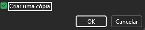
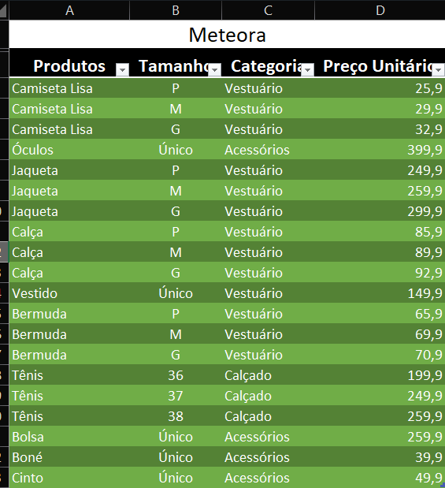
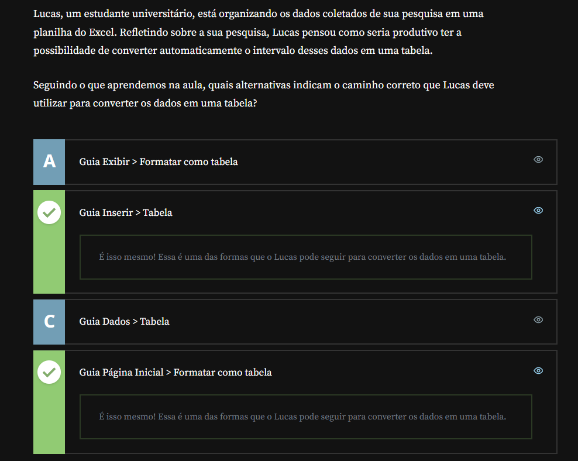
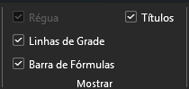
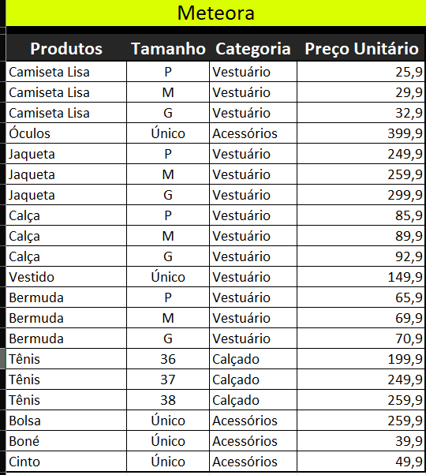
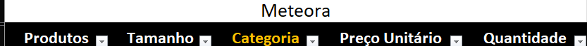
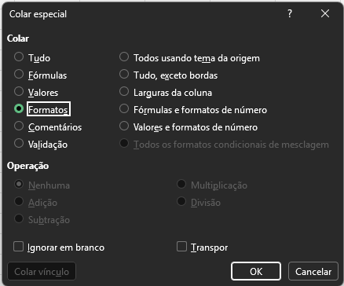
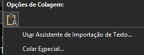

# Formatação Passo a Passo

## Sumário
* [1. Preparando o ambiente](#1-preparando-o-ambiente)
* [2. Formatar como tabela](#2-formatar-como-tabela)
* [3. Convertendo dados em tabela](#3-convertendo-dados-em-tabela)
* [4. Aplicando Formatos](#4-aplicando-formatos)
* [5. Inserindo dados em uma planilha formatada](#5-inserindo-dados-em-uma-planilha-formatada)
* [6. Faça como eu fiz: Formatar como Moeda](#6-faça-como-eu-fiz-formatar-como-moeda)
* [7. O que aprendemos](#7-o-que-aprendemos)

## 1. Preparando o ambiente
Para acompanhar o curso com o máximo de aproveitamento, você pode fazer o download da [planilha](src/Meteora%20Ecommerce%20-%20FINAL%20AULA%201.xlsx) que estamos trabalhando para a Loja Meteora

## 2. Formatar como tabela
O documento a ser trabalhado está disponível [aqui](src/Meteora%20Ecommerce%20-%20FINAL%20AULA%201.xlsx), nesse documento será trabalhado o processo de formatação da planilha, tal documento está sem formatação previa ou demais funcionalidades, e foi baixado através do link da aula, porém para darmos continuidade ao processo, iremos realizar as formatações necessárias, tais como inserção de linha superior antes dos rótulos do arquivo em sí conforme exemplo abaixo:  
<table style="text-align: center; width: 100%;"> 
<tr>
    <td style="text-align: left;">
    
    </td>
</tr>
</table>

No exemplo acima, vemos que para além do titulo realizamos o processo de _Mesclar e Centralizar_, porém como boa prática, não se recomenda realizar esse processo de _"Mesclar e Centralizar"_, dentro de uma planilha.

> Dica para um processo de cópia de uma planilha para outra, uma forma mais prática, de realizar esse processo, pode ser feita, clicando sobre o nome da planilha (barra inferior do arquivo), segurar a tecla `CTRL`, e arrastar essa planilha para o lado direito. O mesmo processo é possível de ser realizado através da opção de mouse direito __Mover ou Copiar__, e escolhendo a opção de __Criar um cópia__.
>
> <table style="text-align: center; width: 100%;"> 
> <tr>
>     <td style="text-align: left;">
>     
>     </td>
> </tr>
> </table>

Conforme demonstrado imagem anterior,para além de mesclar e centralizar o titulo também foi realizado a adição de uma linha em branco pós titulo da tabela, esse recurso foi utilizado para que tal linha funcione como um separador entre o titulo e o cabeçalho da tabela, isso é util quando estamos realizando formatação da planilha em __Tabela__, para que possa ser realizar a formatação de um intervalo de valores, em tabela, primeiro seleciona-se esse intervalo desejado, e posteriormente no canto superior direito da guia de Página Inicial, é possível visualizar as formatação de tabela de maneira rápida, ao escolhe um modelo, o Excel exibirá ao usuário uma informação sobre o intervalo selecionado, e aplicará tal formatação. 
Um dos motivos do marcador de titulo e cabeçalhos, para a tabela, se da ao fato que por padrão o Excel realiza a marcação da flag de _"Minha tabela possui cabeçalho"_, o que torna a formatação da planilha um pouco grosseira, para evitar isso e deixar a formatação mais apresentável, realizamos essa marcação e selecionaremos o intervalo com o cabeçalho e os valores da planilha, deixando assim a planilha do E-commerce, em questão com a seguinte formatação:  

<table style="text-align: center; width: 100%;"> 
<tr>
    <td style="text-align: left;">
    
    </td>
</tr>
</table>

## 3. Convertendo dados em tabela

<table style="text-align: center; width: 100%;"> 
<tr>
    <td style="text-align: left;">
    
    </td>
</tr>
</table>

## 4. Aplicando Formatos
Já que realizamos a duplicação da planilha dentro da nossa pasta de trabalho, iremos agora realizar a formatação da planilha de forma não tabular, ou seja iremos formatar a outra planilha sem aplicação de formatação como tabela, para tal processo utilizaremos, formatações de preenchimento de fundo de célula, formatação de alinhamento, tamanho de fonte e etc...  
Um ponto que vale ser ressaltado, e que habitualmente é confundidos as bordas da células, como bordas reais, porém na verdade o nome técnico da linhas divisoras apresentadas pelo Excel são linhas de grades, tais linhas podem ser desabilitadas através da guia de menu __Exibir__ desabilitando a flag de linhas de grade, conforme exemplo:  

<table style="text-align: center; width: 50%;"> 
<tr>
    <td style="text-align: left;">
    
    </td>
</tr>
</table>

Porém isso não significa que não é possível realizar a adição de bordas na planilha ou no intervalo de células, para tal recurso basta realizar a seleção de intervalo de células desejado, e na guia de Página inicial após as funções de formatação de fonte (__Negrito__, _Itálico_, <u>Sublinhado</u>), onde está presente uma opção de quadro, sendo possível realizar a adição de bordas nessa planilha, o que deixara a tabela em questão da seguinte maneira:  

<table style="text-align: center; width: 100%;"> 
<tr>
    <td style="text-align: left;">
    
    </td>
</tr>
</table>

Outra formatação possível, refere-se a formatação de números, as opções formatação de números, ficam dentro da guia de Página Inicial, no agrupamento denominado de __Número__.
> __DICA:__ É possível realizar a seleção de um intervalo de células de maneira mais rápida e prática, onde ao selecionarmos uma célula em questão e seguramos as teclas de 
> `CTRL + >SHIFT + ⬇️` (ou para direção desejada), o Excel, irá selecionar o intervalo na direção que você selecionou até o final de onde tenha valor

## 5. Inserindo dados em uma planilha formatada
Ao longo dessa aula, estamos trabalhando com dois tipos de formatação ou __(duas planilhas)__, diferentes, uma com formato de tabela, e outra sem o formato de tabela, a primeira ser abordada nesse módulo será a __sem__, para a adição de informações sem o formato de tabela e importante salientar que o que irá definir a formatação nos campos adjacentes as informações prévias da planilha será a seleção do intervalo de valores, ou seja caso estivéssemos realizando a inserção de valores, nas linha 24 da planilha, essas não seriam aplicadas formatações, visto que a seleção realizada anteriormente foi de `A3:D23`, assim como formatações na coluna  `E` também não serão afetadas primariamente. Porém caso realizarmos qualquer edição em uma planilha __com__ formatação de tabela, ao realizarmos por exemplo a adição de uma informação em uma coluna adjacente no intervalo da tabela tal formatação também será aplicada para as demais colunas de forma automática, porém é valido ressaltar que:
> Todas as alterações que dizem respeito ao formato da tabela serão replicados de forma automática, porém o mesmo não se aplica por exemplo as informações ali contidas, conforme
> demonstra imagem abaixo:  
>
> <table style="text-align: center; width: 100%;"> 
> <tr>
>     <td style="text-align: left;">
>     
>     </td>
> </tr>
> </table>

Entretanto existe uma maneira de realizar a cópia de formatação de forma mais rápida para planilhas __sem formatação de tabela__, para tal processo basta selecionar um coluna da planilha na qual deseja copiar o formato, e clicar sobre o `pincel de formatação`, ou ainda através dos atalhos `CTRL+C` selecione o intervalo de destino e `CTRL + ALT + V` será apresentado uma tela a depender da versão do `Office`, sobre o que deseja ser colado, escolha a opção de formatação, conforme imagem:  
>
> <table style="text-align: center; width: 100%;"> 
> <tr>
>     <td style="text-align: center;">
>     
>     </td>
> </tr>
> </table>

Em casos de inserção de valores dentro da tabela, onde por exemplo o texto copiado tenha alguma formatação, pode ser utilizado a opção dentro da guia da página inicial, de colar sem formatação, pelo ícone de colar temos a opção de _Manter somente texto_: 

<table style="text-align: center; width: 50%;"> 
<tr>
    <td style="text-align: left;">
    
    </td>
</tr>
</table>

## 6. Faça como eu fiz: Formatar como Moeda
É hora de ação! Vamos treinar o que foi visto na aula para formatar os valores da coluna “Preço Unitário” com o formato de Moeda. E então, vamos colocar a mão na massa?!

- Passo 1: Selecione a coluna que contém as informações de Preço Unitário.

- Passo 2: Clique com o botão direito do mouse na coluna Preço Unitário e escolha a opção "Formatar Células”.

- Passo 3: Na caixa de diálogo "Formatar Células", vá para a guia "Número".

- Passo 4: Na lista de categorias, clique em "Moeda".

- Passo 5: Escolha o símbolo da moeda desejado na lista suspensa "Símbolo da Moeda".

- Passo 6: Especifique o número de casas decimais que você deseja exibir na caixa "Casas decimais".

- Passo 7: Se desejar, você pode adicionar opções adicionais de formatação, como separador de milhar, símbolo negativo e outros. Ajuste as opções conforme necessário.

- Passo 8: Clique em "OK" para aplicar a formatação de moeda às células selecionadas.

Pronto, os valores da coluna Preço Unitário foram formatados como moeda!

## 7. O que aprendemos
<table style="text-align: center; width: 100%;"> 
<tr>
    <td style="text-align: left;">
    
    </td>
</tr>
</table>

---
<table align="center" style="border-collapse: collapse; margin-left: auto; margin-right: auto;"> 
  <caption><b>Skills do projeto</b></caption>
  <tr>
    <td style="padding: 5px;">
      
    </td>
    <td style="padding: 5px;">
      
    </td>
    <td style="padding: 5px;">
      
    </td>
  </tr>
</table>

---
__Titulo:__ Formatação Passo a Passo
__Autor:__ Thierry Lucas Chaves  
__Data de Criação:__ 01-05-2026  
__Data de Modificação:__ 01-05-2026  
__Versão:__ "1.0"