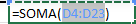
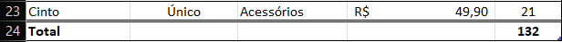
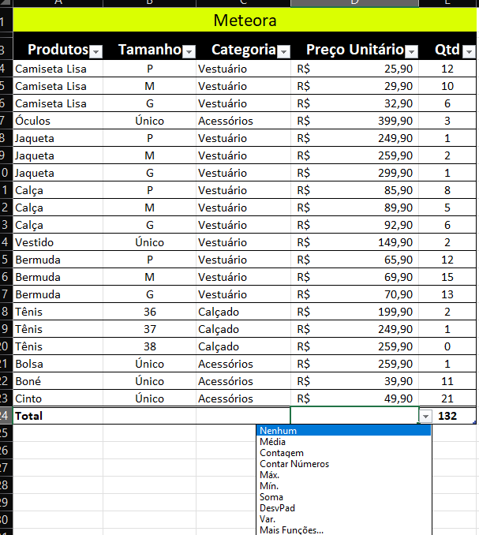
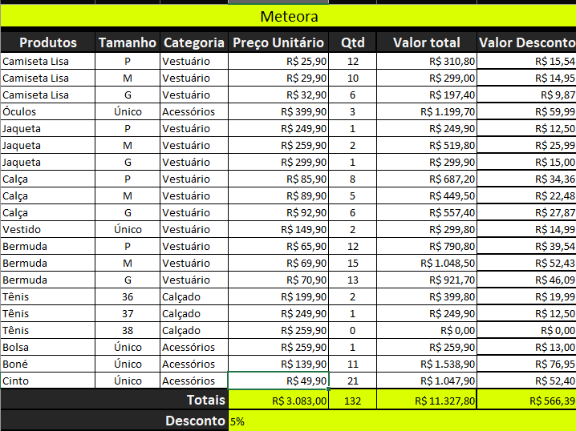
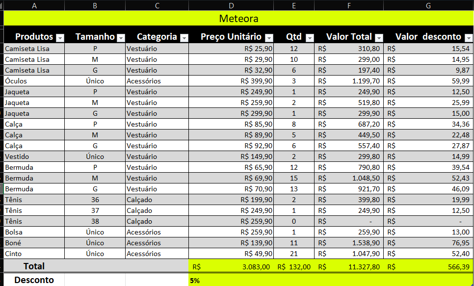

# Formulas e Funções

## Sumário: 

* [1. Preparando o ambiente: planilha Meteora E-commerce](#1-preparando-o-ambiente-planilha-meteora-e-commerce)
* [2. Aplicando cálculos](#2-aplicando-cálculos)
* [3. Calculando o total de vendas](#3-calculando-o-total-de-vendas)
* [4. Tipos de referências](#4-tipos-de-referências)
    * [Referência Relativa](#referência-relativa)
    * [Referência Estruturada](#referência-estruturada)
* [5. Calculando o valor do desconto](#5-calculando-o-valor-do-desconto)
    * [5.1 Desafio](#51-desafio)
* [6. Faça como fiz: Linha de totais](#6-faça-como-fiz-linha-de-totais)
* [7. Desafio: Valor desconto](#7-desafio-valor-desconto)
* [8. O que aprendemos ?](#8-o-que-aprendemos)
---
## 1. Preparando o ambiente: planilha Meteora E-commerce
Para acompanhar o curso com o máximo de aproveitamento, você pode fazer o download da [planilha](src/Meteora%20Ecommerce%20-%20FINAL%20AULA%202.xlsx) que estamos trabalhando para a Loja Meteora

## 2. Aplicando cálculos
O desafio primário proposto, é realizar a confecção de uma linha de totais.
> PS: Atualmente nossa pasta de trabalho consta com duas planilhas, uma __com__ e outra __sem__ formatação de tabela.  

Nesta aula iremos realizar tal processo na planilha __sem__ a tabela, devido ao retrabalho de edição em duas planilhas. 
Para realizar o processo, primeiro iremos realizar a `auto-soma` disponibilizada pelo Excel, essa opção que está disponível na guia de Página Inicial, e uma maneira um pouco restritiva, pois ela é possível de ser feita com número médias etc.., como o próprio nome diz ela realiza a soma de números. 
Outra maneira de realizar essa somatória e através de formulas, uma maneira de realizar essa formula segue o modelo abaixo:

```Excel
=D1+D2+D3+D4
```
Outra maneira de realizar esse processo, e esse é o mais recomendado se da na utilização de __funções__, para que uma função no Excel, seja utilizada segue-se uma premissa básica na célula que recebera aquela função, essa seguindo a notação de:  
```Excel
=soma(parâmetros)
```
os parâmetros que serão inseridos na função, no caso da função soma é o intervalo de valores que se deseja inserir, esse intervalo e demonstrado a __primeira célula : ultima célula__
<table style="text-align: center; width: 50%;"> 
<tr>
    <td style="text-align: left;">
    
    </td>
</tr>
</table>

> Quando for necessário realizar a soma de células especificas, substitui-se o caractere de `:` para o de `;`, dessa maneira o Excel, irá realizar a somente os valores das células e não do intervalo em sí.

Outro ponto importante sobre a utilização de funções é que o valor da célula e ajustado conforme os valores do intervalo mudam, ou seja a somatória das células selecionadas ocorrem de forma dinâmica, e nesse cenário sobre utilização de funções existem duas maneiras de identificar a utilização de uma, sendo elas abrindo a célula para verificar o valor inserido, ou selecionado a célula desejada, e verificando o seu valor dentro da barra de formulas.

---
Já para realizar o processo de soma dentro de uma planilha com formatação de tabela, existe uma maneira mais rápida para essa funcionalidade, através da guia de __Design da Tabela__, existe a opção de linha de totais, que somente é apresentada em espaços com formatação de tabela, nessa guia é possível realizar a seleção da Flag de __Linha de totais__, com essa opção marcada, será realizado a totalização de forma automática. 
<table style="text-align: center; width: 100%;"> 
<tr>
    <td style="text-align: left;">
    
    </td>
</tr>
<tr>
    <td style="text-align: left;">
    
    </td>
</tr>
</table>
Dessa maneira para além de já realizar a soma de um campo a formatação em tabela também oferece a opção de inserção de outras funções nas linhas escolhidas,como por exemplo a função de soma na coluna dos valores
<table style="text-align: center; width: 60%;"> 
<tr>
    <td style="text-align: left;">
    
    </td>
</tr>
</table>

## 3. Calculando o total de vendas
<table style="text-align: center; width: 100%;"> 
<tr>
    <td style="text-align: left;">
    
    </td>
</tr>
</table>

## 4. Tipos de referências
Ao longo do curso foi afirmado reiteradas vezes, que a utilização de formatação de tabela devia ser utilizada com tabela, e um dos motivos para tal cautela se deve ao fato das referências, quando estamos utilizando formulas em planilhas não formatadas, as referências as células utilizada são <a href="#ref_relativa">referências relativas</a>, porém quando estamos trabalhando com tabelas, o Excel realiza <a href="#ref_estruturada">referências estruturadas </a>, de forma simples a explicação dessas referências pode ser entendida da seguinte maneira, em referência relativas: o Excel utiliza o intervalo selecionado como sua referência por exemplo `=soma(__D4:D23__)`, dessa maneira a referência do intervalo selecionado para aplicação fa função está referenciando diretamente o intervalo daquela planilha, porém quando estamos falando de referências estruturadas: o Excel irá realizar os nomes das tabelas para fazer as somas por exemplo `=SUBTOTAL(__109;[Preço Unitário]__)`, diferente da planilha sem estrutura de tabela o Excel, selecionou a função __SUBTOTAL__, que recebe 2 parâmetros como input, sendo eles, o número da função a ser utilizada _(no caso 109)_, e o nome da coluna da tabela que está entre colchetes, com o nome da coluna isso fica explicito quando por exemplo selecionamos uma determinada célula de uma coluna o valor anteriormente escrito com o nome da célula muda para o nome da coluna, o que pode ser entendido como o Excel identificando o nome do cabeçalho sendo como o nome da coluna.
Ao realizar referências relativas, em planilhas não tabulares, pode ser realizado por exemplo o atalho de copiar e colar(ou de arraste do valor da célula) das formulas uma vez que as referências são feitas com base na posição das linhas com as colunas, o Excel realiza automaticamente a mudança do intervalo para a coluna desejada.

<details id="ref_relativa">
<summary>Referência Relativa </summary>
    <p> É o método de referência padrão do Excel. Uma referência relativa (ex: A1) indica o endereço de uma célula em relação à posição da célula que contém a fórmula. </p>
    <ul>
        <li> <b>Comportamento:</b> Ao copiar ou arrastar uma fórmula com referência relativa para outras células, o Excel ajusta automaticamente o endereço com base no deslocamento de linhas e colunas. </li>
        <li> <b>Aplicação:</b>  Ideal para cálculos simples onde a mesma operação é aplicada em uma sequência de células adjacentes.</li>
        <li> <b>Exemplo:</b> Se a fórmula na célula C1 for =A1*B1, ao arrastá-la para C2, o Excel a ajustará automaticamente para =A2*B2.</li>
    </ul>
</details>

<details id="ref_estruturada">
    <summary>Referência Estruturada </summary>
        <p>
        Introduzida para trabalhar especificamente com Tabelas do Excel (funcionalidade Insert > Table ou Ctrl+T). Em vez de usar endereços de células (ex: A1), utiliza-se o nome da tabela e dos cabeçalhos das colunas (ex: Tabela1[Valor]).
        <ul>
            <li> <b>Comportamento:</b> É intrinsecamente "absoluta" em relação à coluna. Ao adicionar novos dados à tabela, a fórmula se expande automaticamente (propagação).</li>
            <li><b>Vantagens:</b> Alta legibilidade (o usuário entende o contexto da conta, como "Preço * Quantidade" em vez de "A2 * B2") e robustez (a fórmula não quebra se colunas forem inseridas ou deletadas).</li>
            <li><b> Sintaxe comum:</b> [@Coluna]: Referência ao item na mesma linha. Tabela1 [Coluna]: Referência à coluna inteira. </li>
        </ul>
</details>

<details>
    <summary>Referência Absoluta </summary>
        <p>
        A referência absoluta é o mecanismo que "trava" a posição de uma célula em uma fórmula, impedindo que o Excel ajuste o endereço automaticamente quando você copia ou arrasta a célula para outros locais.</p>
        <p> <b> O Mecanismo do Cifrão ($) </b> </br>
        O diferencial técnico aqui é a utilização do símbolo de cifrão ($) como um caractere de ancoragem. Quando colocado antes da letra da coluna e do número da linha, o Excel entende que aquela referência deve ser tratada como uma constante.
        </p>
        <ul>
            <li> <b>Sintaxe:</b> $A$1 (Coluna A fixa, Linha 1 fixa).</li>
            <li> <b>Comportamento:</b> Se você arrastar a fórmula =B2*$A$1 para a célula de baixo, o resultado será =B3*$A$1. Note que B2 mudou para B3 (ajuste relativo), mas $A$1 permaneceu estático.</li>
        </ul>
        <p> <b>Quando Utilizar? </b>
        </br>
        A referência absoluta é indispensável quando o cálculo depende de um parâmetro fixo (uma constante) que não deve sofrer deslocamento durante a propagação da fórmula.</br>
        Cenários comuns:
         <ul>
            <li> <b> Cálculo de Impostos: </b> Aplicar uma alíquota única (ex: 15%) sobre uma coluna de valores</li>
            <li> <b>Conversão de Moeda: </b> Multiplicar diversos valores pela cotação do dólar armazenada em uma célula específica.</li>
            <li> <b>Buscas: </b> Definir uma matriz de dados fixa para funções como PROCV (VLOOKUP)..</li>
        </ul>
</details>


## 5. Calculando o valor do desconto
A partir de agora será realizado a dinâmica de _Pequenos desafios_, nessa primeira etapa, o desafio será para o modelo de planilha com tabela, ficando a cargo do aluno a realização do desafio no modelo __com formatação de tabela__. Porém para aplicação desse desafio segue o que foi realizado na planilha __sem formatação de tabela__.   
- Inclusão de coluna e valor de totais:
    - Para o processo foi realizado, a cópia da coluna com os valores em formato de moeda, o que para além de facilitar a formatação realiza em conjunto a formatação de linhas de grade no arquivo. 
- Inclusão de linhas:
    - Foi realizado a inclusão de 2 linhas no final da tabela, sendo uma delas a linha de soma total de valores, e a linha de valor de desconto, na célula que contem o valor do percentual de desconto, foi realizado a formatação do tipo da coluna com a _"mascara"_ de porcentagem.
- Inclusão da coluna de desconto por produto:
    - Nesse processo para além da cópia da coluna de valores, foi realizado também a edição dos seus valores, para que este contivesse o percentual relativo de desconto por produto, para tal foi utilizado a formula: 
    ```excel
    =celula_valor*celula_desconto
    ```
    > OBS: Devido as referências de células em planilhas não formatadas serem relativas faz-se necessário realizar a __"trava"__, da célula de desconta para que essa não sofresse alteração nas linhas conseguintes.  

Ao finalizar o processo a planilha ficou da seguinte maneira:
<table style="text-align: center; width: 50%;"> 
<tr>
    <td style="text-align: left;">
    
    </td>
</tr>
</table>

### 5.1 Desafio:
<table style="text-align: center; width: 50%;"> 
<tr>
    <td style="text-align: left;">
    
    </td>
</tr>
</table>


## 6. Faça como fiz: Linha de totais
Vamos aplicar o que vimos na aula e criar uma linha de totais para realizar os principais cálculos para o nosso cliente?

Ver opinião do instrutor
Opinião do instrutor

Criar a linha de totais na Planilha Produtos

Passo 1: Na planilha, na célula D24, da coluna Preço Unitário, vamos abrir a função Soma().

Passo 2: Insira nela o sinal de igual (=) para abrir a fórmula e digite a função Soma().

`=Soma(`
Passo 3: Agora você pode selecionar o intervalo D4:D23 para indicar quais são os parâmetros da nossa função.

`=Soma(D4:D23)`
Passo 4: Por fim, pressione o `[ENTER]`.

Pronto! A nossa linha de totais foi criada na planilha de produtos.

Criar a linha de totais na Tabela de Produtos

- Passo 1: Clique na tabela de produtos para habilitar a guia Design da Tabela.

- Passo 2: Na guia Design da tabela, grupo Opções de Estilo de Tabela, clique na opção Linha de Totais.

- Passo 3: Clique na célula D24, da coluna Preço Unitário para selecionar a função Soma().

Pronto! A nossa linha de totais foi criada na tabela de produtos.
## 7. Desafio: Valor desconto
Então, que tal se desafiar à medida que aprende? Chegou a hora de colocar em prática tudo o que temos aprendido até agora!

Neste primeiro desafio, vamos exercitar nossas habilidades para calcular o valor do desconto na tabela de produtos. Essa é uma oportunidade incrível para aplicar os conhecimentos adquiridos em aula de forma prática e real. Então, respire fundo, afie suas habilidades e vamos em frente para conquistar juntos o desenvolvimento.  

__Etapas para o desafio:__

- Passo 1: Criar duas novas colunas na tabela de produtos com os títulos Valor Total e Valor do Desconto.

- Passo 2: Calcular o valor total para cada produto.

- Passo 3: Inserir o desconto de 5%.

- Passo 4: Calcular o valor do desconto para cada produto.
## 8. O que aprendemos ?

Nessa aula, você aprendeu a:
Identificar quais são as referências no Excel;
Utilizar funções como Soma() e Média() para realizar cálculos no Excel;
Calcular o valor de desconto utilizando a multiplicação no Excel;
Produzir cálculos de porcentagem no Excel.

---
<table align="center" style="border-collapse: collapse; margin-left: auto; margin-right: auto;"> 
  <caption><b>Skills do projeto</b></caption>
  <tr>
    <td style="padding: 5px;">
      
    </td>
    <td style="padding: 5px;">
      
    </td>
    <td style="padding: 5px;">
      
    </td>
  </tr>
</table>

---
__Titulo:__ Formulas e Funções  
__Autor:__ Thierry Lucas Chaves  
__Data de Criação:__ 01-05-2026  
__Data de Modificação:__ 04-05-2026  
__Versão:__ "1.0"