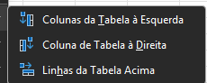
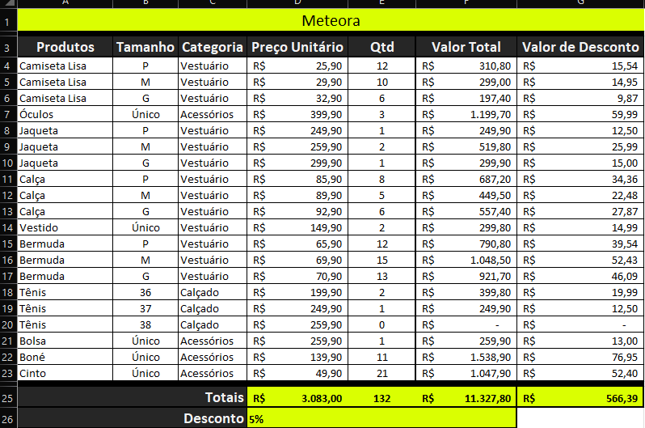
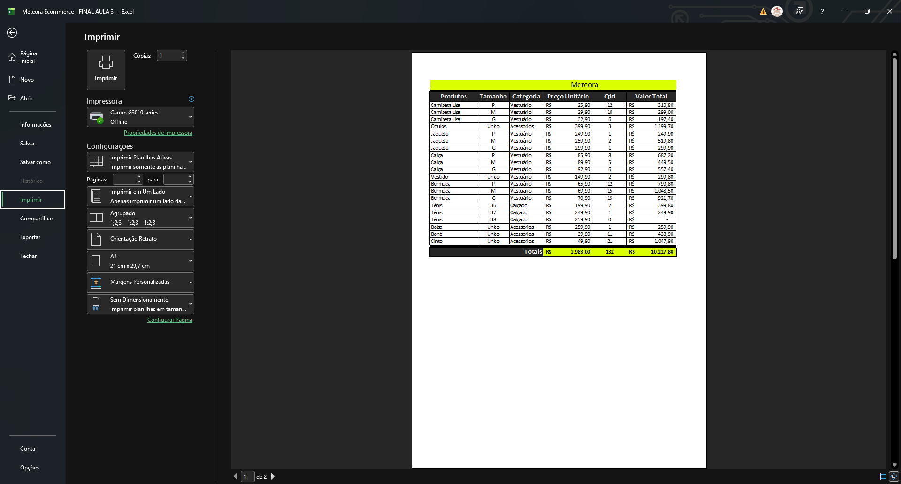
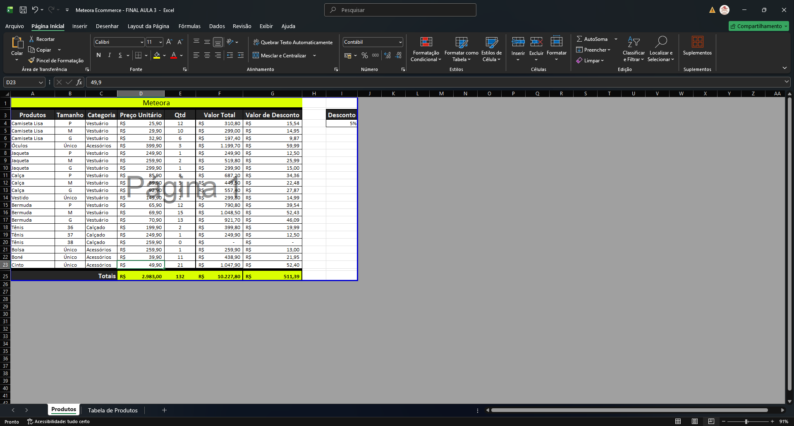

# Estruturando os dados

## Sumário:

* [1. Preparando o ambiente](#1-preparando-o-ambiente)
* [2. Resolvendo o primeiro desafio](#2-resolvendo-o-primeiro-desafio)
* [3. Estruturando a planilha](#3-estruturando-a-planilha)
* [4. Copiar o estilo de formatação](#4-copiar-o-estilo-de-formatação)
* [5. Imprimindo a planilha](#5-imprimindo-a-planilha)
* [6. Faça como fiz: Ajustando o valor de desconto](#6-faça-como-fiz-ajustando-o-valor-de-desconto)
* [7. O que aprendemos ?](#7-o-que-aprendemos)
---
## 1. Preparando o ambiente: 
Para acompanhar o curso com o máximo de aproveitamento, você pode fazer o download da [planilha](src/Meteora%20Ecommerce%20-%20FINAL%20AULA%203.xlsx) que estamos trabalhando para a Loja Meteora
## 2. Resolvendo o primeiro desafio
Antes de realizar a descrição da solução do [Desafio da aula anterior](https://github.com/thierryLchaves/Santander-Imersao-Digital/blob/dd9f7a41ad093365847c1e38b857291b2d356d31/Analise_de_dados_e_IA_Nivelamento/Semana_01/Excel/03_Formulas_e_Funcoes/FormulasEFuncoes.md), devemos nos atentar algumas dicas importantes sobre o que foi feito no modelo __Sem__ formatação de tabela, para o modelo __Com__ formatação de tabela.  

- No modelo __Sem__ a formatação, foi realizado a inserção do valor do desconto na linha abaixo dos valores totais, porém adotar essa estratégia pode ser considerado um erro, bem como seguindo as boas práticas, realizar o processo de mesclar células, não é aconselhável de ser realizado quando estamos trabalhando __com__ formatação de tabela.
    - Para sanar esse erro então podemos realizar a adição do valor de desconto em uma coluna adjacente, pois dessa maneira mitiga-se a probabilidade de erros.

- No modelo __Com__ a formatação de tabela devido a sua característica, contém algumas facilidades em relação o outro modelo, sendo uma deles a possibilidade de opção de mouse direito, colunas a direita da tabela, o que consecutivamente realiza a perpetuação da formatação para as colunas como bordas e as quantidades de linhas necessários que existem na tabela. 
<table style="text-align: center; width: 50%;"> 
<tr>
    <td style="text-align: left;">
    
    </td>
</tr>
</table>

>OBS: Quando estamos trabalhando com tabelas pode ocorrer que quando for iniciado alguma formula e essa dependa de uma célula que esteja perto da que está recebendo a formula a célula desejada fique indisponível para seleção, para contornar esse problema, basta selecionar a célula abaixo do coluna desejada, e realizar a movimentação através do teclado com a setas.  

- Outro ponto como realizamos a inserção do valor de desconto fora da tabela, é de suma importância que seja realizado a _"trava"_ do valor, para que quando for feito a replicação dos valores, esta informação não seja movida, uma vez que esse valor será adicionado como `referência relativa`.

## 3. Estruturando a planilha
Como modificamos a estrutura da planilha com tabela, iremos realizar o mesmo na planilha __sem__ a formatação, para esse processo vale se atentar a alguns pontos:  
- Como padrão o `Excel`realiza a tentativa de pegar todo o intervalo que contem valores, e assim como foi feito na linha pós titulo, será feito também na linha anterior a linha de totais, conforme demonstrado exemplo abaixo:  
<table style="text-align: center; width: 50%;"> 
<tr>
    <td style="text-align: left;">
    
    </td>
</tr>
</table>

- Seguindo as boas práticas, iremos também realizar o processo de modificação da linha de desconto, para que essa fique em uma coluna, para tal para além da adição de uma coluna com tais informações iremos realizar o processo de eliminar a linha.
> OBS: como a coluna de valor de desconto perdeu a sua referência, o Excel, irá apresentar substituir os valores anteriormente preenchidos, para a `#REF!`, que significa que uma das   > partes pertencentes a fórmula ou função não estão mais presentes (excluídas e/ou movidas de lugar)
> <table style="text-align: center; width: 50%;"> 
> <tr>
> <td style="text-align: left;">
>  
> </td>
> </tr>
> </table>
> Porém como modificamos o valor de desconto para coluna, basta apontar a nova referência para aplicação da formula corretamente.
## 4. Copiar o estilo de formatação
Mariana está desenvolvendo uma planilha para organizar as informações da empresa em que trabalha. Ela recebeu a tarefa de criar uma nova coluna para calcular os valores totais de gastos dessa organização. Depois de inserir as informações, ela teve uma ideia: aplicar rapidamente o mesmo estilo de formatação que está utilizando na nova coluna criada sem carregar os dados junto.

Baseado no que vimos na aula, como a Mariana pode copiar o mesmo estilo de formatação que está utilizando na nova coluna?
<table style="text-align: center; width: 100%;"> 
<tr>
    <td style="text-align: left;">
    
    </td>
</tr>
</table>

## 5. Imprimindo a planilha

> Dica do professor: Somente utilize a impressão da planilha em ultimo caso, o ideal e que as planilhas não sejam impressas.  
Para realizar o processo de impressão pode ser realizado de duas formas distintas sendo elas:  
- 1. Guia aquivo -> Imprimir
- 2. Teclado: `CTRL + P`
Ao utilizar quaisquer das opções listas será exibido as configurações de impressão similar ao exemplo abaixo:
<table style="text-align: center; width: 100%;"> 
<tr>
    <td style="text-align: left;">
    
    </td>
</tr>
</table>

A primeira coisa a se atentar no caso de impressões, e de __MODIFICAR A ORIENTAÇÃO DA IMPRESSÃO PARA PAISAGEM__, na maioria dos casos esse processo já realiza uma adequação expressiva no conteúdo impresso. 
Outro passo para que possamos realizar o melhor ajuste da planilha a ser impressa e a opção de `Ajustar Planilha em uma Página`.
Por fim podemos visualizar em tempo real, um _preview_, da impressão para tal no canto inferior direito do programa existem as opções de visualização, a escolher o modelo de `Visualizar quebra de página` o Excel, exibirá a planilha de forma que possamos ter uma noção de como ficaria a planilha impressa, conforme demonstra imagem abaixo:
<table style="text-align: center; width: 100%;"> 
<tr>
    <td style="text-align: left;">
    
    </td>
</tr>
</table>

## 6. Faça como fiz: *Ajustando o valor de desconto*
Na aula, ao excluir a linha contendo as informações de desconto, o Excel retornou a informação de erro #REF! na coluna Valor de desconto. O erro #REF! ocorre geralmente quando células que foram referenciadas por fórmulas são excluídas ou algo é colado sobre elas.

Vamos aplicar o que vimos na aula para ajustar o valor de desconto na planilha e corrigir o erro #REF!?

- Passo 1: O primeiro passo para corrigir o erro, é apagar as informações da coluna Valor de Desconto.

- Passo 2: Logo em seguida, selecione o intervalo G4:G23 e aperte a tecla Delete para apagar as informações.

- Passo 3: Na coluna Valor de Desconto, digite o símbolo do sinal de igual (=) para indicar para o Excel que vamos realizar um cálculo.

- Passo 4: Selecione a célula F4 da coluna Valor total para indicar o primeiro parâmetro do cálculo que será realizado.  
`=F4`
- Passo 5: Nesse momento, digite o símbolo da multiplicação (*) e selecione a célula I4 da coluna Desconto para indicar o segundo parâmetro do cálculo que será realizado.  
`=F4*I4`

- Passo 6: Antes de “arrastar” a fórmula para as outras células da coluna Valor de desconto, pressione a tecla de atalho F4 para “travar” a célula I4 e indicar para o Excel que queremos utilizar a referência do tipo Absoluta.

- Passo 7: Pressione o `[ENTER]`.

- Passo 8: Utilize a alça de preenchimento para arrastar a nova fórmula corrigida para as demais células da coluna Valor de Desconto.

- Passo 9: Em seguida, clique na caixa de Opções de autopreenchimento para ajustar a formatação.

Pronto, o erro #REF! foi corrigido e o valor do desconto ajustado corretamente!

## 7. O que aprendemos ?
Nessa aula, você aprendeu a:
Utilizar os recursos do comando Imprimir;
Modificar a orientação do papel ao imprimir;
Delimitar para que a impressão ocorra em uma página;
Resolver erros como o erro #REF! no Excel.

<table align="center" style="border-collapse: collapse; margin-left: auto; margin-right: auto;"> 
  <caption><b>Skills do projeto</b></caption>
  <tr>
    <td style="padding: 5px;">
      
    </td>
    <td style="padding: 5px;">
      
    </td>
    <td style="padding: 5px;">
      
    </td>
  </tr>
</table>

---
__Titulo:__ Estruturando os dados
__Autor:__ Thierry Lucas Chaves  
__Data de Criação:__ 04-05-2026  
__Data de Modificação:__ 04-05-2026  
__Versão:__ "1.0"