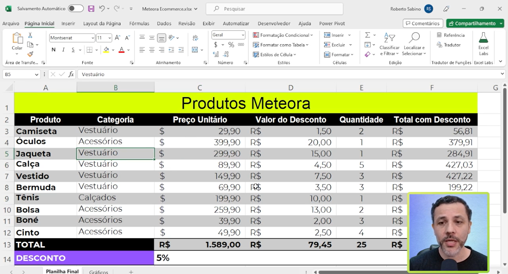
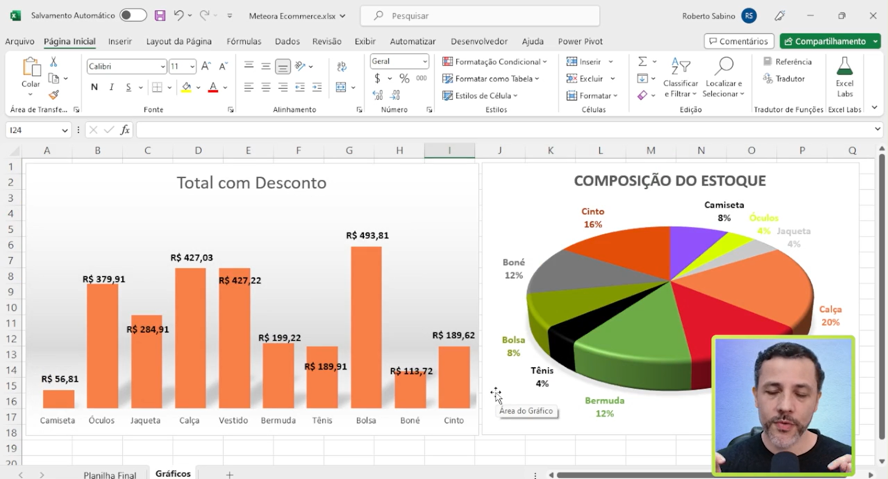
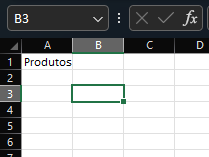
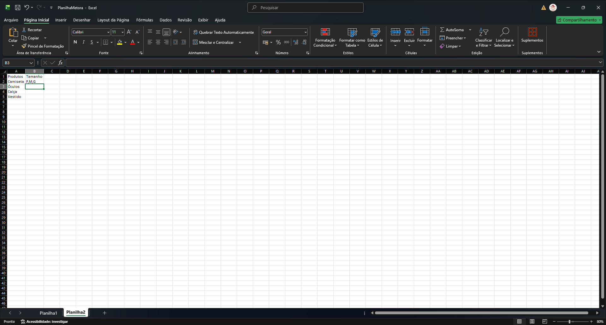
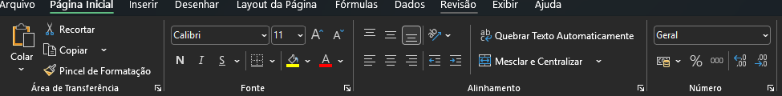

# Domine o editor de planilhas 

## 1.  Introdução 

### 1.1 Para quem se destina o curso 

Esse curso servirá para:  
- O aumento da expertise do aluno na ferramenta.
    Ou seja o curso serve para aqueles que utilizam a fermenta no seu dia a dia, porém ainda não tem um bom conhecimento sobre o como a ferramenta funciona. 
- Primeiro contato com Excel: 
    Ou seja para aqueles que precisam da utilização dessa ferramenta, mais ainda não conhece o Excel, seja por falta de contato ou pela utilização de outras ferramentas similares. 
- Versão da Microsoft. 
    Para aqueles que utilizam outras ferramentas de planilha, porém desejam conhecer o Excel da Microsoft de forma mais _"aprofundada"_.

Neste curso será abordado, todo o processo "básico" do Excel, seja ele: Como organizar uma planilha, como fazer o primeiros cálculos, o que são referências (células), como atualizar uma planilha, como compartilhar uma planilha (qual seria a diferença entre enviar a planilha por E-mail, ou fazer uma edição colaborativa.)

## 2. Conhecendo o trabalho
E importante frisar que o curso em questão é sobre `Excel`, ou seja os demais editores de planilha não serão contemplados no curso. 
Visto que o `Excel` é uma ferramenta paga e muita das vezes nem todos podem arcar com os custos do software, é possível realizar as atividades desse software de forma online, para tal basta acessar o [aplicativo do Excel](https://excel.cloud.microsoft/?wdOrigin=OFFICECOM-WEB.APPGALLERY). 
> É muito importante se atentar sobre as inserções de vendas realizadas pela microsoft, porém não é necessário que seja comprado o aplicativo.  

O curso será do 0 até a parte avançada, então sua aplicabilidade será vasta, e conforme dito em vídeo ao final do curso teremos uma planilha similar a imagem abaixo.  

<table style="text-align: center; width: 100%;"> 
<tr>
    <td style="text-align: left;">
    
    </td>
</tr>
</table>

Para além dos processos que podem ser tidos como básicos _(contas, percentual, formulas etc..)_, também será abordado processo de criação de gráficos, esses serão vistos e ficaram similar aos da imagem abaixo:

<table style="text-align: center; width: 100%;"> 
<tr>
    <td style="text-align: left;">
    
    </td>
</tr>
</table>

## 3. Conhecendo o Excel.
A versão a ser utilizada para demonstração dos comandos e da planilha em questão, trata-se do `office 365`, porém outras versões do Excel são amplamente compatíveis, tendo variações como _layout_ de página ou algo do tipo, porém os conceitos são os mesmos.  

Um conceito importante a se trabalhar com Excel, e que quando estamos criando um novo arquivo do tipo (`XLS`, ou `XLSL`), quando estamos nos referindo a uma pasta de trabalho, este se refere a um conjunto de planilhas do Excel, a intercessão das linhas e colunas no Excel, formam uma __célula__ o intuito dessa divisão nesses arquivos é que seja possível utilizar as informações de forma isolada.   
Outro ponto é que dado á essa característica de o Excel, classifica ou demonstra suas informações como as colunas com letras _A,B,C_, e suas linhas em algarismos _1,2,3_, o que possibilita a referência de uma informação por essa combinação, isso fica claro quando por exemplo realizamos a seleção de uma célula com o mouse ou através da navegação em teclado o Excel informa no canto superior esquerdo do arquivo qual é a célula selecionada. 

<table style="text-align: center; width: 100%;"> 
<tr>
    <td style="text-align: left;">
    
    </td>
</tr>
</table>

> Uma boa prática em Excel, e a organização de uma Planilha, para sendo assim para melhor visualização das informações, a melhor forma de organizar esse planilha fica sendo a __1ª__ linha contendo o nome da informação e as linhas seguintes tendo a informação.

Outro ponto importante a se notar em arquivos Excel, e que habitualmente as células, iniciam _"fechadas"_, ou seja nulas/sem informação para que possamos adicionar valores nessas células podemos dar duplo clique com o mouse ou utilizar o atalho de teclado `F2`, o que habilitara aquela célula para adição, porém quando estamos com o cursor sobre uma célula já preenchida caso começarmos a digitar algum valor, o Excel irá sobrescrever o valor ali informado, porém para que possamos editar o valor ou adicionar algo ali também podemos utilizar o `F2`, para adicionar algo.
Outro ponto e que caso seja necessário realizar a inserção de uma linha acima de outra, essa edição é possível de ser realizada, basta posicionar o  mouse sobre o rótulo
> Rótulo em Excel, são as linhas que identificam uma linha no Excel.  
e com o mouse direito escolher a opção de inserir.  

## 4. Inserindo linhas na planilha 

<table style="text-align: center; width: 100%;"> 
<tr>
    <td style="text-align: left;">
    
    </td>
</tr>
</table>

## 5. Organizando dados na planilha
Uma coisa bastante importante na utilização do Excel, trata-se da __barra de formas__, está fica localizada habitualmente acima dos rótulos das colunas, conforme exemplo:  
<table style="text-align: center; width: 100%;"> 
<tr>
    <td style="text-align: left;">
    
    </td>
</tr>
</table>

A barra de formulas para além de inserção de formulas propriamente dito, também é possível editar o valor de uma célula, sem que propriamente tenha _"Aberto"_ a célula.
Outros comandos e preceitos muito importantes no Excel, são os comando de copia e cola "`CTRL+C ou CTRL+V`", esses comandos funciona no Excel para se copiar o valor de uma célula, no momento da copia, bem como para seleção utiliza-se a tecla `SHIFT` com a ação de arraste do teclado ou setas do teclado para seleção de um intervalo. 
> Conforme dito anteriormente a estrutura de um Planilha, ou o seu desenho deve ter a estrutura de tipo valor, então caso seja necessário que uma combinação de informação tenha valores diferentes, recomenda-se a inserção do mesmo valor com uma variante, sem que haja o conjunto de valores em uma mesma célula, vide exemplo abaixo 

<table style="text-align: center; width: 100%;"> 
<tr>
    <td> Exemplo <b>Errado</b>
    </td>
    <td style="text-align: left;">
    
    </td>
</tr>
<tr>
    <td> Exemplo <b>Correto</b>
    </td>
    <td style="text-align: left;">
    
    </td>
</tr>
</table>

> Para que possamos agilizar a cópia de linhas e valores no Excel é possível realizar a copia de uma linha, selecionar um intervalo que se deseja que aqueles valores sejam copiados, e com botão direito do mouse sobre o rótulo escolher a opção de __Inserir células copiadas__.

## 6. Edição e formato
Para o redirecionamento das colunas, é possível o reajuste manual, para tal artificio basta ir com ponteiro do mouse sobre a intercessão de uma coluna para outra até que apresente um ícone semelhante a uma cruz (com duas ponteiras em suas laterais), e redimensionar a coluna em questão isso pode ser feito de forma unitária, assim como de __N__ colunas em conjunto ou um intervalo de colunas, isso pode ser feito tanto para colunas quanto para linha.  
> É importante salientar que esse redimensionamento feito em conjunto será aplicado de forma padrão para todo o intervalo selecionado.  

Sobre as guias do Excel, que ficam posicionadas no topo da pasta de trabalho, cada uma delas funciona como um menu, onde ao selecionar uma das opções, é apresentado uma serie de opções.Na guia da página inicial são agregados os principais comandos do Excel, ou os mais utilizados, como por exemplo os comandos de alinhamento:
<table style="text-align: center; width: 100%;"> 
<tr>
    <td style="text-align: left;">
    
    </td>
</tr>
</table>

## 7. Faça como eu fiz: digitando dados no Excel
Passo 1: Para dar início, vamos digitar as informações enviadas pelo cliente no Excel:

Produtos / Tamanho
Camiseta Lisa - P
Camiseta Lisa - M
Camiseta Lisa - G
Óculos - Único
Jaqueta - P
Jaqueta - M
Jaqueta - G
Calça - P
Calça - M
Calça - G

Passo 2: Clique com o botão direito do mouse no rótulo da linha 1 para selecionar os dois títulos Produtos e Tamanho.

Passo 3: Na guia Página Inicial, no grupo Fonte, clique no ícone N para colocar os títulos em Negrito.

Passo 4: Em seguida, ainda no grupo Fonte, clique na caixa Tamanho da fonte ou no ícone A para aumentar o tamanho dos títulos. Na aula o professor selecionou o tamanho “14”.

Passo 5: Selecione a coluna B e em seguida no grupo Alinhamento, localize o botão de alinhamento central (ícone centralizar), para centralizar as informações de Tamanho. Pronto! Temos o básico de uma formatação.

Agora que temos uma formatação básica na planilha, é hora de ampliar os horizontes! Com as ferramentas que você aprendeu em nosso curso, você pode descobrir um mundo de possibilidades no Excel. Vamos colocar todo esse conhecimento em ação e explorar o potencial desse programa juntos. Prepare-se para se surpreender com o que podemos alcançar!

## 8. Para saber mais: principais atalhos do Excel
Na aula vimos que os atalhos são combinações de teclas ou comandos que podem ser utilizados para executar tarefas diárias de forma rápida sem precisar mover o cursor do mouse ou navegar por menus e opções.

Pensando nisso, recomendamos a leitura e memorização dos que mais você precisa e usar e a consulta sempre que aos principais atalhos utilizados no Excel, com base neste link do [Suporte da Microsoft](https://support.microsoft.com/pt-br/office/atalhos-de-teclado-no-excel-1798d9d5-842a-42b8-9c99-9b7213f0040f)

## 9. O que aprendemos?

    - Identificar os componentes da tela do Excel;
    - Reconhecer o que são células no Excel;
    - Utilizar formas de inserir linhas e colunas no Excel;
    - Implementar edições e formatações no Excel;
    - Utilizar a opção de salvar.

---

<table align="center" style="border-collapse: collapse; margin-left: auto; margin-right: auto;"> 
  <caption><b>Skills do projeto</b></caption>
  <tr>
    <td style="padding: 5px;">
      
    </td>
    <td style="padding: 5px;">
      
    </td>
  </tr>
</table>

---
__Titulo:__ Domine o editor de planilhas   
__Autor:__ Thierry Lucas Chaves  
__Data de Criação:__ 29-04-2026  
__Data de Modificação:__ 30-04-2026  
__Versão:__ "1.0"