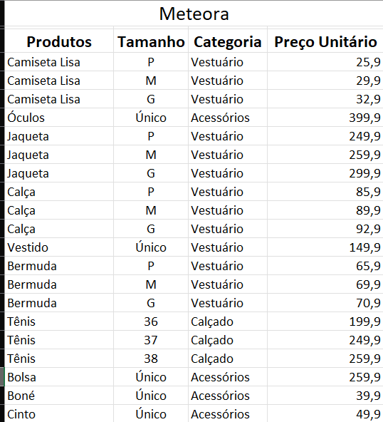

# Formatação Passo a Passo

## Sumário

## 1. Formatar como tabela
O documento a ser trabalhado está disponível [aqui](src/Meteora%20Ecommerce%20-%20FINAL%20AULA%201.xlsx), nesse documento será trabalhado o processo de formatação da planilha, tal documento está sem formatação previa ou demais funcionalidades, e foi baixado através do link da aula, porém para darmos continuidade ao processo, iremos realizar as formatações necessárias, tais como inserção de linha superior antes dos rótulos do arquivo em sí conforme exemplo abaixo:  
<table style="text-align: center; width: 100%;"> 
<tr>
    <td style="text-align: left;">
    
    </td>
</tr>
</table>

No exemplo acima, vemos que para além do titulo realizamos o processo de _Mesclar e Centralizar_, porém como boa prática, não se recomenda realizar esse processo de _"Mesclar e Centralizar"_, dentro de uma planilha.

> Dica para um processo de cópia de uma planilha para outra, uma forma mais prática, de realizar esse processo, pode ser feita, clicando sobre o nome da planilha (barra inferior do arquivo), segurar a tecla `CTRL`, e arrastar essa planilha para o lado direito. O mesmo processo é possível de ser realizado através da opção de mouse direito __Mover ou Copiar__, e escolhendo a opção de __Criar um cópia__.
>
> <table style="text-align: center; width: 100%;"> 
> <tr>
>     <td style="text-align: left;">
>     
>     </td>
> </tr>
> </table>

Conforme demonstrado imagem anterior,para além de mesclar e centralizar o titulo também foi realizado a adição de uma linha em branco pós titulo da tabela, esse recurso foi utilizado para que tal linha funcione como um separador entre o titulo e o cabeçalho da tabela, isso é util quando estamos realizando formatação da planilha em __Tabela__, para que possa ser realizar a formatação de um intervalo de valores, em tabela, primeiro seleciona-se esse intervalo desejado, e posteriormente no canto superior direito da guia de Página Inicial, é possível visualizar as formatação de tabela de maneira rápida, ao escolhe um modelo, o Excel exibirá ao usuário uma informação sobre o intervalo selecionado, e aplicará tal formatação. 
Um dos motivos do marcador de titulo e cabeçalhos, para a tabela, se da ao fato que por padrão o Excel realiza a marcação da flag de _"Minha tabela possui cabeçalho"_, o que torna a formatação da planilha um pouco grosseira, para evitar isso e deixar a formatação mais apresentável, realizamos essa marcação e selecionaremos o intervalo com o cabeçalho e os valores da planilha, deixando assim a planilha do E-commerce, em questão com a seguinte formatação:  

<table style="text-align: center; width: 100%;"> 
<tr>
    <td style="text-align: left;">
    
    </td>
</tr>
</table>

---

<table align="center" style="border-collapse: collapse; margin-left: auto; margin-right: auto;"> 
  <caption><b>Skills do projeto</b></caption>
  <tr>
    <td style="padding: 5px;">
      
    </td>
    <td style="padding: 5px;">
      
    </td>
  </tr>
</table>

---
__Titulo:__ Formatação Passo a Passo
__Autor:__ Thierry Lucas Chaves  
__Data de Criação:__ 01-05-2026  
__Data de Modificação:__ 01-05-2026  
__Versão:__ "1.0"