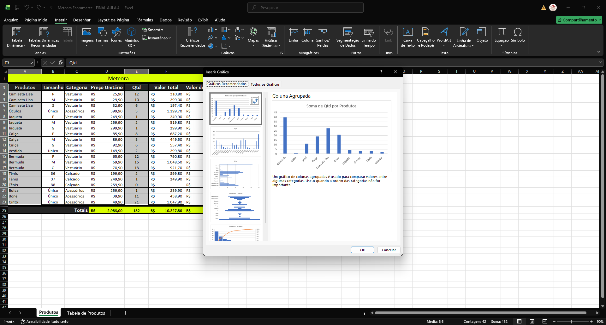
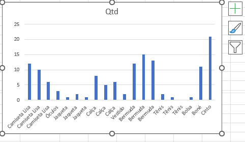
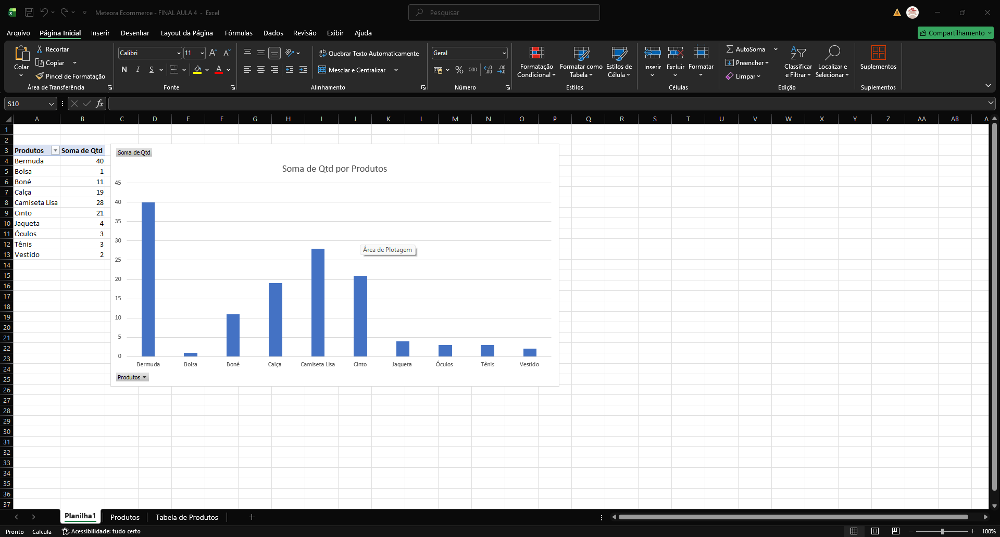
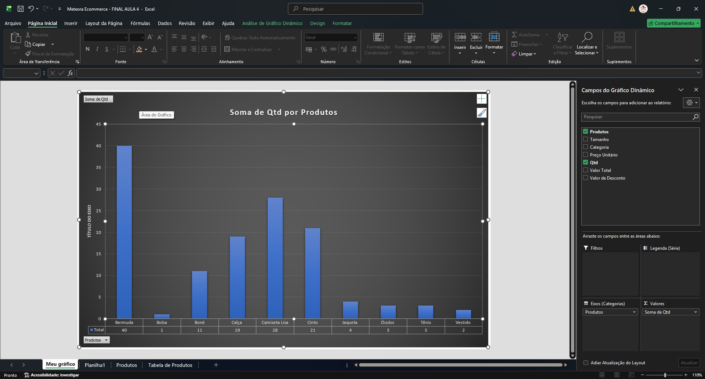
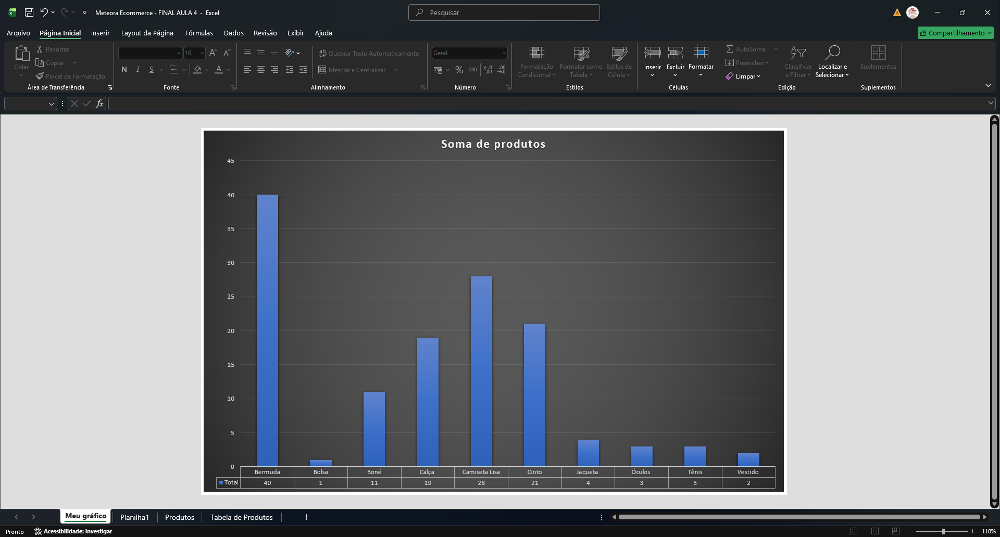
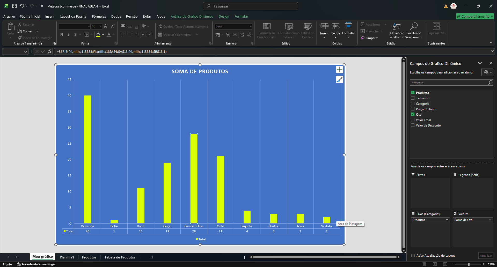

# Tornando os dados mais visuais

## Sumário: 
* [1. Preparando o ambiente: planilha Meteora Ecommerce](#1-preparando-o-ambiente-planilha-meteora-ecommerce)
* [2. Criando gráficos](#2-criando-gráficos)
* [3. Ajustando o Design de gráfico](#3-ajustando-o-design-de-gráfico)
* [4. Adicionar elemento no gráfico](#4-adicionar-elemento-no-gráfico)
* [5. Formatando o gráfico](#5-formatando-o-gráfico)
* [6. Faça como fiz: Alterar o tipo de gráfico](#6-faça-como-fiz-alterar-o-tipo-de-gráfico)
* [7. O que aprendemos ?](#7-o-que-aprendemos)

## 1. Preparando o ambiente: *planilha Meteora Ecommerce*
Para acompanhar o curso com o máximo de aproveitamento, você pode fazer o download da [planilha](db/Meteora%20Ecommerce%20-%20FINAL%20AULA%204.xlsx) que estamos trabalhando para a Loja Meteora

## 2. Criando gráficos
Um dos pontos de suma importância a serem considerados, a confeccionar gráficos com Excel, e realizar o questionamento de __O que se deseja mostrar com esse gráfico?__, outro ponto importante a se atentar e que os gráficos devem sempre seguir a seleção desde o rótulo até o final dos dados, e para seleção de colunas múltiplas, sem que tenham um intervalo contínuo deve ser selecionado as colunas desejadas com a tecla `CTRL` pressionada para devida seleção. 
Nos novos modelos do Excel, é possível ter o recuso de __`Gráficos Recomendados`__: 
<table style="text-align: center; width: 100%;"> 
<tr>
    <td style="text-align: left;">
    
    </td>
</tr>
</table>

Ao se utilizar dos gráficos do tipo de barras, e importante se atentar a um _"problema"_ comum desse tipo de gráfico, que diz respeito tanto a repetição das informações, quanto ao alinhamento das barras:  
<table style="text-align: center; width: 100%;"> 
<tr>
    <td style="text-align: left;">
    
    </td>
</tr>
</table>

Para que possamos contornar esse problema, podemos optar pela escolha do __gráfico dinâmico__, ao escolher esse tipo de gráfico o Excel realiza automaticamente a inserção de uma nova planilha na pasta de trabalho, não somente com o gráfico, bem com uma nova planilha com uma `tabela dinâmica`
> Tabela dinâmicas não serão abordas no curso.  
Mas para fins de conhecimento vale uma breve explanação sobre a tabela dinâmica, uma tabela dinâmica permite seja realizado a reestruturação dos dados sem modificar a tabela original, porém replicando essa planilha uma nova realizando a reorganização dos dados:  

<table style="text-align: center; width: 100%;"> 
<tr>
    <td style="text-align: left;">
    
    </td>
</tr>
</table>

Com o gráfico devidamente inserido, podemos realizar sua movimentação para uma nova planilha através da guia Design na opção de menu Mover gráfico.

## 3. Ajustando o Design de gráfico

Para o caso de estudo em questão ou seja nossa planilha as duas principais guias a serem utilizadas serão as guias de __Design e Formatar__, na guia de Design temos duas principais ferramentas para melhor visualização dos gráficos sendo elas: 
- Estilo do gráfico: Nessa opção serão apresentadas modelos pré-formatados de gráficos disponíveis para seleção e formatação do gráfico
- Layout Rápido: Nessa opção serão adicionados opções também pre-formatadas para edição do visual do gráfico podendo modificar ou inserir novas informações no nosso gráfico
<table style="text-align: center; width: 100%;"> 
<tr>
    <td style="text-align: left;">
    
    </td>
</tr>
</table>

Para além dessa formatações, padrões disponibilizadas do Excel, também e possível realizar a adição de novos elementos, essa opção e encontrada na guia de Design do gráfico na opção de Adiciona Elemento do gráfico, para além de adições e edições dos possíveis elementos existentes no gráfico também e possível realizar uma nova gama de informações do gráfico com opção de mais opções.  
Como anteriormente realizamos a escolha de gráfico dinâmico, podemos notar que nesse gráfico existem filtros ou _"botões"_, presentes no nosso gráfico que podem não ser de interesse do autor da planilha que tais informações sejam alteradas, para remoção dessa opções basta clicar sobre algum dos filtros do gráfico em questão e escolher a opção de `Ocultar todos os botões do gráfico`, o que torna nosso gráfico da seguinte maneira:

<table style="text-align: center; width: 100%;"> 
<tr>
    <td style="text-align: left;">
    
    </td>
</tr>
</table>

## 4. Adicionar elemento no gráfico
Kátia criou um gráfico para demonstrar os dados de vendas da empresa que trabalha para o seu chefe. Durante a apresentação, seu chefe solicitou que ela incluísse uma legenda no gráfico, para indicar quais dados da tabela ela utilizou para construir o gráfico e facilitar a sua interpretação. A princípio, Kátia achou que seria uma tarefa complicada, porém chegando em sua sala descobriu que é muito simples.

Vamos ajudar a Kátia a incluir a legenda no gráfico. Qual é a sequência correta dos passos que ela deve seguir?
<table style="text-align: center; width: 100%;"> 
<tr>
    <td style="text-align: left;">
    
    </td>
</tr>
</table>

## 5. Formatando o gráfico
Sobre a formatação a maioria será realizada na guia de Página Inicial do gráfico, como por exemplo a modificação das cores da barras para realizar tal processo basta clicar sobre uma das barras ou ícones do gráfico e com a ferramenta de preenchimento modificar a cor do gráfico em questão:

<table style="text-align: center; width: 100%;"> 
<tr>
    <td style="text-align: left;">
    
    </td>
</tr>
</table>

Já para destaque de um único resultado basta clicar novamente sobre a informação desejada, e realizar a alteração desta. 

## 6. Faça como fiz: *Alterar o tipo de gráfico*
É hora de ação! Imagine que você criou um gráfico do tipo "Pizza 3D" e depois de pronto você verificou que seria mais adequado um gráfico do tipo "Barras 3D Agrupadas".

Como fazer para alterar seu gráfico?

Vamos ao passo a passo:

- Passo 1: Inicie selecionando o gráfico que deseja alterar.

- Passo 2: Na guia "Design do Gráfico", no grupo Tipo, clique no ícone "Alterar Tipo do Gráfico".

- Passo 3: Na caixa de diálogo "Alterar Tipo de Gráfico", do lado esquerdo, basta escolher o grupo "Barras".

- Passo 4: Logo em seguida, passe o mouse sobre as miniaturas de gráficos na parte superior da caixa de diálogo até encontrar o tipo "Barras 3D Agrupadas" e clique sobre este item.

- Passo 5: Clique no botão "OK".

Pronto, seu gráfico está alterado!

## 7. O que aprendemos ? 

Nessa aula, você aprendeu a:
- Utilizar o recurso de gráfico do Excel;
- Produzir gráficos no Excel;
- Elaborar diferentes tipos de formatações no gráfico.
---
<table align="center" style="border-collapse: collapse; margin-left: auto; margin-right: auto;"> 
  <caption><b>Skills do projeto</b></caption>
  <tr>
    <td style="padding: 5px;">
      
    </td>
    <td style="padding: 5px;">
      
    </td>
    <td style="padding: 5px;">
      
    </td>
  </tr>
</table>

---
__Titulo:__ Tornando os dados mais visuais
__Autor:__ Thierry Lucas Chaves  
__Data de Criação:__ 04-05-2026  
__Data de Modificação:__ 05-05-2026  
__Versão:__ "1.0"