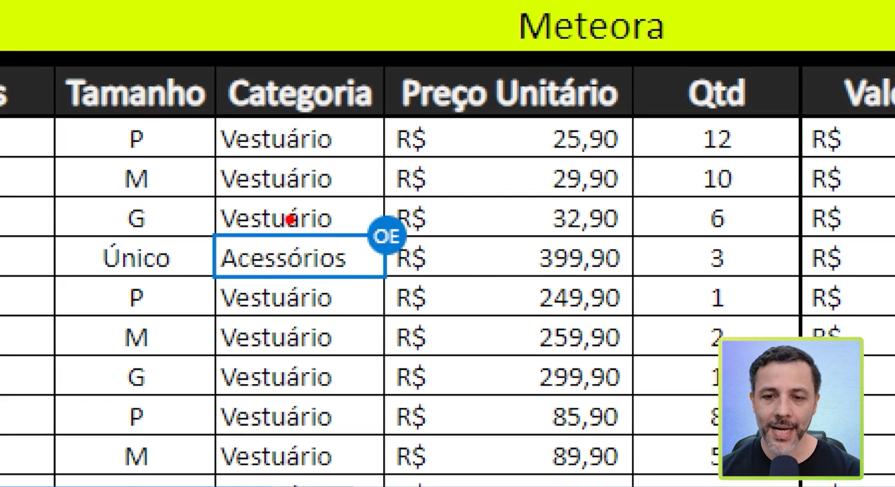
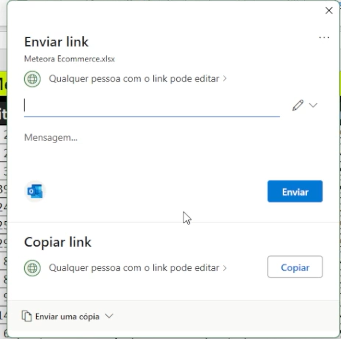
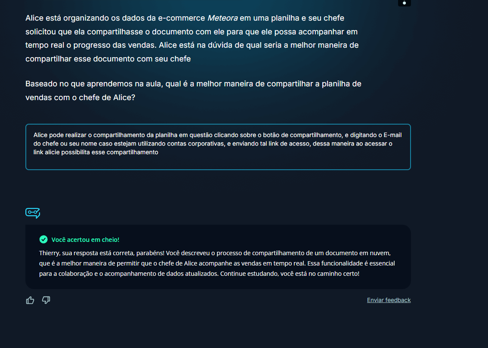
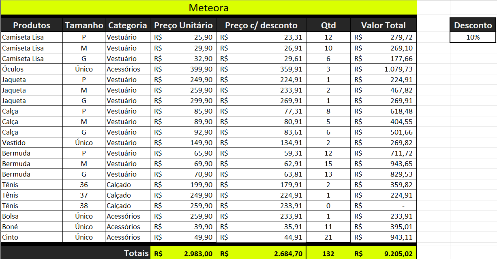
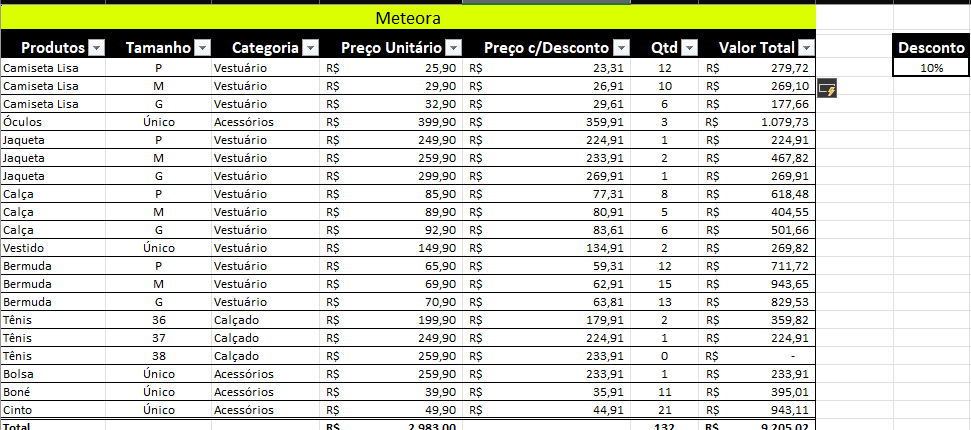

# Compartilhando dados na nuvem

## 1. Preparando o ambiente: *planilha Meteora E-commerce*
Para acompanhar o curso com o máximo de aproveitamento, você pode fazer o download da [planilha](db/Meteora%20Ecommerce%20-%20FINAL%20AULA%205.xlsx) que estamos trabalhando para a Loja Meteora. 

## 2. Compartilhar e Colaborar
Nessa aula será demonstrado como realizar o compartilhamento da planilha em questão.  
Para que esse processo seja realizado da melhor forma possível é necessário a utilização do `Excel Online` ou do `Office 365`, pois nessas plataformas possibilitam a edição da planilha em conjunto, é valido ressaltar que na [primeira aula](https://github.com/thierryLchaves/Santander-Imersao-Digital/blob/81c6086fb584a19c5afd626e4b98b331644cfc27/Analise_de_dados_e_IA_Nivelamento/Semana_01/Excel/01_Domine_o_editor_de_planilhas/DomineOeditorDePlanilhas.md), foi realizado a edição da planilha utilizando essas plataformas, e ativado a opção de compartilhamento em nuvem.  
Quando realizamos esse processo é possível visualizar quando existe algum usuário editando a planilha ficando caracterizado pelo ícone de seleção:

<table style="text-align: center; width: 100%;"> 
<tr>
    <td style="text-align: left;">
    
    </td>
</tr>
</table>

Essa maneira realiza o compartilhamento entre a própria conta, porém ainda é possível realizar o compartilhamento entre constas distintas, para tal processo dentro da ferramenta, deve-se acessar o botão de `Compartilhamento`, pós tal seleção será apresentado uma tela de __pop-up__ para que seja inserido o E-mail ou gerado um link para disponibilizar o compartilhamento da planilha em questão.

<table style="text-align: center; width: 100%;"> 
<tr>
    <td style="text-align: left;">
    
    </td>
</tr>
</table>

> OBS: Existe diferenças entre compartilhar uma planilha via a opção primária da tela entre a opção de enviar uma cópia, na segunda opção a planilha em questão é enviada como anexo, e como o nome sugere tal informação e compartilhada como uma cópia da planilha.

> OBS 2: É possível realizar também de realizar o `download` da planilha ou salva-la em máquina local, porém dessa maneira a opção de edição simultânea não é possível de ser realizada, para além disso também fica indisponível a opção de salvamento automático 

## 3. Compartilhar o arquivo na nuvem

Alice está organizando os dados da e-commerce Meteora em uma planilha e seu chefe solicitou que ela compartilhasse o documento com ele para que ele possa acompanhar em tempo real o progresso das vendas. Alice está na dúvida de qual seria a melhor maneira de compartilhar esse documento com seu chefe

Baseado no que aprendemos na aula, qual é a melhor maneira de compartilhar a planilha de vendas com o chefe de Alice?

<table style="text-align: center; width: 100%;"> 
<tr>
    <td style="text-align: left;">
    
    </td>
</tr>
</table>

## 4. Faça como fiz: *Salvando a planilha na nuvem*
Imagine uma situação: você está trabalhando em uma planilha no seu computador e deseja gravá-la na nuvem para garantir que ela esteja segura e acessível em qualquer lugar.

Vamos fazer o passo a passo para "subir" essa planilha usando o próprio Excel?!

Vamos ao passo a passo:

- Passo 1: Com a sua pasta de trabalho aberta, vá até a guia __"Arquivo"__ e escolha a opção __"Salvar como".__

- Passo 2: Do lado esquerdo, onde estiver selecionado "Este PC" mude para a opção `"OneDrive"`.
    - Caso você nunca tenha usado o OneDrive e não tenha uma conta Microsoft, clique em "Inscrever-se" e siga o passo a passo do cadastramento.
    - Caso você não esteja conectado, no entanto já tenha uma conta Microsoft, clique no botão "Entrar" e entre com o e-mail da sua conta Microsoft.
    - Caso nenhuma das opções apareça, você já está conectado. Siga para o passo 3.
- Passo 3: Escolha um nome para sua pasta, ou mantenha o mesmo nome que já estava gravado em seu computador. (Lembre-se que essa pasta está na nuvem).
    - Caso queira mudar a pasta onde fará a gravação, clique em "Mais opções..." e use a caixa de diálogo "Salvar Como".
- Passo 4: Clique no botão "Salvar".

Pronto, a pasta de trabalho foi salva na nuvem!

## 5. Explicando o desafio
Para realizar o desafio em questão deve ser realizado a adição de uma coluna com __valor com desconto sobre o produto__, atualmente a planilha em questão está realizando o calulo do percentual de desconto sobre o valor total da peça, e o valor total será modificado para que o valor das peças seja baseados sobre o valor da peça, com o desconto aplicado.
> Desafio extra: Replicado o calculo na planilha __com formatação de tabela__

### 5.1 Desafio feito sem revisão
Para resolução do desafio, foi realizado a seguinte formula sobre a célula de Preço C/desconto

```Excel
=D4-(D4*$I$4)
```
Após aplicação dessa formula, foi replicado o mesmo para o restante das colunas deixando a planilha sem formatação da seguinte maneira:  

<table style="text-align: center; width: 100%;"> 
<tr>
    <td style="text-align: left;">
    
    </td>
</tr>
</table>

### 5.2 Desafio Extra
Mesmo se tratando de uma planilha com formatação de tabela, foi realizado a mesma lógica com a diferença de que nao foi realizado a inserção de coluna copiada e sim inserido uma nova coluna a esquerda, e excluindo a ultima coluna da planilha, fazendo assim com que o calculo de valor inicial -(valor inicial * desconto), conforme demonstrado em trecho de código abaixo,

```Excel
=[@[Preço Unitário]]-([@[Preço Unitário]]*$I$4)
```
Ficando então com a planilha de seguinte maneira:

<table style="text-align: center; width: 100%;"> 
<tr>
    <td style="text-align: left;">
    
    </td>
</tr>
</table>

## 6. Desafio: *Calcular o desconto para caa produto*

Então, está preparado para se desafiar à medida que aprende? A hora é agora!

Neste desafio, a sua missão é seguir o passo a passo elaborado durante a aula e descobrir qual fórmula devemos utilizar para calcular o valor do desconto para cada produto.

Essa é uma excelente oportunidade para explorar e aplicar o seu conhecimento, colocando em prática tudo o que aprendeu. Bora lá!
Opinião do instrutor

Vamos ao passo a passo:

- Passo 1: Para calcular o valor do desconto para cada produto, você precisa utilizar duas funções: Subtração e Multiplicação.

- Passo 2: Na coluna Preço c/ Desconto, digite o símbolo do sinal de igual `(=)` para indicar para o Excel que vamos realizar um cálculo.

- Passo 3: Selecione a célula D4 da coluna Preço Unitário para indicar o primeiro parâmetro do cálculo que será realizado.
    ```text
    =D4
    ```
- Passo 4: Em seguida, digite o símbolo da subtração `(-)`.
    ```text
    =D4-
    ```
- Passo 5: Antes de inserirmos a segunda função, abra um parênteses `(` para indicar para o Excel que a segunda função precisa ser executada antes da subtração.
    ```text
    =D4-(
    ```
- Passo 6: Selecione novamente a célula D4 da coluna da coluna Preço Unitário para indicar o primeiro parâmetro da segunda função.
    ```text
    =D4-(D4
    ```
- Passo 7: Em seguida, digite o símbolo da multiplicação `(*)` e selecione a célula I4 da coluna Desconto para indicar o segundo parâmetro do cálculo que será realizado. Feche o parênteses `)`
    ```text
    =D4-(D4*I4)
    ```
- Passo 8: Antes de “arrastar” a fórmula para as outras células da coluna Preço c/ Desconto, pressione a tecla de atalho `F4` para “travar” a célula I4 e indicar para o Excel que queremos utilizar a referência do tipo Absoluta.

- Passo 9: Pressione o `[ENTER]`.

- Passo 10: Nesse momento, utilize a alça de preenchimento para arrastar a nova fórmula corrigida para as demais células da coluna Preço c/ Desconto.

- Passo 9: Em seguida, clique na caixa de Opções de autopreenchimento para ajustar a formatação.

Pronto, a fórmula foi criada e já temos o valor do preço com desconto para cada produto!

## 7. O que aprendemos ?
Nessa aula, você aprendeu como:
- Utilizar o recurso de compartilhamento em nuvem;
- Experimentar como acessar o OneDrive;
- Utilizar os benefícios do trabalho colaborativo;
- Produzir o compartilhamento de um arquivo na nuvem.

---
<table align="center" style="border-collapse: collapse; margin-left: auto; margin-right: auto;"> 
  <caption><b>Skills do projeto</b></caption>
  <tr>
    <td style="padding: 5px;">
      
    </td>
    <td style="padding: 5px;">
      
    </td>
    <td style="padding: 5px;">
      
    </td>
  </tr>
</table>

---
__Titulo:__ Compartilhando dados na nuvem
__Autor:__ Thierry Lucas Chaves  
__Data de Criação:__ 05-05-2026  
__Data de Modificação:__ 05-05-2026  
__Versão:__ "1.0"