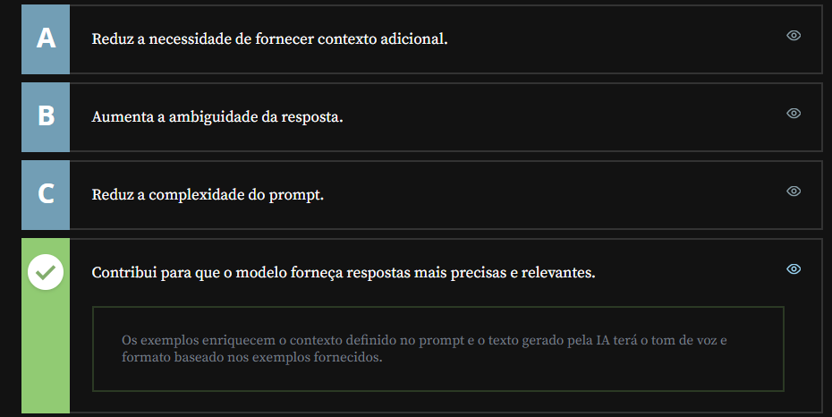

# IA's DE Texto

## Sumário

## 1. Apresentação
Nessa trilha será destinada a introdução sobre os modelos de inteligência artificial disponíveis no mercado, sendo eles:
- `ChatGPT`
- `Google Gemini`
- `Google IA Studio`
- `Maritaca AI`

Ou seja o principal objetivo desse módulo e auxiliar, para extrair todo o potencial que as I.A's podem oferecer, seja para manipular o texto, resumir, editar, mas também como outras ferramentas, "multi-modais" sejam para vídeos, imagens etc..
## 2. Usando o ChatGPT
Antes de começar iremos vamos definir o que é __`LLM`__ esse termo vem do inglês e significa _Large Language model_, ou traduzindo grandes modelos de linguagem, nesse termo enquadra-se o primeiro modelo mais famoso o [ChatGPT](https://chatgpt.com/), No momento  video o modelo de linguagem utilizado era o `Chatgpt` 4o,  porém ainda é possível realizar a modificação dos modelos para outros mais antigos, como por exemplo o  `4o-mini`. 

> E valido ressaltar que sempre que for realizar uma interação com um pedido diferente do feito anteriormente é importante iniciar um novo chat.

Outro ponto, é importante que ao realizar prompts perguntas mais estruturadas para o chat.
## 3. Descobrindo o Google Gemini
As funcionalidades de texto do [Gemini](https://gemini.google.com/app), basicamente são as mesma, umas das diferenças mais visíveis dizem respeito a escolha de modelos que existe no chat gpt e da que existe no Gemini, para além disso por se tratar de uma ferramenta do google, ele consegue utilizar ferramentas do google também como por exemplo [Google Hotels](https://www.google.com/travel/search?ts=CAESABoAKgIKAA&ved=0CAAQ5JsGahcKEwiAz9-rqKWUAxUAAAAAHQAAAAAQCg&ictx=3&authuser=0),assim como também ele realiza outras interações com outras ferramentas `Google`
## 4. Lidando com textos
Uma recomendação sobre modelos que lidam com texto, e que podemos realizar por exemplo textos com regras ex para realizar tal coisa siga esse e esse padrão, já quando for utilizar tal coisa siga o padrão X Y ou Z.
Outra dica é que para sempre que for realizar um pedido ou interação, essa seja iniciada com um comando,exemplo:
```text
Crie um E-mail para um cliente seguindo as regras descritas abaixo:
```
## 5. Aprimorando o contexto
Como vimos em aula, é importante que o comando enviado para a IA generativa tenha um contexto bem definido. Existem diferentes técnicas já estudadas para elaborar bons prompts, e uma das mais utilizadas é a utilização de exemplos.

Qual é o benefício de usar exemplos específicos em um prompt ao interagir com o ChatGPT ou o Gemini?
<table style="text-align: center; width: 100%;"> 
<tr>
    <td style="text-align: left;">
    
    </td>
</tr>
</table>

## 6. Mão na massa: Criando conteúdo para um blog de alimentação saudável
Vamos praticar!

Nos vídeos anteriores, utilizamos o ChatGPT e o Gemini como assistentes em uma agência de viagens. Descobrimos hotéis na Itália com características específicas e criamos posts de blog e um e-mail dentro desse mesmo contexto.

Agora, experimente criar um post de blog que fale sobre alimentação saudável e que forneça algumas receitas.

Certifique-se de fornecer as instruções para que o resultado seja o que você busca. Use a criatividade!

Opinião do instrutor

Existem muitas formas de obter um bom resultado ao interagir com IAs generativas. Porém, o mais importante é que o comando seja claro e tenha as preferências especificadas.

Aqui está um exemplo de como o prompt para gerar o post de blog sobre alimentação saudável poderia ser:
```text
Crie um texto para blog.

- o tema é alimentação saudável que também pode ser prazerosa
- o tom deve ser informal, mas com pouco uso de gírias
- use emojis
- dê 3 opções de receitas vegetarianas e saudáveis para um café da manhã reforçado
- não use listas
```
## 7. Para saber mais 
É bastante impressionante ver a IA generativa funcionando pela primeira vez. Os modelos de linguagem como o Gemini e o ChatGPT são verdadeiras revoluções na área de Inteligência Artificial - principalmente pelo alcance às mãos de qualquer pessoa com acesso à internet.

Se conhecer esses modelos despertou sua curiosidade acerca do tema, leia o artigo [ChatGPT: o que é, como usar e dicas de comandos para o dia a dia](https://www.alura.com.br/artigos/chatgpt) e também [O que é Inteligência Artificial? Como funciona uma IA, quais os tipos e exemplos](https://www.alura.com.br/artigos/inteligencia-artificial-ia)
## O que aprendemos?
Nesta aula, aprendemos:

- Usar as plataformas ChatGPT e Gemini para gerar textos.
- Manipular o tipo de linguagem que queremos em nossos textos.
- Gerar e-mails a partir de um conjunto de regras.
- Gerar resumos de textos longos com LLMs.

---

<table align="center" style="border-collapse: collapse; margin-left: auto; margin-right: auto;"> 
  <caption><b>Skills do projeto</b></caption>
  <tr>
    <td style="padding: 5px;">
      
    </td>
    <td style="padding: 5px;">
      
  </tr>
</table>


---
__Titulo:__  IA's DE Texto
__Autor:__ Thierry Lucas Chaves  
__Data de Criação:__ 06-05-2026  
__Data de Modificação:__ 06-05-2026  
__Versão:__ "1.0"