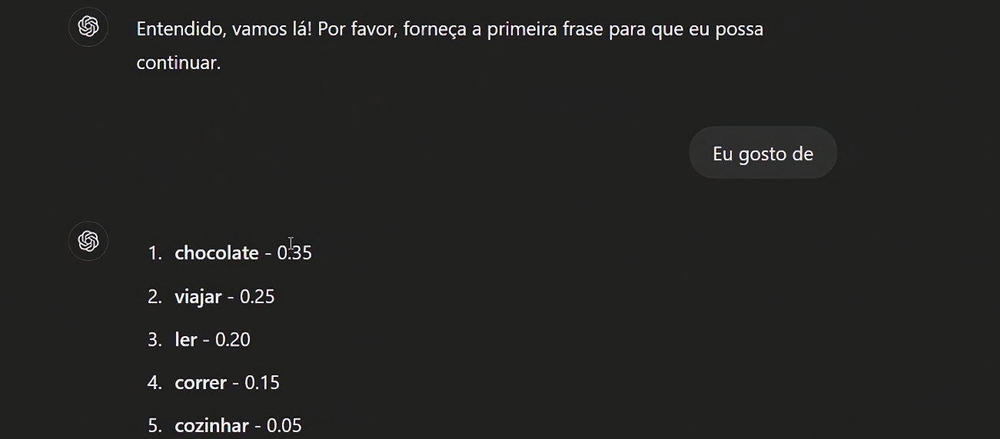
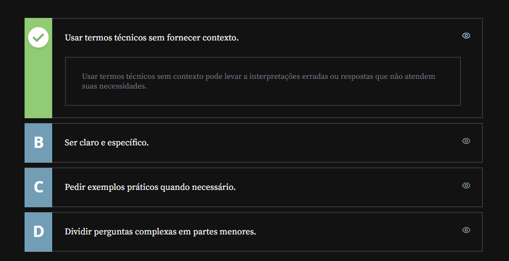

# Modelos De Linguagem

## Sumário
- [Modelos De Linguagem](#modelos-de-linguagem)
  - [Sumário](#sumário)
  - [1. O que é e como funciona um modelo de linguagem](#1-o-que-é-e-como-funciona-um-modelo-de-linguagem)
  - [2. Princípios da Engenharia de Prompt](#2-princípios-da-engenharia-de-prompt)
    - [2.1 Princípios para a criação de um prompt ideal](#21-princípios-para-a-criação-de-um-prompt-ideal)
  - [3. Análise de Prompts no ChatGPT](#3-análise-de-prompts-no-chatgpt)
  - [4. Mão na massa: criando um post para seu trabalho](#4-mão-na-massa-criando-um-post-para-seu-trabalho)
  - [5. Para saber mais](#5-para-saber-mais)
  - [6. O que aprendemos?](#6-o-que-aprendemos)

## 1. O que é e como funciona um modelo de linguagem
Quando estamos falando de modelos de linguagem, isso nos remete a uma área de estudo da _"Inteligência Artificial"_, que é chamada de `NLP` que significa Natural Language Processing,o que traduzindo significa Processamento de linguagem natural, tendo como objetivo de estudo dessa área a comunicação de seres humanos com máquinas com a linguagem que é utilizada por seres humanos.  
Ou seja ao invés de se utilizar linguagens de programação seja ela de baixo ou alto nível, utilizamos a linguagem natural humana, e esse modelo se encarrega de realizara _"decodificação"_ desse processo.  
Para melhor elucidar o que estamos dizendo, vamos dar o exemplo de uma sentença em português.  
Sempre quando utilizamos o verbo __GOSTAR__, como por exemplo:   
>"Eu gosto __de__ viajar"  
Em vias de regra sempre quando utilizamos esse verbo ele é precedido da preposição __"de"__, isso quando estamos falando de português, porém quando traduzimos essa mesma frase para o inglês, ela ficaria como:  
> __I like__ to  travel, ou ainda __I like__ traveling; 
Como podemos notar nesse idioma não temos a mesma regra para tal sentença, e não existe uma tradução direta para a preposição.   
Voltando ao nosso objeto de estudo os `NLP`, realizam a busca de padrões de linguagem, e _"entendem"_ esses padrões, tal processo pode ser feito com base de treinamentos extensas, seja em conteúdos de internet, livros afim de realizar o entendimento seja do padrão semântico por probabilidade de próxima palavra pós tal palavra, ou seja por contexto de conteúdo.  

Para simularmos o que foi descrito acima podemos realizar uma _"brincadeira"_, com o `ChatGPT` com o seguinte prompt:
```text
Vamos simular como funciona o ChatGPT, para cada frase que eu escrever no prompt, você deve listar as 5 palavras com maior probabilidade que você usaria para completá-las, junto com a probabilidade de cada uma delas.
Combinado?  Apenas as palavras e probabilidades, sem mais nada.
```
Ao realizar tal prompt podemos ter uma saída conforme exemplo abaixo: 

<table style="text-align: center; width: 100%;"> 
<tr>
    <td style="text-align: left;">
    
    </td>
</tr>
</table>

## 2. Princípios da Engenharia de Prompt
Nessa seção vamos visualizar os princípios da `Engenharia de Prompt`, tal processo tem esse nome mais ligado a sua base etimológica e não pelo uso comum utilizados para demais profissões, quando buscamos a etimologia da palavra engenharia temos que essa vem de engenhar, que seria como criar, então quando estamos falando de `Engenharia de Prompt`, estamos querendo de dizer sobre técnicas de construção de um prompt para essas  `LLM's` de tal maneira que esse prompt seja o melhor possível conforme o contexto e que se obtenha a melhor resposta a partir desse prompt. 
Uma das regras principais para lograrmos exito em um prompt, e que esse __deve ser estruturado de maneira muito clara__, exemplificando essa regra seria como se estivéssemos delegando alguma tarefa a um novato ou a um estagiário, que detém muito conhecimento teórico, porém não tenha as devidas vivências na empresa ou na área, então quando delegarmos a tarefa em questão temos que ser o mais claro e objetivo possível.  

### 2.1 Princípios para a criação de um prompt ideal
    - Ter clareza ao dar as instruções;
    - Dividir tarefas complexas em sub-tarefas menores; 
    - Pedir para o modelo explicar seus passos antes de dar a resposta;
    - Pedir para o modelo dar justificativas de suas respostas;
    - Gerar várias respostas diferentes e pedir para o modelo escolher a melhor.

O ultimo passo listado "Gerar várias reposta diferentes e pedir para o modelo escolher a melhor, também pode ser conhecido como <a href="#selfConsistency">Self-Consistency</a>
<details id="selfConsistency">
    <summary>Self-Consistency (Autoconsistência)</summary>
        <p>
        O conceito de Self-Consistency (Autoconsistência) é uma técnica avançada de engenharia de prompts que busca melhorar o desempenho de modelos de linguagem em tarefas que exigem raciocínio complexo, como lógica, matemática ou programação.
        <b> Definição Resumida</b>
        Em vez de seguir apenas um único caminho de raciocínio (como no Chain-of-Thought padrão), o modelo gera múltiplas rotas de pensamento diferentes para o mesmo problema. A resposta final é selecionada com base no resultado que aparece com maior frequência entre todas as gerações, aplicando uma espécie de "votação majoritária.</br>
        <b>Como Funciona o Fluxo: </b>
        </p>
        <ul>
        <li> Prompt de Cadeia de Pensamento: O modelo é estimulado a "pensar passo a passo" (Chain-of-Thought). </li>
        <li> Geração Diversificada: O modelo gera várias respostas independentes (amostragem) para a mesma pergunta.</li>
        <li> Votação por Consistência: O sistema analisa todos os caminhos gerados. Mesmo que os processos de raciocínio variem, se a maioria chegar ao mesmo resultado numérico ou lógico, esse resultado é considerado o mais confiável.</li>
    </ul>
    <p>Por que é útil?</p>
    <ul>
    <li> Redução de Alucinações: Minimiza erros pontuais que podem ocorrer em uma única tentativa. </li>
    <li> Aumento de Precisão: É particularmente eficaz em problemas onde existem várias formas de chegar à solução correta.</li>
    <li> Robustez: Torna a saída do modelo menos dependente de uma "sorte" estatística na geração dos tokens iniciais. </li>
    </ul>
</details>

## 3. Análise de Prompts no ChatGPT
Você está utilizando o ChatGPT como assistente em um projeto complexo e precisa criar um prompt eficaz. Das alternativas abaixo, qual poderia prejudicar na qualidade da resposta do chat, se fosse uma característica do seu prompt?  

<table style="text-align: center; width: 100%;"> 
<tr>
    <td style="text-align: left;">
    
    </td>
</tr>
</table>

## 4. Mão na massa: criando um post para seu trabalho
Na aula anterior falamos sobre engenharia de prompt - a área que estuda como obter resultados cada vez mais precisos em IAs generativas.

São algumas das técnicas de engenharia de prompt:

- Ter clareza ao dar as instruções;
- Dividir tarefas complexas em subtarefas menores;
- Pedir para o modelo explicar seus passos antes de dar a resposta;
- Pedir para o modelo dar justificativas de suas respostas;
- Gerar várias respostas diferentes e pedir para o modelo escolher a melhor.
- 
Essas técnicas parecem simples, mas são detalhes que fazem uma imensa diferença na utilidade que a IA tem no dia a dia.

Para praticar, use as técnicas e crie um prompt com múltiplos passos em que o resultado final seja um post sobre algum assunto específico da sua área de trabalho ou estudo.
Esse post deve ter o formato adequado para ser publicado no seu LinkedIn pessoal e utilizar a hashtag #IAnaAlura.

Utilizando a divisão em subtarefas e mantendo as instruções claras e bem contextualizadas, os resultados obtidos são bastante interessantes!

Veja um exemplo de prompt:
```text
1. Fale sobre as 5 bibliotecas mais utilizadas para criação de gráficos em análise de dados com Python

2. Faça uma analogia de cada biblioteca mencionada com um personagem emoção do filme Divertida Mente - Alegria, Tristeza, Nojinho, Medo e Raiva

3. Crie um post para eu postar em meu Linkedin pessoal, utilizando a hashtag #IAnaAlura. O post deve ser apropriado para o Linkedin, mas trazer o aspecto divertido da analogia com o filme
```
Pratique bastante, explorando assuntos do seu interesse e diferentes técnicas. Compare os resultados obtidos para compreender como adequar as técnicas à sua realidade.
## 5. Para saber mais
Se você quiser aprender mais a fundo sobre os modelos de linguagem e como os modelos mais poderosos da atualidade foram treinados, recomendo a leitura do livro “Inteligência Artificial e ChatGPT” da Casa do Código, que explica desde a base da IA até conceitos mais avançados de Engenharia de Prompt: 
- [Inteligência Artificial e ChatGPT: Da revolução dos modelos de IA generativa à Engenharia de Prompt](https://www.casadocodigo.com.br/products/livro-inteligencia-artificial-chatgpt)  
- 
## 6. O que aprendemos? 
Nesta aula, aprendemos:

- Como funcionam os modelos de linguagem por baixo dos panos.
- Como criar prompts melhores.
- O que é e quais são os princípios mais relevantes da Engenharia de Prompt.

---

<table align="center" style="border-collapse: collapse; margin-left: auto; margin-right: auto;"> 
  <caption><b>Skills do projeto</b></caption>
  <tr>
    <td style="padding: 5px;">
      
    </td>
    <td style="padding: 5px;">
      
    </td>
  </tr>
</table>


---
__Titulo:__ Modelos De Linguagem
__Autor:__ Thierry Lucas Chaves  
__Data de Criação:__ 06-05-2026  
__Data de Modificação:__ 06-05-2026  
__Versão:__ "1.0"