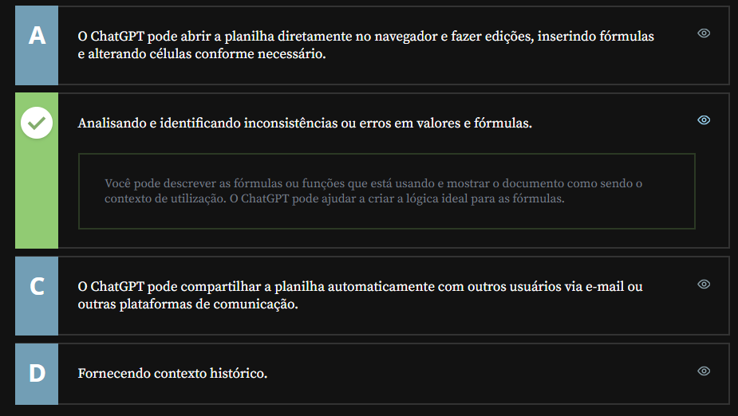
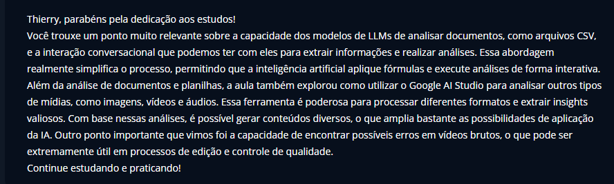

# IA's para Analises

## Sumário:
- [IA's para Analises](#ias-para-analises)
  - [Sumário:](#sumário)
  - [1. Análise de documentos](#1-análise-de-documentos)
  - [2. Análise de imagens e vídeos](#2-análise-de-imagens-e-vídeos)
  - [3. Para saber mais: Sobre Tokens](#3-para-saber-mais-sobre-tokens)
  - [4. Análise de áudios](#4-análise-de-áudios)
  - [5. Trabalhando com dados](#5-trabalhando-com-dados)
  - [6. Mão na massa: analisando planilha e gerando gráficos](#6-mão-na-massa-analisando-planilha-e-gerando-gráficos)
  - [7. Para saber mais: Mais ferramentas](#7-para-saber-mais-mais-ferramentas)
  - [8. O que aprendemos?](#8-o-que-aprendemos)

## 1. Análise de documentos
Uma das principais utilidades desses modelos de LLM'S são a de análises, seja analise de documentos, imagens ou vídeos.
Quando trabalhamos com modelos de LLM's, podemos realizar a analise de documentos de uma maneira simples, como por exemplo o upload de um arquivo `CSV`, e ao invés de analisarmos o arquivo e realizar o processo de <a href="#ETL">ETL</a> nos mesmo podemos falar a analise de uma maneira interativa com o modelo, o processo como se fosse uma conversa, onde permutaremos ao modelo coisas sobre o objeto de analise no caso o `CSV`, e o `ChatGPT` irá aplicara formulas analises etc, sobre o documento em questão.

    
Definição de ETL

        
O ETL (Extract, Transform, Load) é o processo fundamental de integração de dados utilizado para mover informações de múltiplos sistemas de origem para um destino único e centralizado, como um Data Warehouse ou Data Lake. 
        <b> As Três Etapas do Processo: </b>
        

        <ul>
            <li>Extração (Extract): Os dados são coletados de diversas fontes, que podem incluir bancos de dados relacionais (como Oracle ou SQL Server), arquivos planos (CSV, JSON), APIs ou planilhas. O foco aqui é ler os dados sem impactar a performance da origem.
            </li>    
            <li> Transformação (Transform): É a fase mais crítica. Os dados brutos são "limpos" e moldados. Isso inclui:
                <ul>
                    <li> Limpeza de dados (remoção de duplicatas, tratamento de valores nulos);</li>
                    <li> Padronização de formatos (como padronizar datas ou textos);</li>
                    <li> Aplicação de regras de negócio e cálculos complexos.</li>
                    <li> Filtragem e agregação.</li>
                </ul>
            </li>
            <li> Carga (Load): Os dados transformados são finalmente gravados no sistema de destino. Essa carga pode ser Full (carrega tudo do zero) ou Incremental (apenas o que mudou desde a última execução).
            </li>
        </ul>
        
 <b> Por que é essencial? </b> 

        <ul>
            <li> Visão Unificada: Consolida dados que antes estavam isolados ("silos de dados"). </li>
            <li> Qualidade: Garante que os analistas e gestores trabalhem com dados confiáveis e padronizados. </li>
            <li> Histórico: Permite manter um registro histórico para análises de tendências, algo que sistemas transacionais muitas vezes não suportam bem.</li>
        </ul>
    
 Contexto Moderno (ELT)
        Atualmente, com o poder de processamento das nuvens, existe também o ELT, onde os dados são carregados primeiro e a transformação ocorre diretamente dentro do destino final, aproveitando a escalabilidade de ferramentas modernas de Big Data.
        O ETL é o "coração" de projetos de Business Intelligence e automações que dependem de dados estruturados para tomada de decisão.
    
        

Para além das ferramentas vistas anteriormente durante o curso,  temos também o [Google IA Studio](https://aistudio.google.com/apps), essa ferramenta é mais voltada para desenvolvedores, porém para fins de estudo utilizaremos da mesma maneira pro `ChatGPT`, com a um diferencial do `Google Gemini` padrão é a possibilidade de escolha do modelo.

## 2. Análise de imagens e vídeos
Assim como são feitas as analises de documentos, é possível realizar analises de imagens seguindo a mesma premissa, tais processos podem ser feitos tanto quanto solicitação de edição de fotos, como também textos a partir da imagem. 
Para além das analises de fotos, podemos realizar analise de vídeos através do [Google IA Studio](https://aistudio.google.com/apps).

## 3. Para saber mais: Sobre Tokens
Tokens são as menores unidades de texto que um modelo de IA utiliza para processar e gerar linguagem. Eles podem ser palavras inteiras, partes de palavras, ou até mesmo caracteres individuais, dependendo do contexto. Em linguagens baseadas em alfabeto, como o português ou o inglês, uma frase pode ser dividida em vários tokens para que a IA entenda ou produza texto.

Por exemplo, a frase "Eu gosto de aprender" pode ser decomposta em tokens como "Eu", "gosto", "de", "aprender". Cada token é uma peça fundamental que a IA manipula para construir ou interpretar sentenças de forma precisa.

Os tokens são fundamentais para o funcionamento eficaz de modelos de IA porque eles são as unidades básicas de informação que a IA manipula ao processar e gerar texto. A importância dos tokens reside em sua função como blocos de construção que a IA usa para compreender e formar frases, ideias e conceitos. Sem a divisão em tokens, a IA teria dificuldade em segmentar, analisar e organizar as informações textuais de maneira coerente  

## 4. Análise de áudios
Para além das analises de, foto, arquivo e vídeos, também podemos utilizar o [Google IA Studio](https://aistudio.google.com/apps), para analise de áudios ou transcrição de áudios, ou ainda analises do áudio.

## 5. Trabalhando com dados
Trabalhar com documentos de diversos formatos amplia significativamente as possibilidades de uso da Inteligência Artificial generativa, mas não substitui o uso das ferramentas tradicionais de manipulação desses documentos, como o Excel ou Docs, por exemplo.

Considere que você enviou uma planilha para o ChatGPT. De que forma ele pode te ajudar na análise desses dados?
<table style="text-align: center; width: 100%;"> 
<tr>
    <td style="text-align: left;">
    
    </td>
</tr>
</table>

## 6. Mão na massa: analisando planilha e gerando gráficos
Faça o download desta [planilha](src/Média%20de%20notas.csv) em formato CSV.

Utilizando o Google AI Studio ou o ChatGPT 4o, faça upload da planilha e peça para que o modelo analise que tipos de dados ela contém.

Depois, peça para o modelo calcular a média aritmética das notas de cada um dos alunos.

Você pode também pedir que o modelo gere um gráfico, como o de dispersão das médias dos estudantes, por exemplo. Se não for possível, você pode pedir as instruções para gerar esse gráfico no Excel ou Google Sheets: 

Opinião do instrutor

A multimodalidade de alguns modelos é muito útil para analisar documentos e fazer perguntas sobre ele. É importante lembrar que os modelos de linguagem contém limitações. Eles são ótimos assistentes, mas não substituem a importância do olhar humano!

Sempre cheque resultados de cálculos com ferramentas totalmente confiáveis e evite compartilhar dados sensíveis com grandes modelos.

## 7. Para saber mais: Mais ferramentas
A SheetGPT é uma ferramenta bastante interessante para auxiliar na análise de dados. Nesse vídeo da websérie sobre [IAs Generativas](https://www.youtube.com/watch?v=Cc9945IBVBM&time_continue=0&source_ve_path=NzY3NTg&embeds_referring_euri=https%3A%2F%2Fcursos.alura.com.br%2F&embeds_referring_origin=https%3A%2F%2Fcursos.alura.com.br)

Outro vídeo da mesma websérie demonstra como [utilizar o ChatGPT para a análise de arquivos e planilhas](https://www.youtube.com/watch?v=u-JoDQ58Dv0)

## 8. O que aprendemos?
Explique com suas próprias palavras os principais conceitos que você aprendeu nesta aula.
<table style="text-align: center; width: 100%;"> 
<tr>
    <td style="text-align: left;">
    
    </td>
</tr>
</table>

---

<table align="center" style="border-collapse: collapse; margin-left: auto; margin-right: auto;"> 
  <caption><b>Skills do projeto</b></caption>
  <tr>
    <td style="padding: 5px;">
      
    </td>
    <td style="padding: 5px;">
      
    </td>
  </tr>
</table>

---
__Titulo:__ IA's para Analises
__Autor:__ Thierry Lucas Chaves  
__Data de Criação:__ 07-05-2026  
__Data de Modificação:__ 07-05-2026  
__Versão:__ "1.0"