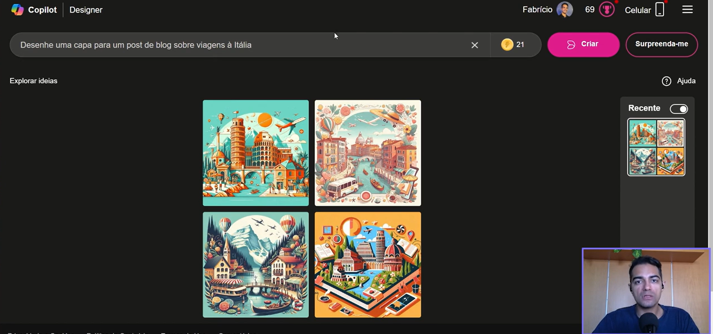
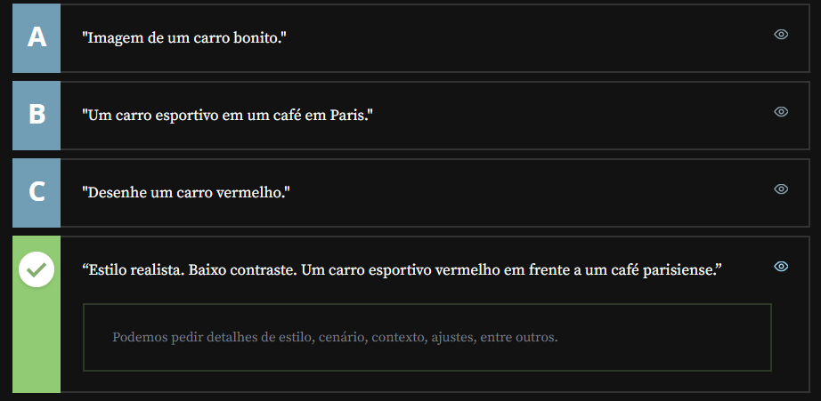

# Gerando Imagens

## Sumário

## 1. Bing Images e DALL-E
No decorrer desse curso realizamos a exploração primária de modelos multimodais ou seja modelos que podem trabalhar com diferentes tipos de dados (Imagens, textos, vídeos, arquivos etc..)
A primeira ser demonstrada é o [Bing Imagens](https://www.bing.com/images/create/ai-image-generator?cc=br)
<table style="text-align: center; width: 100%;"> 
<tr>
    <td style="text-align: left;">
    
    </td>
</tr>
</table>

Outra plataforma que pode ser possível de utilização é o [DALL-E](https://openart.ai/suite/create-image/gpt-image-2)

## 2. Midjourney
[Midjourney](https://www.midjourney.com/explore?tab=top)
## 3. Prompts para imagens
Em IAs geradoras de imagens, temos um campo de inserção de texto que funciona de forma similar aos prompts em IAs textuais. Considerando as técnicas de engenharia de prompt, qual das alternativas abaixo é um comando mais adequado para gerar uma imagem?
<table style="text-align: center; width: 100%;"> 
<tr>
    <td style="text-align: left;">
    
    </td>
</tr>
</table>

## 4. Mão na massa: completando post com imagens
Lembra da atividade feita na aula 2, em que você criou um prompt para um post de Linkedin com um assunto do seu interesse?

Utilize alguma das IAs generativas de imagem apresentadas para criar a imagem que ilustra esse post. Explore as ferramentas e prompts com diferentes especificações para encontrar a imagem que faz mais sentido para você.

Aproveita para postar lá no Linkedin e marca a gente!  

Opinião do instrutor

Pratique aplicar as técnicas que você aprendeu neste curso em problemas do seu cotidiano. Pode ser que a IA seja uma ótima assistente.

Lembre-se: as respostas não são 100% precisas e a IA não substitui o trabalho humano. É imprescindível sempre checar fatos e cálculos.

Além disso, em uma tecnologia tão recente, ainda existem debates éticos importantíssimos acontecendo. Para saber mais sobre esse assunto, recomendo a leitura do artigo
[Ética e Inteligência Artificial (IA) para profissionais de tecnologia: navegando no mundo digital de forma responsável](https://www.alura.com.br/artigos/etica-e-inteligencia-artificial)  

## 5. Para saber mais: Outras ferramentas  
Nessa aula, criamos imagens com três ferramentas: Bing Images, DALL-E e Midjourney.

Existem muitas outras, como a [Stabble Diffusion](https://www.alura.com.br/artigos/stable-diffusion),, por exemplo. No artigo [Inteligência Artificial para criar desenhos e outras imagens](https://www.alura.com.br/artigos/inteligencia-artificial-desenha-e-cria-imagens) você pode conhecer outras ferramentas interessantes.
## 6. O que aprendemos?
Nesta aula, aprendemos sobre:

- Criação de imagens usando Bing Images, DALL-E e Midjourney.
- Prompts para imagens.
## 7. Conclusão
O que aprendemos ao longo do curso:

Começamos entendendo como escrever prompts eficazes, incluindo detalhes precisos e indicando o que a IA pode ou não fazer. Aplicamos isso em exemplos práticos, como criar listas de hotéis, transformá-las em posts de blog e reescrever conteúdos com tons diferentes.

Também aprendemos a criar regras para automatizar e-mails personalizados, usando nomes de clientes e emojis para incentivar compras. Uma estratégia importante foi dividir tarefas complexas em etapas menores, em vez de enviar tudo de uma vez.

Exploramos como usar geradores de imagens como DALL-E, Bing Images e Midjourney para ilustrar nossos posts em diferentes redes sociais.

Além disso, vimos como resumir artigos, PDFs e documentos, explorar pontos específicos deles e até reescrever conteúdos técnicos de forma mais acessível. O Google AI Studio também nos permitiu analisar arquivos de vídeo e áudio longos.

A mensagem principal:

A IA não vai necessariamente roubar seu trabalho, mas quem souber usá-la bem terá uma vantagem competitiva no mercado de trabalho.

Próximos passos:

Refaça as atividades, faça os exercícios extras e continue explorando essas ferramentas no seu dia a dia!

---

<table align="center" style="border-collapse: collapse; margin-left: auto; margin-right: auto;"> 
  <caption><b>Skills do projeto</b></caption>
  <tr>
    <td style="padding: 5px;">
      
    </td>
    <td style="padding: 5px;">
      
    </td>
  </tr>
</table>

---
__Titulo:__ Gerando Imagens
__Autor:__ Thierry Lucas Chaves  
__Data de Criação:__ 07-05-2026  
__Data de Modificação:__ 07-05-2026  
__Versão:__ "1.0"