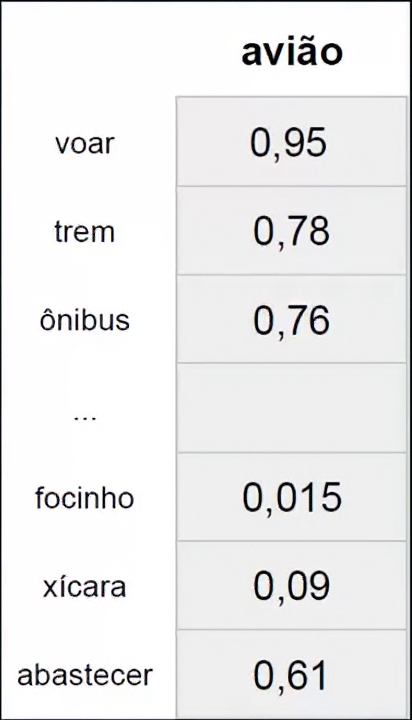
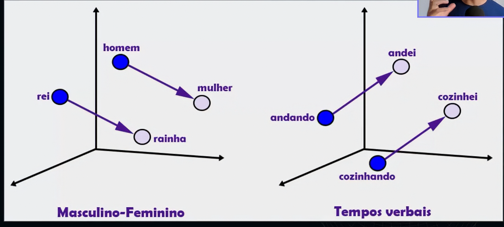
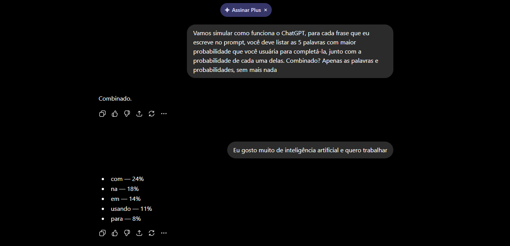
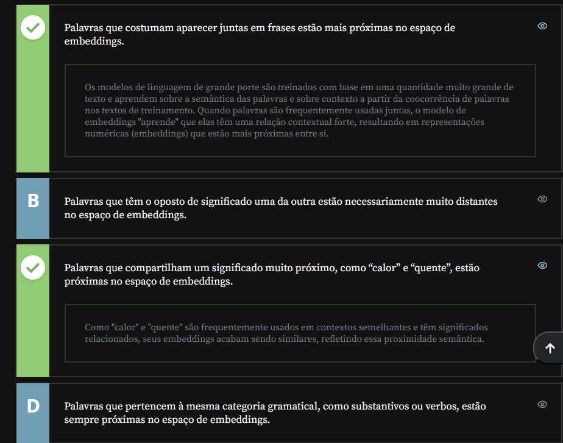
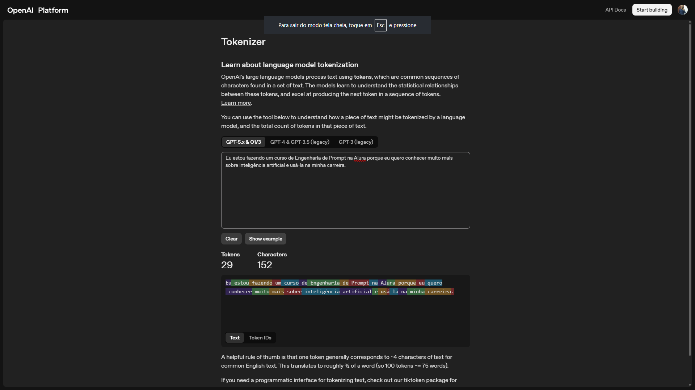
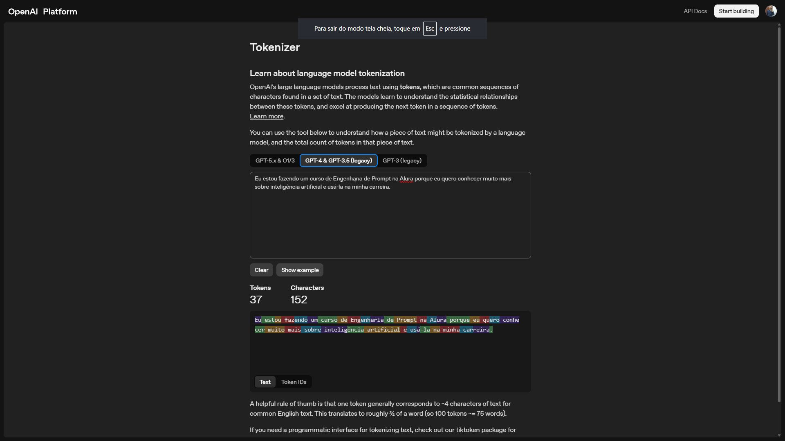

# Conceitos Iniciais

## Sumário: 
- [Conceitos Iniciais](#conceitos-iniciais)
  - [Sumário:](#sumário)
  - [1. Apresentação](#1-apresentação)
  - [2. Preparando o ambiente](#2-preparando-o-ambiente)
  - [3. A proximidade semântica](#3-a-proximidade-semântica)
  - [4. Word embeddings](#4-word-embeddings)
  - [5. O que são tokens?](#5-o-que-são-tokens)
    - [5.1 Sobre os Tokens](#51-sobre-os-tokens)
  - [6. Faça como eu fiz: explorando probabilidades](#6-faça-como-eu-fiz-explorando-probabilidades)
  - [7. O que aprendemos?](#7-o-que-aprendemos)

## 1. Apresentação
Neste curso, vamos explorar diversos tópicos juntos.

Começaremos aprendendo o que é um modelo de linguagem, conhecendo um pouco sobre como eles funcionam em segundo plano, além de alguns dos conceitos mais relevantes quando falamos sobre modelos de linguagens, ou modelos de linguagens grandes, os LLMs (Large Language Models).

Em seguida, vamos aprofundar nos princípios da Engenharia de Prompt: o que é Engenharia de Prompt? Quais são as técnicas e os princípios mais importantes que utilizaremos para criar o prompt ideal, de modo a obter as respostas desejadas a partir desses modelos de linguagem?

Depois, vamos explorar as técnicas mais conhecidas, por meio de artigos científicos publicados pelas empresas que estão em alta, como OpenAI, Google, Anthropic, Mistral AI, e muitas outras que criam modelos de linguagem. Essas empresas publicaram artigos e iremos nos aprofundar neles para entender como funcionam, bem como utilizá-los na prática.

Por fim, vamos conhecer outras técnicas menos utilizadas na prática e mais utilizadas por pessoas que irão aplicar os modelos de maneira programática, utilizando API e código.

## 2. Preparando o ambiente
Durante o curso, vamos utilizar diferentes ferramentas de Inteligência Artificial Generativa.

Nesta aula, utilizaremos o ChatGPT, uma ferramenta disponível na [página da OpenAI](https://chatgpt.com/). Para começar a utilizá-la, é necessário criar uma conta na OpenAI.
 Para começar a utilizá-la, é necessário criar uma conta na OpenAI.

Se você ainda não possui uma conta, basta clicar na opção "Sign up" ou “Cadastrar” na página inicial e, em seguida, escolher entre criar uma conta ou utilizar uma conta Google ou Microsoft - caso escolha a segunda opção, será necessário permitir que a OpenAI acesse suas informações.

Após efetuar o login, seguem abaixo alguns passos para começar a usar o ChatGPT:

- 1 - Digite sua primeira mensagem na caixa de texto e pressione "Enviar". Por exemplo: você pode começar com um simples "Olá" ou fazer uma pergunta.

- 2 - O ChatGPT responderá automaticamente à sua mensagem com uma resposta gerada por inteligência artificial. A partir daí, você pode continuar a conversa fazendo mais perguntas ou respondendo às perguntas do ChatGPT.

- 3 - Experimente diferentes tipos de perguntas ou tópicos para ver o que o ChatGPT é capaz de fazer. Você pode perguntar sobre um tema específico, pedir ajuda com uma tarefa ou simplesmente conversar com o ChatGPT.

Caso você deseje mudar de tópico e começar uma nova conversa a qualquer momento, basta clicar na opção "New chat" (nova conversa) no menu lateral esquerdo.

Para acompanhar este curso, é possível utilizar tanto a versão gratuita quanto a versão paga, chamada "Plus".

Também vamos utilizar o [playground da OpenAI](https://platform.openai.com/chat/edit?models=gpt-5.5). Entretanto, essa é uma funcionalidade paga.
Para essa atividade, é possível utilizar o [AI Studio](https://aistudio.google.com/app/prompts/new_chat), o playground do modelo Gemini, do Google. Para utilizar, basta estar em uma conta `Gmail`.  

## 3. A proximidade semântica
A primeira coisa quando falamos sobre __o que é um modelo de linguagem__ `LLM`, atualmente associamos o termo em questão com as IAS disponíveis no mercado, essas por sua vez foram treinadas com uma grande amostragem de dados, quase o conteúdo completo da internet,porém quando analisamos o seu comportamento esses modelos funcionam como um modelo estatístico mais complexo, para exemplificar melhor vamos supor o seguinte cenário, quando em português-br nos conjugamos a frase:  
> Eu gosto de pizza, quase sempre após a utilização do gosto temos a preposição da palavra `DE`, porém em outros idiomas essa preposição não existentes
> ```text
> Eu gosto de pizza
> I like pizza. 
> I like to travel. 
> Pizza severim
> ```
Então quando falamos de modelos de linguagem estamos falando que a `IA's`, eles _"aprendem"_ padrões da linguagem humana e relações entre muitas palavras, de forma estatística. 
Mas como isso e realmente feito ? Temos um termo utilizado nessa área que são <a href="#WordEMB">Word Embeddings</a>, que são meios de realizar representações distribuídas de palavras que compreendem a proximidade semântica entre elas, em suma teoricamente esses Embeddings são representações de palavras ou _"sub-palavras"_ de forma numérica, ou seja é o número que representa essa palavras fazendo também a representação da proximidade dessa palavra da próxima palavra semanticamente, a imagem abaixo ilustra melhor esses Embeddings

<table style="text-align: center; width: 100%;"> 
<tr>
    <td style="text-align: left;">
    
    </td>
</tr>
</table>

Quando olhamos a imagem acima, temos uma demonstração prática do `Word Embedding`, quando por exemplo reparamos na palavra __Carro__, está está mais próxima das palavras _"(Taxi,ônibus,trem...)"_ do que por exemplo da palavra rei, pois a probabilidade de estarmos tratando de um meio de transporte e maior que de de uma monarquia, então dessa maneira parece que a _"IA"_ entende do que estamos falando, isso ao olhar no gráfico de vetores nos traz a ideia de proximidade e distância das palavras, isso fica mais claro quando olhamos na imagem abaixo:  

<table style="text-align: center; width: 50%;"> 
<tr>
    <td style="text-align: left;">
    
    </td>
</tr>
</table>

Outra coisa que podemos fazer com esses `embeddings` seria cálculos matemáticos, pois uma vez que as palavras se tornam números é possível realizar calulos em cima dessas probabilidades.

<table style="text-align: center; width: 100%;"> 
<tr>
    <td style="text-align: left;">
    
    </td>
</tr>
</table>

todo esse processo de calculo probabilístico é feito por meio desses gráficos e treinamentos dos modelos, podendo ter representações gráficas até tridimensionais por exemplo, então o que esses modelos fazem e uma espécie de adivinhação da próxima palavra com base na proximidade das palavras com base naquele contexto.
Simulando esse mesmo processo no [ChatGPT](https://chatgpt.com/):

<table style="text-align: center; width: 100%;"> 
<tr>
    <td style="text-align: left;">
    
    </td>
</tr>
</table>

A grande diferença de um auto-complete básico ou até dos mais robustos para os modelos de `LLM's` é a persistência de contexto, ou seja o modelo mantém na conversa o contexto do que foi dito para melhor fluidez, ou seja a medida que vamos mantendo a conversação ele não só envia os [tokens](#51-sobre-os-tokens), mas todo o contexto da conversa, o que torna a capacidade de não se perder durante a interação.   

<details id="WordEMB">
<summary>Word Embeddings</summary>
    <p>Word Embeddings são a base da compreensão de linguagem em LLMs, transformando palavras em vetores numéricos que capturam significado e contexto.</p>
    <ul>
        <li><strong>Representação Vetorial:</strong> Converte tokens em listas de números (vetores) em um espaço de alta dimensionalidade, onde a proximidade geométrica indica similaridade semântica.</li>
        <li><strong>Contextualização (Transformers):</strong> Diferente de modelos antigos, as LLMs modernas ajustam o valor do embedding dinamicamente com base nas palavras vizinhas (ex: "banco" de sentar vs "banco" financeiro).</li>
        <li><strong>Aplicações em LLMs:</strong> Essencial para mecanismos de atenção, busca semântica (RAG), tradução automática e transferência de conhecimento entre domínios.</li>
    </ul>
</details>

## 4. Word embeddings
Nathália é uma desenvolvedora que trabalha em uma editora de livros de tecnologia. Ela está construindo uma solução baseada em Inteligência Artificial que faça sugestões de novos livros para leitores que já são clientes da editora.

Para iniciar seu projeto, Nathália está aprendendo sobre word embeddings e ficou impressionada sobre como as palavras são representadas e agrupadas no espaço de embeddings.  

<table style="text-align: center; width: 100%;"> 
<tr>
    <td style="text-align: left;">
    
    </td>
</tr>
</table> 

Em relação à distribuição das palavras nesse espaço, quais afirmações são verdadeiras?  
<table style="text-align: center; width: 100%;"> 
<tr>
    <td style="text-align: left;">
    
    </td>
</tr>
</table> 

## 5. O que são tokens?
No ultimo módulo visualizamos sobre a funcionalidade probabilística da sugestão de uma palavra pós outra, o que nos faz pensar: _"Esses modelos sempre irão sugerir a palavra com maior probabilidade ?"_  e a reposta é __NÃO!__.  
A explicação para essa reposta se deve ao fato do conceito que foi criado que é conhecido como __`TEMPERATURA`__, mas o que é essa temperatura no desenvolver desses modelos os cientistas perceberam que sempre que o modelo escolhia a resposta mais provável de preceder a palavra anterior, as resposta ficavam _"robóticas"_ de mais perdendo alguns truques entre muitas aspas, que nos humanos fazemos, para exemplificar na prática esse conceito iremos acessa o [playground da OpenAI](https://platform.openai.com/chat/edit?models=gpt-5.5), ao acessarmos esse Playground vemos que existe um campo de `temperature`, indo de  `0 a 2`
> Para utilização do playground é necessário a adição de créditos, que são pagos e por esse motivo não utilizarei a plataforma  
O que essa temperatura nessa plataforma faz, quanto mais próximo de 0 menor é a chance do modelo responder com alguma palavra que não tenha uma alta probabilidade de precedência, mas a medida que aumentamos a temperatura maior é a _'inventividade"_ do modelo, no exemplo dado no curso foi realizado uma serie de prompts, com os dizeres:
```text
Complete a frase a seguir:

Eu gosto muito de comer ---.
```
Quando esse prompt foi realizado com a temperatura em __`0`__ o modelo teve uma predileção pela palavra __chocolate__ tendo uma ocorrência esporádica da palavra __pizza__, porém quando aumentamos a temperatura da resposta do modelo para __`1`__, já tivemos uma equivalência entre pizza e chocolate, e quando aumentamos a temperatura para __`1.4`__ o modelo nos deu para além da resposta pizza ou chocolate, como:  `pizza 🍕, e muito gostoso não é mesmo`, e outras respostas para além da padrão anteriormente sugerida. Obviamente esse é um __EXEMPLO ANEDÓTICO__ de utilização, mas serve para notarmos um comportamento de que quanto maior for a temperatura mais variada são as resposta para o modelo, para além disso é importante se atentar ao fato de que quanto mais próximo a temperatura está do 2, maior as chances do modelo <a href="#alucinar">Alucinar</a>, ou de gerar uma próxima palavra que tem uma probabilidade muito infima de preceder a palavra anterior.  

### 5.1 Sobre os Tokens
Outro conceito muito comum no contexto de `LLM's` são os tokens, durante toda a aula estamos nos referindo ao tratamento das `LLM's` com _palavras_ mas esses modelos não trabalham com _palavras_ propriamente ditos e sim com `tokens`, mas o que são os tokens ?
> - `Tokens` São a unidade básica em modelos de linguagem. Representam palavras ou subpalavras.
>   - __Exemplo:__ Infeliz = in + feliz

No exemplo acima a palavra infeliz na linguá portuguesa pode representar 2 tokens, pois temos a subpalavra `in` e a subpalavra feliz, pois a subpalavra `in` pode estar associada a outras palavras como por exemplo: 
```text  
Infeliz, incrível, indivisível etc..
```
Os tokens são um conceito básico desses modelos, podendo ser uma parte de uma palavra _(como referimos anteriormente sendo subpalavras)_, ou ainda palavras inteiras, essa divisão de tokens dependem do algorítimo de _"tokenização"_ utilizado.  
Uma forma de consulta desses tokens gerados no `ChatGPT` pode ser consultado neste [site](https://platform.openai.com/tokenizer), onde através desse endereço podemos visualizar quantos tokens os modelos disponíveis pelo `ChatGPT` utilizam para uma frase ou prompt enviado, como podemos ver abaixo a diferença entre os modelos: 
<table style="text-align: center; width: 100%;"> 
<tr>
    <td style="text-align: left;">
    
    </td>
    <td style="text-align: left;">
    
    </td>
</tr>
</table> 

<details>
    <summary>Alucinar </summary>
    <p>Alucinação é o fenômeno onde uma LLM gera informações factualmente incorretas, sem sentido ou desconectadas da realidade,
     apresentando-as com extrema confiança.</p>
    <ul>
        <li><strong>Causas Principais:</strong> Decorre da natureza probabilística do modelo (prever a próxima palavra mais provável) e de lacunas ou ruídos nos dados de treinamento.</li>
        <li><strong>Tipos de Alucinação:</strong> Pode ser intrínseca (contradiz a fonte fornecida) ou extrínseca (inventa fatos externos que não podem ser verificados pelos dados de entrada).</li>
        <li><strong>Mitigação:</strong> Reduzida através de técnicas como RAG (Recuperação de Dados Externos), ajustes na "Temperatura" do modelo e engenharia de prompts (ex: pedir para o modelo citar fontes ou admitir quando não sabe).</li>
    </ul>
</details>

## 6. Faça como eu fiz: explorando probabilidades
Nessa aula, descobrimos como modelos de linguagem de grande escala, como o ChatGPT, compreendem e geram texto.

Esses modelos são treinados com uma quantidade muito grande de textos e, durante o treinamento, vão criando “compreensões matemáticas” sobre linguagem, semântica e significado.

Quando enviamos uma instrução para o modelo, o texto é primeiro dividido em tokens e, em seguida, convertido em embeddings. Cada embedding é um valor numérico que representa a palavra em um espaço matemático, onde todo o vocabulário do modelo é organizado de acordo com o contexto.

Então, o modelo gera uma palavra de cada vez, calculando qual próxima palavra é a mais provável no contexto da resposta.

Ainda vimos o conceito de temperatura aplicado na IA generativa: a temperatura é um parâmetro que permite controlar se o modelo vai escolher a palavra mais provável e criar uma resposta robótica, ou escolher palavras com menor probabilidade e criar respostas mais criativas.  
__Agora é sua vez!__
Envie o prompt abaixo para o ChatGPT e, então, envie alguma frase incompleta para que ele responda com as probabilidades. Experimente com diversas frases para compreender melhor como as palavras são escolhidas no momento da geração de texto.
```text
Vamos simular como funciona o ChatGPT. Para cada frase que eu escrever no prompt, você deve listar as 5 palavras com maior probabilidade que você usaria para completá-la, junto com a probabilidade de cada uma delas. Combinado? Apenas as palavras e probabilidades, sem mais nada. Me diga se você entendeu.
```
Você também pode ajustar a temperatura no _playground_ do modelo para experimentar como funciona a geração de texto com diferentes valores desse parâmetro.
>Dica: a OpenAI, empresa que desenvolveu o ChatGPT, não fornece um nível gratuito de uso do [playground](https://platform.openai.com/chat/edit?models=gpt-5.5).  
>Para essa atividade, é possível utilizar o [AI Studio](https://aistudio.google.com/app/prompts/new_chat), o playground do modelo Gemini, do Google.  
>Para utilizar, basta estar em uma conta Gmail. Divirta-se!
---
__Opinião do instrutor__  
Uma experiência divertida pode ser criar uma frase com as palavras __menos__ prováveis sugeridas pelo ChatGPT. Apenas alterando a palavra __`maior`__ para __`menor`__ no prompt que utilizamos na simulação, assim:  
```text
Vamos simular como funciona o ChatGPT. Para cada frase que eu escrever no prompt, você deve listar as 5 palavras com menor probabilidade que você usaria para completá-la, junto com a probabilidade de cada uma delas. Combinado? Apenas as palavras e probabilidades, sem mais nada. Me diga se você entendeu.
```
Ao enviar a frase “Eu gosto de mergulhar no”, a maior probabilidade de continuação seria “mar”, a segunda, “rio”. Mas, pedindo as menores probabilidades, temos como resposta apenas palavras que não tem nenhuma relação com mergulho:  
```text
elefante - 0.00001%

contêiner - 0.00002%

caminhão - 0.00003%

satélite - 0.00004%

urânio - 0.00005%
```  
Compreender conceitos que explicam como funcionam modelos de linguagem é um passo importante para aprender a tirar o melhor proveito dessa tecnologia.  
Na próxima aula, vamos conhecer o que é a famosa Engenharia de Prompt. Vamos lá?

## 7. O que aprendemos?

Nessa aula, você aprendeu a:
- Conceituar como as palavras são representadas no modelo através de word embeddings e tokens;
- Identificar como as palavras se relacionam através da semântica em um modelo de linguagem;
- Simular o funcionamento do modelo de linguagem visualizando probabilidades;
- Explorar o parâmetro de temperatura no playground da OpenAI.

---

<table align="center" style="border-collapse: collapse; margin-left: auto; margin-right: auto;"> 
  <caption><b>Skills do projeto</b></caption>
  <tr>
    <td style="padding: 5px;">
      
    </td>
    <td style="padding: 5px;">
      
    </td>
  </tr>
</table>


---
__Titulo:__ Conceitos Iniciais
__Autor:__ Thierry Lucas Chaves  
__Data de Criação:__ 14-05-2026  
__Data de Modificação:__ 15-05-2026  
__Versão:__ "1.0"