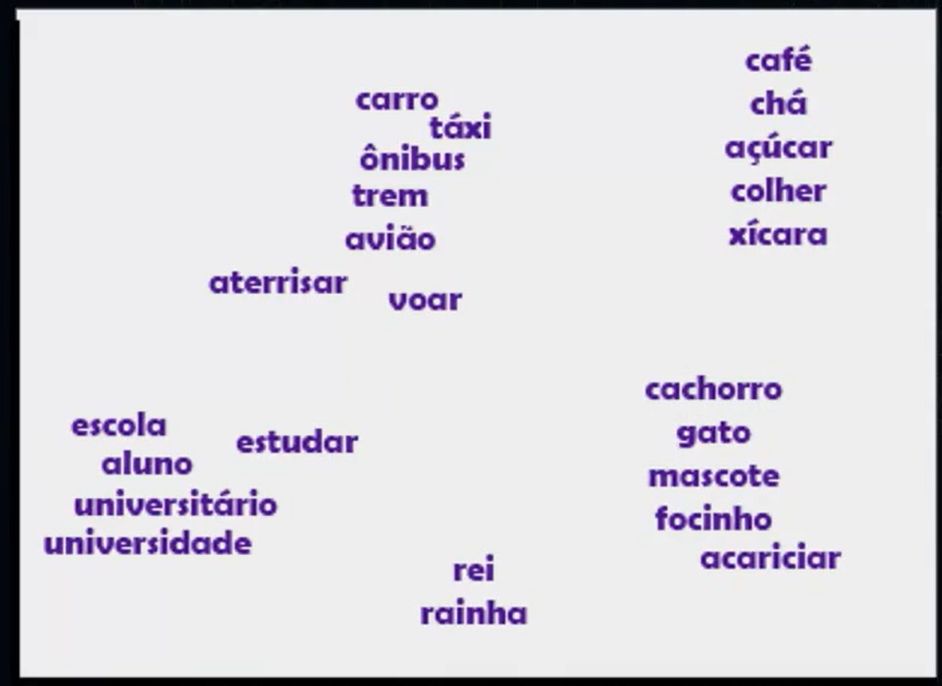

# Conceitos Iniciais

## Sumário

## 1. Apresentação
Neste curso, vamos explorar diversos tópicos juntos.

Começaremos aprendendo o que é um modelo de linguagem, conhecendo um pouco sobre como eles funcionam em segundo plano, além de alguns dos conceitos mais relevantes quando falamos sobre modelos de linguagens, ou modelos de linguagens grandes, os LLMs (Large Language Models).

Em seguida, vamos aprofundar nos princípios da Engenharia de Prompt: o que é Engenharia de Prompt? Quais são as técnicas e os princípios mais importantes que utilizaremos para criar o prompt ideal, de modo a obter as respostas desejadas a partir desses modelos de linguagem?

Depois, vamos explorar as técnicas mais conhecidas, por meio de artigos científicos publicados pelas empresas que estão em alta, como OpenAI, Google, Anthropic, Mistral AI, e muitas outras que criam modelos de linguagem. Essas empresas publicaram artigos e iremos nos aprofundar neles para entender como funcionam, bem como utilizá-los na prática.

Por fim, vamos conhecer outras técnicas menos utilizadas na prática e mais utilizadas por pessoas que irão aplicar os modelos de maneira programática, utilizando API e código.

## 2. Preparando o ambiente
Durante o curso, vamos utilizar diferentes ferramentas de Inteligência Artificial Generativa.

Nesta aula, utilizaremos o ChatGPT, uma ferramenta disponível na [página da OpenAI](https://chatgpt.com/). Para começar a utilizá-la, é necessário criar uma conta na OpenAI.
 Para começar a utilizá-la, é necessário criar uma conta na OpenAI.

Se você ainda não possui uma conta, basta clicar na opção "Sign up" ou “Cadastrar” na página inicial e, em seguida, escolher entre criar uma conta ou utilizar uma conta Google ou Microsoft - caso escolha a segunda opção, será necessário permitir que a OpenAI acesse suas informações.

Após efetuar o login, seguem abaixo alguns passos para começar a usar o ChatGPT:

- 1 - Digite sua primeira mensagem na caixa de texto e pressione "Enviar". Por exemplo: você pode começar com um simples "Olá" ou fazer uma pergunta.

- 2 - O ChatGPT responderá automaticamente à sua mensagem com uma resposta gerada por inteligência artificial. A partir daí, você pode continuar a conversa fazendo mais perguntas ou respondendo às perguntas do ChatGPT.

- 3 - Experimente diferentes tipos de perguntas ou tópicos para ver o que o ChatGPT é capaz de fazer. Você pode perguntar sobre um tema específico, pedir ajuda com uma tarefa ou simplesmente conversar com o ChatGPT.

Caso você deseje mudar de tópico e começar uma nova conversa a qualquer momento, basta clicar na opção "New chat" (nova conversa) no menu lateral esquerdo.

Para acompanhar este curso, é possível utilizar tanto a versão gratuita quanto a versão paga, chamada "Plus".

Também vamos utilizar o [playground da OpenAI](https://platform.openai.com/chat/edit?models=gpt-5.5). Entretanto, essa é uma funcionalidade paga.
Para essa atividade, é possível utilizar o [AI Studio](https://aistudio.google.com/app/prompts/new_chat), o playground do modelo Gemini, do Google. Para utilizar, basta estar em uma conta `Gmail`.  

## 3. A proximidade semântica
A primeira coisa quando falamos sobre __o que é um modelo de linguagem__ `LLM`, atualmente associamos o termo em questão com as IAS disponíveis no mercado, essas por sua vez foram treinadas com uma grande amostragem de dados, quase o conteúdo completo da internet,porém quando analisamos o seu comportamento esses modelos funcionam como um modelo estatístico mais complexo, para exemplificar melhor vamos supor o seguinte cenário, quando em português-br nos conjugamos a frase:  
> Eu gosto de pizza, quase sempre após a utilização do gosto temos a preposição da palavra `DE`, porém em outros idiomas essa preposição não existes
> ```text
> Eu gosto de pizza
> I like pizza. 
> I like to travel. 
> Pizza severim
> ```
Então quando falamos de modelos de linguagem estamos falando que a `IA's`, eles _"aprendem"_ padrões da linguagem humana e relações entre muitas palavras, de forma estatística. 
Mas como isso e realmente feito ? Temos um termo utilizado nessa área que são <a href="#WordEMB">Word Embeddings</a>, que são meios de realizar representações distribuídas de palavras que compreendem a proximidade semântica entre elas, em suma teoricamente esses Embeddings são representações de palavras ou _"sub-palavras"_ de forma numérica, ou seja é o número que representa essa palavras fazendo também a representação da proximidade dessa palavra da próxima palavra semanticamente, a imagem abaixo ilustra melhor esses Embeddings

<table style="text-align: center; width: 100%;"> 
<tr>
    <td style="text-align: left;">
    
    </td>
</tr>
</table>

<details id="WordEMB">
<summary>Word Embeddings</summary>
    <p>Word Embeddings são a base da compreensão de linguagem em LLMs, transformando palavras em vetores numéricos que capturam significado e contexto.</p>
    <ul>
        <li><strong>Representação Vetorial:</strong> Converte tokens em listas de números (vetores) em um espaço de alta dimensionalidade, onde a proximidade geométrica indica similaridade semântica.</li>
        <li><strong>Contextualização (Transformers):</strong> Diferente de modelos antigos, as LLMs modernas ajustam o valor do embedding dinamicamente com base nas palavras vizinhas (ex: "banco" de sentar vs "banco" financeiro).</li>
        <li><strong>Aplicações em LLMs:</strong> Essencial para mecanismos de atenção, busca semântica (RAG), tradução automática e transferência de conhecimento entre domínios.</li>
    </ul>
</details>

## 4. Word embeddings
## 5. O que são tokens?
## 6. Faça como eu fiz: explorando probabilidades
## 7. O que aprendemos?


<!-- <table style="text-align: center; width: 100%;"> 
<tr>
    <td style="text-align: left;">
    
    </td>
</tr>
</table> -->

---

<table align="center" style="border-collapse: collapse; margin-left: auto; margin-right: auto;"> 
  <caption><b>Skills do projeto</b></caption>
  <tr>
    <td style="padding: 5px;">
      
    </td>
    <td style="padding: 5px;">
      
    </td>
  </tr>
</table>


---
__Titulo:__ Conceitos Iniciais
__Autor:__ Thierry Lucas Chaves  
__Data de Criação:__ 14-05-2026  
__Data de Modificação:__ 14-05-2026  
__Versão:__ "1.0"