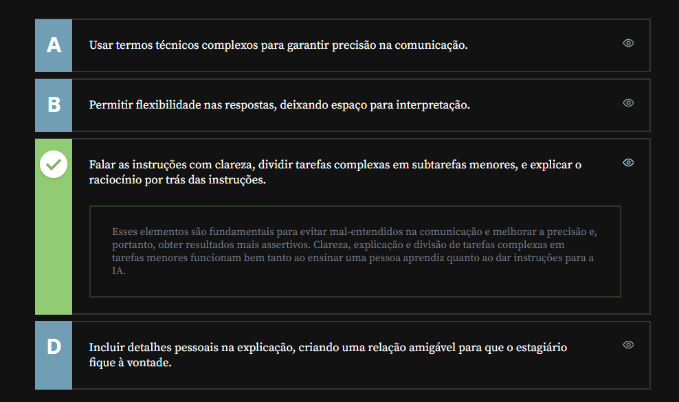

# Engenharia de Prompt

## Sumário

## 1. O que é Engenharia de Prompt?

Finalmente iremos realizar no conceito de `Engenharia de prompt`, para exemplificar esse conceito utilizaremos o [Gemini](http://gemini.google.com/), para execução de tal tarefa para além disso vamos supor que recebemos a seguinte tarefa: 
```text
Você precisa escrever um texto para um post de Instagram sobre Inteligência artificial. A página onde o posto será publicado é majoritariamente acessada por pessoas jovens, de 14 a 20 anos de idade. Você quer usar uma ferramenta de IA para te ajudar nessa tarefa.
```
Se realizarmos um pedido solto para a IA somente com o que desejamos de forma genérica a resposta retornada pelo modelo também será genérica, por esse motivo devemos ser mais especifico no pedido, como ao invés de simplesmente solicitar _(Escreva um texto sobre inteligência artificial)_, podemos substituir por algo como:    

```text
Escreva um texto sobre inteligência artificial. Esse texto será usado em um posto do Instagram, então siga o formato mais comum dessa rede social. Utilize uma linguagem informal, com gírias. No final, adicione uma chamada para que o público clique no link da Bio caso queira saber mais informações.
```  
Em suma quando falamos de Engenharia de prompt, estamos falando de como podemos __"engenhar" ou "projetar"__ o nosso `prompt` da melhora maneira possível para obter o resultado que almejamos. 

## 2. Para saber mais: motivando a ação
O termo `prompt` é antigo e conhecido de pessoas que trabalham na área de tecnologia. O _“Prompt de comando”_  do Windows, por exemplo, é uma interface que recebe códigos que executam funções administrativas avançadas no sistema operacional.  
Na área da computação, esse termo já é utilizado desde as primeiras interações de usuários com máquina por meio de texto.

Mas… o que essa palavra significa?

Em tradução literal do inglês, prompt significa _“incitar” ou “induzir”, “fazer com que algo aconteça”, “motivar”._ É um verbo que indica que algum movimento está prestes a acontecer.

Quando uma interface apresenta um prompt para a pessoa usuária, é exatamente isso que está acontecendo: o programa está nos __“provocando”__ a fazer um pedido através da linha de prompt. Quando enviamos o comando, devolvemos o incentivo, e isso inicia a interação entre a pessoa e a máquina.

No contexto de modelos de linguagem e inteligência artificial, o prompt é fundamental e permite que a interação se assemelhe a uma conversa, com o uso de linguagem natural.

Sendo assim, criar um bom prompt para interagir com um modelo de linguagem requer técnicas que compreendam o funcionamento dessa tecnologia, assim como na comunicação humana: é importante conhecer o público-alvo para adaptar o discurso em uma palestra, por exemplo. Da mesma forma, é importante conhecer os fundamentos de um modelo de linguagem para adaptar a comunicação e obter bons resultados.  

## 3. Preparando o ambiente
Na aula seguinte, utilizaremos o modelo de linguagem Mistral. Você pode utilizar qualquer modelo que prefira para acompanhar a aula, mas, caso queira conhecer o Mistral, [é preciso criar uma conta](https://chat.mistral.ai/chat).

Você pode fazer login diretamente com o Google ou com a Microsoft e permitir acesso a alguns dados, ou, se preferir, clique em _“Registrar”_ para criar uma conta do zero.

<table style="text-align: center; width: 100%;"> 
<tr>
    <td style="text-align: left;">
    
    </td>
</tr>
</table>

## 4. Princípios de criação 

Nos temos algumas coisas que podem ser consideradas como __Os princípios para criação de um prompt ideal__  
- Ter clareza ao dar instruções; 
- Dividir tarefas complexas em subtarefas menores;
- Pedir para o modelo explicar seus passos antes de dar a resposta; 
- Pedir para o modelo dar justificativas de suas respostas; 
- Gerar várias respostas diferentes e pedir pra o modelo escolher a melhor.  

Sobre o ponto _(Dividir tarefas complexas em subtarefas menores;)_, podemos exemplificar esse processo conforme feito pela própria Open IA havia feito com seus modelos anteriores para exemplificar, utilizando o modelo similar o jogo detetive:
```prompt
Use as dicas a seguir para responder à seguinte questão de múltipla escolha, usando o seguinte procedimento:  
Dicas:
1º A senhorita Scarlett era a única pessoa na sala. 
2º A pessoa com cachimbo estava na cozinha. 
3º O coronel Mostarda era a única pessoa no observatório. 
4º O professor Plum não estava na biblioteca nem na sala de bilhar.
5º A pessoa com castiçal estava no observatório.

Pergunta: O coronel Mostarda estava no observatório com castiçal ?
(a) Sim; O coronel Mostarda estava no observatório com o castiçal 
(b) Não; O coronel Mostarda não estava no observatório com o castiçal
(c) Desconhecido; Não há informações suficientes para determinar se o Coronel Mostarda estava no observatório com o castiçal. 
 
Reposta:

```
Com o prompt fornecido acima, foi percebido que o modelo frequentemente errava na resposta. então a solução foi realizar o processo de divisão das informações em subtarefas, deixando o prompt da seguinte maneira:  
```prompt
Use as dicas a seguir para responder à seguinte questão de múltipla escolha, usando o seguinte procedimento:   

(1) Primeiramente, analise as dicas uma por uma e considere se a dica é potencialmente relevante.  
(2) Em segundo lugar, combine as dicas relevantes para raciocinar a resposta correta à pergunta 
(3) Em terceiro lugar, mapeie a resposta para uma das respostas de múltipla escolha: (a),(b),(c)

Dicas:
1º A senhorita Scarlett era a única pessoa na sala. 
2º A pessoa com cachimbo estava na cozinha. 
3º O coronel Mostarda era a única pessoa no observatório. 
4º O professor Plum não estava na biblioteca nem na sala de bilhar.
5º A pessoa com castiçal estava no observatório.

Pergunta: O coronel Mostarda estava no observatório com castiçal ?
(a) Sim; O coronel Mostarda estava no observatório com o castiçal 
(b) Não; O coronel Mostarda não estava no observatório com o castiçal
(c) Desconhecido; Não há informações suficientes para determinar se o Coronel Mostarda estava no observatório com o castiçal. 
 
Reposta:

```

Então com esse prompt podemos visualizar que não significa que temos que dividir em N prompt nossa solicitação e sim que o modelo realize a divisão das tarefas.


## 5. Comunicando instruções

Maria Isabel, uma engenheira de dados sênior, precisa orientar um estagiário que acabou de chegar na empresa. Ela sabe que, para se fazer entender, é preciso tomar alguns cuidados na forma como ela comunica as tarefas, principalmente as mais complexas.

Esses mesmos cuidados são recomendados ao escrever comandos para uma IA generativa.

Quais dos seguintes itens são importantes tanto na comunicação com o estagiário quanto na criação de prompts para uma IA generativa?
<table style="text-align: center; width: 100%;"> 
<tr>
    <td style="text-align: left;">
    
    </td>
</tr>
</table>

## 6. Faça como eu fiz: princípios fundamentais
Nessa aula, vimos alguns princípios gerais da Engenharia de Prompt: o ato de construir cuidadosamente um comando eficaz para extrair o melhor resultado possível de uma IA generativa.

Essas diretrizes são comprovadamente eficazes na melhora na qualidade das respostas. As principais delas são:

Ter clareza ao dar as instruções;
- 1. Dividir tarefas complexas em subtarefas menores;
- 2. Pedir para o modelo explicar seus passos antes de dar a resposta;
- 3. Pedir para o modelo dar justificativas de suas respostas;
- 4. Gerar várias respostas diferentes e pedir para o modelo escolher a melhor.
- 5. Pratique você também!

O prompt a seguir contém as dicas do joguinho detetive e as alternativas “Sim”, “Não” e “Desconhecido”.
```prompt
Use as dicas a seguir para responder à seguinte questão de múltipla escolha.

Dicas:
1. A Senhorita Scarlett era a única pessoa na sala.
2. A pessoa com o cachimbo estava na cozinha.
3. O Coronel Mostarda era a única pessoa no observatório.
4. O Professor Plum não estava na biblioteca nem na sala de bilhar.
5. A pessoa com o castiçal estava no observatório.

Pergunta: O Coronel Mostarda estava no observatório com o castiçal? 
(a) Sim; O Coronel Mostarda estava no observatório com o castiçal
(b) Não; O Coronel Mostarda não estava no observatório com o castiçal
(c) Desconhecido, não há informações suficientes para determinar se o Coronel Mostarda estava no observatório com o castiçal

Resposta:
```
Teste também, em outro chat, o mesmo jogo, mas aplicando alguns princípios da engenharia de prompt.
```text
Use as dicas a seguir para responder à seguinte questão de múltipla escolha, usando o seguinte procedimento:

(1) Primeiramente, analise as dicas uma por uma e considere se a dica é potencialmente relevante
(2) Em segundo lugar, combine as dicas relevantes para raciocinar a resposta correta à pergunta
(3) Em terceiro lugar, mapeie a resposta para uma das respostas de múltipla escolha: (a), (b) ou (c)


Dicas:
1. A Senhorita Scarlett era a única pessoa na sala.
2. A pessoa com o cachimbo estava na cozinha.
3. O Coronel Mostarda era a única pessoa no observatório.
4. O Professor Plum não estava na biblioteca nem na sala de bilhar.
5. A pessoa com o castiçal estava no observatório.

Pergunta: O Coronel Mostarda estava no observatório com o castiçal? 
(a) Sim; O Coronel Mostarda estava no observatório com o castiçal
(b) Não; O Coronel Mostarda não estava no observatório com o castiçal
(c) Desconhecido, não há informações suficientes para determinar se o Coronel Mostarda estava no observatório com o castiçal

Resposta:
```
Nesse último prompt, dividimos a tarefa principal em subtarefas, e a instrução ficou mais clara, consequentemente. Compare os resultados e teste em diferentes modelos. É bacana, também, testar em tarefas do seu dia a dia que não obtiveram resultados satisfatórios anteriormente.  

__Opinião do instrutor__

No momento em que você está fazendo esse curso, pode ser que os modelos de linguagem atuais já estejam muito mais preparados para responder ao enigma do Coronel Mostarda, mesmo sem as especificidades das orientações do segundo prompt. Isso é ótimo!

A área de IA se movimenta com muita rapidez e os modelos estão em melhoria constante. O ChatGPT 4, por exemplo, que foi lançado em 2024, tem cerca de 170 trilhões de parâmetros em seu treinamento, e já foi aperfeiçoado pelas experimentações científicas feitas com os modelos que vieram antes dele.

Como comparação, o modelo 3.5 (o que foi lançado em 2022 e trouxe o assunto IA à tona), tinha 170 bilhões de parâmetros! Ou seja, o modelo 4 tem um “conhecimento” mil vezes maior que seu modelo anterior. Esse salto impressionante impacta consideravelmente na capacidade do modelo.

Porém, a melhora na capacidade dos modelos não nos exime de conhecer as técnicas de engenharia de prompt, muito pelo contrário! Conforme a tecnologia avança em complexidade, é imperativo que nós, pessoas usuárias dessas tecnologias, avancemos em nossa compreensão sobre elas, também.

## 7. O que aprendemos?

Nessa aula, você aprendeu:
- O que o termo “Engenharia de Prompt” significa;
- As principais recomendações para criar um prompt eficaz.

---

<table align="center" style="border-collapse: collapse; margin-left: auto; margin-right: auto;"> 
  <caption><b>Skills do projeto</b></caption>
  <tr>
    <td style="padding: 5px;">
      
    </td>
    <td style="padding: 5px;">
      
    </td>
  </tr>
</table>


---
__Titulo:__ Engenharia de Prompt
__Autor:__ Thierry Lucas Chaves  
__Data de Criação:__ 15-05-2026  
__Data de Modificação:__ 15-05-2026  
__Versão:__ "1.0"