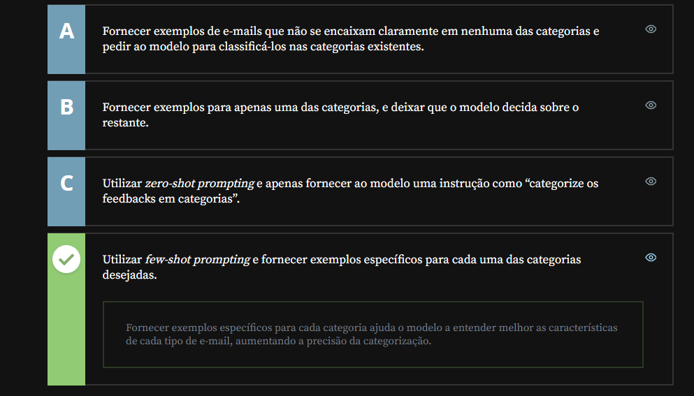
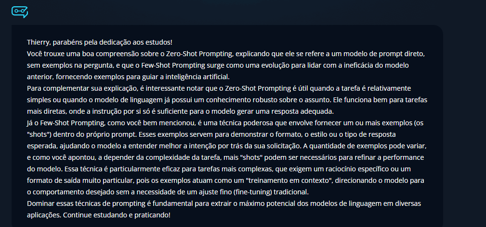

# Few-Shot Prompt

## Sumário: Few-Shot Prompt

- [Few-Shot Prompt](#few-shot-prompt)
  - [Sumário: Few-Shot Prompt](#sumário-few-shot-prompt)
  - [1. Preparando o ambiente](#1-preparando-o-ambiente)
  - [2. Entendendo a técnica](#2-entendendo-a-técnica)
  - [3. Mais exemplos](#3-mais-exemplos)
  - [4. Para saber mais: Few-Shot vs Zero-Shot](#4-para-saber-mais-few-shot-vs-zero-shot)
  - [5. Escolhendo técnicas](#5-escolhendo-técnicas)
  - [6. Faça como eu fiz: comandos com exemplos](#6-faça-como-eu-fiz-comandos-com-exemplos)
  - [7. O que aprendemos?](#7-o-que-aprendemos)

## 1. Preparando o ambiente
Na aula seguinte, utilizaremos o modelo de linguagem Sabiá, da empresa brasileira [Maritaca AI](https://www.maritaca.ai/).  
Você pode utilizar qualquer modelo que prefira para acompanhar a aula, mas, caso queira conhecer o Maritalk, a plataforma que hospeda o chat, é [preciso criar uma conta](https://chat.maritaca.ai/auth).

Você pode fazer login diretamente com o Google e permitir acesso a alguns dados, ou, se preferir, clique em “Registrar” para criar uma conta do zero.

<table style="text-align: center; width: 100%;"> 
<tr>
    <td style="text-align: left;">
    
    </td>
</tr>
</table>

## 2. Entendendo a técnica
Essa é uma das técnicas mais utilizadas atualmente para melhora de respostas no cenário de I.A, para melhor entendimento dessa técnicas utilizaremos conforme dito no [capitulo 1](#1-preparando-o-ambiente), a [Maritaca AI](https://www.maritaca.ai/). O funcionamento dessa plataforma e bastante similar aos demais já vistos anteriormente, e por tal motivo não iremos nos ater a funcionalidades da plataforma por hora.  
Dentro do chat iremos iniciar uma conversa, com os seguintes dizeres:  
```text
Um diretor de cinema já dirigiu 16 filmes. Metade dos filmes que ele dirigiu são de ação, e metade dos filmes de ação têm a participação do Nicolas Cage, e na metade deles o  Nicolas Cage tem bigode. Quantos filmes de ação com participação do Nicola Cage com bigode ele dirigiu ?
```  
Com esse modelo de prompt acima, estamos criando um modelo de prompt nomeado de <a href="#ZSP">Zero-Shot Prompting</a>.  Conforme o próprio nome da técnica já diz, 
trata-se de um modelo de prompt onde não se tem exemplos na pergunta, ou seja, um modelo direto de pergunta, ou sem nenhum exemplo de como deveria ser a resposta. 
Porém ao passar do tempo notou-se que esse modelo de prompt poderia ser ineficaz, a partir de então foi criado uma nova técnica de prompt que foi nomeada de <a href="#FSP"> Few-Shot Prompting</a>, utilizando o mesmo prompt anteriormente exemplificado iremos recriar esse prompt utilizando essa técnica no prompt anterior informarmos a I.A um problema de interpretação e de matemática, sendo assim podemos reescrever aquele prompt da seguinte maneira:  
```text
Pergunta: João tem 10 bolas. Metade dela são azuis e metade são vermelhas. Quantas bolas vermelhas joão tem?
Resposta: A resposta é 5;
---
Pergunta: Um diretor de cinema já dirigiu 16 filmes. Metade dos filmes que ele dirigiu são de ação, e metade dos filmes de ação têm a participação do Nicolas Cage, e na metade deles o  Nicolas Cage tem bigode. Quantos filmes de ação com participação do Nicola Cage com bigode ele dirigiu ?
Resposta:  
```
Ou seja nesse modelo de prompt antes de realizar de fato o pedido direcionamos ou condicionamos a I.A para que ela atue diretamente em um determinado caminho de resposta, seguindo uma lógica de conversação, no caso demos um exemplo de problema matemático e como desejaríamos que fosse a resposta, posteriormente realizamos de fato nossa pergunta, a depender da complexidade dos problemas enfrentados, poderíamos fornecer mais exemplos ou _"shots"_ para I.A. 

<details id="ZSP">
    <summary>Clique aqui para expandir: Zero-Shot Prompting</summary>
    <p>Zero-Shot Prompting é uma técnica onde uma LLM realiza uma tarefa imediatamente, sem receber nenhum exemplo prévio de como fazê-la, baseando-se apenas na sua instrução inicial.</p>
    <ul>
        <li><strong>Conhecimento Prévio:</strong> O modelo depende exclusivamente do conhecimento geral e dos padrões que absorveu durante a sua fase de treinamento massivo.</li>
        <li><strong>Contraste (Few-Shot):</strong> Diferente do Few-Shot Prompting (onde você fornece 2 ou 3 exemplos de "entrada e resposta"), o Zero-Shot vai direto ao ponto (ex: "Classifique o texto a seguir como Positivo ou Negativo:").</li>
        <li><strong>Casos de Uso:</strong> Ideal para tarefas padrão e diretas, como tradução de idiomas, análise de sentimentos óbvios, resumos textuais e geração de ideias.</li>
    </ul>
</details>

<details id="FSP">
    <summary>Few-Shot Prompting</summary>
    <p>Few-Shot Prompting é uma técnica de engenharia de prompt onde fornecemos à LLM alguns exemplos práticos de "entrada e saída" antes de enviar a instrução final. Em vez de apenas dizer o que fazer, você mostra ao modelo o formato, o tom e a estrutura esperada através de demonstrações. Isso ativa a capacidade de aprendizado em contexto do modelo, reduzindo drasticamente erros de formatação e ambiguidades em tarefas complexas, como a geração de payloads estruturados ou análises com critérios muito específicos.</p>
</details>

## 3. Mais exemplos
Continuando os exemplos de prompt, agora utilizaremos o [Le Chat Mistral](https://chat.mistral.ai/chat), e iremos iniciar uma nova conversa no chat com o seguinte prompt:  
```text
 Havia 23 maçãs no refeitório. Se foram usadas 20 para fazer o almoço e foram compradas mais 6, quantas maçãs eles têm agora ?
```
No modelo acima utilizamos a técnica de zero-shot, agora como poderíamos realizar esse mesmo prompt utilizando a técnica de few-shot?
```text
Pegunta: O Rogério tem 5 bolas de tênis. Ele compra mais 2 caixas de bolas, cada uma com 3 bolas. Quantas bolas  quantas bolas de tênis ele tem agora ?
Resposta: Ele tem 11 bolas de tênis


Pegunta: Havia 23 maçãs no refeitório. Se foram usadas 20 para fazer o almoço e foram compradas mais 6, quantas maçãs eles têm agora ?
Reposta: 
```
Até o presente momento demos exemplos da técnica de few-shot com problemas matemáticos simples, porém essa técnica não limita a sua utilização apenas a casos de problemas matemáticos sejam simples ou complexos, vamos iniciar um novo chat e vamos supor que o problema a ser solucionado, trata-se de um problema de analise de sentimentos, em um cenário de analise de sentimentos de redes sociais vamos realizar o seguinte prompt:

```
"Esse filme foi terrível"
- Negativo. 

"Esse filme é o meu filme favorito agora"
- Positivo?

"Esse é o pior filme que já vi!"
- Negativo

"Esse filme foi bacana"
- 
```
No exemplo acima fornecemos ao modelo 3 exemplos de frases possíveis e a reposta correspondente a analise de sentimento, e como deveria ser a resposta _"(Positivo ou Negativo)"_. Agora iremos ainda utilizando a mesma técnica para um exemplo de utilização no âmbito da tradução :

```text
Inglês: Hello, how  are you?
Francês: Bonjour, comment ça va?

Inglês: I am lerning to speak French. 
Francês: J'apprends à parler français.

Inglês: The weather is very nice today.
Francês: 
```
## 4. Para saber mais: Few-Shot vs Zero-Shot
Em 2020, cientistas da OpenAI publicaram um artigo chamado Language Models are Few-Shot Learners, ou seja: __modelos de linguagem aprendem com alguns exemplos.__

Esse artigo descreve as técnicas de aprendizado de máquina utilizadas no treinamento do modelo de linguagem de grande porte GPT-3. O artigo relata como foi observado que o modelo já treinado em uma grande quantidade de texto pode demonstrar melhores resultados em tarefas específicas após passar por um “refinamento” no treinamento, focado nessas tarefas.

Desde então, o GPT evoluiu e tem se desempenhado cada vez melhor em uma diversidade de tarefas, e a técnica de few-shot learning se expandiu para os prompts enviados por pessoas usuárias do ChatGPT e de outros modelos de linguagem em geral.

Com essa técnica, utilizamos, de maneira indireta, alguns dos pilares do aprendizado de máquina que foram empregados no treinamento desses LLMs. Como:  
- Aprendizado por exemplos. O modelo, inicialmente, aprende a reconhecer padrões e estruturas a partir de uma grande quantidade de exemplos. Quando o prompt contém exemplos, o modelo utiliza desse aprendizado anterior para inferir padrões e lógica necessárias.
- Memorização e Generalização: A técnica few-shot prompting se baseia na capacidade que o modelo tem de memorizar padrões e, então, generalizar esses padrões para outras situações.
- Previsão sequencial: Os modelos são treinados para prever a próxima palavra de uma sequência. Os exemplos no prompt ajudam o modelo a prever de maneira mais precisa em tarefas específicas.

Isso nos leva a considerar que, mesmo com incontáveis benefícios na utilização de few-shot prompting na precisão da resposta do modelo, pode ser que não seja a técnica mais adequada a todas as situações. Além disso, é notável que comandos com zero-shot são melhores “compreendidos” em modelos mais evoluídos, como o GPT-4, devido ao seu treinamento mais abrangente.
 
> Se quiser saber mais sobre as diferenças entre o GPT-3 e o GPT-4, confira o artigo GPT-3 e GPT-4: [o que é, diferenças e como a inteligência artificial pode te ajudar](https://www.alura.com.br/artigos/o-que-e-gpt-3-gpt-4).

Compreender essas diferenças é crucial para decidir como e quando aplicar as técnicas de `few-shot prompting e zero-shot prompting` de forma eficaz. A seguir, observe em quais situações cada abordagem é mais adequada.  
__Quando utilizar Few-Shot Prompting__
- Quando a tarefa requer alta precisão;
- Geração de textos com um formato definido;
- Em categorizações onde há muita variedade;
- Tarefas com regras complexas.

__Quando utilizar Zero-Shot Prompting__
- Exploração inicial de novas tarefas, que ainda não dispõem de exemplos;
- Quando você quer que o modelo generalize;
- Em tarefas simples e bem definidas, como categorização de spams óbvios, por exemplo;
- Situações que exigem respostas rápidas em detrimento de precisão;
- Quando fornecer exemplos específicos pode introduzir viés indesejado.

Escolher a técnica apropriada pode melhorar significativamente a qualidade das respostas geradas e a eficiência na realização de diversas tarefas. Enquanto o few-shot prompting permite um ajuste mais fino e preciso ao fornecer exemplos específicos, o zero-shot prompting é valioso para tarefas gerais e quando a flexibilidade é necessária.

## 5. Escolhendo técnicas
Harri está planejando abrir sua padaria e, como ele quer ter tempo para desenvolver receitas e criar relações saudáveis com sua equipe, está se dedicando a automatizar alguns processos simples, mas que tomam bastante tempo no dia a dia. Ele está explorando como usar modelos de linguagem para ajudar a categorizar os e-mails que recebe como “encomendas”, “feedbacks”, “fornecedores”, “promoções” e “geral”.

Qual abordagem é mais apropriada para fazer a categorização automática dos e-mails?  

<table style="text-align: center; width: 100%;"> 
<tr>
    <td style="text-align: left;">
    
    </td>
</tr>
</table>

## 6. Faça como eu fiz: comandos com exemplos
Nessa aula, conhecemos os conceitos de zero-shot, one-shot e few-shot prompting.
- `Zero-shot prompting:` apenas o comando, sem nenhum exemplo;
- `One-shot prompting:` quando há um exemplo do comportamento esperado do modelo, além do comando;
- `Few-shot prompting:` quando há dois ou mais exemplos do comportamento esperado do modelo, além do comando.  

Enviar um ou mais exemplos orienta o modelo a como gerar a resposta, e é muito mais eficaz do que uma descrição detalhada do formato.  
Além disso, os exemplos também indicam com qual área de conhecimento estamos trabalhando, seja matemática, tradução, análise de sentimento, etc.
__Agora é sua vez!__  
Observe, em seu dia a dia de trabalho ou estudos, alguma situação que exige um padrão e se beneficiaria do uso da Inteligência Artificial.

Se preferir, você também pode testar com os mesmos exemplos que foram trabalhados em aula!

Problema de matemática: 
```text
Pergunta: João tem 10 bolas. Metade delas são azuis e metade são vermelhas. Quantas bolas vermelhas o João tem? 

Resposta: A resposta é 5. 

Pergunta: Um diretor de cinema já dirigiu 16 filmes. Metade dos filmes que ele dirigiu são de ação, e metade dos filmes de ação têm a participação do Nicolas Cage, e na metade deles o Nicolas Cage tem bigode. Quantos filmes de ação com a participação do Nicolas Cage com bigode ele dirigiu? 

Resposta:
```
Outro problema de matemática
```text
Pergunta: Roger tem 5 bolas de tênis. Ele compra mais 2 latas de bolas de tênis. Cada lata contém 3 bolas de tênis. Quantas bolas de tênis ele tem agora?

Resposta: A resposta é 11.

Pergunta: Havia 23 maçãs no refeitório. Se foram usadas 20 para fazer o almoço e foram compradas mais 6, quantas maçãs eles têm agora?

Resposta:
```
Análise de sentimentos
```text
"Esse filme foi terrível" 
- Negativo

"Esse filme é o meu filme favorito agora!" 
- Positivo

"Esse é o pior filme que eu já vi!
-Negativo

"Esse filme foi bacana"
-
```
Tradução  

```text
Inglês: Hello, how are you? 
Francês: Bonjour, comment ça va?

Inglês: I am learning to speak French. 
Francês. J'apprends à parler français.

Ingles: The weather is very nice today.
```
__Opinião do instrutor__
Uma das vantagens mais bacanas da técnica few-shot prompting é a possibilidade de __manter um estilo__.

Se você gosta de escrever textos para um blog, por exemplo, mas tem dificuldade em escolher títulos, pode mostrar ao modelo alguns textos que já escreveu com os títulos que mais gostou. O modelo entenderá o padrão e dará sugestões que seguem o seu jeitinho.

Outra aplicação interessante é a reescrita de textos em diferentes estilos, para comunicar o mesmo assunto para públicos diversos. Apenas instruir ao modelo para que reescreva um texto com uma linguagem informal, geralmente, não tem resultados tão naturais. Porém, com exemplos de qualidade, essa tarefa pode ter uma grande assistência.

## 7. O que aprendemos?
Explique com suas próprias palavras os principais conceitos que você aprendeu nesta aula.


<table style="text-align: center; width: 100%;"> 
<tr>
    <td style="text-align: left;">
    
    </td>
</tr>
</table>

---

<table align="center" style="border-collapse: collapse; margin-left: auto; margin-right: auto;"> 
  <caption><b>Skills do projeto</b></caption>
  <tr>
    <td style="padding: 5px;">
      
    </td>
    <td style="padding: 5px;">
      
    </td>
  </tr>
</table>


---
__Titulo:__ Few-Shot Prompt
__Autor:__ Thierry Lucas Chaves  
__Data de Criação:__ 17-05-2026  
__Data de Modificação:__ 17-05-2026  
__Versão:__ "1.0"