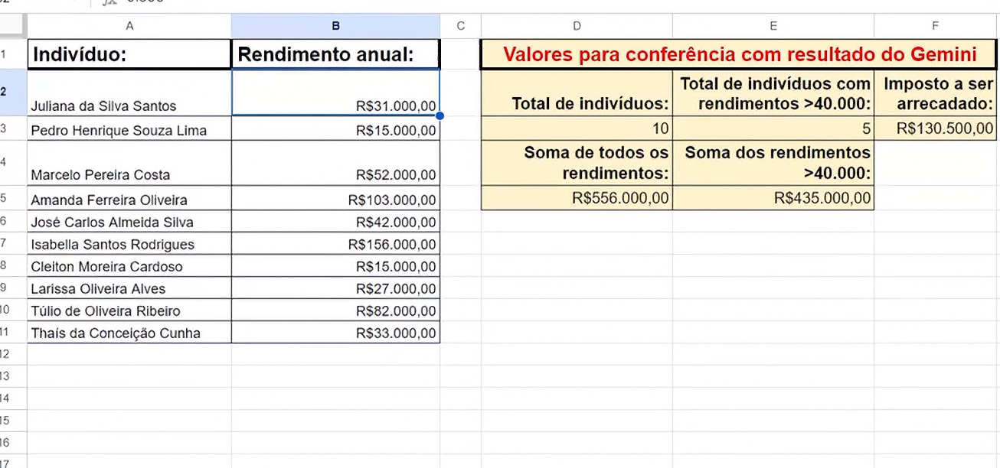
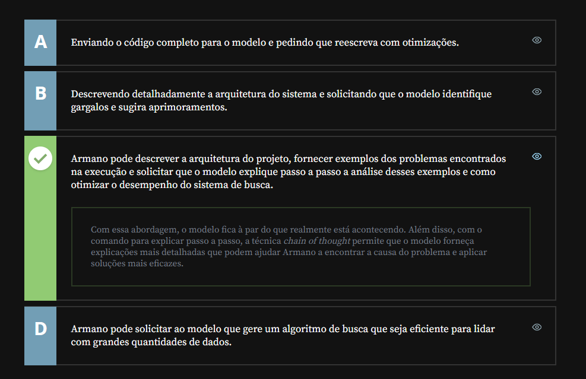

# Chain Of Thought Prompt

## Sumário: Chain Of Thought Prompt

- [Chain Of Thought Prompt](#chain-of-thought-prompt)
  - [Sumário: Chain Of Thought Prompt](#sumário-chain-of-thought-prompt)
  - [1. Preparando o ambiente](#1-preparando-o-ambiente)
  - [2. Entendendo a técnica](#2-entendendo-a-técnica)
  - [3. Outro exemplo](#3-outro-exemplo)
  - [4. Para saber mais: Zero-Shot com Chain of Thought](#4-para-saber-mais-zero-shot-com-chain-of-thought)
  - [5. Otimizando algoritmos](#5-otimizando-algoritmos)
  - [6. Faça como eu fiz: cadeia de pensamentos](#6-faça-como-eu-fiz-cadeia-de-pensamentos)
  - [7. O que aprendemos?](#7-o-que-aprendemos)

## 1. Preparando o ambiente
Na aula seguinte, utilizaremos o modelo de linguagem Gemini, do Google. Você pode utilizar qualquer modelo que prefira para acompanhar a aula, mas, caso [queira conhecer o Gemini](https://gemini.google.com/app?hl=pt-BR), basta estar logado em uma conta Gmail.

Clique em “fazer login” para acessar a tela de login e inserir seu e-mail Google ou criar uma nova conta.    

<table style="text-align: center; width: 100%;"> 
<tr>
    <td style="text-align: left;">
    
    </td>
</tr>
</table>

## 2. Entendendo a técnica
Em nossa aula anterior, havíamos feito um prompt sobre um problema matemático, porém no modelo passado para exemplo, fomos muito diretos na resposta vamos melhorar nossa prompt realizado para que esse processo seja mais didático mostrando ao modelo um resposta com uma linha de pensamento:  
```text
Pergunta: Rogério tem 5 bolas de tênis. Ele compra mais 2 latas de bolas de tênis. Cada lata contém 3 bolas de tênis. Quantas bolas de tênis ele tem agora?

Resposta: O Rogério inicialmente tinha 5 bolas de tênis. Se cada caixa tem 3 bolas e ele comprou 2 caixa, isso significa que ele comprou mais 6 bolas. Ou seja, no total agora ele tem 5 + 6  que resulta em 11 bolas de tênis

Pergunta: Havia 23 maçãs no refeitório. Se foram usadas 20 para fazer o almoço e foram compradas mais 6, quantas maçãs eles têm agora?

Resposta:
```
Nesse nosso modelo de prompt para além da introdução do exemplo da pergunta, realizamos também um modelo de linha raciocínio para resposta do modelo, ou seja nesse prompt estamos construindo uma `CADEIA DE PENSAMENTO`, que no inglês é <a href="#COT">Chain of Thougth</a>.  

<details id=COT>
    <summary>Chain of Thougth</summary>
    <p>Chain of Thought (CoT) Prompting é uma técnica que induz a LLM a detalhar o seu processo de raciocínio passo a passo antes de entregar a resposta final, imitando o fluxo de pensamento humano.</p>
    <ul>
        <li><strong>Raciocínio Lógico:</strong> O modelo quebra problemas complexos em etapas sequenciais menores, o que reduz drasticamente erros em tarefas que exigem dedução.</li>
        <li><strong>Comando Chave:</strong> Pode ser ativado de forma simples adicionando frases como "pense passo a passo" ou "explique sua lógica antes de responder" no prompt.</li>
        <li><strong>Casos de Uso:</strong> Ideal para problemas matemáticos, charadas de lógica, geração de códigos complexos e tomadas de decisão que envolvem múltiplos critérios.</li>
    </ul>
</details>

## 3. Outro exemplo
Agora vamos utilizar desses conceitos aprendidos até o momento em um problema mais complexo, abaixo temos uma planilha sobre um país fictício onde é necessário realizar o calculo de Imposto de Renda sobre seus abitantes:    

<table style="text-align: center; width: 100%;"> 
<tr>
    <td style="text-align: left;">
    
    </td>
</tr>
</table>

Podemos, realizar um prompt em alguma I.A realizando o seguinte prompt:
```text
Pergunta: Tenha uma lista de valores. O meu resultado final será 30% da soma desses valores.
Porém, nem todos os valores serão somados, apenas aqueles acima de R$:40.000,00. Para a lista abaixo, conte quantos valores existem acima de R$:40.000,00, quais são eles, faça a soma desses valores e no fim calcule o valor de 30% dessa soma.

R$: 10.000,00
R$: 20.000,00
R$: 50.000,00
R$: 60.000,00


Reposta: Nessa lista, existem 4 valores. Há 2 valores acima de R$:40.000,00, sendo eles (R$:50.000,00 e R$:60.000,00). A soma desses valores é de R$:110.000,00. O resultado final é  30% desse valor total, portanto 30% de R$:110.000,00 equivale em R$: 33.000,00
```
## 4. Para saber mais: Zero-Shot com Chain of Thought
A técnica Chain of Thought nasceu com base na _few-shot prompting_. Ou seja, a cadeia de pensamentos era apresentada ao modelo na resposta de cada exemplo fornecido, e, ao se basear nos exemplos, o modelo replicava a lógica necessária para solução de problemas mais simbólicos.

Entretanto, um estudo posterior explorou a capacidade dos modelos de explicar raciocínio mesmo sem uma quantidade de exemplos elaborados, apenas com a adição da frase __“explique passo a passo”__ no prompt.

Essa técnica é particularmente útil em situações que demandam pensamento simbólico e abstrato, como decisões estratégicas, problemas matemáticos complexos, análise filosófica e ética ou interpretação de dados científicos, por exemplo.

Como vimos na aula sobre _`few-shot e zero-shot prompting`_, modelos avançados conseguem lidar muito melhor com comandos sem orientação explícita. Ainda assim, o uso do comando “explique passo a passo” ainda é extremamente útil em cenários em que o detalhamento cuidadoso e consideração de múltiplos fatores são cruciais.
## 5. Otimizando algoritmos
Armano trabalha em uma multinacional e está desenvolvendo um sistema de busca para uma nova aplicação do sistema interno da empresa. O sistema de busca estava indo bem, mas começou a apresentar problemas de desempenho ao ser testado com grandes volumes de dados.

Como Armano pode elaborar um prompt para que um modelo de linguagem o ajude a otimizar o algoritmo para lidar com grandes volumes de dados da forma mais eficaz possível?
<table style="text-align: center; width: 100%;"> 
<tr>
    <td style="text-align: left;">
    
    </td>
</tr>
</table>

## 6. Faça como eu fiz: cadeia de pensamentos
Nessa aula, conhecemos a técnica Chain-of-thought, que pode ser traduzida como __cadeia de pensamentos.__

Essa técnica se baseia em incitar que o modelo _“raciocine”_, tanto com uso de __few-shot prompting__ quanto de __zero-shot prompting__, indicando que é possível obter respostas muito mais precisas ao _“ensinar”_ ao modelo o processo lógico por trás de uma pergunta.

A cadeia de pensamentos se faz necessária em situações que demandam um pensamento lógico complexo ou abstrato, característicos de algumas áreas do conhecimento humano.

Com uso de exemplos, o indicado é demonstrar a lógica necessária para se chegar na resposta correta, conforme o exemplo dado no prompt abaixo:
```text
Pergunta: O Rogério tem 5 bolas de tênis. Ele compra mais 2 caixas de bolas, cada uma com 3 bolas. Quantas bolas de tênis ele tem agora?

Resposta: O Rogério inicialmente tinha 5 bolas de tênis. Se cada caixa tem 3 bolas e ele comprou 2 caixas, isso significa que ele comprou mais 6 bolas. Ou seja, no total agora ele tem 5+ 6, que resulta em 11 bolas de tênis.

Pergunta: Havia 23 maçãs no refeitório. Se foram usadas 20 para fazer o almoço e foram compradas mais 6, quantas maçãs eles têm agora?

Resposta:
```
Já no caso de _zero-shot chain of thought_, a frase “explique passo a passo” adicionada ao comando é que incita o modelo a raciocinar. Isso pode ser útil quando não há exemplos disponíveis ou até mesmo para desvendar a lógica por trás de um problema.

Agora é sua vez de praticar! Teste a técnica chain of thought com problemas do seu dia a dia ou, se preferir, utilize o problema do cálculo da alíquota do “Carraristão”. Os valores estão disponíveis [na planilha](db/Alura%20-%20GPT%20-%20Soma%20de%20colunas.xlsx)

__Opinião do instrutor__

Se preferir, você pode utilizar o mesmo prompt da aula.
```text
Pergunta: Tenho uma lista de valores. O meu resultado final será 30% da soma desses valores. Porém, nem todos os valores serão somados, apenas aqueles acima de R$40.000,00. Para a lista abaixo, conte quantos valores existem acima de R$40.000,00, quais são eles, faça a soma desses valores e, no fim, calcule o valor de 30% dessa soma.

R$10.000,00
R$20.000,00
R$50.000,00
R$60.000,00

Resposta: Nessa lista, existem 4 valores. Há 2 valores acima de R$40.000,00, que são
R$50.000,00 e R$60.000,00. A soma desses valores é R$110.000,00. O resultado final é 30% desse valor, portanto, 30% de R$110.000,00, que é R$33.000,00

Pergunta: Tenho uma lista de valores. O meu resultado final será 30% da soma desses valores. Porém, nem todos os valores serão somados, apenas aqueles acima de R$40.000,00. Para a lista abaixo, conte quantos valores existem acima de R$40.000,00. Para a lista abaixo, conte quantos valores existem e qual o resultado final. 
R$31.000,00
R$15.000,00
R$52.000,00
R$103.000,00
R$42.000,00
R$156.000,00
R$15.000,00
R$27.000,00
R$82.000,00
R$33.000,00

Resposta:
```  

## 7. O que aprendemos?
Nessa aula, você aprendeu a:
- Criar prompts que incitam raciocínio do modelo;
- Utilizar técnicas few-shot e zero-shot com chain of thought.


---

<table align="center" style="border-collapse: collapse; margin-left: auto; margin-right: auto;"> 
  <caption><b>Skills do projeto</b></caption>
  <tr>
    <td style="padding: 5px;">
      
    </td>
    <td style="padding: 5px;">
      
    </td>
  </tr>
</table>


---
__Titulo:__ Chain Of Thought Prompt
__Autor:__ Thierry Lucas Chaves  
__Data de Criação:__ 17-05-2026  
__Data de Modificação:__ 17-05-2026  
__Versão:__ "1.0"