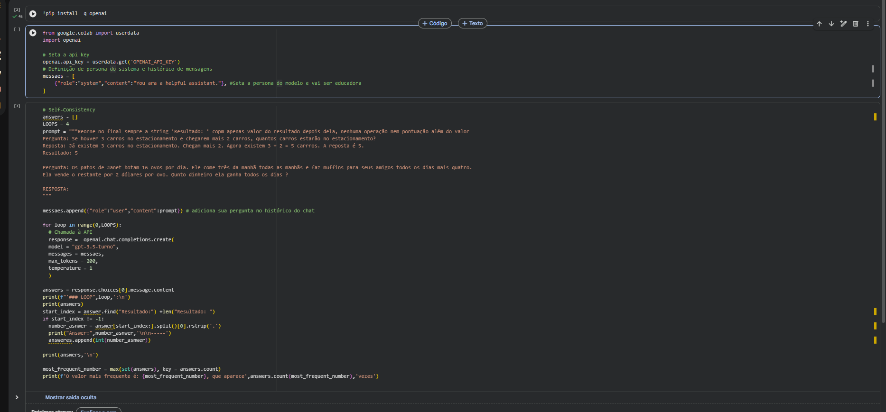
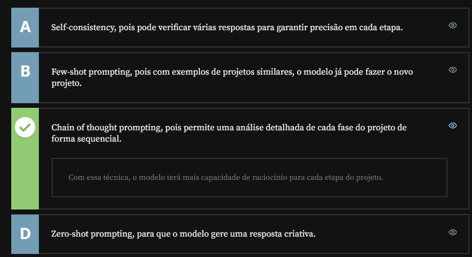

# Mais Tecnicas De Prompt

## Sumário:

- [Mais Tecnicas De Prompt](#mais-tecnicas-de-prompt)
  - [Sumário:](#sumário)
  - [1. Least-to-Most Prompting](#1-least-to-most-prompting)
  - [2. Chain-of-Verification](#2-chain-of-verification)
  - [3. Self-Consistency](#3-self-consistency)
  - [4. Organizando processos](#4-organizando-processos)
  - [5. Mão na massa: aplicando técnicas de Prompt no cotidiano](#5-mão-na-massa-aplicando-técnicas-de-prompt-no-cotidiano)
  - [6. O que aprendemos?](#6-o-que-aprendemos)
  - [7. Conclusão](#7-conclusão)

## 1. Least-to-Most Prompting

ZHOU,D. et al(Google)
Least-to-Most Prompting Enables complex reasoning in large language models, arXiv, 2022.
Essa técnica foi criada ainda no modelo do GPT3, e o problema que essa técnica buscava sanar, era que para modelos de raciocínio ainda tínhamos um problema nessa seara , então o intuito dessa técnica é de dividir o problema a ser passado pro modelo, porém fazendo de forma mais programática, vamos a um exemplo:  

```text
Amy leva 4 minutos para subir ao topo de um toboágua. Ela leva 1 minuto para escorregar até o solo. O toboágua fecha daqui a 15 minutos. Quantas vezes ela ainda consegue escorregar antes que o toboágua feche ?

- Modelo, decomponha o problema em subproblemas, e vá adicionando ao prompt final.
========================================================================================================================================================================
"Quanto tempo leva cada viagem?"

- Amy leva 4 minutos para subir ao topo de um toboágua. Ela leva 1 minuto para escorregar até o solo. O toboágua fecha daqui a 15 minutos. Quanto tempo leva cada viagem ? Amy leva 4 minutos para subir ao topo e 1 minuto para escorregar até o solo. 4 + 1 = 5. Então cada viagem leva 5 minutos. Quantas vezes ela ainda consegue escorregar antes que o toboágua feche ?

```
>PS: E importante muita cautela ao utilizar essa técnica de prompt, pois sempre devemos lembrar que os modelos não lêm a pergunta propriamente dito e sim o fazem por 
> [tokens](https://github.com/thierryLchaves/Santander-Imersao-Digital/blob/9dd1d2f1faadb21525f5c609278bb44eb37653ba/Analise_de_dados_e_IA_Nivelamento/Semana_02/Engenharia_de_Prompt_criando_prompts_eficazes_para_IA_Generativa/01_Conceitos_iniciais/ConceitosIniciais.md), o que pode fazer com que o custo de manter o contexto de
> uma conversar utilizando esse modelo suba exponencialmente. 

Em linha gerais esse modelo é o ato de fazer com que o modelo divida um problema do maior problema para o menor assim por diante.

## 2. Chain-of-Verification
Outra técnica que também foi proposta, trata-se da `Chain-of-Verification`
DHULIAWALA, S. et al (Meta)
Chain-of-Verification Reduces Hallucination in large language Models. ArXiv, 2023.

Essa técnica tem um relacionamento de utilização maior quando estamos tratando sobre fatos, ou algo relacionado a pessoas, e serve para verificar se a informação que o modelo está fornecendo sobre o problema é correto ou não. 
> A técnica proposta tem __4__ fases de processamento sendo elas:
> - 1. Prompt e resposta iniciais
> - 2. Geração das perguntas de verificação
> - 3. Execução das verificações
> - 4. Geração da resposta final verificada.

Para que possamos melhor exemplificar sua utilização vamos ao exemplo:

```text
Fase 1
Prompt: Cite alguns políticos que nasceram na cidade de Nova Iorque.
Reposta: Aqui estão alguns políticos que nasceram na cidade de  Nova Iorque:
    1. Hillary Clinton - Ex-Secretária de estado e ex-candidata presidencial democrata
    2. Donald Trump - Ex-presidente dos Estados Unidos
    3. Michael Bloomberg - Ex-prefeito da cidade Nova York e Ex-candidato presidencial democrata
    4. Brnie..
========================================================================================================================
Fase 2
Prompt: Modelo, crie perguntas de verificação com base no prompt e nas resposta. 
Resposta:
    1.  Onde nasceu Hillary Clinton?
    2.  Onde nasceu Donald Trump?
    3.  Onde nasceu Michael Bloomberg?
    4.  Onde nasceu Bernie..?
========================================================================================================================
Fase 3
Prompt: Modelo, resposta às perguntas geradas.
Resposta:
    1. Hilary Clinton Nasceu em Chicago, Illinois, Estados Unidades, em 26 de outubro de 1947.
    2. Donald Trump nasceu em 14 de junho de 1946, no Queens, em Nova Iorque, NY, Estados Unidos, 
    3. Michael Bloomberg nasceu em 14 de fevereiro de 1942 em Boston, Massachusetts, Estados Unidos.
    4. Bernie...
========================================================================================================================
Fase 4
Prompt: Modelo irá analisar as respostas verificadas, compará-las com o prompt inicial e oferecer a resposta final verificada:
Resposta: Aqui estão alguns políticos que nasceram na cidade de nova Iorque:
    1. Donald Trump - Ex-presidente dos Estados Unidos
    2. Alexandria Ocassio-Cortez - Membro democrata da Câmara de representantes do EUA.
    3. Bernie...
 ========================================================================================================================
 ```
>PS: Para essa técnica devemos ter a mesma cautela com a técnica anterior.

## 3. Self-Consistency
Essa ultima técnica foi idealizada por 
Wang, X. et al. (Google)
Self-Conssistency Improves Chain of Thougth Reasoning in Language Models. ArXiv, 2022.;

Essa técnica é muito utilizada para melhorar a técnica de __Chain of Thougt__ em modelos de linguagem, seu funcionamento consiste em realizar a mesma pergunta várias e várias vezes para o modelo, capturar as respostas enviadas, e visualizar dentre aqueles respostas qual foi a que teve mais vezes o mesmo retorno.
Vamos utilizar [Google Colab](https://colab.research.google.com/), para que possamos dar um exemplo em `Python` de como utilizamos essa técnica.
<table style="text-align: center; width: 100%;"> 
<tr>
    <td style="text-align: left;">
    
    </td>
</tr>
</table>

## 4. Organizando processos
Monalisa é uma cientista de dados e está planejando um projeto complexo de aprendizado de máquina para sua empresa. Esse processo envolve várias etapas interligadas, e ela gostaria de utilizar um modelo de linguagem como assistente na organização de cada etapa do projeto.

Qual técnica de engenharia de prompt seria mais eficaz para garantir que o modelo pense em cada etapa de forma detalhada?
<table style="text-align: center; width: 100%;"> 
<tr>
    <td style="text-align: left;">
    
    </td>
</tr>
</table>

## 5. Mão na massa: aplicando técnicas de Prompt no cotidiano
E aí, bora praticar?

Elabore um prompt que seja realmente útil para o seu dia a dia. Fique à vontade para usar a criatividade, ou escolha algumas das sugestões a seguir.

- Crie um prompt para organizar sua rotina de estudos na Alura, que considere suas áreas de interesse, outras atividades e diferentes estilos de estudo (assistir aulas, prática em projetos, exercícios, etc);
- Crie um prompt que permita uma interação com o modelo simulando uma entrevista técnica na sua área. Informe tópicos técnicos específicos e instrua o modelo como ele deve agir;
- Desenvolva um prompt para gerar perguntas e respostas sobre os tópicos estudados em um curso. Use o modelo para revisar e reforçar seu aprendizado, e pratique com ele simulando um quiz de conhecimento.

Refine seus prompts e teste em diferentes interações, até encontrar o prompt que melhor funciona.

Se desejar, compartilhe seus resultados e reflexões no fórum!

__Opinião do instrutor__  
Aqui vão algumas dicas que devem ser aplicadas na criação de prompts:

- Lembre-se de escrever de forma clara e com especificidade. Quanto mais detalhado for o seu pedido, melhor será o resultado.
- Dê instruções sobre o formato que você espera a resposta. Pode ser lista, texto, tabela…
- Considere utilizar exemplos, mas lembre-se que, em algumas situações, pode ser melhor utilizar apenas outras técnicas.
- Experimente refinar o prompt. Se a resposta inicial não for o que você espera, faça alterações no prompt, adicione detalhes ou mude o foco.
- Peça para o modelo explicar suas respostas e sugerir melhorias.
- Se simular cenários interativos, como a entrevista técnica, explique claramente no prompt inicial como o modelo deve agir durante toda a interação.  

Quanto mais você explora os conceitos de engenharia de prompt no seu dia a dia, mais eficazes serão seus resultados com IAs generativas. Experimente as técnicas aprendidas no curso em situações diversas de sua vida profissional e pessoal, e aproveite a IA como valiosa assistente para otimizar seus processos e resultados.
## 6. O que aprendemos?
Nessa aula, você aprendeu :
- Técnica Least-to-most prompting, aplicada em problemas de raciocínio lógico complexo;
- Técnica Chain of verification, aplicada para verificação de fatos reais;
- Técnica Self Consistency, aplicada para seleção da melhor resposta do modelo;
- Possibilidade de uso programático dos LLMs.
## 7. Conclusão
---

<table align="center" style="border-collapse: collapse; margin-left: auto; margin-right: auto;"> 
  <caption><b>Skills do projeto</b></caption>
  <tr>
    <td style="padding: 5px;">
      
    </td>
    <td style="padding: 5px;">
      
    </td>
  </tr>
</table>


---
__Titulo:__ Mais Tecnicas De Prompt
__Autor:__ Thierry Lucas Chaves  
__Data de Criação:__ 17-05-2026  
__Data de Modificação:__ 17-05-2026  
__Versão:__ "1.0"