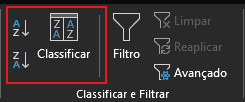
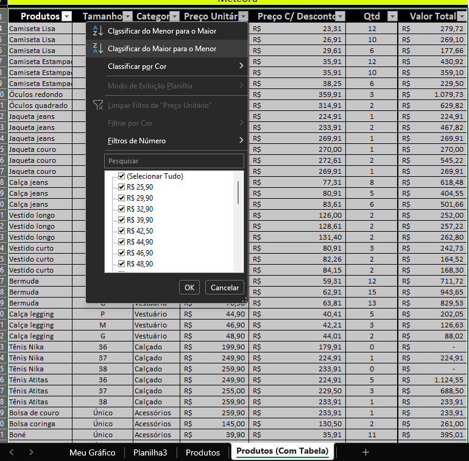
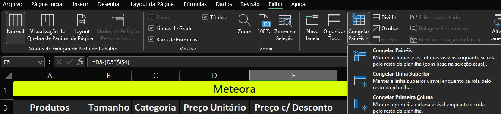
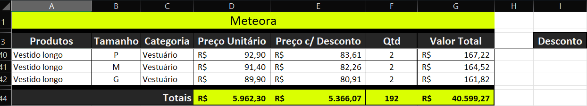
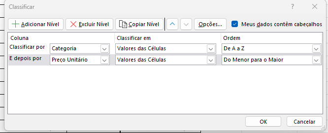
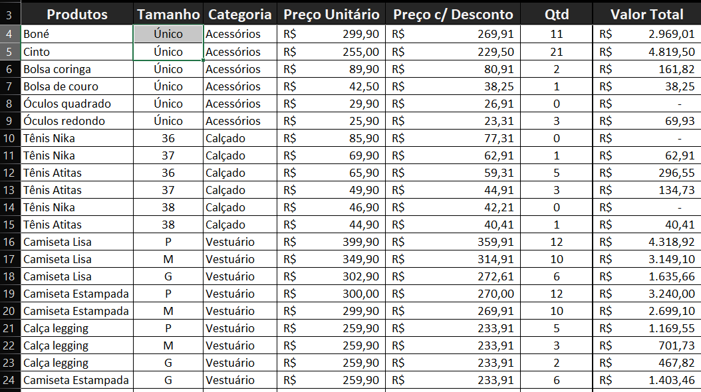
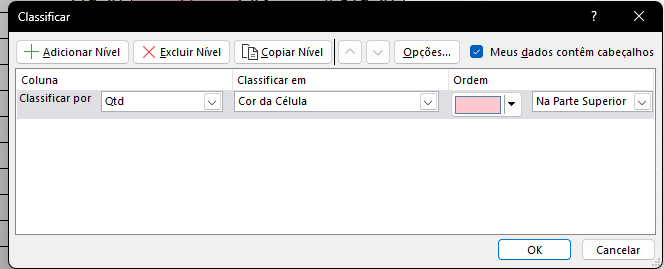
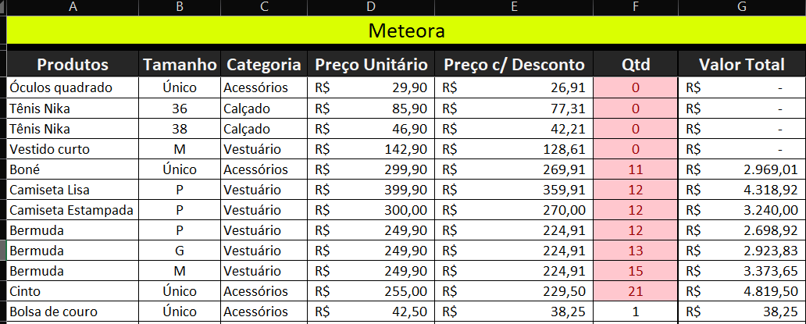
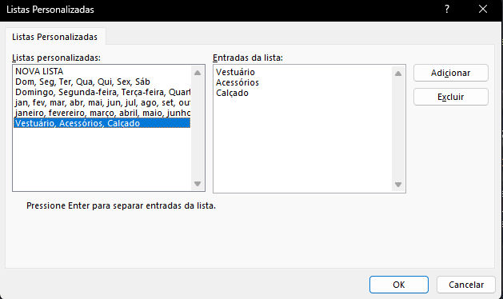

# Classificando os dados no Excel

## Sumário

## 1. Apresentação
Esse curso serve para:
     - Que já trabalha com Excel no dia a dia, mas deseja um aumento de produtividade
     - Otimização de tarefas (conhecendo alguns detalhes de função,ou detalhes de formatação)
     - Melhoria do desempenho (Seja pelo conhecimento de formas mais rápidas de formatar uma planilha ou algo do tipo )
## 2. Preparando o ambiente: Planilha Meteora E-commerce
Queremos que você aproveite ao máximo essa oportunidade de aprendizado e desenvolva suas habilidades de forma excepcional. Por isso, temos uma dica valiosa a seguir.

Para acompanhar o curso com o máximo de aproveitamento, você pode acessar a [planilha](db/Meteora%20Ecommerce%20-%20PLANILHA%20INICIAL.xlsx) que estamos trabalhando no curso. Essa planilha é uma ferramenta poderosa que complementará os seus estudos. Ao explorá-la, você poderá praticar os conceitos apresentados, fazer exercícios e acompanhar seu próprio progresso de maneira personalizada.  
> Nota: Nas planilhas disponibilizadas ao decorrer das aulas, estão com o produto Camiseta Lisa contendo um espaço no final da palavra. Para evitar que gere um resultado com erros, basta remover o espaço e atualizar a planilha novamente.

Aproveite essa dica e ponha as suas habilidades em prática! Estamos empolgados para ver o seu desenvolvimento durante o curso. Seu sucesso é nossa prioridade e estamos comprometidos em ser seus parceiros nessa jornada. 

## 3. Classificação de Dados
Ao decorrer do curso anterior, realizamos edições na nossa pasta de trabalho utilizando 2 modelos diferentes, __com__ e __sem__ formatação de planilha, onde vimos a diferença de referência estrutura, referência relativa e referência absoluta _(caso de dúvidas sobre a definição esse conteúdo se encontra [aqui](https://github.com/thierryLchaves/Santander-Imersao-Digital/blob/main/Analise_de_dados_e_IA_Nivelamento/Semana_01/Excel_domine_o_editor_de_planilhas/03_Formulas_e_Funcoes/FormulasEFuncoes.md) )_, porém durante essa aula iremos dar um maior enfase na planilha __sem__, porém sera demonstrado algumas coisas na formatação de tabela ao longo do curso para que possamos comparar algumas diferenças. 
Uma das coisas que iremos abordar com enfase será a classificação de dados, onde no momento iremos realizar a __Ordenação dos dados__, e iniciaremos a organização da planilha por preço unitário:
Existem algumas maneiras de realizar tal ordenação, uma delas e seguindo os passos descritos abaixo
  - 1º Selecione um dado da desejada
  - 2º Sobre a guia `Dados`
  - 3º Escolher a opção de `Classificar`
 <table style="text-align: center; width: 100%;"> 
<tr>
    <td style="text-align: left;">
    
    </td>
</tr>
</table>

Ao realizar esse processo o Excel realiza automaticamente o processo de ordenação da planilha para além do dado selecionado, ordena também todos os dados contidos na planilha.  

Um ponto importante a se atentar nesse processo de ordenação e de que ao realizar o processo de classificação, através do botão de _"classificação de A a Z"_ selecionado somente dado o Excel realiza a ordenação dos dados por completo de todo conteúdo, porém quando realizamos esse mesmo processo selecionando um intervalo somente aquele intervalo será ordenado.
>Ps: Importante salientar que ao realizar a ordenação por meio de seleção de intervalo o Excel irá realizar tal ordenação por meio da célula selecionada.
>Para que esse processo não ocorra pode realizar a seleção da coluna com os atalhos de teclado `TAB`ou `Shift + TAB`.

No modelo de planilha __com__ tabela, essa ordenação é feita de forma mais prática, pois nesse modelo dispõe ao usuário o meio de classificação _"no nome das colunas"_
<table style="text-align: center; width: 100%;"> 
<tr>
  <td style="text-align: left;">
  
  </td>
</tr>
</table>
 
## 4. Classificação por níveis
Uma das outras diferenças visíveis, em planilhas com formatação com tabela é o recurso de ao ir realizado o `Scroll Down`, o Excel mantém de certa forma o nome do item para a coluna, essa funcionalidade somente é possível no modelo de planilha __com formatação de tabela__, porém podemos realizar algo similar no modelo __sem formatação de tabela__, e isso é possível realizado o processo de `Congelar painéis`, essa opção permite com que o usuário possa deixar  _(Linhas ou colunas)_ de forma fixa. 
Para realizar esse processo o usuário deve:
- Acessar a guia __Exibir__
- Escolher a opção de menu `Congelar Painéis`
- Escolher quais das 3 opções disponíveis.
  - `Congelar Painéis:` Mantém as linhas e colunas visíveis, com base na seleção de intervalo
  - `Congelar Linha Superior: ` Mantém a linha superior visível
  - `Congelar Primeira Coluna: ` Mantém a primeira coluna visível 
<table style="text-align: center; width: 100%;"> 
<tr>
  <td style="text-align: left;">
  
  </td>
</tr>
</table>

No caso da nossa [planilha](db/Meteora%20Ecommerce%20-%20PLANILHA%20INICIAL.xlsx), iremos realizar o congelamento a partir da linha 4 caso escolhermos a opção de `Congelar Linha Painéis`, pois opção de primeira  está presente o titulo da planilha, fazendo assim com que a planilha tenha a seguinte apresentação:

<table style="text-align: center; width: 100%;"> 
<tr>
  <td style="text-align: left;">
  
  </td>
</tr>
</table>

> OBS: A opção de `Congelar Painéis` não entra na linha do `CTRL + Z`, então dessa maneira é melhor que seja selecionado a opção de `Descongelar Painéis`
--- 
Para além do congelamento dos painéis, também temos a opção de `Classificação de Múltiplos níveis`, essa funcionalidade nos permite por exemplo realizar a _"combinação  de classificação"_ por diferentes itens
<table style="text-align: center; width: 100%;"> 
<tr>
  <td style="text-align: left;">
  
  </td>
</tr>
</table>

Quando realizamos esse processo o Excel irá realizar as duas classificações concomitantemente, seguindo a hierarquia realizada na opção acima, ou seja primeiro será realizar a ordenação/classificação pela categoria em ordem alfabética e dentro dessa classificação será aplicado a ordenação do preço unitário, do maior para o menor conforme demonstrado abaixo:  

<table style="text-align: center; width: 100%;"> 
<tr>
  <td style="text-align: left;">
  
  </td>
</tr>
</table>

## 5. Classificando os dados em níveis
Na empresa de eletrônicos em que trabalha, Ana é a gerente de vendas responsável por classificar a lista de vendas. Ela precisa ordenar os vendedores com base em duas colunas: "Tempo de Serviço" e "Total de Vendas". Nesse momento, o interesse de Ana está em priorizar os vendedores com maior tempo de serviço (decrescente) e, em seguida, ordená-los em ordem decrescente de total de vendas.

Seguindo o que aprendemos na aula, qual é o caminho correto que a Ana deve utilizar para classificar as colunas corretamente?
<table style="text-align: center; width: 100%;"> 
<tr>
  <td style="text-align: left;">
  
  </td>
</tr>
</table>

## 6. Outros tipos de classificação
Uma das outras maneiras de realizar uma classificação se faz por meio da `Formatação Condicional`, essa opção está disponível na guia de Pagina Inicial, no grupo estilos, em suma essa opção é _"Uma mistura"_ de uma formatação _(COR, ESTILO DE FONTE ETC..)_, mediante a uma condição _(Valor de célula XPTO é maior que 10..)_.
> Para que o processo de formatação condicional, funcione __É NECESSÁRIO SELECIONAR A CÉLULA OU O INTERVALO DE CÉLULAS ANTES__  

No [planilha](db/Meteora%20Ecommerce%20-%20PLANILHA%20INICIAL.xlsx) que estamos trabalhando realizamos duas formatações, escolhendo a opção de `Realce de Células` uma para valores __Menores__ que 1 e outra para valores __Maiores__ que 10, deixando-as com uma coloração de fundo em vermelho, com essa formatação condicional realizada, podemos combinar tal opção com a classificação, pois no modelo de classificação é possível realizar a classificação com base na cor da célula:
<table style="text-align: center; width: 100%;"> 
<tr>
  <td style="text-align: left;">
  
  </td>
</tr>
<tr>
  <td style="text-align: left;">
  
  </td>
</tr>
</table>

Ainda na seara de classificações, podemos realizar a classificação de forma personalizada, para tal processo dentro da opção de classificar, ao selecionar uma coluna desejada, no valor de ordem temos a opção de `Lista Personalizada`, nessa opção de menu é possível realizar uma classificação que não necessariamente seguira a ordem alfabética ou de crescente ou decrescente, e sim conforme a lista informada.
<table style="text-align: center; width: 100%;"> 
<tr>
  <td style="text-align: left;">
  
  </td>
</tr>
</table>

## 7. Faça como eu fiz: classificando os dados de produtos com tabela
É hora de ação! Vamos treinar o que aprendemos na aula e classificar os dados da nossa planilha de Produtos (Com tabela) seguindo dois critérios: primeiro, ordenar a coluna “Categoria” em ordem alfabética (A a Z); em seguida, classificar a coluna “Preço Unitário”, do maior para o menor valor. E então, que tal colocar a mão na massa e obter resultados incríveis por meio da prática? Vamos lá!  

__Opinião do instrutor__

- Passo 1: Selecione o intervalo que contém os dados que pretendemos classificar (A3:G42). Lembre-se de incluir a linha de rótulo de dados, pois essa ação é importante nesse momento.

- Passo 2: Na Guia "Dados", no grupo “Classificar e Filtrar”, clique no ícone "Classificar".

- Passo 3: A seguir, na caixa de diálogo "Classificar", vamos selecionar o primeiro nível de classificação.

- Passo 4: No campo “Classificar por”, selecione como primeiro nível de classificação a coluna "Categoria".

- Passo 5: Depois, no campo "Ordem", escolha a opção "A a Z".

- Passo 6: Clique no no botão "+ Adicionar Nível" para criarmos o segundo nível da nossa classificação.

- Passo 7: No campo "E depois por" , selecione como segundo nível da classificação, a coluna "Preço Unitário"

- Passo 8: Por fim, no campo "Ordem" do "Preço Unitário", escolha a opção "Do maior para o menor". Clique no botão "OK"

Pronto! Temos a visualização das informações na ordem que queríamos!
## 8. O que aprendemos?
Nessa aula, você aprendeu a:
- Reconhecer o recurso de classificação do Excel.
- Relacionar colunas para classificação no Excel.
- Classificar os dados em ordem crescente de A a Z no Excel.
- Classificar os dados em ordem decrescente de Z a A no Excel.
- Classificar os dados por níveis no Excel.
- Produzir diferentes formas de classificação dos dados no Excel.

---

<table align="center" style="border-collapse: collapse; margin-left: auto; margin-right: auto;"> 
  <caption><b>Skills do projeto</b></caption>
  <tr>
    <td style="padding: 5px;">
      
    </td>
    <td style="padding: 5px;">
      
    </td>
    <td style="padding: 5px;">
      
    </td>
  </tr>
</table>

---
__Titulo:__ Classificando os dados no Excel
__Autor:__ Thierry Lucas Chaves  
__Data de Criação:__ 07-05-2026  
__Data de Modificação:__ 10-05-2026  
__Versão:__ "2.0"