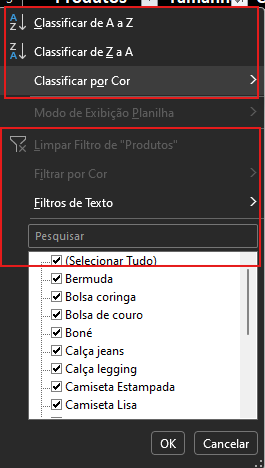
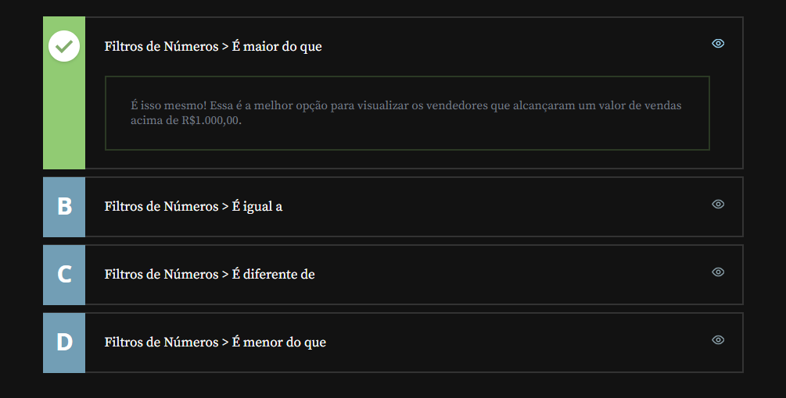
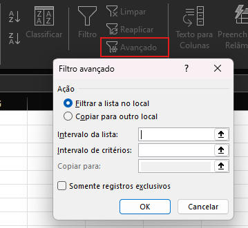
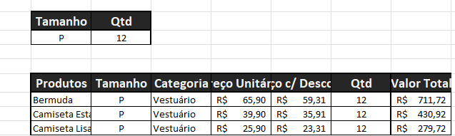

# Aplicando Filtros No Excel

## Sumário

## 1. Preparando o ambiente: planilha Meteora E-commerce
Queremos garantir que você aproveite ao máximo o nosso curso e alcance todo o seu potencial. Por isso, estamos disponibilizando uma ferramenta essencial para auxiliá-lo nessa jornada: a [planilha](db/Meteora%20Ecommerce%20-%20FINAL%20AULA%201.xlsx) que estamos utilizando durante o curso.

Para acompanhar o curso com o máximo de aproveitamento, você pode fazer o download da planilha. Com a planilha em mãos, você terá a oportunidade de praticar os exercícios propostos, explorar os exemplos e mergulhar ainda mais no aprendizado.  

## 2. Filtrando os dados
Na [aula anterior](https://github.com/thierryLchaves/Santander-Imersao-Digital/blob/f0c94a7a355af1926c3c42c43e43beaca7f16955/Analise_de_dados_e_IA_Nivelamento/Semana_02/Funcoes_com_excel_operacoes_matematicas_e_filtros/01_Classificando_os_dados_no_Excel/ClassificandoOsDadosNoExcel.md), nos realizamos a edição da tabela em questão para que fosse possível realizar ordenação dos dados que aprendemos como sendo um processo de __Classificação de dados__, porém nessa aula daremos seguimento na edição da planilha para que essa seja realizada através de filtros, em sintaxe um filtro pode ser considerado o processo no Excel para escolha de dados desejado do usuário sem que os demais dados sejam exibidos.  

A priore veremos a aplicação dos filtros no modelo da planilha __com__ tabela, nesse modelo ao clicar sobre o ícone de _"setas"_ nos títulos das colunas ao clicar sobre qualquer um dos ícones será apresentado a tela com as opções tanto de __Classificação__ quanto a de __Filtro__:
<table style="text-align: center; width: 100%;"> 
<tr>
    <td style="text-align: left;">
    
    </td>
</tr>
</table>

Diferente do processo de classificação o filtro por sua vez realiza a _"LIMPEZA"_ visual da planilha deixando somente os dados selecionados.

Para aplicar o mesmo processo dentro da planilha __"sem"__ formatação, devemos seguir os seguintes passos:
- Clicar sobre uma célula de preferência uma célula que contenha os rótulos da planilha 
- Acessar a guia Dados
- Selecionar a opção de menu Filtro.
  
Com esse processo temos a aplicação do filtro realizada, porém é valido ressaltar um pequena diferença entre os 2 modelos, enquanto no modelo __com__ formatação de tabela, ao aplicarmos o filtro a linha pelas somas se adaptarem automaticamente ao filtro realizado, porém no modelo __sem__ essa formatação esse processo não acontece de forma automática.
>PS: O Excel é capaz de diferenciar o tipo de dado presente nas células, podemos verificar esse processo quando aplicamos filtros, onde para cada conteúdo disponível nas células, o filtro apresentado será diferente, esse filtro pode ser realizado tanto pelo tipo de dado quanto pela coloração em caso de de formatação condicional.

## 3. Filtros específicos

Dentro do processo de aplicação de filtros, podemos utilizar filtros específicos como por exemplo filtro `contém`, nesse filtro é possível realizar um filtro em células de texto para determinarmos que o texto `contém` uma determinada palavra, como por exemplo buscar a palavra _"couro"_ na lista de produtos, esse tipo de filtro nos permite uma filtragem por classificação de `AND/OR` ou seja podemos escolher valores que contém determinado valor ou determinado valor ou um ou outro. 
Esse tipo de filtro  também pode ser utilizado para células que contém número, onde podemos realizar uma especie de filtro de intervalo .  
> PS: Uma maneira mais fácil de realizar a limpeza de filtro e realizado através da "deseleção" do botão de filtro na aba de guia.

## 4. Filtro de número
Maria é a gerente de uma loja de roupas com uma visão aguçada em obter oportunidades de forma estratégica. Nesse momento, ela está analisando as vendas mensais de sua equipe com base no seguinte objetivo: identificar os vendedores que ultrapassaram a marca de R$1.000,00 em vendas.

Como gerente, ela busca constantemente maneiras de aprimorar o desempenho da equipe, porém, agora encontra-se com essa tarefa de garantir que cada membro seja devidamente reconhecido e recompensado pelo seu desempenho.

Seguindo o que vimos na aula, vamos ajudar a Maria a aplicar o filtro da forma correta na coluna de Vendas, para visualizar quais foram os vendedores que atingiram a meta. Escolha a alternativa correta que nos guia nessa direção.
<table style="text-align: center; width: 100%;"> 
<tr>
    <td style="text-align: left;">
    
    </td>
</tr>
</table>

## 5. Filtro avançado
Para que possamos trabalhar com filtros avançados, é muito importante que nos atentarmos de todos os passos, pois esse filtro exige um certo critério para sua aplicação. 
Para o devido funcionamento do processo do filtro avançado é necessário que os seguintes passos sejam executados:  
- 1º Realize a criação de __UMA NOVA PLANILHA__
- 2º Antes de realizar o processo é necessário que __NOVA PLANILHA JÁ TENHA FILTROS CRIADOS__
  - Para que funcione corretamente, pode ser realizado a cópia dos rótulos que desejados para aplicação de filtro para nova planilha.
- 3º Após a cópia dos rótulos que servirão como filtros, acessar guia dados, e escolher a opção de menu Avançado, sobre o grupo de  `Classificar e filtrar`
  >- <table style="text-align: center; width: 100%;"> 
  >  <tr>
  >    <td style="text-align: left;">
  >  
  > </td>
  > </tr>
  > </table>
- 4º Copiar para outro local (Nesse cenário é o ideal pois desejamos realizar uma cópia da planilha original para essa nova planilha.)
- 5º No item de `intervalo da lista`, selecionar o intervalo de valores no qual se encontra a base com os dados.
- 6º No item de `Intervalo de critérios`, deve-se selecionar os campos que foram copiados, para a nova planilha.
- 7º No item de `copiar para`, deve-se informar o local onde se deseja que os dados sejam copiados. 
- 8º O item de `Somente registros exclusivos`, somente será uma opção viável quando existem dados duplicados e queremos eliminar tais informações. 

Com todos os passos aplicados, será apresentado o resultado como o da imagem abaixo:
<table style="text-align: center; width: 100%;"> 
<tr>
    <td style="text-align: left;">
    
    </td>
</tr>
</table>

>PS: O filtro avançado realiza o processo de filtragem manual dos dados, o que implica que caso modificarmos algum valor do `intervalo de critérios` os valores presentes na tabela de cópia não serão modificados, devendo ser aplicado novamente os passos descritos acima.  

## 6. Faça como eu fiz: filtrando os dados por categoria
Agora é com você! Vamos treinar o que aprendemos na aula e aplicar um filtro para visualizarmos todos os produtos que são da categoria Acessórios. E então, vamos colocar a mão na massa?!  
__Opinião do instrutor__ 

- Passo 1: Para criar o filtro, selecione a linha que contém os "Rótulos de Dados" da planilha de Produtos (Linha 3).

- Passo 2: Com os rótulos de dados selecionados, na guia "Dados", no grupo “Classificar e Filtrar”, clique no ícone "Filtro". Você pode utilizar também as teclas de atalho Ctrl + Shift + L para chegar nesse mesmo resultado.

- Passo 3: Na coluna Categoria, localize o botão de filtro (um botão parecido com uma seta para baixo). Clique nele para mostrar as opções de filtro.

- Passo 4: Escolha a opção "Filtros de Texto" e, em seguida, clique na opção "É igual a”.

- Passo 5: Na janela “Filtro Automático Personalizado”, selecione a opção ”é igual a” localizado em categoria e digite Acessórios na caixa ao lado. Em seguida, aperte o botão “Ok”. Pronto, nosso filtro foi aplicado e agora podemos visualizar todos os produtos da categoria Acessórios!

## 7. O que aprendemos?
Nessa aula, você aprendeu a:
- Identificar o que são filtros no Excel.
- Utilizar os diferentes tipos de filtros do Excel.
- Experimentar os filtros automáticos do Excel.
- Produzir filtros com condições no Excel.
- Produzir o filtro avançado.
- 
---

<table align="center" style="border-collapse: collapse; margin-left: auto; margin-right: auto;"> 
  <caption><b>Skills do projeto</b></caption>
  <tr>
    <td style="padding: 5px;">
      
    </td>
    <td style="padding: 5px;">
      
    </td>
    <td style="padding: 5px;">
      
    </td>
  </tr>
</table>

---
__Titulo:__ Aplicando Filtros No Excel
__Autor:__ Thierry Lucas Chaves  
__Data de Criação:__ 11-05-2026  
__Data de Modificação:__ 11-05-2026  
__Versão:__ "1.0"