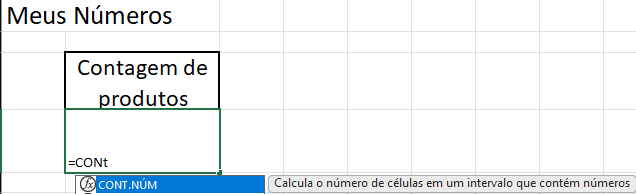
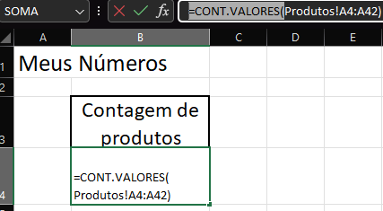
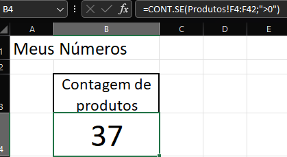
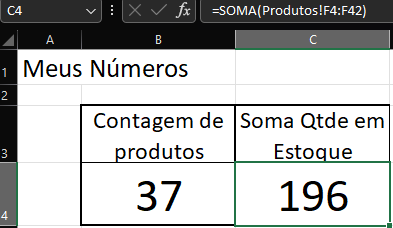
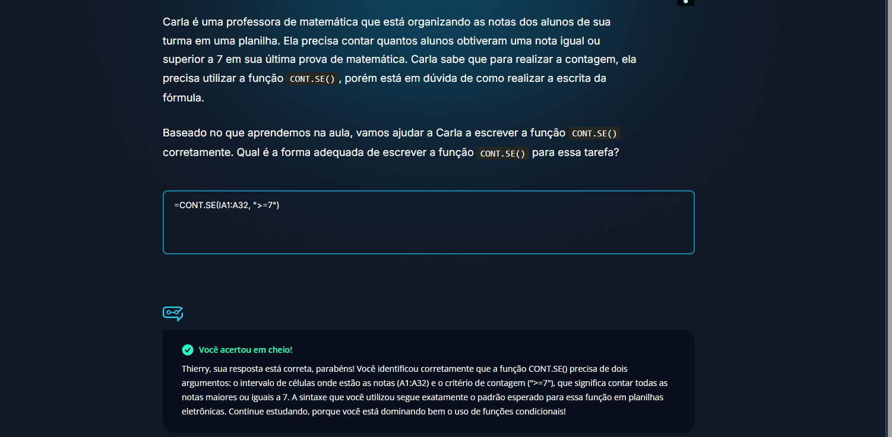
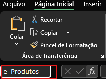
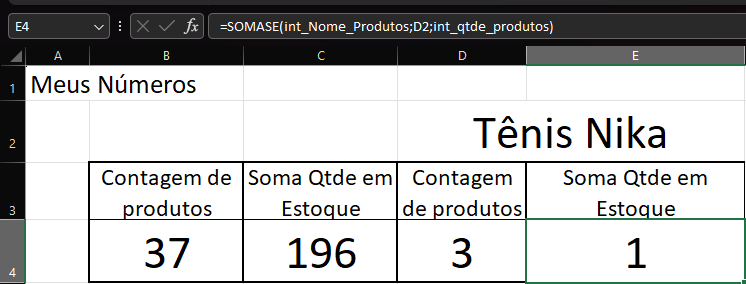
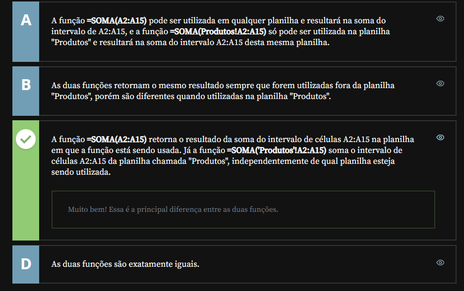
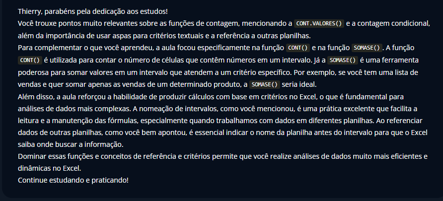

# Cálculos com condição

## Sumário: 
- [Cálculos com condição](#cálculos-com-condição)
  - [Sumário:](#sumário)
  - [1. Preparando o ambiente: planilha Meteora E-commerce](#1-preparando-o-ambiente-planilha-meteora-e-commerce)
  - [2. Contando os produtos](#2-contando-os-produtos)
  - [3. Contagem condicional](#3-contagem-condicional)
  - [4. Contagem de alunos](#4-contagem-de-alunos)
  - [5. Soma condicional](#5-soma-condicional)
  - [6. Operadores lógicos](#6-operadores-lógicos)
  - [7. Faça como eu fiz: contagem condicional](#7-faça-como-eu-fiz-contagem-condicional)
  - [8. O que aprendemos?](#8-o-que-aprendemos)

## 1. Preparando o ambiente: planilha Meteora E-commerce
Para acompanhar o curso com o máximo de aproveitamento, você pode fazer o download da [planilha](db/Meteora%20Ecommerce%20-%20FINAL%20AULA%202.xlsx) que estamos trabalhando no curso.
## 2. Contando os produtos
A partir de agora iremos realizar o trabalho somente em cima da planilha de produtos, e para facilitar esse processo iremos ocultar as demais abas da nossa pasta de trabalho, para realizar esse processo, basta clicar sobre o nome da planilha desejada e com a opção de mouse ocultar. 
Feito a preparação mencionada, o passo que iremos seguir será o de construção de indicadores da planilha, o primeiro passo e criar um nova planilha, onde nela realizamos a inserção de novos dados que chamaremos de _"Meus números"_, e a partir da linha 3 da coluna B iremos nomear a Células B3 como contagem de números, para esse processo iremos utilizar a guia de `Fórmulas`, nessa em questão nos apresenta uma gama de categorias de formulas diferentes, como por exemplo  _(Lógica, Texto, Pesquisa e Referência etc..)_, obviamente não iremos abordar todas as fórmulas existentes e sim as mais utilizadas.
A primeira função a ser abordada é a função de __`CONTAGEM`__, em suma maioria todas funções de contagem se iniciam com _"CONT"_.
> Ps: caso não lembrarmos o que necessariamente a função faz, o Excel dispõe um resumo no auto-complete sobre a finalidade da função
> <table style="text-align: center; width: 100%;"> 
> <tr>
>   <td style="text-align: left;">
>   
>   </td>
> </tr>
> </table>

Para nossa planilha utilizaremos a priore a função `=CONT.VALORES()`, deixando a contagem da seguinte maneira:

<table style="text-align: center; width: 100%;"> 
    <tr>
   <td style="text-align: left;">
   
   </td>
 </tr>
</table>

## 3. Contagem condicional
A função utilizada para contagem condicional trata-se da função _`=CONT.SE()`_, no nosso modelo de função sua sintaxe utiliza 2(dois) parâmetros, sendo o intervalo de contagem e posteriormente a condição no casso da nossa planilha, desejamos realizar a contagem somente dos produtos  que contém  a quantidade maior que __0__, porém se inserirmos _>0_ na formula o Excel não ira reconhecer a função, para que a condição seja atendida a condição deverá estar entre `""` , esse artificio se faz necessário pois o símbolo de _">"_ e como esse caractere é um tipo de dado `TEXTO`, precisamos informar que se trata de um critério
> Não serão todas as funções que exigem esse artificio, porém é valido se atentar a tal.  
> <table style="text-align: center; width: 100%;"> 
>   <tr>
>   <td style="text-align: left;">
>   
>   </td>
> </tr>
> </table>


A próxima função utilizada é a de soma, porém como podemos verificar essa soma já existe na nossa planilha de produtos __sem formatação__, podemos replicar o valor da linha de soma diretamente nesse novo campo, porém se aportarmos a célula `F44`, por exemplo o valor será 0, isso se deve ao fato de que quando estamos trabalhando com referência, precisamos apontar a planilha e a célula desejada, deixando por assim o resultado 
```text
=produtos!F44
# ou ainda 
=SOMA(produtos!F4:F44)
```
<table style="text-align: center; width: 100%;"> 
<tr>
    <td style="text-align: left;">
    
    </td>
</tr>
</table>

## 4. Contagem de alunos
Carla é uma professora de matemática que está organizando as notas dos alunos de sua turma em uma planilha. Ela precisa contar quantos alunos obtiveram uma nota igual ou superior a 7 em sua última prova de matemática. Carla sabe que para realizar a contagem, ela precisa utilizar a função CONT.SE(), porém está em dúvida de como realizar a escrita da fórmula.

Baseado no que aprendemos na aula, vamos ajudar a Carla a escrever a função CONT.SE() corretamente. Qual é a forma adequada de escrever a função CONT.SE() para essa tarefa?
<table style="text-align: center; width: 100%;"> 
<tr>
    <td style="text-align: left;">
    
    </td>
</tr>
</table>

## 5. Soma condicional
Quando desejamos trabalhar com um tipo de soma específica, ou uma contagem para um determinado valor de busca, também utilizaremos o `CONT.SE`, porém utilizaremos um outro tipo de referência para condição o que é permitido no `CONT.SE`, 
> PS: Para agilizar o processo de referência de intervalos, podemos utilizar o recurso de `CAIXA DE NOME`,para utilizar esse recurso devemos:
>   - 1º Selecionar o intervalo de valores que serão _"substituídos"_
>   - 2º Dentro da Guia de Página Principal, e informar dentro da caixa de nome (Localizado na parte superior esquerda da planilha.)
>       <table style="text-align: center; width: 50%;"> 
>         <tr>
>           <td style="text-align: left;">
>           
>           </td>
>       </tr>
>     </table>
Quando realizarmos o processo de nomenclatura podemos construir nossa função da seguinte maneira: 
```excel
=CONT.SE(int_Nome_Produtos;D2)
```
Onde D2, seria o nome que o usuário realizara a digitação do nome do produto desejado.
Agora para realizarmos propriamente a soma condicional o nome da formula é `SOMASE`, nessa função devemos passar __3__ parâmetros sendo eles:
- O intervalo de seleção / busca
- O critério de condição para soma 
- O intervalo de número para soma
Utilizando nossa planilha a formula ficaria da seguinte forma:
```excel
=SOMASE(int_Nome_Produtos;D2;int_qtde_produtos)
```
<table style="text-align: center; width: 100%;"> 
    <tr>
   <td style="text-align: left;">
   
   </td>
 </tr>
</table>

>PS: Em caso de condição / critério de formulas de busca por exemplo , ou seja formulas onde o critério a ser utilizado será mais amplo que o habitual, podemos utilizar o caractere coringa do Excel `*`, quando utilizado o Excel irá realizar a busca da palavra primeira, antes do caractere mencionado. 

## 6. Operadores lógicos
No momento de usar funções no Excel (como CONT.SE ou SOMA), uma série de detalhes tem que ser considerados para que tenhamos o resultado esperado. Afinal, cada um desses detalhes podem influenciar na otimização da produtividade do nosso trabalho.

Considerando uma análise atenta sobre a diferença entre as fórmulas "=SOMA(A2:A15)" e "=SOMA(Produtos!A2:A15)", selecione a alternativa que nos leva ao resultado esperado.

<table style="text-align: center; width: 100%;"> 
    <tr>
   <td style="text-align: left;">
   
   </td>
 </tr>
</table>

## 7. Faça como eu fiz: contagem condicional
É hora de ação! Vamos treinar o que aprendemos na aula e contar quantos produtos são da categoria Vestuário?

Essa é uma oportunidade perfeita para aprimorar suas habilidades e explorar as funcionalidades do Excel. Use a função adequada para realizar essa contagem e perceba os insights aparecer. Vamos lá!  

__Opinião do instrutor__

- Passo 1: O primeiro passo que devemos seguir, é selecionar a célula onde vamos escrever a nossa função. Para efeitos deste exercício, vamos colocar a nossa fórmula na célula __C45__.

- Passo 2: Como queremos contar com base em um critério, produtos da categoria vestuário, vamos utilizar a função `=CONT.SE`.

- Passo 3: Na célula __** C45**__ vamos inserir a função

```text
=CONT.SE(
```
- Passo 4: O primeiro parâmetro da função CONT.SE é o intervalo onde a contagem deve ser realizada. Neste caso, selecione o intervalo da coluna Categoria (C4:C42) e, em seguida, digite o ponto e vírgula “;” para adicionar o último parâmetro da função.
```text
=CONT.SE(C4:C42;
```
- Passo 5: O segundo e último parâmetro da função CONT.SE(), será o critério que a contagem deve se basear, neste caso o Vestuário. Lembre-se de que a função CONT.SE exige que o critério esteja entre aspas.
```text
=CONT.SE(C4:C42;”Vestuário”
```
- Passo 6: Feche os parênteses e pressione o [ENTER] para finalizar a fórmula.
```text
=CONT.SE(C4:C42;”Vestuário”)
```
Pronto, nossa função foi criada e está pronta!!
## 8. O que aprendemos?
Explique com suas próprias palavras os principais conceitos que você aprendeu nesta aula.
```text
Nesta aula aprendemos sobre funções de contagem contagem sendo elas condicionais ou não, onde utilizamos por exemplo a função cont.valores(), que realiza a contagem sobre o intervalo selecionado, também aprendemos sobre contagem condicional que realiza a contagem de algum valor mediante alguma condição, e da importância sobre a utilização do "" para informar um critério quando esse possuir algum tipos de caracteres, também aprendemos como transformar um intervalo de valores em intervalo nomeado, e por fim a diferença de referências, quando desejamos realizar a referência de uma outra planilha é necessário que esta seja mencionada antes do intervalo de valores.
```

<table style="text-align: center; width: 100%;"> 
    <tr>
   <td style="text-align: left;">
   
   </td>
 </tr>
</table>

---

<table align="center" style="border-collapse: collapse; margin-left: auto; margin-right: auto;"> 
  <caption><b>Skills do projeto</b></caption>
  <tr>
    <td style="padding: 5px;">
      
    </td>
    <td style="padding: 5px;">
      
    </td>
    <td style="padding: 5px;">
      
    </td>
  </tr>
</table>


---
__Titulo:__ Cálculos com condição
__Autor:__ Thierry Lucas Chaves  
__Data de Criação:__ 12-05-2026  
__Data de Modificação:__ 14-05-2026  
__Versão:__ "1.0"