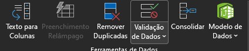
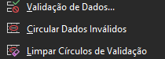
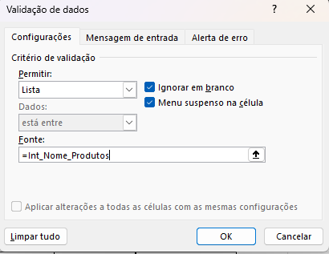
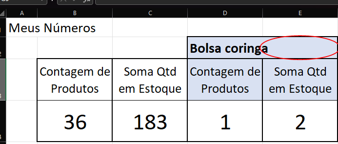
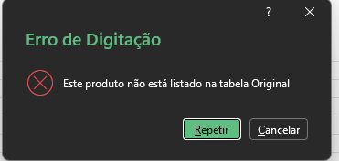
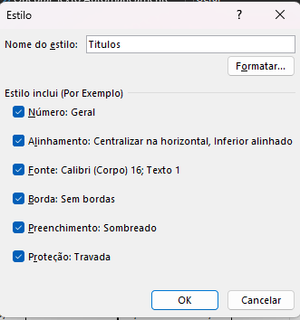

# Operações matemáticas e filtros  

## Sumário:

- [Operações matemáticas e filtros](#operações-matemáticas-e-filtros)
  - [Sumário:](#sumário)
  - [1. Preparando o ambiente: planilha Meteora E-commerce](#1-preparando-o-ambiente-planilha-meteora-e-commerce)
  - [2. Explorando a Validação de Dados no Excel](#2-explorando-a-validação-de-dados-no-excel)
  - [3. Criando uma validação de dados.](#3-criando-uma-validação-de-dados)
  - [4. Tipos de mensagem](#4-tipos-de-mensagem)
  - [5. Estilos de célula](#5-estilos-de-célula)
  - [6. Faça como eu fiz: criando a lista de produtos](#6-faça-como-eu-fiz-criando-a-lista-de-produtos)
  - [7. O que aprendemos?](#7-o-que-aprendemos)

## 1. Preparando o ambiente: planilha Meteora E-commerce
Para acompanhar o curso com o máximo de aproveitamento, você pode fazer o download da [planilha](db/Meteora%20Ecommerce%20-%20FINAL%20AULA%203.xlsx) que estamos trabalhando no curso.
## 2. Explorando a Validação de Dados no Excel
Um dos problemas de utilizarmos campos passíveis de digitação do usuário, se dá na probabilidade de digitação errada, ou com divergências de caracteres, para realizar esse processo iremos utilizar um recurso normalmente chamado de __Validação de Dados__, esse recurso pode ser utilizado para enumeras coisas, porém a mais recorrente e quando se tem uma lista e so escolhemos um dos valores da lista.  
Para realizar tal processo, como em quase todos os processos do Excel, primeiro escolhemos a célula que recebera a função.  
- 1º Pós seleção da célula iremos acessar a guia `Dados`
- 2º Escolher o grupo `Ferramentas de dados`
- 3º Escolher a opção de menu `Validação de Dados`
> <table style="text-align: center; width: 50%;"> 
> <tr>
> <td style="text-align: left;">
>  
> </td>
> </tr>
> </table>
Através de tal menu é possível a escolha de 3 opções sendo elas: 
> <table style="text-align: center; width: 50%;"> 
> <tr>
> <td style="text-align: left;">
>  
> </td>
> </tr>
> </table>
A primeira a ser abordada será a de validação de dados, ao escolher essa função podemos fazer uma serie de coisas, porém para nossa aplicação será a de criar uma lista.
Essa opção faz com que o usuário não realize o input de qualquer valor naquela célula, e somente possa selecionar uma lista de opções. Para atribuir valores a está lista, podemos inserir um intervalo de valores através da seleção conforme já foi visto anteriormente, porém como já atribuímos um nome ao intervalo de produtos por exemplo, a caixa de seleção irá apresentar o nome dessa lista que atribuímos anteriormente.
> <table style="text-align: center; width: 50%;"> 
> <tr>
> <td style="text-align: left;">
>  
> </td>
> </tr>
> </table>

## 3. Criando uma validação de dados.
Marina está organizando um evento para sua escola e precisa fazer o controle das inscrições dos alunos em uma planilha do Excel. Para garantir que os alunos insiram apenas os nomes das atividades disponíveis, Marina gostaria de criar uma validação de dados.

Com base no que vimos na aula, qual é o caminho correto que a Marina deve seguir para criar a validação de dados?
<table style="text-align: center; width: 100%;"> 
<tr>
    <td style="text-align: left;">
    
    </td>
</tr>
</table>

## 4. Tipos de mensagem
Uma maneira de realizar a configuração do campo para que esse não aceite dados em branco daqueles que serão inseridos pelo usuário, e desmarcar a flag `Ignorar em branco`, com essa flag desmarcada, o Excel irá exibir uma mensagem quando o usuário tentar preencher os dados da lista ou apagar o conteúdo da lista.
> PS: Essa mensagem somente será exibida quando o valor presente na lista for inserido, pois essa é uma validação de entrada, ou seja caso a célula em questão esteja em branco a priore não será exibido nenhuma mensagem. 

Para as outras duas opções citadas anteriormente, a de `Circular Dados Inválidos` e `Limpar Círculos de validação` são utilizados quando por exemplo queremos evidenciar dados que estão em desacordo com formula.
<table style="text-align: center; width: 100%;"> 
<tr>
    <td style="text-align: left;">
    
    </td>
</tr>
</table>

Já para retirar esse círculo de validação utilizamos a ultima opção __`Limpar Círculos de validação`__.

Por fim veremos como adaptar a mensagem que é exibida pro usuário no caso de erro dos valores da lista, para adaptar o processo dentro do menu suspenso de validação existe guia de alerta de erro onde é possível adaptar tanto a mensagem quanto o titulo da mensagem a ser exibida do usuário. 
<table style="text-align: center; width: 50%;"> 
<tr>
    <td style="text-align: left;">
    
    </td>
</tr>
</table>

Outra opção dentro da `Validação de dados` e a opção de __Mensagem de entrada__, que serve por exemplo para realizar uma informação do que se trata a lista, utilizada para explicar ao usuário por exemplo.

## 5. Estilos de célula
Para melhorar o processo de formatação de células dentro do Excel de forma mais prática do que copiar esse formato em cada nova célula ou planilha criada, o Excel disponibiliza a opção de `Estilo de Célula`, essa opção fica dentro da guia de  `Página Inicial`, no agrupamento de Estilos, com essa funcionalidade é possível realizar por exemplo pré-formatações como de titulo, rótulos etc.. 
Dentro dessa opção de menu é possível criar um novo estilo de célula, ao escolher tal opção será apresentado ao usuário a opção de formatações: 
<table style="text-align: center; width: 50%;"> 
<tr>
    <td style="text-align: left;">
    
    </td>
</tr>
</table>

Após o preenchimento do título da formatação devemos clicar em formatar, para que ai sim seja apresentado as opções de formatações, as flags presentes no menu inicial dizem respeito sobre onde e o que será incluso nessa formatação de célula.
A grande diferença do estilo de célula para o pincel de formatação por exemplo, é que quando realizamos a aplicação desse estilo ele irá replicar as modificações a todas as células que tenham aquele estilo aplicado. 

## 6. Faça como eu fiz: criando a lista de produtos
Chegou mais um momento de você exercitar o aprendizado e fortalecer suas habilidades.

Por isso, desafie-se a aplicar o que aprendemos em aula e crie uma validação de dados do tipo lista. Coloque em prática o seu conhecimento e aproveite para experimentar um pouco mais dessa valiosa possibilidade no Excel.

__Opinião do instrutor__

- Passo 1: Clique na célula D2 da Planilha2 para inserir a validação de dados.

- Passo 2: Na guia "Dados", no grupo Ferramentas de Dados, clique no ícone "Validação de Dados".

- Passo 3: Na caixa de diálogo "Validação de Dados", no campo "Permitir", escolha a opção “Lista”.

- Passo 4: No campo “Fonte” selecione o intervalo `A4:A42` da Planilha Produtos ou digite `=Int_Nome_Produtos`.

- Passo 5: Aperte o botão “Ok”.

Pronto, nossa validação de dados do tipo lista foi criada!

## 7. O que aprendemos?
Nessa aula, você aprendeu a:
- Experimentar o recurso de Validação de Dados no Excel.
- Implementar mensagens de entrada e saída na Validação de Dados no Excel.
- Elaborar uma validação de dados do tipo lista no Excel.
- Elaborar estilos de célula no Excel.

---

<table align="center" style="border-collapse: collapse; margin-left: auto; margin-right: auto;"> 
  <caption><b>Skills do projeto</b></caption>
  <tr>
    <td style="padding: 5px;">
      
    </td>
    <td style="padding: 5px;">
      
    </td>
    <td style="padding: 5px;">
      
    </td>
  </tr>
</table>

---
__Titulo:__ Operações matemáticas e filtros  
__Autor:__ Thierry Lucas Chaves  
__Data de Criação:__ 12-05-2026  
__Data de Modificação:__ 14-05-2026  
__Versão:__ "1.0"