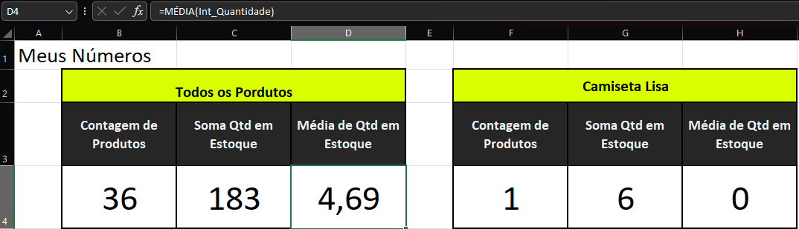
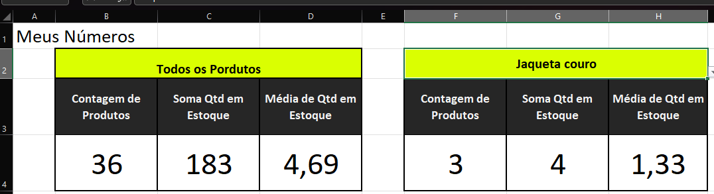
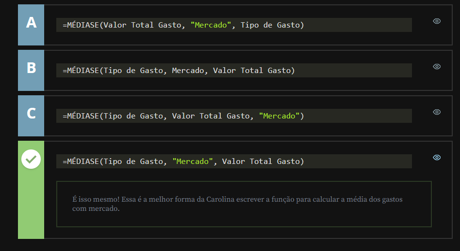

# Utilizando outras funções

## Sumário: 

- [Utilizando outras funções](#utilizando-outras-funções)
  - [Sumário:](#sumário)
  - [1. Preparando o ambiente: planilha Meteora E-commerce](#1-preparando-o-ambiente-planilha-meteora-e-commerce)
  - [2. MÉDIA() e MÉDIASE()](#2-média-e-médiase)
  - [3. Média de gastos](#3-média-de-gastos)
  - [4. Faça como eu fiz: calculando a média do produtos](#4-faça-como-eu-fiz-calculando-a-média-do-produtos)
  - [5. Conhecendo o desafio](#5-conhecendo-o-desafio)
  - [6. Desafio: refazendo as funções com a tabela produtos](#6-desafio-refazendo-as-funções-com-a-tabela-produtos)
  - [7. Projeto final do curso](#7-projeto-final-do-curso)
  - [8. O que aprendemos?](#8-o-que-aprendemos)
  - [9. Carreira em Excel](#9-carreira-em-excel)
  - [10. Conclusão](#10-conclusão)
  - [11. Créditos](#11-créditos)

## 1. Preparando o ambiente: planilha Meteora E-commerce
Para acompanhar o curso com o máximo de aproveitamento, você pode fazer o download da [planilha](db/Meteora%20Ecommerce%20-%20FINAL%20AULA%204.xlsx) que estamos trabalhando no curso.
## 2. MÉDIA() e MÉDIASE()
Para agregar a nossa planilha iremos realizar uma nova formatação e inclusão de informações, sendo elas a media geral de quantidade de produtos e a media conforme o filtro, para tal no nosso quadro de indicadores, vamos separar em 2 quadros um para os produtos gerais e outro para o nosso quadro de filtros, fazendo assim com que um dos quadrantes nos demonstre a média total, e outro do item procurado conforme filtro de lista. 
<table style="text-align: center; width: 100%;"> 
<tr>
    <td style="text-align: left;">
    
    </td>
</tr>
</table>

O código para média geral segue a sintaxe abaixo:
```text
=MÉDIA(Int_Quantidade)
```
Já para a média de utilizando filtro a sintaxe da assinatura segue o padrão abaixo:
```text
=MÉDIASE(Int_Nome_Produtos;F2;Int_Quantidade)
```
A diferença para além da quantidade de argumentos/Parâmetros, e a sua utilização, explicando o porque de cada parâmetro:
- 1º `Int_Nome_Produtos`, utilizamos esse primeiro parâmetro pois estamos _"dizendo"_ ao Excel, que queremos uma média de quantidade dos produtos então passamos quais são os produtos. 
- 2º `F2`, nesse parâmetro estamos passando uma referencia relativa do valor o qual será o produto a ser realizado a média conforme a quantidade. 
- 3º `Int_Quantidade` nesse passamos o intervalo com as quantidades de cada produto. 
<table style="text-align: center; width: 100%;"> 
<tr>
    <td style="text-align: left;">
    
    </td>
</tr>
</table>

## 3. Média de gastos
Carolina é uma estudante de economia que está analisando os gastos mensais de sua família em uma planilha do Excel. Ela deseja calcular a média dos gastos mensais que sua família teve com o mercado.

Seguindo o que aprendemos na aula, vamos ajudar a Carolina a escrever a função corretamente para realizar este cálculo?  

<table style="text-align: center; width: 100%;"> 
<tr>
    <td style="text-align: left;">
    
    </td>
</tr>
</table>

## 4. Faça como eu fiz: calculando a média do produtos  

Agora é o momento de aplicarmos o que aprendemos e colocar nossas habilidades à prova! Por isso, fica o desafio: que tal utilizar o conhecimento adquirido em aula para calcular a média da quantidade de um determinado produto em Estoque?

Com as dicas que exploramos, você é uma pessoa preparada para realizar esse cálculo de forma precisa e eficiente. Aproveite essa oportunidade para consolidar seu aprendizado e se destacar na análise de dados no Excel.

- Passo 1: O primeiro passo que devemos seguir é selecionar a célula onde vamos escrever a nossa função. Para efeitos deste exercício, vamos colocar a nossa fórmula na célula `H4`.

- Passo 2: Como queremos calcular a média com base em um critério, quantidade de um determinado produto em Estoque, vamos utilizar a função`=MÉDIASE()`.

- Passo 3: Na célula `H4` vamos inserir a função:
```text
=MÉDIASE(
```
- Passo 4: O primeiro parâmetro da função `MÉDIASE()` é o intervalo que contém o critério que queremos analisar. Neste caso, selecione o intervalo da coluna Produto na planilha de Produtos (C4:C42) e, em seguida, digite o ponto e vírgula “;” para adicionar o segundo parâmetro da função.
```text
=MÉDIASE(Produtos!C4:C42;
```
- Passo 5: O segundo parâmetro da função MÉDIASE() é o nosso critério para calcular a média, que neste caso será o nome do Produto que está na linha F2 da planilha Meus Números.
```text
=MÉDIASE(Produtos!C4:C42;F2;
```
- Passo 6: O terceiro e último parâmetro da função MÉDIASE(), é o intervalo que iremos utilizar para fazer a média, que neste caso será o intervalo da coluna Qtd (F4:F42) da planilha Produtos.
```text
=MÉDIASE(Produtos!C4:C42;F2;Produtos!F4:F42)
```
- Passo 7: Feche os parênteses e pressione o `[ENTER]` para finalizar a fórmula.

Pronto, nossa função foi criada e está pronta!!
## 5. Conhecendo o desafio
__Relembrando__  
- Evitar mesclar células quando estiver trabalhando com uma base de dados
- Aprender a trabalhar com funções (Porém não se desespere para aprender todas funções existentes)
- Conhecer as funções mais importantes
---
__Sobre o desafio__  
Realizar um cópia da planilha _"Meus Números"_, porém com base na planilha __com tabela__, refazendo as formulas aplicadas na planilha anterior, porém utilizando como base a planilha com formatação de tabela.  

>Dica: Para melhor aplicabilidade das formulas anteriormente feitas, será a aplicação referência estruturadas.
> Uma maneira para facilitar esse processo, pode ser realizando um (alias para tabela)
> - 1 Selecionar uma célula da tabela a fim de habilitar a guia Design da tabela
> - 2 Acessar agrupamento Nome tabela
> - 3 Modificar o nome para facilitar a referência 
Dentro das células que formos aplicar as funções, ao realizar o __input__ dos valores utilizar uma sintaxe conforme o exemplo abaixo:
```text
=CONT.VALORES(TB_Produtos[Produtos])
```
## 6. Desafio: refazendo as funções com a tabela produtos
Então, você é uma pessoa preparada para se desafiar à medida que aprende? A hora é agora!

Neste desafio, a sua missão é seguir o passo a passo elaborado durante a aula para refazer as funções utilizando agora as informações que estão na tabela de produtos.

Para desenvolver o Desafio, recomendamos que você baixe a [planilha](db/Meteora%20Ecommerce%20-%20FINAL%20AULA%204.xlsx) que estamos trabalhando para a Loja Meteora. Essa é uma excelente oportunidade para explorar e aplicar o seu conhecimento, colocando em prática tudo o que aprendeu. Se atente às dicas a seguir e bora lá!

__Opinião do instrutor__

Dicas para realizar o desafio:

- Passo 1: Para realizar a contagem de todos os Produtos disponíveis em estoque, você precisa utilizar a função CONT.SE(). Lembre-se de que a função CONT.SE exige que o critério esteja entre aspas.

- Passo 2: Para calcular a Soma da Qtd em Estoque, utilize a função `SOMA()`.

- Passo 3: Para calcular a Média de Qtd em Estoque, utilize a função `MÉDIA()`.

- Passo 4: Para realizar a contagem de um determinado Produto disponível em estoque, você precisa utilizar a função `CONT.SE()`.

- Passo 5: Para calcular a Soma da Qtd de um determinado produto em Estoque, utilize a função `SOMASE()`.

- Passo 6: Para calcular a Média de Qtd de um determinado produto em Estoque, utilize a função `MÉDIASE()`.

## 7. Projeto final do curso
Você pode fazer o download da [planilha final](db/Meteora%20Ecommerce%20-%20FINAL%20AULA%205%20-%20DESAFIO%20RESOLVIDO.xlsx) da loja Meteora que criamos ao longo deste curso.
## 8. O que aprendemos?
Nessa aula, você aprendeu a:
- Utilizar a função MÉDIA() do Excel.
- Utilizar a função MÉDIASE() do Excel.
- Calcular com base em critérios no Excel.
- Produzir cálculos utilizando tabelas no Excel.  
- 
## 9. Carreira em Excel
Nesse módulo contém informações/dicas de utilização do Excel, e por tal motivo não serão inclusos informações sobre o vídeo
## 10. Conclusão
__Evolução de conhecimento__
- Conhecimento de funções
- Formas diferentes de formatação
- Aumento de produtividade

## 11. Créditos

---
<table align="center" style="border-collapse: collapse; margin-left: auto; margin-right: auto;"> 
  <caption><b>Skills do projeto</b></caption>
  <tr>
    <td style="padding: 5px;">
      
    </td>
    <td style="padding: 5px;">
      
    </td>
    <td style="padding: 5px;">
      
    </td>
  </tr>
</table>


---
__Titulo:__ Utilizando outras funções
__Autor:__ Thierry Lucas Chaves  
__Data de Criação:__ 12-05-2026  
__Data de Modificação:__ 14-05-2026  
__Versão:__ "1.0"