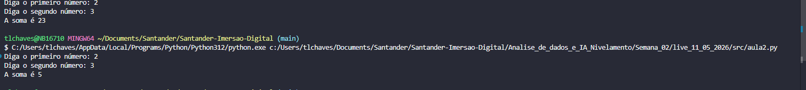

# Conteúdo Live 11/05/2026
## Introdução de Lógica de Programação II (Condicionais)

## Sumário: 

## 1. Recapitulação
### Input de dados
```py 
nome = input("Me diga seu nome: ")
print(f"olá {nome}")
```
Conforme visto em aula anterior, a diferença do print para o variáveis com inpunt's, se da principalmente pela possibilidade de reutilização dos valores contidos.

### Soma de veiáveis  
```py
primeiro_numero = input("Diga o primeiro número: ")
segundo_numero = input("Diga o segundo número: ")
print(f"A soma é {primeiro_numero + segundo_numero}")

```
Quando realizamos o processo do código acima o `Python` irá exibir como resultado das duas variáveis juntas e não sua soma, isso se da pois as duas variáveis estão tipadas como texto ou `str`, para sanar tal processo devemos realizar o cast dessas variáveis, da seguinte forma abaixo:  

```py
primeiro_numero = int(input("Diga o primeiro número: "))
segundo_numero = int(input("Diga o segundo número: "))
print(f"A soma é {primeiro_numero + segundo_numero}")

```
conforme exemplo de saída abaixo
<table style="text-align: center; width: 100%;"> 
<tr>
    <td style="text-align: left;">
    
    </td>
</tr>
</table>

> Ps: quando temos duas strings com + o python irá realizar sempre a concatenação das strings e não operações aritméticas 

## 2. Operadores Booleanos:
__O código da aula está disponível [aqui](src/aula2.py)__  

Os operadores booleanos no python são 
```text
<,>,<=,=>,==,=!
```
Quando utilizamos operadores booleanos puramente será possível somente 2 resultados, como `FALSE` ou `TRUE`

```py
a = 2
b = 3
print(f"{a} > {b} dá {a>b}")
print(f"{a} < {b} dá {a<b}")
print(f"{a} >= {b} dá {a>=b}")
print(f"{a} <= {b} dá {a<=b}")
print(f"{a} == {b} dá {a==b}")
print(f"{a} =! {b} dá {a<b}")
```

## 3. Condicional:
Um exemplo de utilização de condicional seria por exemplo a verificação de idade conforme exemplo abaixo
```py
idade = int(input("Diga a sua idade: "))
if idade < 18:
    print("Você não pode comprar bebidas alcoólicas!!! 😡🤬")
else:
    print("Você pode comprar bebidas alcoólicas!")
```
## 4 Operadores AND & OR:
Esses operadores também são classificados como operadores booleanos, ou seja retornam somente `TRUE` or `FALSE`, e isso define a grosso modo um operador booleano.
Definição de and e or
O cerne do operador `OR`, e que para ser verdadeiro somente 1 das condições necessita ser verdadeiro e no caso do `AND` é o contrário.
conforme tabela abaixo:  

__Tabela Verdade `OR`__
|       |     |       |           |
| ----- | --- | ----- | --------- |
| TRUE  | OR  | FALSE | __TRUE__  |
| FALSE | OR  | TRUE  | __TRUE__  |
| TRUE  | OR  | TRUE  | __TRUE__  |
| FALSE | OR  | FALSE | __FALSE__ |

Em termos de código essa tabela pode ser "traduzida" em código da seguinte maneira:  
```py
idoso = input("Você é idose ? (sim/não): ")
deficiente = input("Você é deficiente ? (sim/não): ")

if idoso == "sim" or deficiente == "sim":
    print("Pode estacionar!")
else:
    print("Procure outra vaga")
```
Já para o operador `AND`, ele trabalha de forma oposta do operador `OR`, ou seja ele somente retornara como `TRUE` se duas condições forem verdadeiras

__Tabela Verdade `AND`__
|       |     |       |           |
| ----- | --- | ----- | --------- |
| TRUE  | AND | FALSE | __FALSE__ |
| FALSE | AND | TRUE  | __FALSE__ |
| TRUE  | AND | TRUE  | __TRUE__  |
| FALSE | AND | FALSE | __FALSE__ |

Em termos de código essa tabela pode ser "traduzida" em código da seguinte maneira:  
```py
if idoso == "sim" and cartao == "sim":
    print("Pode estacionar!")
else:
    print("Procure outra vaga")
```
Outro exemplo de múltiplas condições :
```py
letra = input("Digite uma letra:")
if letra == "a" or letra == "e" or letra == "i" or letra == "o" or letra == "u":
    print("É vogal!")
else:
    print("Não é vogal!")
```
---
<table align="center" style="border-collapse: collapse; margin-left: auto; margin-right: auto;"> 
  <caption><b>Skills do projeto</b></caption>
  <tr>
    <td style="padding: 5px;">
      
    </td>
    <td style="padding: 5px;">
      
    </td>
    <td style="padding: 5px;">
      
    </td>
  </tr>
</table>

---
__Titulo:__ Introdução de Lógica de Programação II (Condicionais)
__Autor:__ Thierry Lucas Chaves  
__Data de Criação:__ 11-05-2026  
__Data de Modificação:__ 11-05-2026  
__Versão:__ "1.0"