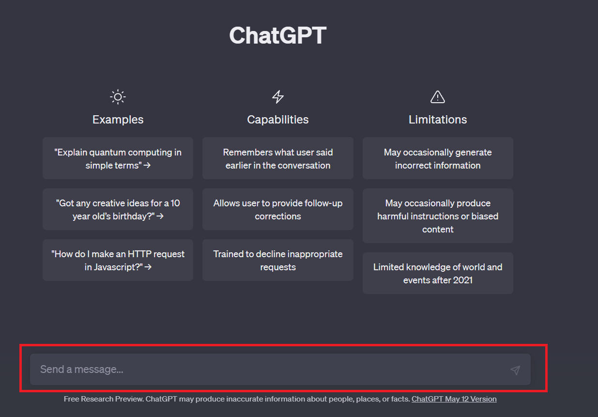

# Criando os primeiros prompts

## Sumário
- [Criando os primeiros prompts](#criando-os-primeiros-prompts)
  - [Sumário](#sumário)
  - [1. Apresentação](#1-apresentação)
  - [2. Preparando o ambiente](#2-preparando-o-ambiente)
  - [3. Para saber mais: compreendendo as limitações do ChatGPT - Por que nem sempre as respostas são precisas?](#3-para-saber-mais-compreendendo-as-limitações-do-chatgpt---por-que-nem-sempre-as-respostas-são-precisas)
  - [4. Utilizando diferentes estratégias para criar prompts](#4-utilizando-diferentes-estratégias-para-criar-prompts)
  - [5. Para saber mais: entendendo o que são tokens](#5-para-saber-mais-entendendo-o-que-são-tokens)
  - [6. Melhorando a qualidade das respostas](#6-melhorando-a-qualidade-das-respostas)
  - [7. Para saber mais: ChatGPT 3.5 vs ChatGPT 4 - Qual é a diferença?](#7-para-saber-mais-chatgpt-35-vs-chatgpt-4---qual-é-a-diferença)
  - [8. Desafio: crie um prompt com a técnica de conclusão](#8-desafio-crie-um-prompt-com-a-técnica-de-conclusão)
  - [9. O que aprendemos?](#9-o-que-aprendemos)

---

## 1. Apresentação
A ideia geral desse módulo é aprender meios de como criar prompts mais confiáveis e garantir respostas mais corretas da I.A, garantindo também a reprodutibilidade dos resultados. 
Se formos pensar em uma interação Humano x Humano, em uma conversa temos uma dialogo síncrono e um contexto da informação e por vezes em suma maioria a resposta não serão acretivas em 100% das vezes, assim também é nas interações Humano X Máquina. Então a ideia e ter um conhecimento de técnicas para que possamos aumentar a acretividade dessas iterações.

## 2. Preparando o ambiente
É importante ressaltar que este curso utilizará o ChatGPT, uma ferramenta disponível na [página da OpenAI](https://chatgpt.com/). Para começar a utilizá-la, é necessário criar uma conta na OpenAI.

Se você ainda não possui uma conta, basta clicar na opção "Sign up" (inscrever-se) na página inicial e, em seguida, escolher entre criar uma conta ou utilizar uma conta Google ou Microsoft - caso escolha a segunda opção, será necessário permitir que a OpenAI acesse suas informações.

Após efetuar o login, seguem abaixo alguns passos para começar a usar o ChatGPT:

- 1 - Digite sua primeira mensagem na caixa de texto e pressione "Enviar". Por exemplo: você pode começar com um simples "Olá" ou fazer uma pergunta.

- 2 - O ChatGPT responderá automaticamente à sua mensagem com uma resposta gerada por inteligência artificial. A partir daí, você pode continuar a conversa fazendo mais perguntas ou respondendo às perguntas do ChatGPT.

- 3 - Experimente diferentes tipos de perguntas ou tópicos para ver o que o ChatGPT é capaz de fazer. Você pode perguntar sobre um tema específico, pedir ajuda com uma tarefa ou simplesmente conversar com o ChatGPT.

Caso você deseje mudar de tópico e começar uma nova conversa a qualquer momento, basta clicar na opção "New chat"(nova conversa) no menu lateral esquerdo.

Para acompanhar este curso, é possível utilizar tanto a versão gratuita quanto a versão paga, chamada "Plus".

Agora que você já sabe como utilizar o ChatGPT, podemos começar!

## 3. Para saber mais: compreendendo as limitações do ChatGPT - Por que nem sempre as respostas são precisas?
Você já passou pela situação em que fez uma pergunta ou deu uma instrução para que o ChatGPT executasse uma tarefa, mas o resultado não foi exatamente o que você esperava?

Essa é uma situação bastante comum entre as pessoas usuárias de inteligências artificiais generativas, uma vez que nem sempre é fácil expressar com precisão o que se deseja. Além disso, você pode ter notado que pequenas alterações na formulação do que escrevemos podem levar a respostas significativamente diferentes, dificultando a obtenção de consistência nos resultados - a consistência nos resultados nos garante uma maior estabilidade nas respostas, evitando variações ou contradições significativas.

Essas perguntas ou instruções que fazemos são chamadas de prompts.

Quando abrimos o ChatGPT há uma caixinha na parte inferior da página onde está escrito “Send a message” (enviar uma mensagem):
<table style="text-align: center; width: 100%;"> 
<tr>
    <td style="text-align: left;">
    
    </td>
</tr>
</table>

É exatamente nesta caixa que nós conseguimos escrever o que queremos enviar para que uma resposta seja retornada. Então, __um prompt nada mais é do que uma instrução__ ou uma entrada fornecida a um modelo de linguagem, como o ChatGPT, para orientar sua geração de texto.

É uma forma de solicitar ao modelo que produza uma resposta ou texto relevante com base na informação fornecida. Os prompts desempenham um papel crucial na interação com o modelo, permitindo que os usuários forneçam direcionamentos específicos para as respostas que desejam obter.

Mas por que os resultados dos prompts nem sempre são bons?

Segundo, a [OpenAI o ChatGPT](https://chatgpt.com/) possui algumas limitações:

- Às vezes, o ChatGPT escreve respostas plausíveis, mas incorretas ou sem sentido. Isso ocorre porque o modelo é treinado com base em grandes quantidades de texto da internet, mas nem todas as informações nesses dados são precisas. Portanto, o modelo pode ocasionalmente produzir respostas incorretas ou inventar informações.
  - O ChatGPT também é sensível a ajustes nos prompts ou às tentativas da mesma solicitação várias vezes. Por exemplo, você pode escrever algo e o modelo pode afirmar que não sabe a resposta, mas se você fizer alguma reformulação no prompt a resposta pode vir de forma correta. Ou se você utilizar o mesmo prompt várias vezes as respostas podem não ser consistentes
  - O modelo também pode ser prolixo e usar demais certas frases. Esses problemas surgem de viéses nos dados de treinamento e problemas de super otimização.

Além disso, o ChatGPT tem limitações em sua capacidade de memória e contexto. O modelo leva em consideração apenas uma quantidade limitada de texto anterior ao gerar uma resposta. Isso significa que se a tarefa exigir informações ou referências anteriores específicas, o modelo pode não conseguir acessá-las adequadamente. Isso pode levar a respostas inconsistentes ou que parecem ignorar completamente o histórico da conversa.

Por fim, o modelo pode sofrer com problemas de viés e gerar respostas que podem ser imprecisas e tendenciosas, devido à natureza dos dados de treinamento usados e à maneira como eles foram coletados.

Por isso, é fundamental que ao utilizar o ChatGPT, sejam adotadas estratégias que maximizem o potencial do modelo e garantam resultados mais precisos e confiáveis. Neste curso, você irá aprender algumas dessas estratégias e poderá utilizá-las na sua interação com o ChatGPT para obter respostas mais adequadas e relevantes para as suas necessidades.

Vamos lá?

## 4. Utilizando diferentes estratégias para criar prompts

## 5. Para saber mais: entendendo o que são tokens

## 6. Melhorando a qualidade das respostas

## 7. Para saber mais: ChatGPT 3.5 vs ChatGPT 4 - Qual é a diferença?

## 8. Desafio: crie um prompt com a técnica de conclusão

## 9. O que aprendemos?

<!-- <table style="text-align: center; width: 100%;"> 
<tr>
    <td style="text-align: left;">
    
    </td>
</tr>
</table> -->

---

<table align="center" style="border-collapse: collapse; margin-left: auto; margin-right: auto;"> 
  <caption><b>Skills do projeto</b></caption>
  <tr>
    <td style="padding: 5px;">
      
    </td>
    <td style="padding: 5px;">
      
    </td>
  </tr>
</table>

---
__Titulo:__ Criando os primeiros prompts
__Autor:__ Thierry Lucas Chaves  
__Data de Criação:__ 17-05-2026  
__Data de Modificação:__ 17-05-2026  
__Versão:__ "1.0"