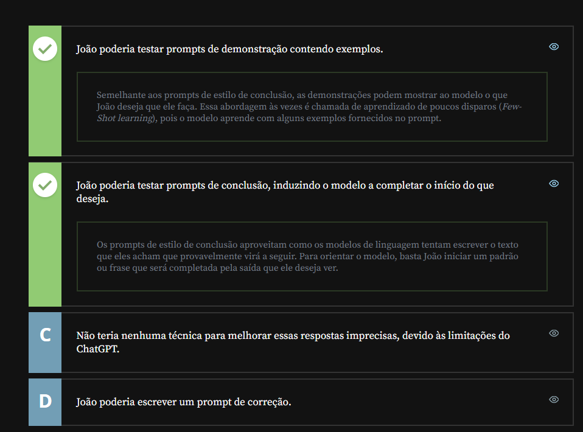
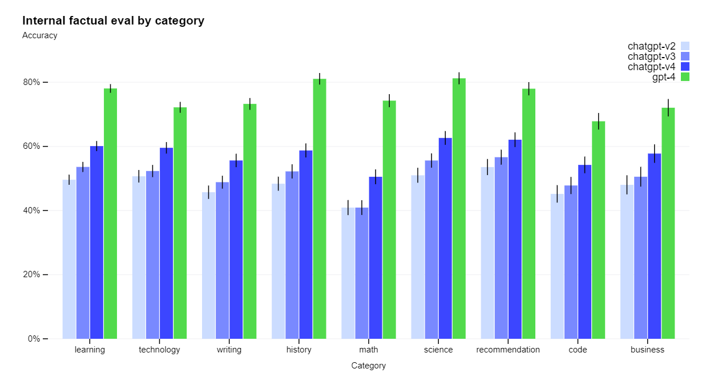
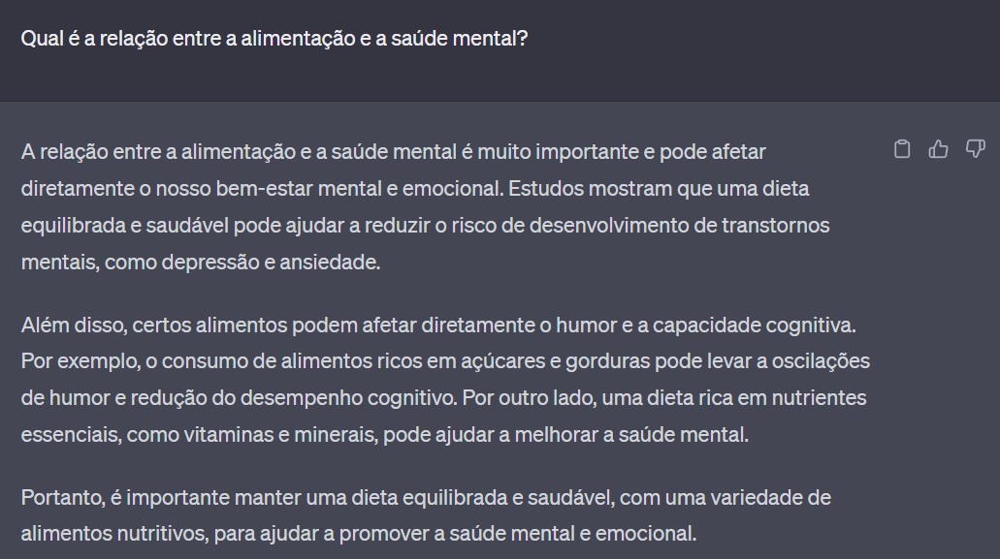
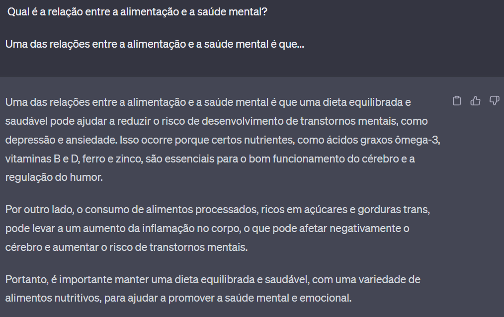

<a id="topo"></a>

# Criando os primeiros prompts

## Sumário
- [Criando os primeiros prompts](#criando-os-primeiros-prompts)
  - [Sumário](#sumário)
  - [1. Apresentação](#1-apresentação)
  - [2. Preparando o ambiente](#2-preparando-o-ambiente)
  - [3. Para saber mais: compreendendo as limitações do ChatGPT - Por que nem sempre as respostas são precisas?](#3-para-saber-mais-compreendendo-as-limitações-do-chatgpt---por-que-nem-sempre-as-respostas-são-precisas)
  - [4. Utilizando diferentes estratégias para criar prompts](#4-utilizando-diferentes-estratégias-para-criar-prompts)
  - [5. Para saber mais: entendendo o que são tokens](#5-para-saber-mais-entendendo-o-que-são-tokens)
  - [Hello World!](#hello-world)
  - [Olá Mundo!](#olá-mundo)
  - [6. Melhorando a qualidade das respostas](#6-melhorando-a-qualidade-das-respostas)
  - [7. Para saber mais: ChatGPT 3.5 vs ChatGPT 4 - Qual é a diferença?](#7-para-saber-mais-chatgpt-35-vs-chatgpt-4---qual-é-a-diferença)
  - [8. Desafio: crie um prompt com a técnica de conclusão](#8-desafio-crie-um-prompt-com-a-técnica-de-conclusão)
  - [9. O que aprendemos?](#9-o-que-aprendemos)

---

## 1. Apresentação
A ideia geral desse módulo é aprender meios de como criar prompts mais confiáveis e garantir respostas mais corretas da I.A, garantindo também a reprodutibilidade dos resultados. 
Se formos pensar em uma interação Humano x Humano, em uma conversa temos uma dialogo síncrono e um contexto da informação e por vezes em suma maioria a resposta não serão acretivas em 100% das vezes, assim também é nas interações Humano X Máquina. Então a ideia e ter um conhecimento de técnicas para que possamos aumentar a acretividade dessas iterações.

## 2. Preparando o ambiente
É importante ressaltar que este curso utilizará o ChatGPT, uma ferramenta disponível na [página da OpenAI](https://chatgpt.com/). Para começar a utilizá-la, é necessário criar uma conta na OpenAI.

Se você ainda não possui uma conta, basta clicar na opção "Sign up" (inscrever-se) na página inicial e, em seguida, escolher entre criar uma conta ou utilizar uma conta Google ou Microsoft - caso escolha a segunda opção, será necessário permitir que a OpenAI acesse suas informações.

Após efetuar o login, seguem abaixo alguns passos para começar a usar o ChatGPT:

- 1 - Digite sua primeira mensagem na caixa de texto e pressione "Enviar". Por exemplo: você pode começar com um simples "Olá" ou fazer uma pergunta.

- 2 - O ChatGPT responderá automaticamente à sua mensagem com uma resposta gerada por inteligência artificial. A partir daí, você pode continuar a conversa fazendo mais perguntas ou respondendo às perguntas do ChatGPT.

- 3 - Experimente diferentes tipos de perguntas ou tópicos para ver o que o ChatGPT é capaz de fazer. Você pode perguntar sobre um tema específico, pedir ajuda com uma tarefa ou simplesmente conversar com o ChatGPT.

Caso você deseje mudar de tópico e começar uma nova conversa a qualquer momento, basta clicar na opção "New chat"(nova conversa) no menu lateral esquerdo.

Para acompanhar este curso, é possível utilizar tanto a versão gratuita quanto a versão paga, chamada "Plus".

Agora que você já sabe como utilizar o ChatGPT, podemos começar!

## 3. Para saber mais: compreendendo as limitações do ChatGPT - Por que nem sempre as respostas são precisas?
Você já passou pela situação em que fez uma pergunta ou deu uma instrução para que o ChatGPT executasse uma tarefa, mas o resultado não foi exatamente o que você esperava?

Essa é uma situação bastante comum entre as pessoas usuárias de inteligências artificiais generativas, uma vez que nem sempre é fácil expressar com precisão o que se deseja. Além disso, você pode ter notado que pequenas alterações na formulação do que escrevemos podem levar a respostas significativamente diferentes, dificultando a obtenção de consistência nos resultados - a consistência nos resultados nos garante uma maior estabilidade nas respostas, evitando variações ou contradições significativas.

Essas perguntas ou instruções que fazemos são chamadas de prompts.

Quando abrimos o ChatGPT há uma caixinha na parte inferior da página onde está escrito “Send a message” (enviar uma mensagem):
<table style="text-align: center; width: 100%;"> 
<tr>
    <td style="text-align: left;">
    
    </td>
</tr>
</table>

É exatamente nesta caixa que nós conseguimos escrever o que queremos enviar para que uma resposta seja retornada. Então, __um prompt nada mais é do que uma instrução__ ou uma entrada fornecida a um modelo de linguagem, como o ChatGPT, para orientar sua geração de texto.

É uma forma de solicitar ao modelo que produza uma resposta ou texto relevante com base na informação fornecida. Os prompts desempenham um papel crucial na interação com o modelo, permitindo que os usuários forneçam direcionamentos específicos para as respostas que desejam obter.

Mas por que os resultados dos prompts nem sempre são bons?

Segundo, a [OpenAI o ChatGPT](https://chatgpt.com/) possui algumas limitações:

- Às vezes, o ChatGPT escreve respostas plausíveis, mas incorretas ou sem sentido. Isso ocorre porque o modelo é treinado com base em grandes quantidades de texto da internet, mas nem todas as informações nesses dados são precisas. Portanto, o modelo pode ocasionalmente produzir respostas incorretas ou inventar informações.
  - O ChatGPT também é sensível a ajustes nos prompts ou às tentativas da mesma solicitação várias vezes. Por exemplo, você pode escrever algo e o modelo pode afirmar que não sabe a resposta, mas se você fizer alguma reformulação no prompt a resposta pode vir de forma correta. Ou se você utilizar o mesmo prompt várias vezes as respostas podem não ser consistentes
  - O modelo também pode ser prolixo e usar demais certas frases. Esses problemas surgem de viéses nos dados de treinamento e problemas de super otimização.

Além disso, o ChatGPT tem limitações em sua capacidade de memória e contexto. O modelo leva em consideração apenas uma quantidade limitada de texto anterior ao gerar uma resposta. Isso significa que se a tarefa exigir informações ou referências anteriores específicas, o modelo pode não conseguir acessá-las adequadamente. Isso pode levar a respostas inconsistentes ou que parecem ignorar completamente o histórico da conversa.

Por fim, o modelo pode sofrer com problemas de viés e gerar respostas que podem ser imprecisas e tendenciosas, devido à natureza dos dados de treinamento usados e à maneira como eles foram coletados.

Por isso, é fundamental que ao utilizar o ChatGPT, sejam adotadas estratégias que maximizem o potencial do modelo e garantam resultados mais precisos e confiáveis. Neste curso, você irá aprender algumas dessas estratégias e poderá utilizá-las na sua interação com o ChatGPT para obter respostas mais adequadas e relevantes para as suas necessidades.

Vamos lá?

## 4. Utilizando diferentes estratégias para criar prompts
A ideia  inicial do video é criar um anuncio de promoção de natal, para isso iremos realizar a digitação do seguinte prompt:
```text
Quero fazer o anúncio de novo preço para uma promoção de natal para assinatura de plano mensal de cesta básica. O novo valor da promoção vale para 12 meses de assinatura de 40kg por R$:30.00
```
Um dica passada e que para melhorar a saída das respostas, podemos por exemplo apenas adicionar algo como 
```text
Natal é uma época de..
```
Porém com um prompt tão vago dessa maneira as respostas podem variar, e esse não é o objetivo, temos como o objetivo melhorar a comunicação entre usuário e máquina, sendo assim criar técnica de reprodutibilidade.

Outra questão sobre a criação de prompts foi mencionado levemente sobre a questão de exemplos já foi visto na [aula anterior](https://github.com/thierryLchaves/Santander-Imersao-Digital/blob/735b0aad338ca834988738a67a1a24d01c461caa/Analise_de_dados_e_IA_Nivelamento/Semana_02/Engenharia_de_Prompt_criando_prompts_eficazes_para_IA_Generativa/03_Few-Shot_Prompt/FewShotPrompt.md). 
Ou seja as estratégias vistas são 
- 1 "Eu quero, eu preciso, me dê"
- 2 Conclusão: "Eu quero um curso de Python"
- 3 Demonstração de exemplos (FEW SHOTS)

## 5. Para saber mais: entendendo o que são tokens
Já deu pra notar que projetar seu prompt é essencialmente como você “programa” o modelo, geralmente fornecendo algumas instruções ou alguns exemplos. Mas como esse modelo funciona? Como ele sabe o que vai nos responder?

Os modelos entendem e processam o texto dividindo-o em tokens. Um token pode ser uma palavra individual, um caractere, ou até mesmo uma parte de uma palavra. Por exemplo, a frase “Hello World!” teria os seguintes tokens:

Hello World!
---

Temos 3 tokens:
- Hello,
- world e;
- um token para o sinal de exclamação.
Enquanto isso, essa mesma frase em português, seria dividida da seguinte forma:

Olá Mundo!
---

Nesse caso temos 5 tokens:

- Ol,
- á,
- mund,
- o e;
- um token para o sinal de exclamação.
Com isso, é possível verificar que dependendo do idioma o processo de tokenização divide as palavras de forma diferente.
> Se você tiver curiosidade em checar como um texto se traduz em tokens, existe uma ferramenta da OpenAI chamada [tokenizer](https://platform.openai.com/tokenizer).

O modelo do ChatGPT atribui um valor de representação a cada token, capturando informações contextuais e semânticas. Essas informações semânticas referem-se ao significado e à interpretação das palavras, frases ou sentenças em um contexto específico.
> semântica está relacionada ao estudo do significado das palavras e como elas se combinam para formar ideias e expressões mais complexas.

No contexto do processamento de linguagem natural, as informações semânticas são usadas para capturar o significado e a intenção subjacentes a uma sequência de palavras. Ao entender as informações semânticas, um modelo de linguagem como o ChatGPT pode inferir o contexto e responder de maneira mais precisa.

Então, os tokens de entrada são passados sequencialmente pelo modelo, permitindo que ele analise o contexto anterior para gerar previsões sobre o próximo token.

É importante mencionar que o número de tokens de entrada é limitado para garantir o bom desempenho do modelo e controlar os custos computacionais. Se um prompt exceder o limite de tokens permitido, será necessário reduzi-lo ou dividir em partes para se adequar ao limite.

## 6. Melhorando a qualidade das respostas
João é um estudante universitário que está usando o ChatGPT para ajudá-lo com seus trabalhos acadêmicos. Ele percebeu que às vezes tem dificuldade em obter respostas precisas do modelo e decidiu tentar usar algumas técnicas para obter resultados melhores.

Escolha as alternativas que mostram algo que seria útil para ajudar o ChatGPT a entender melhor o que João está procurando?
<table style="text-align: center; width: 100%;"> 
<tr>
    <td style="text-align: left;">
    
    </td>
</tr>
</table>

## 7. Para saber mais: ChatGPT 3.5 vs ChatGPT 4 - Qual é a diferença?
Nos vídeos anteriores nós testamos alguns prompts em duas versões do ChatGPT: versão 3.5 e 4.

Foi possível notar que os resultados são diferentes para cada uma das versões e que as respostas geradas pela versão 4 são lentas quando comparadas a versão anterior. Como a versão 4 é mais complexa que sua versão anterior, o tempo de resposta para gerar as respostas pode ser significativamente maior. Isso significa que, embora as respostas geradas pela versão 4 sejam mais precisas e relevantes, elas podem levar mais tempo para serem geradas do que as respostas da versão 3.5.

E qual é a diferença entre as versões? O que mudou na versão 4?

Segundo a OpenAI o GPT-4, lançado em março de 2023, é o sistema mais avançado da OpenAI até o momento, produzindo respostas mais seguras e úteis. Porém, essa versão até o momento só está disponível na opção de assinatura mensal chamada Plus.

Além das respostas mais seguras, a empresa diz que o GPT-4 está mais criativo e colaborativo do que nunca. Ele pode gerar, editar e interagir com os usuários em tarefas de redação criativa e técnica, como compor músicas, escrever roteiros ou aprender o estilo de escrita de um usuário.

Além disso, o GPT-4 é um grande modelo multimodal (aceitando entradas de imagem e texto, emitindo saídas de texto) que, embora menos capaz que os humanos em muitos cenários do mundo real, exibe desempenho de nível humano em vários benchmarks profissionais e acadêmicos.

É importante mencionar que a OpenAI dedicou seis meses para aprimorar a segurança e alinhamento do GPT-4, conforme informado pela própria empresa. As avaliações internas da empresa mostram que o GPT-4 tem 82% menos probabilidade de responder a solicitações de conteúdo proibido e 40% mais chances de produzir respostas corretas do que o GPT-3.5.

Apesar de suas capacidades, o GPT-4 tem limitações semelhantes aos modelos GPT anteriores. Mais importante, ainda não é totalmente confiável (ele “alucina” fatos e comete erros de raciocínio). Porém, embora ainda seja um problema real, o GPT-4 reduz significativamente as alucinações, em relação aos modelos anteriores. Alucinações, nesse contexto, se referem à geração de respostas que aparentam ser verdadeiras, mas que podem ser falsas ou com pouca confiabilidade.

Na figura a seguir, temos a acurácia do ChatGPT em nove categorias:
- aprendizagem
- tecnologia
- escrita
- história
- matemática
- ciências
- recomendação
- código
- negócios

O GPT-4 (em verde) foi comparado com as três primeiras versões do ChatGPT, mostrando que há ganhos significativos em todos os tópicos.
<table style="text-align: center; width: 100%;"> 
<tr>
    <td style="text-align: left;">
    
    </td>
</tr>
</table>

O modelo básico GPT-4, assim como os modelos anteriores da série GPT, foi criado para prever a próxima palavra em um documento e treinado com base em dados disponíveis publicamente, bem como dados licenciados pela OpenAI. Esses dados de treinamento incluem várias soluções corretas e incorretas para problemas matemáticos, raciocínios fracos e fortes, afirmações auto contraditórias e consistentes, representando uma ampla variedade de ideologias e ideias.

É importante ressaltar que quando uma pessoa usuária faz uma pergunta, o modelo básico pode fornecer várias respostas que podem estar um pouco distantes da intenção original da pessoa. No entanto, a versão 4 do ChatGPT apresenta respostas mais precisas e relevantes do que a versão 3.5, embora possa ter um tempo de resposta mais lento devido à sua maior complexidade.

Se você quiser se aprofundar mais no assunto, acesse as seguintes páginas:
- [Research: GTP-4](https://openai.com/pt-BR/index/gpt-4-research/)
- [GPT-4 Technical Report](https://arxiv.org/abs/2303.08774)

## 8. Desafio: crie um prompt com a técnica de conclusão
Você está trabalhando em um projeto de pesquisa e precisa utilizar o ChatGPT para gerar respostas relevantes para perguntas específicas. No entanto, o modelo não está fornecendo respostas completas e precisas para as perguntas.

Seu desafio é criar prompts de conclusão para ajudar o modelo a gerar respostas precisas e completas para as perguntas de pesquisa.

Crie pelo menos duas prompts que iniciem a resposta para as perguntas de pesquisa, de forma a ajudar o modelo a completar a resposta de forma precisa e relevante.

Compare a resposta com e sem a conclusão e reflita qual resposta foi mais interessante.  

__Opinião do instrutor__
Aqui temos um exemplo de prompt de conclusão, onde a pergunta de pesquisa testada foi a seguinte:
```text
Qual é a relação entre a alimentação e a saúde mental?
```
Como resultado, obtivemos a seguinte resposta:
<table style="text-align: center; width: 100%;"> 
<tr>
    <td style="text-align: left;">
    
    </td>
</tr>
</table>
Por outro lado, adicionando a estratégia de conclusão o prompt criado foi o seguinte

```text
Qual é a relação entre a alimentação e a saúde mental?

Uma das relações entre a alimentação e a saúde mental é que...
```
Neste caso, o resultado foi o seguinte:

<table style="text-align: center; width: 100%;"> 
<tr>
    <td style="text-align: left;">
    
    </td>
</tr>
</table>

Note que com o prompt de conclusão, o ChatGPT retornou uma resposta com maior riqueza de informações no primeiro parágrafo.

## 9. O que aprendemos?

Nessa aula, você aprendeu a:
- Criar prompts de instrução;
- Criar e identificar o que são prompts de conclusão;
- Criar prompts de explicação.

---

<table align="center" style="border-collapse: collapse; margin-left: auto; margin-right: auto;"> 
  <caption><b>Skills do projeto</b></caption>
  <tr>
    <td style="padding: 5px;">
      
    </td>
    <td style="padding: 5px;">
      
    </td>
  </tr>
</table>


---
__Titulo:__ Criando os primeiros prompts
__Autor:__ Thierry Lucas Chaves  
__Data de Criação:__ 17-05-2026  
__Data de Modificação:__ 21-05-2026  
__Versão:__ "1.0"