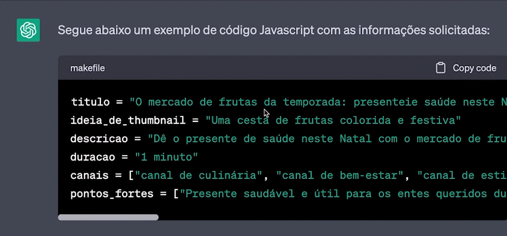
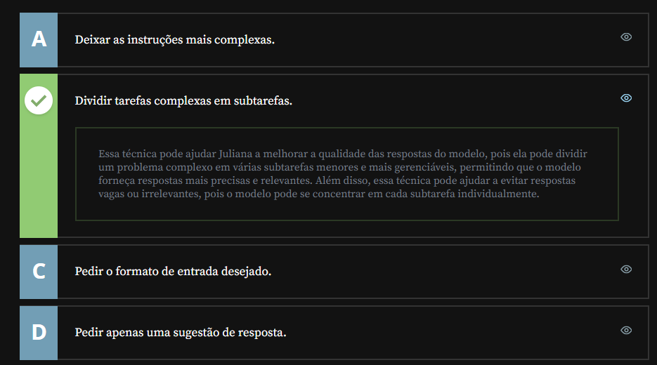
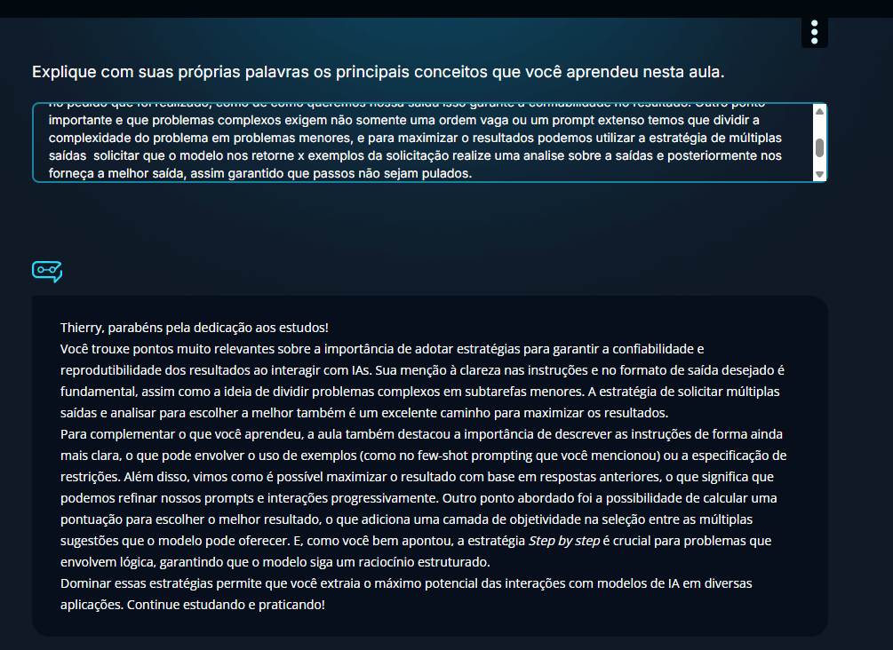

<a id="topo"></a>

# Melhorando a confiabilidade dos resultados

## Sumário
- [Melhorando a confiabilidade dos resultados](#melhorando-a-confiabilidade-dos-resultados)
  - [Sumário](#sumário)
  - [1. Dividindo tarefas complexas em subtarefas mais simples](#1-dividindo-tarefas-complexas-em-subtarefas-mais-simples)
  - [2. Aprendendo a dar instruções mais claras](#2-aprendendo-a-dar-instruções-mais-claras)
  - [3. Para saber mais: boas práticas na escrita de prompts](#3-para-saber-mais-boas-práticas-na-escrita-de-prompts)
  - [4. Maximizando o potencial dos resultados](#4-maximizando-o-potencial-dos-resultados)
  - [5. Utilizando boas práticas na criação de prompts](#5-utilizando-boas-práticas-na-criação-de-prompts)
  - [6. Utilizando a estratégia Step by step](#6-utilizando-a-estratégia-step-by-step)
  - [7. Desafio: resolvendo um problema de lógica](#7-desafio-resolvendo-um-problema-de-lógica)
  - [8. Queremos ouvir você!](#8-queremos-ouvir-você)
  - [9. O que aprendemos?](#9-o-que-aprendemos)

---

## 1. Dividindo tarefas complexas em subtarefas mais simples
No inicio da aula nos foi dado a ideia de criar o seguinte prompt:
```text
Estou lançando uma campanha nova de natal para um produto na nossa plataforma de assinatura de supermercado, "o mercado de frutas da temporada! no YouTube. Sugira tudo que eu preciso para criar uma ótima campanha. 
```
dando seguimento no que vimos na [aula anterior](https://github.com/thierryLchaves/Santander-Imersao-Digital/blob/66af86f44bf2034f4e26185f0dcb98185c3b42ff/Analise_de_dados_e_IA_Nivelamento/Semana_03/ChatGPT_otimizando_a_qualidade_dos_resultados/01_Criando_os_primeiros_prompts/CriandoOsPrimeirosPrompts.md), no que diz respeito ao exemplo de campanha de marketing para o natal, porém em nosso exemplo cima, realizamos uma complexificação maior do pedido, porém com esse prompt acima temos algo muito amplo e como nas LLM'S se baseiam em uma amostragem geral do que está disponível na internet, ela pode nos retornar algo dentro dessa média, ou algumas informações de como criar tal campanha de marketing.
Então como podemos melhorar a resposta obtida ? Iremos modificar prompt para o seguinte:
```text
Estou lançando uma campanha nova de natal para um produto na nossa plataforma de assinatura de supermercado, "o mercado de frutas da temporada! no YouTube.
O vídeo no YouTube precisa do título, descrição, ideia de Thumbmail e texto no Thumbmail. Sugira a duração em minutos e em quais canais posso fazer parceria para divulgar a campanha. Descreva também os pontos fortes dessa campanha.
```
Em termos gerais esse novo prompt contem a ideia de descrição item por item sobre o que queremos, o que garante assim melhor resultado. Para além da melhor descrição do pedido feito para a I.A, a __Estratégia__ e "quebrar" uma demanda em pequenas tarefas.
Outra estratégia para reprodutibilidade é realizar expressamente o tipo de saída, deixando nossa saída da seguinte forma:  
```text
Estou lançando uma campanha nova de natal para um produto na nossa plataforma de assinatura de supermercado, "o mercado de frutas da temporada! no YouTube.
O vídeo no YouTube precisa do título, descrição, ideia de Thumbmail e texto no Thumbmail. Sugira a duração em minutos e em quais canais posso fazer parceria para divulgar a campanha. Descreva também os pontos fortes dessa campanha.
Devolva o resultado em código JavaScript:

titulo="
ideia_de_Thumbmail=""
descricao=""
duracao=""
canais=[]
pontos_fortes=[]
```

Deixando nossa saída similar a imagem :
<table style="text-align: center; width: 100%;"> 
<tr>
    <td style="text-align: left;">
    
    </td>
</tr>
</table>


## 2. Aprendendo a dar instruções mais claras
Conforme já dito anteriormente, sobre instruções claras para o GPT, trata-se também de ser mais explicito e enfático no tipo de retorno, no ultimo prompt visualizado, para além da saída sugerida exemplificada é possível que o `GPT` nos retorne alguma explicação do que fora feito, porém como o cerne da ideia seria automatizar as saídas, devemos ser enânticos no tipo de retorno, podemos deixar nosso prompt até então trabalhado da seguinte forma: 
```text
```text
Estou lançando uma campanha nova de natal para um produto na nossa plataforma de assinatura de supermercado, "o mercado de frutas da temporada! no YouTube.
O vídeo no YouTube precisa do título, descrição, ideia de Thumbmail e texto no Thumbmail. Sugira a duração em minutos e em quais canais posso fazer parceria para divulgar a campanha. Descreva também os pontos fortes dessa campanha.
Devolva o resultado em código JavaScript. Retorne SOMENTE o código a segui, mais nada:
```titulo="
ideia_de_Thumbmail=""
descricao=""
duracao=""
canais=[]
pontos_fortes=[]```
```
Como estamos lidando diretamente com a interface do `GPT` para realizar uma especie de automatização de resultado, uma saída seria ao final do prompt solicitar que o resultado seja devolvido X vezes, isso é necessário pois conforme já descrito em outras aulas, o modelo de cobrança é realizado por Tokens, e uma vez que realizamos o reenvio da mesma solicitação várias vezes ou reenviamos o mesmo prompt várias vezes seria o equivalente ao imputar a quantidade de vezes aquele mesmo bloco de `Tokens` já quando solicitamos no final do prompt que o chat nos retorne a quantidade __X__ de resposta seria adicionado ao custo somente a cobrança por aqueles tokens extra da solicitação.


## 3. Para saber mais: boas práticas na escrita de prompts
Existem algumas dicas de boas práticas que podem te ajudar a melhorar a escrita dos prompts para o ChatGPT. Aqui estão algumas delas:

Use delimitadores para indicar claramente partes distintas do prompt:
Os delimitadores podem ajudar a escrever prompts melhores no ChatGPT, porque fornecem uma estrutura clara para o modelo entender o que está sendo solicitado e gerar respostas mais precisas e relevantes.

O seguintes delimitadores normalmente são utilizados:

1) """ (três aspas duplas): O uso de três aspas duplas é comum em várias linguagens de programação e serve para indicar um texto que não deve ser processado ou interpretado. No ChatGPT, isso pode ser usado para separar o texto da instrução. Isso ajuda a deixar a intenção da pergunta ou tópico mais clara para o modelo, facilitando a geração de uma resposta.  
__Exemplo:__
```text
Dê um título para o texto abaixo:

Texto:

“””Python é uma linguagem de propósito geral de alto nível, multiparadigma, suporta o paradigma orientado a objetos, imperativo, funcional e procedural. Possui tipagem dinâmica e uma de suas principais características é permitir a fácil leitura do código e exigir poucas linhas de código se comparado ao mesmo programa em outras linguagens. “””

Título:
```
2) ``(três crases): As três crases são usadas para indicar que o conteúdo entre elas é tratado como um bloco de código.  
__Exemplo__:
```text
  Explique o código abaixo:

for i in range(5):
   print(i)
```
3) _____ (sublinhados): Os sublinhados podem ser usados para gerar um resultado no formato de formulário. Isso é interessante, caso você queira automatizar o resultado de um prompt e não deseja que o resultado seja em código, apenas em texto.

A seguir temos um prompt que utiliza esse recurso:
```text
Estou lançando uma campanha de dia das mães de um kit de beleza. O vídeo no youtube precisa de título, descrição, ideia de thumbnail e texto de thumbnail. Sugira a duração em minutos e em quais canais posso fazer parceria para divulgar a campanha. Descreva também os pontos fortes dela. Devolva o resultado no formato abaixo:
Título: _____
Descrição: _____
Ideia de thumbnail: _____
Texto de thumbnail: _____
Duração: _____
Canais: _____, _____,_____
Pontos fortes: _____,_____,_____
```
- Use acentos e caracteres especiais:
  - Se você escrever os prompts em português é interessante usar acentos ou caracteres especiais. Isso pode ajudar o modelo a entender melhor aquilo que você está solicitando.
- Use sinais de pontuação:
  - É legal usar sinais de pontuação:vírgulas, interrogações e pontos finais, para separar as cláusulas e tornar o prompt mais fácil de ler e entender.
  Por exemplo, "Qual é a diferença entre as linguagens Python e R?" É mais fácil de entender do que "Qual é a diferença entre as linguagens Python e R".
- Use citações:
  - Use aspas para citar trechos de texto relevantes em seu prompt, especialmente se estiver fazendo uma pergunta baseada em uma citação de um texto. Por exemplo:
  - >Sobre o que é o livro "Storytelling com Dados" da autora Cole Nussbaumer Knaflic?
  
- Tenha clareza e especificidade: 
  -  Ao escrever um prompt, é importante ser claro(a) e específico(a) sobre o que você deseja que o ChatGPT faça. Isso ajuda o modelo a entender  exatamente o que você está pedindo e a gerar uma resposta mais precisa. Por isso, é importante evitar usar termos vagos ou ambíguos que possam confundir o modelo.
  Por exemplo, em vez de escrever "Me dê informações sobre Python", tente escrever "Como é a sintaxe da linguagem de programação Python?".
- Forneça contexto:  
  - Fornecer informações adicionais ou contexto relevante para o ChatGPT pode ajudar o modelo a entender melhor a pergunta e gerar uma resposta mais precisa. Se você estiver fazendo uma pergunta sobre um tópico específico, você pode fornecer algumas informações básicas sobre esse tópico no prompt.
  Por exemplo, se você estiver fazendo uma pergunta sobre um erro em um código Python, forneça alguns detalhes básicos sobre o que é aquele código.
- Evite perguntas complexas:
  - Evite fazer perguntas complexas ou que exijam respostas detalhadas. O ChatGPT funciona melhor quando recebe perguntas simples e diretas. Por isso, tente dividir perguntas complexas em perguntas menores e mais simples.

Lembre-se de que essas são apenas algumas dicas e que a escrita dos prompts pode variar dependendo do contexto da pergunta. Tente usar essas dicas como um guia geral para melhorar a qualidade das suas interações com o ChatGPT!

## 4. Maximizando o potencial dos resultados
Assim como realizamos na vida real em interações humanas, quando temos opiniões de diferentes pessoas para basear nossa resposta, ou ainda para extrairmos quais pontos de cada opinião recebida é a melhor, podemos realizar o mesmo processo no chat, no exemplo anterior de N respostas no mesmo prompt, podemos ao finalizar esse processo enviar uma nova mensagem, com os seguintes dizeres:  
```text
Crie um anúncio novo baseado nos anteriores, que máxima o potencial dos resultados.
```
Outra dica sobre tais interações com esses modelos é __Evite pular passos__, pois ao realizar esses atalhos podemos ter respostas menos confiáveis, ou piores.
Ou seja no nosso prompt anterior solicitamos ao modelo que criasse um novo modelo de resposta, porém não temos explicitamente qual critério que fora aplicado para tal geração, sendo assim ao invés de solicitar algo amplo conforme descrito, podemos solicitar que primeiro ele analise o resultado das saídas, e depois solicitar a decisão final. Modificando nosso prompt anterior podemos reescreve-lo da seguinte forma:
```text
Analise os ponto em comum entre elas e suas diferenças. 
Descreva tais ponto em comum e diferenças.
Descreva com pontos positivos ou negativos de cada uma delas separadamente.
Dê uma nota entre -100% e +100% como um "potencializador" da campanha. Isto é, o quanto este ponto influencia no resultado final da campanha.
```
Pós o resultado da analise, podemos inserir um novo prompt como por exemplo:
```text
Com base nessas pontuações, crie um novo anúncio, baseado nessas conclusões que segue a mesmas regras de antes  maximizando a pontuação.
```
## 5. Utilizando boas práticas na criação de prompts
Juliana é Engenheira de Dados em uma empresa de tecnologia e está criando prompts no ChatGPT para ajudar ela e o seu time a resolver problemas complexos de programação. Juliana quer saber qual técnica pode ajudá-la a melhorar a qualidade das respostas do modelo.

Qual das seguintes técnicas pode ajudar Juliana a melhorar a qualidade das respostas do modelo do ChatGPT?
<table style="text-align: center; width: 100%;"> 
<tr>
    <td style="text-align: left;">
    
    </td>
</tr>
</table>

## 6. Utilizando a estratégia Step by step
Nesse tópico iremos trabalhar com exemplos lógicos matemáticos.
Em um novo chat iremos realizar o seguinte prompt
```text
Esse ano a receita da empresa cresceu 20% mas o lucro(o EBITDA) caiu 10%. O que aconteceu?
```
Podemos realizar esse mesmo prompt com a adição da seguinte frase:
```text
Let's think step by step.
```
A frase em questão, foi adicionada pois nos _papers_ de comparação de desempenho do chat que obtiveram melhores resultados foram os que utilizaram essa frase.

Revisando o que essa estrategia diz
- 1) Descreva a situação do problema;
- 2) Obtenha a resposta passo a passo;
- 3) Análise de cada uma das hipóteses.

## 7. Desafio: resolvendo um problema de lógica
Giovanna estava pensando em investir R$ 6.500,00 em uma aplicação de renda fixa que oferecia uma taxa de juros simples de 1% ao mês, por um período de 12 meses. Antes de realizar o investimento, ela deseja ter uma ideia sobre o valor final, incluindo o valor dos juros, para decidir se o retorno será suficiente para cobrir suas despesas planejadas de fim de ano. Para obter essa informação, ela criou um prompt no ChatGPT e deseja saber como é calculada a fórmula de juros simples, quais variáveis estão envolvidas nessa situação, qual é o valor dos juros e qual será o valor final do investimento.

Seu desafio é criar um prompt que traga todas essas informações.  

__Opinião do instrutor__
Um exemplo de prompt que poderia ser criada para obter as informações que Giovanna precisa é o seguinte:
```text 
Giovanna fez uma aplicação de R$6500,00 a uma taxa de juros simples de 1% a.m por 12 meses. Qual foi o montante dessa aplicação ao final do tempo previsto?

- Explique a fórmula dos juros simples
- Identifique as variáveis do problema separado por três aspas: """"Giovanna fez uma aplicação de R$6500,00 a uma taxa de juros simples de 1% a.m - por 12 meses. Qual foi o montante dessa aplicação ao final do tempo previsto?""""
- Calcule o valor dos juros
- Calcule o montante final
```

## 8. Queremos ouvir você!
Sua opinião é muito importante para nós! Deixe seu feedback sobre o curso.


## 9. O que aprendemos?

<table style="text-align: center; width: 100%;"> 
<tr>
    <td style="text-align: left;">
    
    </td>
</tr>
</table>

---

<table align="center" style="border-collapse: collapse; margin-left: auto; margin-right: auto;"> 
  <caption><b>Skills do projeto</b></caption>
  <tr>
    <td style="padding: 5px;">
      
    </td>
    <td style="padding: 5px;">
      
    </td>
  </tr>
</table>


---
__Titulo:__ Melhorando a confiabilidade dos resultados
__Autor:__ Thierry Lucas Chaves  
__Data de Criação:__ 17-05-2026  
__Data de Modificação:__ 22-05-2026  
__Versão:__ "1.0"