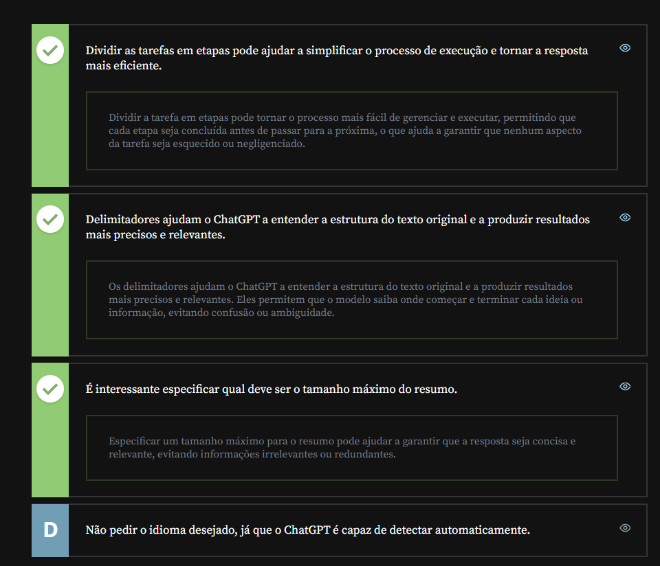
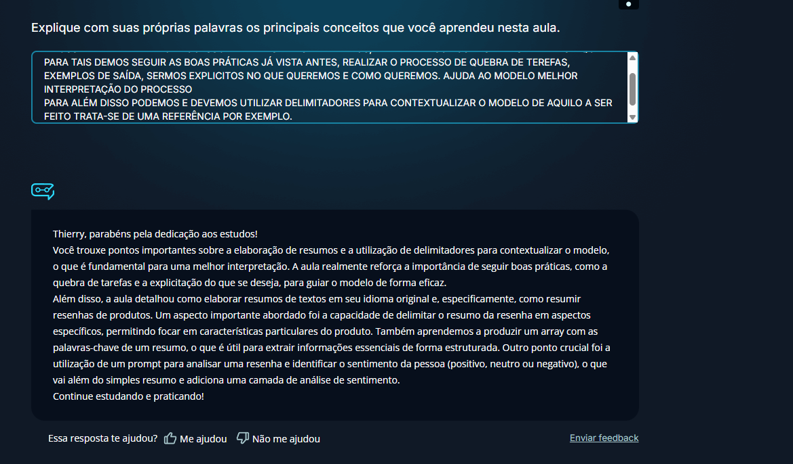

<a id="topo"></a>

# Explorando a aplicações

## Sumário
- [Explorando a aplicações](#explorando-a-aplicações)
  - [Sumário](#sumário)
  - [1. Sintetizando textos na linguagem correta: aprenda boas práticas](#1-sintetizando-textos-na-linguagem-correta-aprenda-boas-práticas)
  - [2. Aprendendo a sintetizar resenhas de produto](#2-aprendendo-a-sintetizar-resenhas-de-produto)
  - [3. Traduzindo e sintetizando textos de forma eficiente](#3-traduzindo-e-sintetizando-textos-de-forma-eficiente)
  - [4. Criando prompts para analisar sentimentos](#4-criando-prompts-para-analisar-sentimentos)
  - [5. Para saber mais: Prompts - Diversas aplicações](#5-para-saber-mais-prompts---diversas-aplicações)
  - [6. Desafio: analisando sentimentos em várias resenhas](#6-desafio-analisando-sentimentos-em-várias-resenhas)
  - [7. O que aprendemos?](#7-o-que-aprendemos)

---

## 1. Sintetizando textos na linguagem correta: aprenda boas práticas
Resumindo texto, uma das utilizações possíveis com as IA's são a de resumo de conteúdo textual, para tal podemos utilizar um prompt conforme o seguinte. 
```text
Resuma o texto. O resumo deve ter uma frase:
Texto:
''' 
'''
Resumo:
```
Aqui é necessário as mesmas estrategias  já vista anteriormente, como de exemplos, step by step, few-shot etc..
porém como o modelo se baseia em probabilística, quando quisermos utilizar a mudança idiomática de um processo, podemos realizar por exemplo um few-shot  de proximidade, modificando o pro o prompt anterior para o seguinte:  
```text
Primeiro identifique qual é o idioma do texto original. 
Depois, resuma o texto usando o idioma identificado. O resumo deve ter uma frase:
Texto:
''' 
'''
Idioma:XXXXX
Resumo EM XXXXX:
```
## 2. Aprendendo a sintetizar resenhas de produto
Assim como realizado anteriormente podemos aplicar o mesmo processo, porém para além de solicitar um resumo propriamente dito podemos expressar que o resumo em sí deve ser delimitado a X caracteres por exemplo.
Podemos seguir um prompt conforme o exemplo abaixo:  
```text
Sua tarefa é gerar um resumo dessa resenha de produto. Resuma a resenha abaixo, delimitada por aspas, com no máximo 30 palavras, focando qualquer aspeto ruim:
""" text"""
Resumo:---
```

## 3. Traduzindo e sintetizando textos de forma eficiente
Uma empresa está buscando expandir seus negócios para outros países. Para isso, precisa entender o que seus clientes em potencial estão dizendo em seus sites e redes sociais. No entanto, muitos desses sites e redes estão em idiomas europeus. Como essa empresa poderia utilizar o ChatGPT para traduzir e sumarizar esses textos de forma eficiente?

Selecione as três alternativas corretas sobre a criação do prompt:
<table style="text-align: center; width: 100%;"> 
<tr>
    <td style="text-align: left;">
    
    </td>
</tr>
</table>

## 4. Criando prompts para analisar sentimentos
assim como fizemos com o processo do resumo podemos solicitar analise de sentimentos também utilizando as dicas e boas práticas vistas anteriormente, Exemplo:  
```text
Qual é  o sentimento da seguinte resenha de produto, que está delimitada por aspas:
Dê a resposta com uma única palavra: "Positivo","Negativo","Neutro" ou "Misto"
"""
texto
"""
Sentimento:
```

## 5. Para saber mais: Prompts - Diversas aplicações
Podemos escrever prompts para diversas finalidades, tanto para nosso dia-a-dia quanto no ambiente de trabalho. Nos vídeos anteriores utilizamos prompts para resumo de textos, tradução e até mesmo para analisar os sentimentos de pessoas que compraram um produto. Vamos explorar mais algumas possibilidades?  
__Transformando o tom de voz__
Vanessa é uma influenciadora digital que compartilha dicas de maquiagem e produtos de beleza em suas redes sociais. Ela recentemente publicou uma análise crítica sobre um novo lançamento de uma marca famosa de cosméticos, destacando alguns pontos negativos do produto. No entanto, ela percebeu que seu tom de voz inicial poderia ter sido um pouco duro. Ela teve a ideia de reescrever seu texto com o ChatGPT, usando um tom mais amigável e objetivo, para transmitir sua opinião de forma equilibrada e respeitosa aos seus seguidores(as).

Vamos tentar escrever um prompt com essa finalidade?
```text
Reescreva o texto abaixo delimitado por “””, deixando seu tom de voz mais simpático e amigável:

Texto: “”” Eu testei o novo lançamento da marca XYZ e, para ser sincera, fiquei extremamente decepcionada. A qualidade do produto é simplesmente terrível. A embalagem é frágil e quebrou logo no primeiro uso, além disso, a pigmentação das sombras é fraca e a durabilidade é praticamente inexistente. Não entendo como uma marca renomada pode lançar algo tão ruim no mercado. Não recomendo de forma alguma! ”””
```
Como resultado temos o novo texto:
```text
"Eu tive a oportunidade de experimentar o mais recente lançamento da marca XYZ e, para ser sincera, acabei me decepcionando um pouco. Fiquei surpresa com a qualidade do produto, que não atendeu às minhas expectativas. A embalagem acabou se mostrando um pouco frágil, infelizmente quebrou logo no primeiro uso. Além disso, percebi que a pigmentação das sombras não é tão intensa quanto eu gostaria, e a durabilidade deixou um pouco a desejar também. Confesso que fiquei um tanto perplexa, pois esperava mais dessa marca renomada. Enfim, minha opinião é de que talvez esse produto não seja o melhor investimento, então não o recomendaria com muita ênfase."
```
Note como dessa forma o texto está menos duro e agressivo! Usar o ChatGPT para mudar o tom de voz de um texto pode ser interessante por várias razões. Aqui estão algumas delas:

__Versatilidade:__ O ChatGPT é capaz de gerar texto em diferentes estilos e tons de voz. Ele pode transformar um texto formal em um texto mais casual, ou vice-versa. Isso permite adaptar o conteúdo para diferentes públicos ou situações, tornando-o mais envolvente e adequado ao propósito desejado.

__Personalização:__ Com o ChatGPT, é possível personalizar o tom de voz para se adequar ao estilo de uma marca, empresa ou indivíduo específico. Isso é especialmente útil em áreas como marketing e publicidade, onde a consistência da voz da marca é crucial para construir uma identidade sólida.

__Adaptação a diferentes plataformas:__ Cada plataforma ou canal de comunicação tem suas próprias nuances e expectativas em relação ao tom de voz. O ChatGPT pode ajudar a adaptar o conteúdo para diferentes plataformas, como redes sociais, blogs, e-mails, entre outros, para que ele se alinhe com a linguagem e o estilo apropriados.

__Criatividade e entretenimento:__ Mudar o tom de voz de um texto pode ser uma forma de estimular a criatividade e criar conteúdo divertido e original. É possível experimentar diferentes estilos narrativos, tornando histórias mais cativantes e envolventes.

__Acessibilidade:__ O uso do ChatGPT para alterar o tom de voz de um texto também pode beneficiar a acessibilidade. Por exemplo, o ChatGPT pode ajudar a adaptar o tom para melhorar a descrição textual para que as pessoas cegas possam compreender com mais detalhes o conteúdo.

__Convertendo formatos__

Allan, um analista de dados, recebeu um conjunto de informações no formato de dicionário Python. Porém, ele precisa converter esses dados para o formato CSV (comma-separated values) para poder importá-los para o Google Sheets e realizar análises mais avançadas. Ele decidiu usar o ChatGPT para ajudar na tarefa de conversão.

Como poderíamos escrever um prompt para isso? É importante contextualizar o ChatGPT, dizendo que temos alguns dados que estão armazenados em um dicionário Python e também é bacana dizer qual é o nome desse dicionário. Depois disso, podemos pedir que ele escreva os dados no formato desejado e que retorne apenas os dados nesse formato.

O prompt segue uma sequência lógica de informações, começando com a contextualização, passando pela descrição do problema e finalizando com a solicitação específica ao modelo:
```text
Temos alguns dados armazenados em um dicionário Python chamado “funcionários” . Escreva esses dados no formato CSV. Retorne apenas o CSV.
funcionarios = {
    '001': {
        'nome': 'João',
        'idade': 30,
        'cargo': 'Gerente',
        'salario': 5000.00
    },
    '002': {
        'nome': 'Maria',
        'idade': 25,
        'cargo': 'Analista',
        'salario': 3500.00
    },
    '003': {
        'nome': 'Pedro',
        'idade': 28,
        'cargo': 'Desenvolvedor',
        'salario': 4000.00
    }
}
CSV:
```
O resultado será o seguinte:
```csv
001,João,30,Gerente,5000.00 002,Maria,25,Analista,3500.00 003,Pedro,28,Desenvolvedor,4000.00
```

Conseguimos obter os dados no formato desejado com o prompt escrito acima. Aqui temos apenas um exemplo, utilizando código, mas fique à vontade para explorar diferentes formatos.

__Verificação ortográfica/verificação gramatical__  

Carol precisa escrever um artigo para uma demanda do trabalho e quer ter certeza de que seu texto está livre de erros ortográficos e gramaticais antes de entregá-lo. Então, ela decide usar o ChatGPT para verificação ortográfica e gramatical. Como ela poderia escrever um prompt para essa tarefa? Que tal usar o seguinte prompt?
```text
Revise e corrija o texto abaixo delimitado por “””. Reescreva a versão corrigida.

Texto: “”” Quando uma historia esta sendo contada ocorre a ativação de partes do cerebro que permitem que quem esteja ouvindo consiga transformar a historia em suas próprias ideias e experiências. No artigo “Speaker–listener neural coupling underlies successful communication” de 2010, publicado na revista PNAS, temos uma estudo de como isso acontece. Na imagem abaixo, retirada do artigo, nós temos a atividade neural de um par de pessoas, sendo uma delas a falante e outra a ouvinte durante uma narrativa. Em A temos a captura da gravaçao da narrativa e em B está o acoplamento neural falante-ouvinte, que foi avaliado através do uso de um modelo linear geral, no qual as séries temporais no cerebro da pessoa que estava falando são usadas para prever a atividade no cérebro da pessoa ouvinte. Esse estudo mostrou que a atividade da pessoa falante é espacial e temporalmente acoplada à atividade da ouvinte. Por conta disso esse acoplamento desaparece quando os participantes não conseguem se comunicar. “””
```
O resultado da revisão e correção é o seguinte:
```text
"Quando uma história está sendo contada, ocorre a ativação de partes do cérebro que permitem que quem esteja ouvindo consiga transformar a história em suas próprias ideias e experiências.

No artigo "Speaker-Listener Neural Coupling Underlies Successful Communication", publicado em 2010 na revista PNAS, temos um estudo sobre como isso acontece. Na imagem abaixo, retirada do artigo, temos a atividade neural de um par de pessoas, sendo uma delas a falante e a outra a ouvinte durante uma narrativa. Em A, temos a captura da gravação da narrativa, e em B está o acoplamento neural falante-ouvinte, que foi avaliado por meio do uso de um modelo linear geral. Nesse modelo, as séries temporais no cérebro da pessoa que estava falando são utilizadas para prever a atividade no cérebro da pessoa ouvinte.

Esse estudo mostrou que a atividade da pessoa falante é espacial e temporalmente acoplada à atividade da ouvinte. Por conta disso, esse acoplamento desaparece quando os participantes não conseguem se comunicar."
```
Com isso, podemos concluir que o ChatGPT conseguiu analisar o texto e entender quais palavras estavam com possíveis erros ortográficos. Ele também conseguiu checar a pontuação inadequada e fez correções.  

__Criando respostas automáticas para e-mails__  
Uma empresa de comércio eletrônico recebe centenas de e-mails por dia dos clientes com perguntas sobre pedidos, informações de produtos, políticas de devolução, entre outros. Devido ao grande volume de emails, a equipe de atendimento ao cliente está sobrecarregada e leva muito tempo para responder a todas as perguntas.

Além disso, a falta de padronização nas respostas resulta em inconsistências e erros de comunicação. Nesse sentido, o uso de respostas automáticas economiza tempo e esforço ao evitar a necessidade de escrever respostas individuais para cada email recebido. Isso é particularmente útil em situações em que muitos e-mails precisam ser respondidos rapidamente.

Abaixo temos o exemplo de um prompt, criado para responder um e-mail sobre a resenha de um produto. Podemos começar pedindo para o ChatGPT agir como um assistente de atendimento ao cliente e ir passando quais tarefas ele terá que executar. Note que nós estamos utilizando as boas práticas: 1) dividindo a grande tarefa em tarefas menores e; 2) utilizando delimitadores para separar a resenha de todas as instruções. Também pedimos para que ele analise o sentimento da resenha e dê a resposta de acordo com o sentimento da pessoa. Além disso, o tom de voz foi especificado, deixando com um tom conciso e profissional:
```text
Você é um assistente de IA de atendimento ao cliente. Sua tarefa é enviar uma resposta por e-mail a um(a) cliente. Dado o e-mail do(a) cliente delimitado por """", gere uma resposta para agradecer ao cliente por sua avaliação. Se o sentimento for positivo ou neutro, agradeça por sua revisão. Se o sentimento for negativo, peça desculpas e sugira que eles entrem em contato com o atendimento ao cliente. Certifique-se de usar detalhes específicos da resenha. Escreva em um tom conciso e profissional. Assine o e-mail como Atendimento ao cliente.

Resenha: """Entrega: rápida e muito eficiente, amei aprovado. Estética liquidificador: linda, não tem o que falar, visualmente é lindo. Potência: ótima, bate bem as coisas, mas se for fazer algo como massa e triturar algo não bate muito bem, são apenas 4 lâminas e elas não pegam bem no final, acaba dando mais trabalho, já tive liquidificador de 6 lâminas e amei a experiência, mas se o seu caso não for esse, é ótimo. Copo: ele é lindo, mas frágil, parece que a qualquer momento pode cair e quebrar do nada, como muito frágil e arranha muito fácil, mas a tampa veda bem e tem medidor em todo o copo e isso é ótimo, fácil também de limpar. Contexto geral: o liquidificador é bom, única coisa de ponto negativo é o quesito das lâminas e que o encaixe do copo com o motor não é bem travado, não tem trava de segurança, e ele fica a todo tempo querendo sair do motor e isso é ruim, deveriam prestar mais atenção a isso, pois é um fator de risco para os consumidores em geral. """

Sentimento da resenha:
``` 
Ao executar o prompt, a resposta do ChatGPT foi a seguinte:
```text
O sentimento geral da resenha é uma combinação de sentimentos positivos e negativos. Alguns aspectos do produto foram apreciados, enquanto outros apresentaram problemas ou preocupações. Para responder ao cliente, você pode usar a seguinte resposta:

Caro(a) cliente,

Agradecemos sinceramente por compartilhar sua avaliação detalhada do nosso liquidificador. A opinião dos nossos clientes é extremamente importante para nós.

Ficamos contentes em saber que a entrega foi rápida e eficiente, e que você apreciou a estética do liquidificador. Também estamos felizes em saber que a potência do produto atende às suas necessidades na maioria das tarefas.

Pedimos desculpas pelos problemas que você encontrou com as lâminas e o encaixe do copo. Levaremos suas observações em consideração para aprimorar esses aspectos em futuras versões do produto. Sua preocupação em relação à segurança é válida, e faremos o possível para melhorar o design do liquidificador. Para resolver as questões específicas que você mencionou, gostaríamos de encorajá-lo(a) a entrar em contato com nosso atendimento ao cliente. Nossa equipe estará à disposição para fornecer assistência adicional e encontrar uma solução que atenda às suas necessidades.

Agradecemos novamente por sua revisão e por compartilhar sua experiência conosco. Sua opinião é valorizada e nos ajuda a aprimorar continuamente nossos produtos e serviços.

Atenciosamente,

Atendimento ao cliente
```
Conseguimos criar uma resposta com base no sentimento da pessoa! Incrível, né?!

Esses foram apenas alguns exemplos de como podemos criar prompts utilizando todas as boas práticas que aprendemos no decorrer do curso. Existem muitas outras maneiras de aplicar esses conceitos e a chave é encontrar maneiras de tornar a sua vida mais eficiente e produtiva com a ajuda dos prompts.  

## 6. Desafio: analisando sentimentos em várias resenhas
Uma empresa que fabrica air-fryers está interessada em entender as opiniões das pessoas consumidoras sobre o desempenho do produto e as suas funcionalidades. A empresa deseja o seguinte para cada resenha:
- Um __resumo__ em português com no máximo 30 palavras;
- Uma lista com os __pontos fortes__ do aparelho;
- Uma lista com os__ pontos fracos__ do aparelho;
- O __sentimento final__ da pessoa em relação ao produto, ou seja, se o sentimento é positivo, neutro ou negativo.  

Sua tarefa será analisar as seguintes resenhas de pessoas que compraram o produto em uma loja online americana.  

- Resenha 1: I use the air fryer a lot. It works very well. I made hamburgers in it last night, the were wonderful! The rack you put the food on is a little hard to clean. It has lots of crevices that food gets in. The basket itself is very easy to clean. I also do not trust the rack not to fall out when dumping out food, like French fries.

- Resenha 2: Air fryer works fine until the handle breaks off. There's only 3 screws that attach the handle to a plastic piece on the basket. The plastic piece breaks and the screws fall out so there's no way to attach the handle to the basket rendering the air fryer useless. If there were 4 screws or if the screws attached to metal the handle attachment would have been much more secure and less prone to breaking.

- Resenha 3: Even though I returned it for the bigger one of the same company I liked the fryer. Ferry ez to use But hard to judge. Seafood button isn't fish and it was a guessing game how to cook the product. I way over cooked it and the chicken legs came out crispy, but the other side was raw. But, this is my first time using an air fryer so maybe it's me. Very sleek on the counter buttons light up real nice. I made tater tots and let me tell you they came out perfect and stayed hot. I like it so much that I returned this one and got the same company Bigger one. But I had to buy it from the place itself not from Amazon and I don't lie that at all. Hope this review helps.

Além disso, será necessário gerar um resultado no formato de saída JSON, para que os dados sejam utilizados para análises posteriores. Neste arquivo JSON, você precisa especificar que quer 5 chaves:  
- ID da resenha
- Resumo
- Lista de pontos fortes
- Lista de pontos fracos
- Sentimento

Com base nas respostas a essas perguntas, a empresa poderá identificar oportunidades de melhoria em seu produto e aprimorar sua estratégia de marketing.

Vamos lá?  

__Opinião do instrutor__
Um exemplo de prompt que poderia ser criada para obter as informações é a seguinte:
```text
Sua tarefa é executar as seguintes ações:

1 - Resuma as resenhas abaixo, delimitadas por aspas, em no máximo 30 palavras

2 - Traduza os resumos para português

Para cada resumo:

3 - Crie uma lista com os pontos fortes do produto

4 - Crie uma lista com os pontos fracos do produto

5 - Defina qual é o sentimento do resumo: positivo, neutro ou negativo?

Ao final:

6 - Gere uma saída em JSON, contendo 5 chaves: um ID para cada resumo, o resumo, a lista de pontos fortes, a lista de pontos fracos, o sentimento.

Resenhas: """" Resenha 1: I use the air fryer a lot. It works very well. I made hamburgers in it last night, the were >wonderful! The rack you put the food on is a little hard to clean. It has lots of crevices that food >gets in. The basket itself is very easy to clean. I also do not trust the rack not to fall out when >dumping out food, like French fries.

Resenha 2: Air fryer works fine until the handle breaks off. There's only 3 screws that attach the >handle to a plastic piece on the basket. The plastic piece breaks and the screws fall out so there's >no way to attach the handle to the basket rendering the air fryer useless. If there were 4 screws >or if the screws attached to metal the handle attachment would have been much more secure and >less prone to breaking.

Resenha 3: Even though I returned it for the bigger one of the same company I liked the fryer. >Ferry ez to use But hard to judge. Seafood button isn't fish and it was a guessing game how to >cook the product. I way over cooked it and the chicken legs came out crispy, but the other side >was raw. But, this is my first time using an air fryer so maybe it's me. Very sleek on the counter >buttons light up real nice. I made tater tots and let me tell you they came out perfect and stayed >hot. I like it so much that I returned this one and got the same company Bigger one. But I had to >buy it from the place itself not from Amazon and I don't lie that at all. Hope this review helps. """" Resumos
```

Com essa prompt obtivemos o seguinte resultado:

```text
Resenha 1: "Use a air fryer frequentemente. Funciona muito bem. O suporte para os alimentos é difícil de limpar. Cesto é fácil de limpar. Não confio muito no suporte para não cair quando despejo a comida."

Pontos fortes: Funciona bem, fácil de usar. Pontos fracos: Suporte difícil de limpar, pouco confiável. Sentimento: positivo.

Resenha 2: "Air fryer funciona bem até que a alça quebra. A fixação da alça é insegura e a peça de plástico do cesto quebra com facilidade."

Pontos fortes: Não foram mencionados. Pontos fracos: Fixação da alça insegura, peça de plástico quebra com facilidade. Sentimento: negativo.

Resenha 3: "Gostei da air fryer, fácil de usar, mas difícil de julgar. Botão de frutos do mar é confuso. Ficou bom para cozinhar batatas fritas e pernas de frango."

Pontos fortes: Fácil de usar, boa aparência, bom para cozinhar batatas fritas e pernas de frango. Pontos fracos: Difícil de julgar, botão de frutos do mar confuso. Sentimento: neutro.
```
```JSON
{
  "1": {
    "resumo": "Use a air fryer frequentemente. Funciona muito bem. O suporte para os alimentos é difícil de limpar. Cesto é fácil de limpar. Não confio muito no suporte para não cair quando despejo a comida.",
    "pontos_fortes": ["Funciona bem", "Fácil de usar"],
    "pontos_fracos": ["Suporte difícil de limpar", "Pouco confiável"],
    "sentimento": "positivo"
  },
  "2": {
    "resumo": "Air fryer funciona bem até que a alça quebra. A fixação da alça é insegura e a peça de plástico do cesto quebra com facilidade.",
    "pontos_fortes": [],
    "pontos_fracos": ["Fixação da alça insegura", "Peça de plástico quebra com facilidade"],
    "sentimento": "negativo"
  },
  "3": {
    "resumo": "Gostei da air fryer, fácil de usar, mas difícil de julgar. Botão de frutos do mar é confuso. Ficou bom para cozinhar batatas fritas e pernas de frango.",
    "pontos_fortes": ["Fácil de usar", "Boa aparência", "Bom para cozinhar batatas fritas e pernas de frango"],
    "pontos_fracos": ["Difícil de julgar", "Botão de frutos do mar confuso"],
    "sentimento": "neutro"
  }
}
```

## 7. O que aprendemos?

<table style="text-align: center; width: 100%;"> 
<tr>
    <td style="text-align: left;">
    
    </td>
</tr>
</table>

---

<table align="center" style="border-collapse: collapse; margin-left: auto; margin-right: auto;"> 
  <caption><b>Skills do projeto</b></caption>
  <tr>
    <td style="padding: 5px;">
      
    </td>
    <td style="padding: 5px;">
      
    </td>
  </tr>
</table>


---
__Titulo:__ Explorando a aplicações
__Autor:__ Thierry Lucas Chaves  
__Data de Criação:__ 17-05-2026  
__Data de Modificação:__ 22-05-2026  
__Versão:__ "1.0"