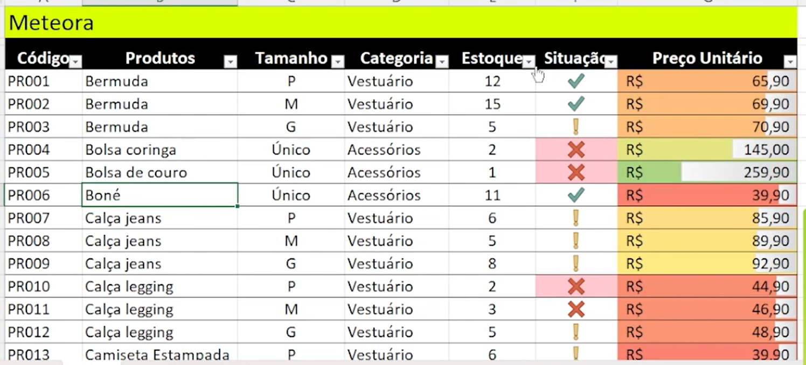
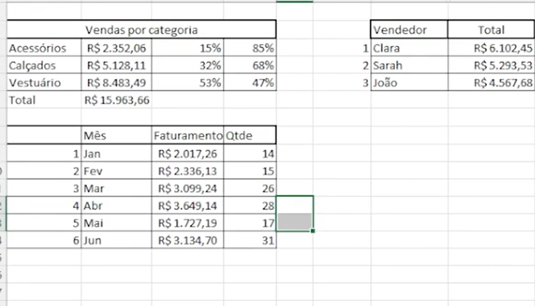
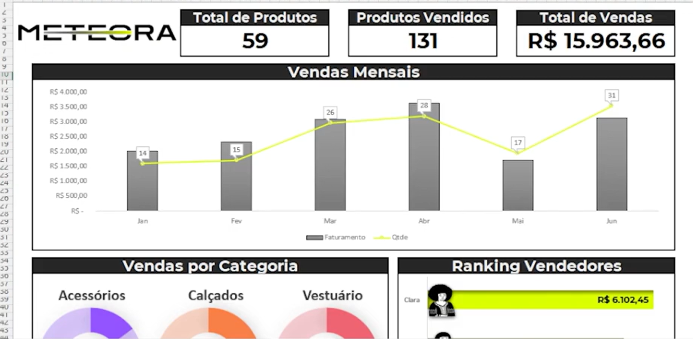
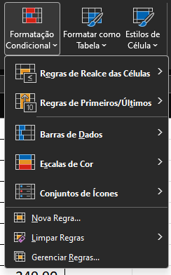
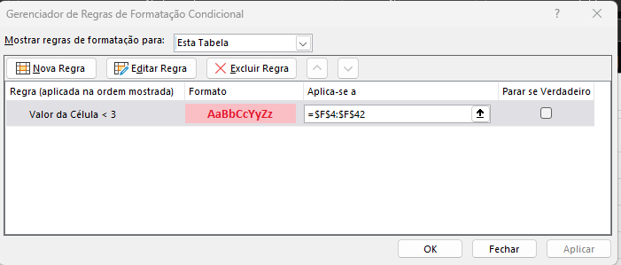
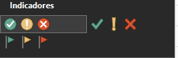
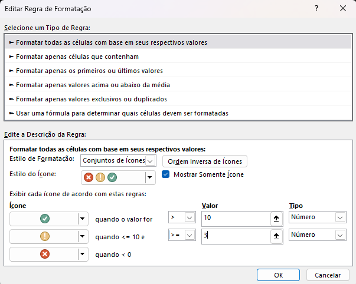
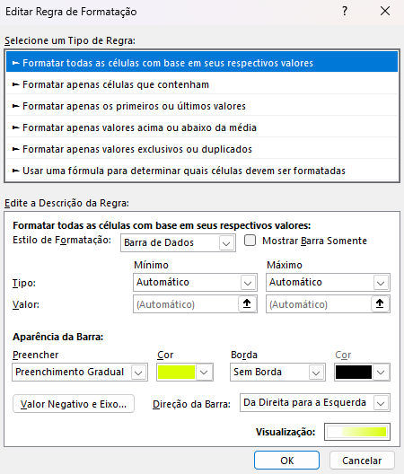

<a id="topo"></a>

# Formatação Condicional

## Sumário
- [Formatação Condicional](#formatação-condicional)
  - [Sumário](#sumário)
  - [1. Apresentação](#1-apresentação)
  - [2. Preparando o ambiente: planilha Meteora E-commerce](#2-preparando-o-ambiente-planilha-meteora-e-commerce)
  - [3. Conhecendo o trabalho a ser feito](#3-conhecendo-o-trabalho-a-ser-feito)
  - [4. Destaque com formatação condicional](#4-destaque-com-formatação-condicional)
  - [5. Conjunto de ícones e barras](#5-conjunto-de-ícones-e-barras)
  - [6. Classificando os dados em níveis](#6-classificando-os-dados-em-níveis)
  - [7. Faça como eu fiz: conjunto de ícones](#7-faça-como-eu-fiz-conjunto-de-ícones)
  - [8. O que aprendemos?](#8-o-que-aprendemos)

---

## 1. Apresentação
Esse curso terá como objetivo:  
- Apresentar informações.
- Criação de Dashboards.
- Transformação de dados (em informação).
- Ajudar na tomada de decisão.
- Sintetizar informações.

Para além desses objetivos macros, também iremos abordar as seguintes skils:
- Formatação condicional 
  -  Vamos aprender agregar uma formatação condicional a dados, para que esse já tragam informações mais importantes para os usuários da planilha.
-  Personalização de gráficos
   -  Vamos aprender, como modificar cores dos gráficos, títulos, legendas etc..
  
## 2. Preparando o ambiente: planilha Meteora E-commerce
Queremos que você aproveite ao máximo essa oportunidade de aprendizado e desenvolva suas habilidades de forma excepcional. Por isso, temos uma dica valiosa a seguir.

Para acompanhar o curso com o máximo de aproveitamento, vamos acessar a [planilha](db/Meteora%20Ecommerce%20-%20AULA%20INICIAL.xlsx) estamos trabalhando no curso.  
Essa planilha é uma ferramenta poderosa que complementará os seus estudos. Ao explorá-la, você poderá praticar os conceitos apresentados, fazer exercícios e acompanhar seu próprio progresso de maneira personalizada.
>__Nota:__ Nas planilhas disponibilizadas ao decorrer das aulas, estão com o produto _Camiseta Lisa_ e o nome _Clara e João_ contendo um espaço no final. Para evitar que gere um
> resultado com erros, basta remover o espaço e atualizar a planilha novamente.

Aproveite essa dica e ponha as suas habilidades em prática! Estamos empolgados para ver o seu desenvolvimento durante o curso. Seu sucesso é nossa prioridade e estamos comprometidos em ser seus parceiros nessa jornada.  

## 3. Conhecendo o trabalho a ser feito
Nosso objetivo desse módulo como um todo é de realizar alterações visuais em nossa [planilha](db/Meteora%20Ecommerce%20-%20AULA%20INICIAL.xlsx), para que ao final do módulo possamos deixar a planilha em questão com uma formatação similar ao exemplo abaixo:  

> <table style="text-align: center; width: 100%;"> 
> <tr>
> <td style="text-align: left;">
> 
> </td>
> </tr>
> </table>

Para além dessas formatações condicionais a serem realizadas, também iremos realizar a confecção de tabelas intermediarias para que possamos no final criar um dashboard de apresentação, conforme exemplos:


> <table style="text-align: center; width: 100%;"> 
> <tr>
> <td style="text-align: left;">
> 
> </td>
>  <td style="text-align: left;">
> 
> </td>
> </tr>
> <tr>
> </table>
Esse curso não se trata de um curso sobre __`Dashboards`__ e sim sobre gráficos.

## 4. Destaque com formatação condicional
Como visto anteriormente no [Módulo 1](https://github.com/thierryLchaves/Santander-Imersao-Digital/blob/9639f20bf9fe44f91b53ebfc4987b04d06826762/Analise_de_dados_e_IA_Nivelamento/Semana_01/Excel_domine_o_editor_de_planilhas) & [Módulo 2](https://github.com/thierryLchaves/Santander-Imersao-Digital/blob/5013c1d9debfa35797111545e19eac3629e49f96/Analise_de_dados_e_IA_Nivelamento/Semana_02/Funcoes_com_excel_operacoes_matematicas_e_filtros), estávamos trabalhando com 2 modelos de planilha uma __com__ e outra __sem__ formatação de planilha, em vias de regra para formatação condicional tais formatação não irão divergir em sua utilização  para além da sintaxe de referência estruturadas para o formato __com__.  

Para o inicio do processo iremos inserir uma nova coluna a direita da coluna nomeada de `estoque`, o intuito dessa coluna é de inserirmos informações visuais nas quantidades de estoque presentes na tabela,de um forma visual conforme demonstrado em exemplo anterior, após a adição de uma nova coluna será replicado o valor da célula de estoque:
```Excel
=[@Estoque]
```
Após tal processo iremos renomear nossa coluna para __Situação__.  
Com os devidos preparativos feitos, iremos selecionar o intervalo de valores desejados e acessar a opção de formatação condicional _(presente na guia Página Inicial agrupamento estilos)_

<table style="text-align: center; width: 50%;"> 
<tr>
    <td style="text-align: left;">
    
    </td>
</tr>
</table>

Dentro dessa opção de menu temos várias opções de formatação, e cada uma com determinadas condições porém iremos utilizar a opção de `Regra de realce das Células` e dentro dessa opção de menu temos varias outras opções tais como: 
> É Menor que..., É Maior que..., Está entre..., É igual a... etc...   

Porém para nossa primeira formatação iremos utilizar a opção de `É menor que`. Assim como já visto anteriormente na [aula anterior](https://github.com/thierryLchaves/Santander-Imersao-Digital/blob/5013c1d9debfa35797111545e19eac3629e49f96/Analise_de_dados_e_IA_Nivelamento/Semana_02/Funcoes_com_excel_operacoes_matematicas_e_filtros/04_Validacao_de_dados/ValidacaoDeDados.md), verificamos que é possível realizar formatações personalizadas para determinada condição, assim como foi feito no processo de formatação de células, também é possível definir um padrão de formatação condicional personalizado, e para acesso do mesmo a estrutura básica segue a mesma.
Após a confecção da regra podemos revisita-la para editar o formato anteriormente feito, tal recurso é acessado dentro da opção de `Formatação Condicional` na opção de menu __GERENCIAR REGRAS__, ao clicar sobre tal opção nos será apresentado um caixa conforme exemplo abaixo:  
<table style="text-align: center; width: 80%;"> 
<tr>
    <td style="text-align: left;">
    
    </td>
</tr>
</table>

É valido ressaltar que como estamos trabalhando com uma planilha __com formatação de tabela__ a inclusão de novos valores/linhas nessa tabela herdara a formatação condicional anteriormente realizada sem que haja necessidade de alterar a regra.

## 5. Conjunto de ícones e barras
No capítulo anterior realizamos a formatação condicional com base no realce de valores ao atingir a condição X, porém o que desejamos e adicionar um ícone nas células. 
Assim como na opção de realce de valores, é importante de ser realizado a devida formatação a opção do agrupamento a ser escolhido será a de `Conjunto de ícones`, nesse agrupamento existem vários tipos de classificações possíveis, com 3,4 opções de ícones, para nosso exemplo utilizaremos o conjunto <table style="text-align: center; width: 80%;"> 
> <tr>
> <td style="text-align: left;">
> 
> </td>
> </tr>
> </table>

Ao selecionar a opção em questão o `Excel` já realiza o preenchimento das células com um sugestão com base em um distribuição com base nesses valores. Porém podemos editar tais valores, para tal iremos acessar a opção de Gerenciar regras, dentro das regras será apresentado as regras que já foram criadas.
> PS: Já havíamos criado uma formatação condicional para realce de valores, e uma nova para os ícones, e essa que será editada.  

Por padrão o `Excel` nos sugere um padrão com base nos números, porém iremos editar o range de valores, assim como também poderíamos nesse gerenciamento editar os ícones do agrupamento como também cada ícone individualmente. Por hora iremos deixar nossa regra da seguinte maneira:   

<table style="text-align: center; width: 80%;"> 
<tr>
    <td style="text-align: left;">
    
    </td>
</tr>
</table>

Ao finalizar o processo de edição, ao aplicar a formatação retornamos a tela de edição das regras para visualizar também  o range de valores que estão selecionados.  
Após o processo de adição dessas informações na coluna de situação iremos adicionar mais uma formatação agora no campo do preço unitário, a opção selecionada será a de `Barra de dados`, assim como fizemos anteriormente vamos explorar a opção de mais regras para aplicação dessa formatação, para esse valor deixaremos o valor da regra o primeiro exibido, e iremos modificar apenas as opções da formatação: _(preenchimento da barra, cor de fundo e orientação)_.

<table style="text-align: center; width: 80%;"> 
<tr>
    <td style="text-align: left;">
    
    </td>
</tr>
</table>

## 6. Classificando os dados em níveis
João é um estudante universitário que está organizando sua lista de tarefas para o próximo semestre, para isso, ele decidiu usar o Excel para criar um plano de estudos semanal. João deseja criar na coluna B de sua planilha uma formatação condicional para destacar automaticamente as tarefas que contém prioridade alta, para que ele possa se concentrar nelas primeiro.

Seguindo o que aprendemos na aula, qual é o caminho do passo a passo que o João deve seguir para a criar uma formatação condicional no Excel e destacar as tarefas mais importantes?

<table style="text-align: center; width: 100%;"> 
<tr>
    <td style="text-align: left;">
    
    </td>
</tr>
</table>

## 7. Faça como eu fiz: conjunto de ícones
Agora é com você! Vamos treinar o que aprendemos na aula para aplicar a formatação condicional do tipo Conjunto de Ícones.

Desafio: A Meteora tem se expandido de forma muito dinâmica e, para atender com mais agilidade às suas necessidades, optou-se por otimizar as ações por meio de uma planilha no Excel para visualizar a quantidade de produtos em estoque.

Sua tarefa, enquanto analista, é utilizar a formatação condicional para atribuir diferentes ícones aos produtos com base nas quantidades disponíveis. Isso permitirá identificar facilmente os níveis de estoque de cada item, como auxiliar a equipe de logística a tomar decisões assertivas para o reabastecimento e no planejamento de vendas. E então, vamos colocar a mão na massa?!

Dica: Comece examinando a coluna que contém as quantidades de produtos em estoque. Pense em como você pode definir faixas de valores para cada ícone. Em seguida, explore as opções de formatação condicional no Excel para aplicar os ícones conforme as condições estabelecidas. Teste diferentes configurações até encontrar a visualização mais adequada ao contexto do estoque da Meteora.

__Opinião do instrutor__

Para realizar essa atividade, siga o passo a passo proposto.

- Passo 1: O primeiro passo para inserirmos a Formatação Condicional do tipo Conjunto de Ícones, é criar uma nova coluna na `TB_Produtos`.
- Passo 2: Seleciona a opção _“Preço Unitário”_ e com o auxílio do botão direito do mouse, clique na opção inserir para adicionar uma nova coluna na tabela.
- Passo 3: Altere o nome da nova coluna para _“Situação”_.
- Passo 4: Na linha `F4` da nova coluna _“Situação"_, digite o sinal do igual `“=”` e selecione a linha `E4` da coluna Estoque.
```excel
=[@Estoque]
```
- Passo 5: Arraste a fórmula para as demais linhas da tabela.
- Passo 6: Selecione novamente a coluna _“Situação”_  da tabela para inserir a formatação Condicional.
- Passo 7: Na guia Página Inicial, grupo Estilos, clique no ícone _“Formatação Condicional”_ , selecione a opção Conjunto de Ícones e em seguida escolha o tipo de ícone. 
- Passo 8: O próximo passo é editar o conjunto de ícones aplicados. Clique novamente no ícone _“Formatação Condicional”_  localizado na guia Página Inicial e, em seguida, selecione a opção Gerenciar Regras.
- Passo 9: Na caixa __“Gerenciador de Regras de Formatação Condicional"__, selecione a regra Conjunto de Ícones. Logo a seguir, clique no botão Editar Regra.
- Passo 10: Na caixa __“Editar Regra de Formatação”__, na opção __“Formatar todas as células com base em seus respectivos valores:”__, habilite a opção Mostrar Somente Ícone.
- Passo 11: Para o primeiro ícone na opção quando o valor for, selecione o símbolo maior `“>”`, em Valor digite o número _“10”_ e em Tipo escolha Número.
- Passo 12: Para o segundo ícone na opção quando `<=10` e, selecione o símbolo maior ou igual `“>=”`, em Valor digite o número _“3”_ e em Tipo escolha Número. Clique no botão _“Ok”_.
- Passo 13: Na caixa __“Gerenciador de Regras de Formatação Condicional”__ clique no botão _“Aplicar”_ e, em seguida, clique no botão _“Ok”_.

Pronto, nossa Formatação Condicional do tipo Conjunto de Ícones foi aplicada e agora podemos sinalizar a quantidade de produtos em estoque!

## 8. O que aprendemos?

Nessa aula, você aprendeu a:
- Identificar o recurso de Formatação Condicional no Excel;
- Diferenciar os tipos de Formatação Condicional do Excel;
- Produzir a Formatação Condicional do tipo Conjunto de Ícones;
- Produzir a Formatação Condicional do tipo Escalas de Cor.

---

<table align="center" style="border-collapse: collapse; margin-left: auto; margin-right: auto;"> 
  <caption><b>Skills do projeto</b></caption>
  <tr>
    <td style="padding: 5px;">
      
    </td>
    <td style="padding: 5px;">
      
    </td>
    <td style="padding: 5px;">
      
    </td>
    <td style="padding: 5px;">
      
    </td>
  </tr>
</table>


---
__Titulo:__ Formatação Condicional
__Autor:__ Thierry Lucas Chaves  
__Data de Criação:__ 17-05-2026  
__Data de Modificação:__ 18-05-2026  
__Versão:__ "1.0"