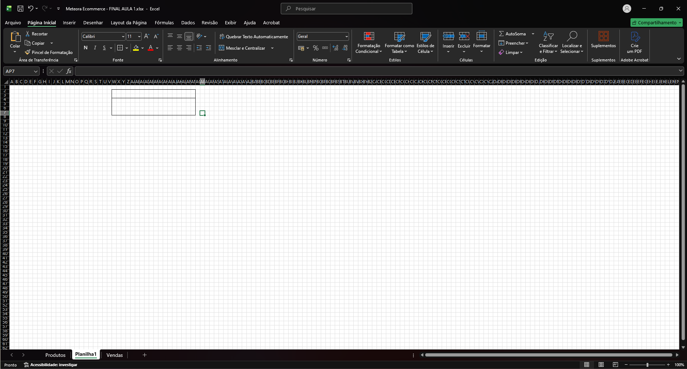
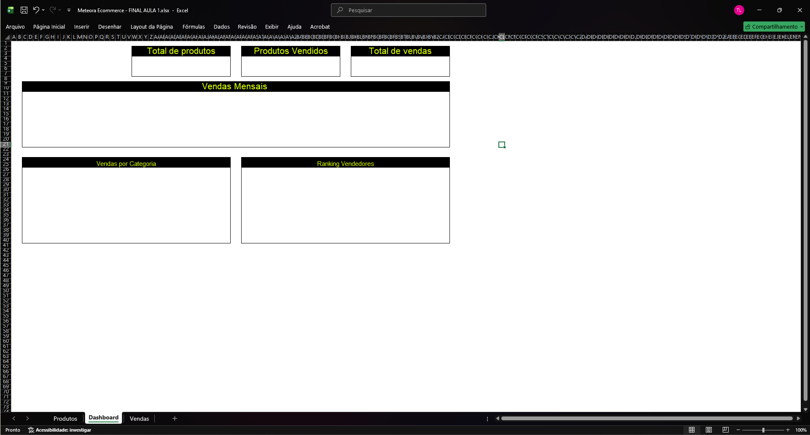
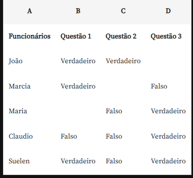
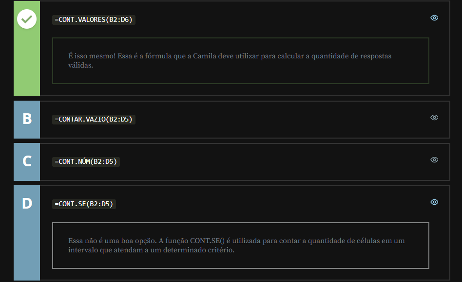

<a id="topo"></a>

# Estruturando o dashboard

## Sumário
- [Estruturando o dashboard](#estruturando-o-dashboard)
  - [Sumário](#sumário)
  - [1. Projeto da aula anterior](#1-projeto-da-aula-anterior)
  - [2. Estruturando o painel](#2-estruturando-o-painel)
  - [3. Criando indicadores](#3-criando-indicadores)
  - [4. Somando com uma condição](#4-somando-com-uma-condição)
  - [5. Preparando os dados](#5-preparando-os-dados)
  - [6. Faça como eu fiz: calculando os indicadores](#6-faça-como-eu-fiz-calculando-os-indicadores)
  - [7. O que aprendemos?](#7-o-que-aprendemos)

---

## 1. Projeto da aula anterior

Continuando a nossa jornada neste curso você pode acessar [aqui](db/Meteora%20Ecommerce%20-%20FINAL%20AULA%201.xlsx) o projeto da aula anterior

## 2. Estruturando o painel
> PS O curso não se destina sobre utilização ou criação de DashBoards, porém serão visto comandos e normas de como realizar a construção de gráficos. 

Para a construção do DashBoard/Gráfico iremos criar uma nova planilha para tal, é de suma importância que para a construção desses gráficos não seja misturados tais dados em uma mesma planilha.
Uma das dicas passadas no curso diz respeito a formatação de Altura e largura das `colunas/linhas`, para o seguimento do processo realizamos a formatação de toda a planilha com os valores 
```text
height: +- 9 px
width: +- 1,30 px
```
Com esse processo de ajuste total da planilha nos auxilia, tanto na divisão de colunas que serão inseridas para confecção dos painéis. Para ajuste da planilha iremos realizar a seleção de __18__ colunas  e 6 linhas a partir da `Coluna C`, e posteriormente deixaremos mais 2 colunas vagas após essa seleção e repetiremos o intervalo, fazendo esse processo teremos um resultado similar a esse:
<table style="text-align: center; width: 100%;"> 
<tr>
    <td style="text-align: left;">
    
    </td>
</tr>
</table>

> PS: Uma sugestão dada durante a aula, foi de que ao serem criados DashBoards os primeiros Painéis sejam aquelas que contenham as informações mais relevantes.

## 3. Criando indicadores

Feito as configurações sugeridas no módulo anterior daremos seguimento a outras formatações, uma delas sendo a opção de _`Recolher Faixa de opções`_ esse recurso de mouse pode ser realizado em qualquer uma das guias do Excel.
Para além disso para melhor apresentação dessa planilha, podemos ocultar as linhas de grade, dentro da guia _Exibir_ desmarca a opção de linhas de grade, fazendo assim com que nosso Dashboard fique da seguinte forma:

<table style="text-align: center; width: 100%;"> 
<tr>
    <td style="text-align: left;">
    
    </td>
</tr>
</table>

Apenas para relembramos algumas formulas que já vimos anteriormente, para a tabela de produtos utilizaremos a formula de contagem de valores, e para essa contagem a formula utilizada é a de 
```exel
=CONT.VALORES(Produtos!B4:B42)
```
Essa formulá pode ser feita tanto dessa maneira quanto da maneira abaixo:
```excel
=CONT.VALORES(TB_Produtos[Código])
```
Na formulá acima utiliza-se do processo de referência estruturada, e essa pode ser mais segura dado que caso sejam acrecidos valores na tabela ou modificados esse valor será atualizado , utilizaremos o processo de referência estruturada também para os demais cards, com as formulas abaixo:
```excel
=SOMA(TB_Vendas[Qtd])

=SOMA(TB_Vendas[Total])
```
## 4. Somando com uma condição
Em uma pesquisa de satisfação em uma empresa, os funcionários responderam a algumas perguntas usando Verdadeiro ou Falso.  

<table style="text-align: center; width: 100%;"> 
<tr>
    <td style="text-align: left;">
    
    </td>
</tr>
</table>

Camila, a gerente da empresa deseja contar quantas respostas válidas foram dadas por cada funcionário no total. Mas está na dúvida de qual função ela deve utilizar.

Baseado no que aprendemos na aula, vamos ajudar a Camila a escolher a função correta para calcular a quantidade de respostas válidas?

<table style="text-align: center; width: 100%;"> 
<tr>
    <td style="text-align: left;">
    
    </td>
</tr>
</table>

## 5. Preparando os dados
Para realizar a confecção de gráficos dentro do Excel uma das funções mais utilizadas para confecção de gráficos é `=SOMASE`. Iremos aplicar essa formula para o dashboard de Ranking de vendedores. 
Mas ao invés de realizar a formula diretamente do quadro, iremos utilizar uma base de dados intermediaria para fazer o tratamento dos dados antes de construir o gráfico propriamente dito.
Então para então criamos essa nova planilha, e até o presente momento dado aos dados apresentados na planilha de vendas, iremos apenas digitar os nomes dos vendedores que são poucos organizados em ordem alfabética e aplicar a formula abaixo  
```Excel
=SOMASE(TB_Vendas[Vendedor];A2;TB_Vendas[Total])
```
No modelo abaixo utilizamos referência estruturada, porém também é possível criar a mesma formula com intervalo digitado substituindo  essa referência pelo intervalo
```Excel
=SOMASE(Vendas!$h$3:$h$61;A2;Vendas!$G$3:$G$61)
```
Porém com esse modelo devemos _"travar"_ os intervalo com atalho de teclado `F4`.  
>PS: É altamente recomendado que o conceito de referência estruturadas sejam utilizadas e adotadas. 

## 6. Faça como eu fiz: calculando os indicadores
É hora de ação! Vamos treinar o que aprendemos na aula e calcular os principais indicadores (Total de Produtos, Produtos Vendidos e Total de Vendas) para o painel interativo da E-commerce Meteora?

Essa é uma oportunidade perfeita para aprimorar suas habilidades e explorar as funcionalidades do Excel. Use as funções mais adequadas para calcular os indicadores e perceba os insights aparecer. Vamos lá!

__Opinião do instrutor__

Para realizar essa atividade, siga o passo a passo proposto.

O primeiro indicador que vamos calcular no “Dashboard” é o Total de Produtos.

- Passo 1: Como queremos contar quantos produtos a E-commerce Meteora tem em estoque, vamos utilizar a função CONT.VALORES.

- Passo 2: Na caixa do primeiro indicador, digite o sinal de igual “=” para iniciar a fórmula e em seguida escreva a fórmula que vamos utilizar.

  `=CONT.VALORES(`
- Passo 3: Para realizar a contagem do total de produtos em estoque, vamos utilizar como argumento da função as informações da tabela Produtos. Digite TB_Produtos para indicar a tabela que queremos que a contagem seja feita.

  `=CONT.VALORES(TB_Produtos`  

- Passo 4: Em seguida abra o colchetes [ e selecione a coluna que queremos realizar a contagem, que neste caso será a coluna “Código”.

  `=CONT.VALORES(TB_Produtos[Código`
- Passo 5: Feche o colchetes “]” e pressione o `[ENTER]` para finalizar a fórmula.

O segundo indicador que vamos calcular no painel é o Produtos Vendidos.

- Passo 6: Como queremos como resultado o total da quantidade de produtos vendidos, vamos utilizar a função Soma.

- Passo 7: Na caixa do segundo indicador, digite o sinal de igual “=” para iniciar a fórmula e em seguida escreva a fórmula.

  `=SOMA(`  

- Passo 8: Para realizar a soma da quantidade total de produtos vendidos, vamos utilizar como argumento da função as informações da tabela Vendas. Digite TB_Vendas para indicar a tabela que queremos que a soma seja feita.

  `=SOMA(TB_Vendas`  

- Passo 9: Em seguida abra o colchetes [ e selecione a coluna que queremos realizar a soma, que neste caso será a coluna “Qtd”.

  `=SOMA(TB_Vendas[Qtd`
- Passo 10: Feche o colchetes “]” e pressione o `[ENTER]` para finalizar a fórmula.

O terceiro e último indicador que vamos calcular no “Dashboard” é o Total de Vendas.

- Passo 11: Como queremos como resultado o valor total das vendas, vamos utilizar a função Soma.

- Passo 12: Na caixa do terceiro indicador, digite o sinal de igual “=” para iniciar a fórmula e em seguida escreva a fórmula.

  `=SOMA(`
- Passo 13: Para realizar a soma do total de vendas, vamos utilizar como argumento da função as informações da tabela Vendas. Digite TB_Vendas para indicar a tabela que queremos que a soma seja feita.

  `=SOMA(TB_Vendas`  

- Passo 14: Em seguida, abra o colchetes "[" e selecione a coluna que queremos realizar a soma, que neste caso será a coluna “Total”.

  `=SOMA(TB_Vendas[Total`
- Passo 15: Feche o colchetes “]” e pressione o [ENTER] para finalizar a fórmula.

Pronto, os principais indicadores foram calculados!

## 7. O que aprendemos?
Nessa aula, você aprendeu a:
- Identificar os pontos importantes na criação de "Dashboards";
- Esquematizar um Dashboard no Excel;
- Utilizar a função CONT.VALORES() do Excel;
- Calcular os principais indicadores no Excel.

---

<table align="center" style="border-collapse: collapse; margin-left: auto; margin-right: auto;"> 
  <caption><b>Skills do projeto</b></caption>
  <tr>
    <td style="padding: 5px;">
      
    </td>
    <td style="padding: 5px;">
      
    </td>
    <td style="padding: 5px;">
      
    </td>
  </tr>
</table>


---
__Titulo:__ Estruturando o dashboard
__Autor:__ Thierry Lucas Chaves  
__Data de Criação:__ 17-05-2026  
__Data de Modificação:__ 20-05-2026  
__Versão:__ "1.0"