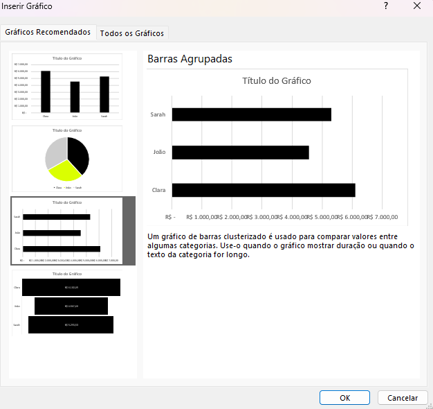
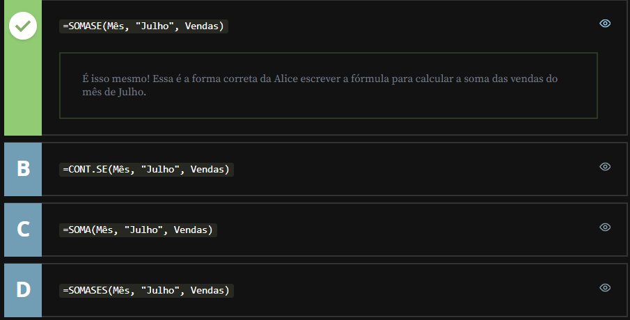
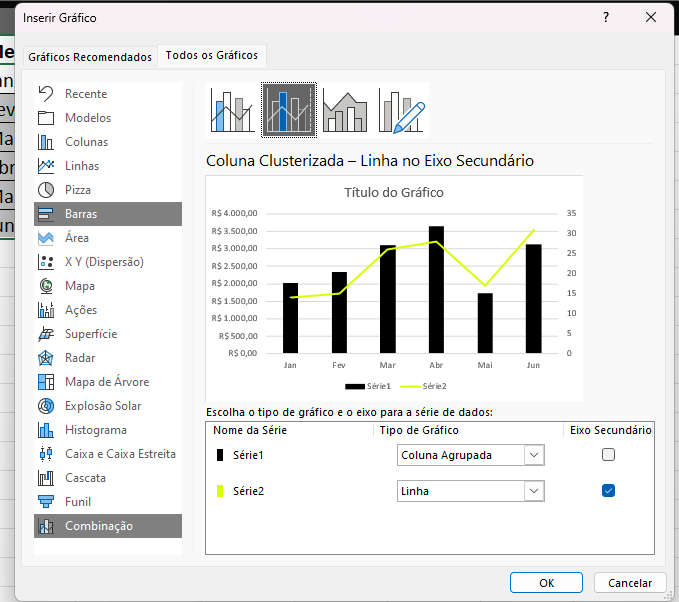

<a id="topo"></a>

# Trabalhando com gráficos

## Sumário
- [Trabalhando com gráficos](#trabalhando-com-gráficos)
  - [Sumário](#sumário)
  - [1. Projeto da aula anterior](#1-projeto-da-aula-anterior)
  - [2. Criando um gráfico de barras](#2-criando-um-gráfico-de-barras)
  - [3. Somando os dados mensais](#3-somando-os-dados-mensais)
  - [4. Somando com uma condição](#4-somando-com-uma-condição)
  - [5. Gráfico de combinação](#5-gráfico-de-combinação)
  - [6. Faça como eu fiz: gráfico de combinação](#6-faça-como-eu-fiz-gráfico-de-combinação)
  - [7. O que aprendemos?](#7-o-que-aprendemos)

---

## 1. Projeto da aula anterior
Continuando a nossa jornada neste curso você pode [acessar aqui](db/Meteora%20Ecommerce%20-%20FINAL%20AULA%202.xlsx) o projeto da aula anterior

## 2. Criando um gráfico de barras
Para criar o gráficos iremos primeiro selecionar os dados desejados na nossa planilha auxiliar com os dados, pós tal seleção iremos na aba de inserir e escolher a opção de gráficos recomendados, um ponto importante a se atentar sobre os gráficos pois dado a quantidade de informações a serem apresentadas,como nosso objetivo é de apresentar a quantidade de vendas por vendedor e são poucos iremos utilizar o de barras agrupadas:

<table style="text-align: center; width: 100%;"> 
<tr>
    <td style="text-align: left;">
    
    </td>
</tr>
</table>

Por padrão esse gráfico é criado como um objeto na própria planilha na qual foram selecionado os dados, porém esse gráfico pode ser modificado de lugar tamanho etc..
Como iremos inserir o gráfico na planilha de Dashbords, não precisamos do titulo do gráfico pois esse já está nessa planilha, então podemos remover o titulo, seja selecionado o titulo e apertando `delete`, ou através da guia de Design do Gráfico. 
Um dos pontos que mais será utilizados devem ser o LayOut de Gráfico e o Estilos de Gráfico, pois esse fornecem uma formatação rápida sobre o gráfico em questão. 
Outro ponto importante de utilização seria opção de menu `Adicionar Elemento de Gráfico` essa opção serve tanto para adicionar elementos como o próprio nome diz, quanto remover elementos adicionados do Layout escolhido.
Outro ponto sobre a formatação do gráfico em questão é que ao visualizar alguma opção dentro de Adicionar elemento Gráfico, e que ao realizar a seleção de _"Mais opções de"_, o gráfico pode modificar a formatação anterior de forma automática então é valido se atentar a esse quesito.  

## 3. Somando os dados mensais
Para o calculo do faturamento mensal, também criamos uma nova planilha auxiliar, nela tendo os dados de Mês _(Com o número correspondente e a abreviação do mês)_ também adicionamos mais 2 colunas uma de total ou faturamento e a quantidade para termos uma relação de quantidade de produtos vendidos por total valor faturado no mês em ambas novas colunas utilizamos o `Somase, conforme exemplo abaixo :  
```excel
=SOMASE(TB_Vendas[Mês];D2;TB_Vendas[Total])

=SOMASE(TB_Vendas[Mês];D2;TB_Vendas[Qtd])
```

## 4. Somando com uma condição
Alice, proprietária de uma loja de eletrônicos, está empenhada em analisar o desempenho das vendas de sua loja. Ela quer calcular a soma das vendas com base em uma condição: apenas as vendas que foram realizadas no mês de Julho.

Seguindo o que aprendemos na aula, vamos ajudar a Alice a escrever a fórmula correta para calcular a soma das vendas do mês de Julho?

<table style="text-align: center; width: 100%;"> 
<tr>
    <td style="text-align: left;">
    
    </td>
</tr>
</table>

## 5. Gráfico de combinação
Esse gráfico é utilizado quando temos o intuito de combinar dados diferentes em uma apresentação visual única, para o nosso caso em especifico, vamos inserir um gráfico de combinação personalizados, pois queremos a linha de quantidade de produtos distribuídas pelos meses em conjunto com o total faturado. então a ideia e que escolhermos a opção de `Linha de Eixo Secundária` para que possamos inserir outro eixo, esse eixo sendo apresentado a direita do gráfico (a quantidade com intervalo de 0 a 35) e o eixo da esquerda ( de 0 a 4.000) sendo o eixo de valores:

<table style="text-align: center; width: 100%;"> 
<tr>
    <td style="text-align: left;">
    
    </td>
</tr>
</table>

> Ps: E importante se atentar para excluir informações nesse gráfico como por exemplo a exclusão do eixo secundário, quando é realizado tal exclusão a linha não irá realizar. 
> o acompanhamento dos valores, para tal pode ser feito a formatação para ocultar esse eixo

## 6. Faça como eu fiz: gráfico de combinação
Agora é com você! Vamos treinar o que aprendemos na aula e criar o gráfico de combinação para a E-commerce Meteora. Nesta atividade, a sua tarefa é representar os valores de faturamento e a quantidade de produtos vendidos ao longo dos meses.

Importante: Essa visualização será fundamental para impulsionar a estratégia de crescimento da empresa, além de trazer uma excelente visibilidade profissional para você. Então, mãos à obra e mostre todo o seu talento como analista de dados, dando vida a insights valiosos que contribuirão para o sucesso da Meteora e para o seu desenvolvimento.

__Opinião do instrutor__  
Para realizar essa atividade, siga o passo a passo proposto.

- Passo 1: Selecione o intervalo E1:G7 que contém os dados que pretendemos utilizar para criar o gráfico.

- Passo 2: Na guia “Inserir”, clique no ícone Gráficos recomendados.

- Passo 3: Na caixa “Inserir Gráfico”, clique na opção Todos os gráficos e em seguida selecione Combinação.

- Passo 4: Em “Combinação Personalizada” habilite a opção Eixo Secundário para as informações de “Qtd.” Clique em “Ok”.

Pronto, o gráfico do tipo combinação foi criado!

Nos próximos passos, vamos formatar o gráfico criado

- Passo 5: Na guia "Formatar" (se não estiver aparecendo, clique sobre o gráfico), clique no ícone Preenchimento da Forma para alterar a cor das colunas.

- Passo 6: Na guia "Formatar" (se não estiver aparecendo, clique sobre o gráfico), clique no ícone Contorno da Forma para alterar a cor da linha.

- Passo 7: Para ocultar o eixo, selecione o eixo secundário (Qtd) e com o auxílio do botão direito do mouse clique em “Formatar Eixo".

- Passo 8: Na janela “Formatar Eixo”, em Rótulos, na opção “Posição do Rótulo” selecione Nenhum.

- Passo 9: No gráfico, selecione a linha que corresponde aos dados de quantidade.

- Passo 10: Na guia “Design do Gráfico”, clique no ícone Adicionar Elemento de Gráfico selecione Rótulos de Dados e escolha a melhor opção para adicionar os rótulos de dados no gráfico. Na aula utilizamos a opção Acima.

Pronto, o gráfico de combinação foi formatado!

Agora vamos mover o gráfico para a planilha Dashboard  

- Passo 11: Para mover o gráfico para o Dashboard, clique no ícone Mover Gráfico na guia Design do Gráfico.

- Passo 12: Na caixa Mover Gráfico, na opção “Objeto em:” selecione Dashboard e em seguida clique no botão Ok.

- Passo 13: Por último, ajuste o tamanho do gráfico para encaixar na posição correta no Dashboard.

Pronto, já temos o gráfico na planilha Dashboard, agora é só seguir as próximas aulas.


## 7. O que aprendemos?
Nessa aula, você aprendeu a:
- Experimentar os recursos de gráficos do Excel;
- Relembrar a função SOMASE() do Excel;
- Elaborar um gráfico de Barras no Excel;
- Elaborar um gráfico de Combinação no Excel;
- Produzir diferentes tipos de formatação nos gráficos no Excel.


---

<table align="center" style="border-collapse: collapse; margin-left: auto; margin-right: auto;"> 
  <caption><b>Skills do projeto</b></caption>
  <tr>
    <td style="padding: 5px;">
      
    </td>
    <td style="padding: 5px;">
      
    </td>
  </tr>
</table>


---
__Titulo:__ Trabalhando com gráficos
__Autor:__ Thierry Lucas Chaves  
__Data de Criação:__ 17-05-2026  
__Data de Modificação:__ 17-05-2026  
__Versão:__ "1.0"