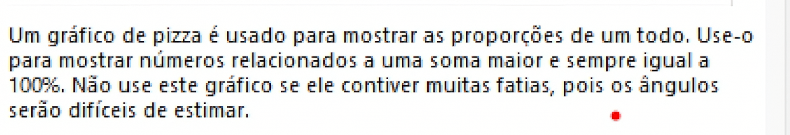
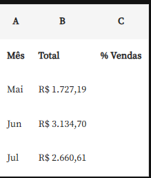
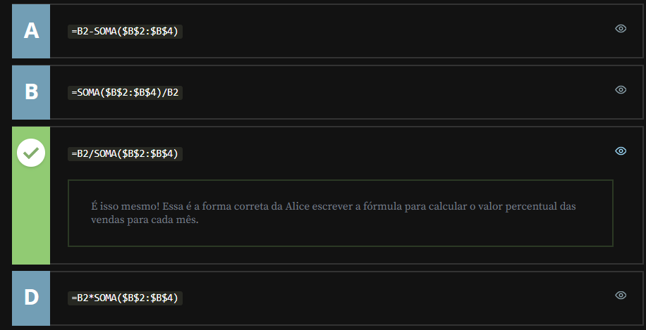
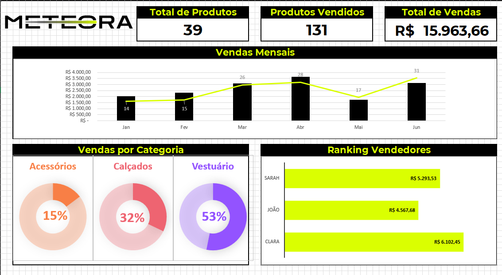
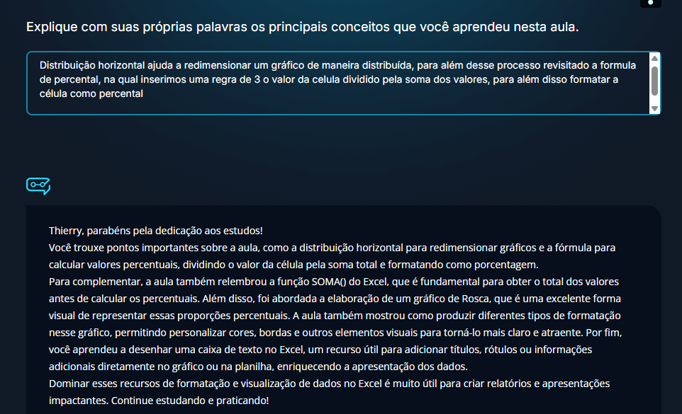

<a id="topo"></a>

# Gráficos de relógio

## Sumário
- [Gráficos de relógio](#gráficos-de-relógio)
  - [Sumário](#sumário)
  - [1. Projeto da aula anterior](#1-projeto-da-aula-anterior)
  - [2. Criando o gráfico de rosca](#2-criando-o-gráfico-de-rosca)
  - [3. Trabalhando com porcentagem](#3-trabalhando-com-porcentagem)
  - [4. Percentual de vendas](#4-percentual-de-vendas)
  - [5. Recursos de formatação](#5-recursos-de-formatação)
  - [6. Faça como eu fiz: gráfico de rosca](#6-faça-como-eu-fiz-gráfico-de-rosca)
  - [7. Desafio: inserir a caixa de texto](#7-desafio-inserir-a-caixa-de-texto)
  - [8. O que aprendemos?](#8-o-que-aprendemos)

---

## 1. Projeto da aula anterior
Continuando a nossa jornada neste curso você pode [acessar aqui](db/Meteora%20Ecommerce%20-%20FINAL%20AULA%203.xlsx) o projeto da aula anterior
## 2. Criando o gráfico de rosca
Existe um gráfico que é muito utilizado para realizar uma representação de relação entre categorias é o __gráfico de rosca ou o gráfico de pizza__.
> PS: Conforme foi dito na [aula anterior](https://github.com/thierryLchaves/Santander-Imersao-Digital/blob/0b646d4408bfa907feb1e613be888db82efce35d/Analise_de_dados_e_IA_Nivelamento/Semana_03/Recursos_visuais_com_excel_explorando_graficos_e_formatos/03_Trabalhando_com_graficos/TrabalhandoComGraficos.md), é de suma importância se atentar que para utilização desse tipo de gráfico somente é recomendado quando não temos muitas informações a serem apresentadas.  

Assim como realizamos nos demais gráficos, também utilizaremos planilha intermediaria para a construção do gráfico em questão. e o processo de construção de nossa tabela intermediária seguira o mesmo padrão, repetição das categorias de forma manual, e a função `SOMASE`, pós esse processo selecionaremos a tabela desejada, e na guia de inserir escolheremos o gráfico do tipo pizza.
>PS: O Excel nos fornece uma descrição sobre o gráfico de pizza nos gráficos recomendados. 
> <table style="text-align: center; width: 100%;"> 
> <tr>
> <td style="text-align: left;">
> 
> </td>
> </tr>
> </table>

Como trabalhamos ao longo desse módulo com a construção dos gráficos em cima de uma espaço pré determinado para apresentação dos gráficos, a depender do gráfico como no casso do gráfico de pizza, essa informação pode ficar pouco visível, ou com um layout comprimido, porém uma das maneiras de se contornar essa limitação é trabalhando com uma técnica coloquialmente chamada de _"reloginho"_
## 3. Trabalhando com porcentagem
A técnica chamada  anteriormente de _"reloginho"_ nada mais é que subdividir um gráfico de pizza ou rosca com as proporções de 100% / N  em vários gráficos de rosca ou pizza com sua proporção, no nosso caso teremos 3 gráficos diferentes 1 para cada categoria.
Como esse novo gráfico será construído a partir da informação percentual  de cada categoria em cima do total de vendas, iremos realizar a edição da nossa planilha auxiliar e inserir mais duas novas colunas de informações sendo elas `%Categoria e %Restante`, para o calculo de cada colunas utilizaremos uma _"regra de 3 básica"_, sendo o valor total de venda da categoria x pela soma de todas as vendas, deixando nossa formula da seguinte maneira:  
```excel
=L2/SOMA($L$2:$L$4)
```
> PS: Quando realizarmos essa aplicação será apresentado o número da divisão em questão em formato numérico como o total sendo 1, porém pode se formatar a exibição para porcentagem.   
Outro ponto é que como o a técnica implica em demonstrar um gráfico com base no total para cada categoria a coluna de restante será o total (1), menos o percentual daquela categoria

## 4. Percentual de vendas
A proprietária da loja de eletrônicos, Alice, continua analisando o desempenho das vendas de sua loja. Depois de obter a soma das vendas mensais para o mês de Julho, Alice achou que também seria interessante e mais relevante obter o valor do percentual das vendas para cada mês.

Para fins de exercício, a planilha que a Alice está utilizando está organizada da seguinte forma:
<table style="text-align: center; width: 50%;"> 
<tr>
    <td style="text-align: left;">
    
    </td>
</tr>
</table>

Baseado no que aprendemos na aula, vamos ajudar a Alice a escrever a fórmula correta para calcular o valor percentual das vendas para cada mês?
<table style="text-align: center; width: 100%;"> 
<tr>
    <td style="text-align: left;">
    
    </td>
</tr>
</table>

## 5. Recursos de formatação
Ao finalizar deixamos o gráfico da seguinte maneira:  
<table style="text-align: center; width: 100%;"> 
<tr>
    <td style="text-align: left;">
    
    </td>
</tr>
</table>

Foi utilizado para formatação desse gráfico tamanhos padrões, outro recurso utilizado foi o de __alinhar__ presente na guia de `Forma de formato` que fica disponível quando realizamos a seleção de mais de um gráfico de uma vez, fazendo assim o alinhamento com as opções de _Distribuir Horizontalmente e Alinhar a parte superior_, para além dessa formatação também foi realizado a formatação de coloração com base em cores personalizadas, e para o efeito "degradê" foi apenas replicado a cor primária e aumentado o nível de transparência 
## 6. Faça como eu fiz: gráfico de rosca
Agora é com você! Vamos treinar o que aprendemos na aula e criar os gráficos de rosca para representarmos a informação das Categorias na E-commerce Meteora.

Nesta atividade, sua missão é explorar a criatividade e habilidades como analista de dados para dar vida a gráficos funcionais e intuitivos. E então, vamos colocar a mão na massa?!

__Opinião do instrutor__

Para realizar essa atividade, siga o passo a passo proposto.

- Passo 1: Selecione o intervalo que contém os valores da categoria que pretendemos utilizar para criar o gráfico (Acessórios: I2:K2, Calçados: I3:K3 e Vestuário: I4:K4).

- Passo 2: Na guia “Inserir”, clique no ícone Inserir Gráfico de Pizza ou Rosca (Ícone representado pelo símbolo de um gráfico de Pizza) e selecione a opção Rosca.

Pronto, o gráfico do tipo rosca foi criado!

Nos próximos passos, vamos formatar a área geral do gráfico

- Passo 3: Na guia "Design do Gráfico" (se não estiver aparecendo, clique sobre o gráfico), no grupo "Estilos de Gráfico", escolha a melhor apresentação para seu gráfico. Na aula o prof. Sabino utilizou o Estilo 3.

- Passo 4: Para excluir a legenda do gráfico, clique no ícone Adicionar Elemento de Gráfico na guia "Design do Gráfico" (se não estiver aparecendo, clique sobre o gráfico), selecione Legenda e clique na opção Nenhum.

- Passo 5: Para excluir os rótulos de dados do gráfico, clique no ícone Adicionar Elemento de Gráfico na guia "Design do Gráfico" (se não estiver aparecendo, clique sobre o gráfico), selecione a opção Rótulos de dados e clique na opção Nenhum.

- Passo 6: Para remover o fundo do gráfico, clique no ícone Preenchimento da Forma na guia "Formatar" (se não estiver aparecendo, clique sobre o gráfico) e selecione a opção Sem preenchimento.

- Passo 9: Para remover o contorno do gráfico, clique no ícone Contorno da Forma na guia "Formatar" (se não estiver aparecendo, clique sobre o gráfico) e selecione a opção Sem preenchimento.

- Passo 10: Para alterar a cor da fonte do título, clique no ícone Preenchimento do texto na guia "Formatar" (se não estiver aparecendo, clique sobre o título do gráfico).

- Passo 11: Caso queira aplicar as mesmas cores utilizadas na aula, clique na opção Mais cores de Preenchimento do ícone Preenchimento do texto.

- Passo 12: Na caixa “Cores” opção Hex digite o código utilizado na aula e em seguida clique no botão Ok.

  - Código Hexa Acessórios: #F87F46
  - Código Hexa Calçados: #EE6471
  - Código Hexa Vestuário: #9353FF

Pronto, a área geral do gráfico foi formatada!

Nos próximos passos, vamos formatar as fatias do gráfico

- Passo 13: Clique sobre a área da rosca, para alterar as cores das fatias do gráfico.

- Passo 14: Para alterar a cor da primeira fatia, clique no ícone Preenchimento da Forma na guia "Formatar" e, em Cores Recentes, selecione a cor que foi utilizada para o título.

- Passo 15: Caso a cor utilizada na aula não esteja aparecendo, clique na opção Mais cores de Preenchimento.

- Passo 16: Na caixa “Cores” opção Hex digite o código utilizado na aula e em seguida clique no botão Ok.

  - Código Hexa Acessórios: #F87F46
  - Código Hexa Calçados: #EE6471
  - Código Hexa Vestuário: #9353FF

- Passo 17: Para alterar a cor da segunda fatia, clique na segunda fatia.

- Passo 18: Clique novamente no ícone Preenchimento da Forma, na guia "Formatar", e selecione a opção Mais cores de preenchimento.

- Passo 19: Na caixa “Cores” na opção Transparência escreva 70% e, em seguida, clique no botão Ok.

Pronto, as fatias do gráfico foram formatadas!

Agora vamos mover o gráfico para a planilha Dashboard

- Passo 20: Para mover o gráfico para o “Dashboard”, clique no ícone Mover Gráfico na guia “Design do Gráfico” (se não estiver aparecendo, clique sobre o gráfico).

- Passo 21: Na caixa Mover Gráfico, na opção “Objeto em:” selecione Dashboard e em seguida clique no botão Ok.

- Passo 22: Por último, ajuste o tamanho do gráfico para encaixar na posição correta no Dashboard.

Pronto, já temos o gráfico na planilha Dashboard, agora é só seguir as próximas aulas.

## 7. Desafio: inserir a caixa de texto
Chegou o momento de destacar o seu desenvolvimento nesta jornada. Neste desafio, a sua missão é seguir o passo a passo elaborado durante a aula para criar as caixas de textos e representar os valores percentuais de cada Categoria.

No entanto, o desafio não para por aí! Utilize essa atividade para explorar ainda mais os recursos e aproveite para adicionar um toque especial de originalidade, elevando o padrão do gráfico e tornando-o surpreendente. E então, vamos colocar a mão na massa?!
__Opinião do instrutor__

Para realizar essa atividade, siga o passo a passo proposto.

- Passo 1: Na guia “Inserir”, clique no ícone Caixa de texto. Após clicar no ícone da Caixa de Texto, o cursor do mouse mudará para um formato de cruz.

- Passo 2: No gráfico, clique e arraste o cursor do mouse para desenhar a caixa de texto no tamanho e posição desejados.

- Passo 3: Solte o botão do mouse para criar a caixa de texto. Ela estará vazia, pronta para você digitar o texto desejado.

- Passo 4: Para representarmos o valor percentual da Categoria na caixa de texto, clique na barra de fórmulas e digite o sinal de igual “=”.

- Passo 5: Clique na planilha Dados para Gráficos, selecione o intervalo da célula que contém os valores da categoria que pretendemos utilizar (Acessórios: J2, Calçados: J3 e Vestuário: J4). Em seguida, pressione [ENTER].

- Passo 6: Para remover o fundo da caixa de texto, clique no ícone Preenchimento da Forma na guia "Forma de Formato" (se não estiver aparecendo, clique sobre a caixa de texto) e selecione a opção Sem preenchimento.

- Passo 7: Para remover o contorno da caixa de texto, clique no ícone Contorno da Forma na guia "Forma de Formato" (se não estiver aparecendo, clique sobre a caixa de texto) e selecione a opção Sem preenchimento.

- Passo 8: Para alterar a cor da fonte, clique no ícone Preenchimento do texto na guia "Forma de Formato" (se não estiver aparecendo, clique sobre a caixa de texto) e em Cores Recentes selecione a cor.

- Passo 11: Caso a cor utilizada na aula não esteja aparecendo, clique na opção Mais cores de Preenchimento. do ícone Preenchimento do texto.

- Passo 12: Na caixa “Cores” na opção Hex digite o código utilizado na aula e em seguida clique no botão Ok.

  - Código Hexa para Acessórios: #F87F46
  - Código Hexa para Calçados: #EE6471
  - Código Hexa para Vestuário: #9353FF

- Passo 13: Na guia "Página inicial", clique na caixa Tamanho da Fonte para aumentar a fonte.

- Passo 14: E por último, na guia "Página inicial", aplique a formatação “Negrito” e centralize a fonte na caixa de texto.

Pronto, já temos o processo do desafio concluído.

## 8. O que aprendemos?

<table style="text-align: center; width: 100%;"> 
<tr>
    <td style="text-align: left;">
    
    </td>
</tr>
</table>

---

<table align="center" style="border-collapse: collapse; margin-left: auto; margin-right: auto;"> 
  <caption><b>Skills do projeto</b></caption>
  <tr>
    <td style="padding: 5px;">
      
    </td>
    <td style="padding: 5px;">
      
    </td>
    <td style="padding: 5px;">
      
    </td>
  </tr>
</table>


---
__Titulo:__ Gráficos de relógio
__Autor:__ Thierry Lucas Chaves  
__Data de Criação:__ 17-05-2026  
__Data de Modificação:__ 20-05-2026  
__Versão:__ "1.0"