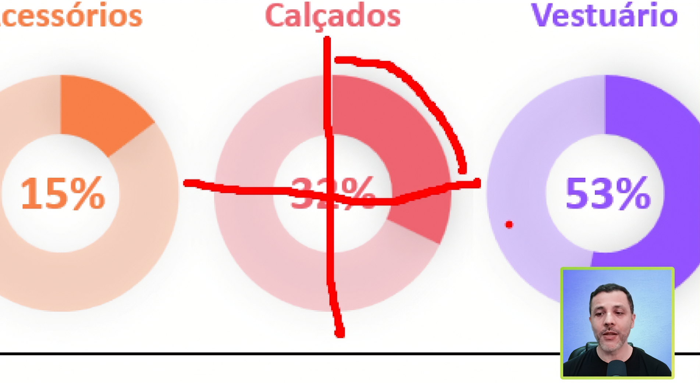
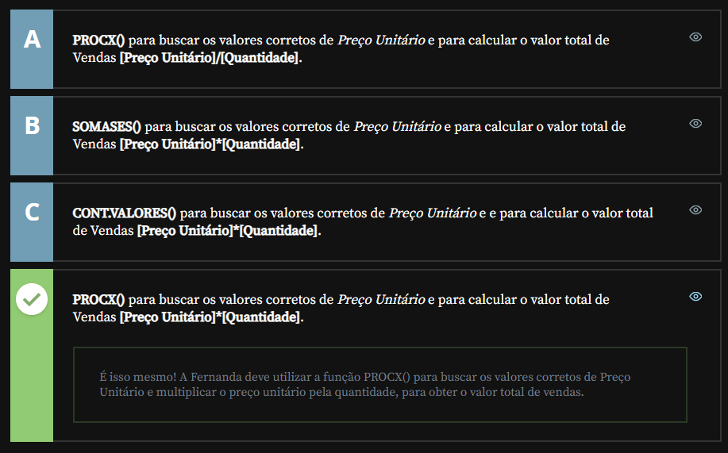

<a id="topo"></a>

# Concluindo o dashboard

## Sumário
- [Concluindo o dashboard](#concluindo-o-dashboard)
  - [Sumário](#sumário)
  - [1. Projeto da aula anterior](#1-projeto-da-aula-anterior)
  - [2. Procura de valores](#2-procura-de-valores)
  - [3. Diferenciando as fórmulas](#3-diferenciando-as-fórmulas)
  - [4. Faça como eu fiz: corrigindo os valores na coluna ''Total''](#4-faça-como-eu-fiz-corrigindo-os-valores-na-coluna-total)
  - [5. Explicando o desafio](#5-explicando-o-desafio)
  - [6. Desafio: alterando o tipo do gráfico](#6-desafio-alterando-o-tipo-do-gráfico)
  - [7. Projeto final do curso](#7-projeto-final-do-curso)
  - [8. O que aprendemos?](#8-o-que-aprendemos)
  - [9. Conclusão](#9-conclusão)
  - [10. Créditos](#10-créditos)

---

## 1. Projeto da aula anterior
Continuando a nossa jornada neste curso você pode [acessar aqui](db/Meteora%20Ecommerce%20-%20FINAL%20AULA%204.xlsx) o projeto da aula anterior.  

## 2. Procura de valores
Uma das maneiras para verificação da veracidade da informação do percentual da técnica dos _"reloginhos"_, e realizar uma divisão do gráfico de pizza/rosca em 4 partes ou duas vezes ao meio (na vertical e na horizontal), onde cada fatia daria aproximadamente 25%, como cada gráfico representa x% de um total e não do total geral agrupado essa técnica pode ser util, ficando assim a divisão de forma visual e ilustrativa.

<table style="text-align: center; width: 100%;"> 
<tr>
    <td style="text-align: left;">
    
    </td>
</tr>
</table>

para que possamos _"arrumar"_ o percentual das categorias, precisamos ajustar o valor do total, pois esse foi realizado a inserção de valores de forma manual, ou seja se aumentarmos o valor em quantidade essa alteração não irá refletir no total, para esse ajuste, primeiro iremos selecionar o intervalo de valores em total e apagar os valores ali presentes, porém antes de realizarmos s multiplicação dos valores, precisamos adicionar em nossa planilha mais uma coluna que nomearemos de unitário, porém esse valor será preenchido com uma nova função a <a href="#procx">`PROCX`</a>, essa formula é uma evolução do <a href="#procv">`PROCV`</a>, e sua formula para nosso caso será da seguinte maneira:  
```excel
=PROCX([@Código];TB_Produtos[Código];TB_Produtos[Preço Unitário])
```
Onde o primeiro parâmetro é o código do produto da tabela de vendas, o intervalo de busca é o código correspondente na tabela de produtos, e o valor ser inserido é o preço unitário presente na tabela de produtos.

<details  id="procx">
    <summary>PROCX</summary>
    <p>PROCX (XLOOKUP) é a função moderna de busca do Excel projetada para substituir o PROCV e o PROCH, permitindo encontrar valores em uma lista ou tabela de forma muito mais flexível e eficiente.</p>
    <ul>
        <li><strong>Busca Bidirecional:</strong> Diferente do PROCV, o PROCX não exige que a chave de busca esteja na primeira coluna, permitindo procurar valores tanto para a esquerda quanto para a direita, além de funcionar na vertical e na horizontal.</li>
        <li><strong>Segurança e Robustez:</strong> A função não quebra se você inserir ou deletar colunas na tabela (pois referencia intervalos exatos em vez de números de índice) e já possui um argumento nativo para tratar erros (substituindo o SEERRO).</li>
        <li><strong>Casos de Uso:</strong> Ideal para cruzamentos complexos de dados, buscas exatas por padrão (sem precisar digitar "FALSO"), pesquisas de trás para frente (do último para o primeiro) e substituição definitiva de fórmulas antigas como ÍNDICE + CORRESP.</li>
    </ul>
</details>

<details id="procv">
    <summary>PROCV </summary>
   <p>PROCV (VLOOKUP) é a tradicional função de pesquisa vertical do Excel, utilizada para localizar um valor em uma coluna e retornar um dado correspondente na mesma linha, de uma coluna especificada à direita.</p>
    <ul>
        <li><strong>Dependência de Índice:</strong> A função exige que você informe o número exato da coluna de retorno (ex: 2, 3, 4), o que faz com que a fórmula quebre ou traga dados errados caso novas colunas sejam inseridas ou deletadas na tabela.</li>
        <li><strong>Restrição Direcional:</strong> Possui a limitação de buscar dados estritamente da esquerda para a direita, tornando obrigatório que a chave de busca (como um ID ou CPF) esteja localizada na primeira coluna do intervalo selecionado.</li>
        <li><strong>Casos de Uso:</strong> Muito utilizada na manutenção de planilhas legadas, cruzamento simples de dados em bases estáticas e auditoria de relatórios antigos que ainda não foram migrados para o moderno PROCX.</li>
    </ul>
</details>

## 3. Diferenciando as fórmulas
Fernanda é administradora de um pequeno comércio de doces que está acompanhando as aulas de Excel do professor Sabino para aprimorar sua planilha de vendas. Ao analisar sua planilha, ela se deparou com a mesma situação abordada na aula pelo Professor, os valores na coluna “Total de Vendas” não foram cadastrados corretamente. Fernanda lembrou que para corrigir as informações, o professor Sabino utilizou duas fórmulas, no entanto ela não consegue lembrar que fórmulas são essas.

Seguindo o que aprendemos na aula, qual alternativa indica as fórmulas corretas que a Fernanda pode utilizar para buscar o valor correto do Preço Unitário e corrigir os valores da coluna Valor total de vendas?

<table style="text-align: center; width: 100%;"> 
<tr>
    <td style="text-align: left;">
    
    </td>
</tr>
</table>

## 4. Faça como eu fiz: corrigindo os valores na coluna ''Total''
Agora é o momento de aplicarmos o que aprendemos e colocar nossas habilidades à prova! Que tal utilizar o conhecimento adquirido em aula para corrigir os valores que estão cadastrados na coluna “Total”?

Com as dicas que exploramos, você é uma pessoa preparada para realizar esse cálculo de forma precisa e eficiente. Aproveite essa oportunidade para consolidar seu aprendizado e se destacar na análise de dados no Excel.
__Opinião do instrutor__

Para realizar essa atividade, siga o passo a passo proposto.

- Passo 1: O primeiro passo que devemos seguir é inserir uma nova coluna na tabela de Vendas. Insira a nova coluna entre as colunas F e G. Altere o nome da nova coluna para Preço Unitário.

- Passo 2: Como queremos saber qual o valor correto de cada produto vendido, vamos utilizar a função =PROCX().

- Passo 3: Na célula G3 vamos inserir a função:

  - `=PROCX(`

- Passo 4: O primeiro parâmetro da função PROCX() é o valor que queremos pesquisar. Neste caso, selecione a célula C3 da coluna “Código” e, em seguida, digite o ponto e vírgula “;” para adicionar o segundo parâmetro da função.

  - `=PROCX(C3;`

- Passo 5: O segundo parâmetro da função PROCX(), pede para selecionarmos em qual intervalo queremos que a pesquisa ocorra. Neste caso, o intervalo que vamos utilizar será a coluna Código da Tabela de Produtos. Digite TB_Produtos seguido do colchetes de abertura [ e selecione a coluna Código. Feche o colchetes “]”e, em seguida, digite o ponto e vírgula “;” para adicionar o terceiro parâmetro da função.

  - `=PROCX(C3;TB_Produtos[Código];`

- Passo 6: O terceiro argumento da função, a matriz_retorno é o intervalo que queremos que a função retorne. Neste caso, o intervalo que vamos utilizar será a coluna Preço Unitário da da Tabela de Produtos. Digite TB_Produtos seguido do colchetes de abertura [ e selecione a coluna Preço Unitário e, em seguida, feche o colchetes “]”.

- Passo 7: Feche os parênteses e pressione o [ENTER] para finalizar a fórmula.

Pronto, os valores de preço unitário foram adicionados na nova coluna!

Agora precisamos corrigir os valores da coluna “Total”.

- Passo 8: Na célula H3, digite o símbolo do sinal de igual (=) para indicar para o Excel que vamos realizar um cálculo.

- Passo 9: Selecione a célula G3 da coluna “Preço Unitário” para indicar o primeiro parâmetro do cálculo que será realizado.

  - `=G3`

- Passo 10: Nesse momento, digite o símbolo da multiplicação (*) e selecione a célula F3 da coluna “Qtd” para indicar o segundo parâmetro do cálculo que será realizado. Pressione o [ENTER].

  - `=G3*F3`

- Passo 11: Utilize a alça de preenchimento para arrastar a nova fórmula corrigida para as demais células da coluna “Total”.

Pronto, nossa função foi criada e os valores foram corrigidos!!

## 5. Explicando o desafio
O desafio final do projeto consiste em realizar a modificação do gráficos de `Vendas por Categoria` e `Ranking Vendedores` de local. 
Para tal temos algumas dicas passadas pelo professor durante a aula.
- 1. Aplicar dentro da planilha de dados para gráficos a replicação da tabela de vendedores.

## 6. Desafio: alterando o tipo do gráfico
Então, você é uma pessoa preparada para se desafiar à medida que aprende? A hora é agora!

Neste desafio, a sua missão é seguir o passo a passo elaborado durante a aula para alterar os gráficos de Categoria e Ranking de Vendedores.

Essa é uma excelente oportunidade para explorar e aplicar o seu conhecimento, colocando em prática tudo o que aprendeu. Se atente às dicas a seguir e bora lá!

__Opinião do instrutor__

Dicas para realizar o desafio:

- Passo 1: Para alterar os gráficos, comece pela planilha “Dados para Gráficos”.

- Passo 2: Na coluna de “”Vendedores””, substitua o nome dos vendedores pelas categorias.

- Passo 3: Na coluna “Totais”, será necessário corrigir um dos argumentos da fórmula SOMASE() para que a fórmula volte a funcionar.

Sintaxe da função SOMASE(intervalo, critérios, intervalo_soma)
- Passo 4: Providencie as mesmas alterações do passo 2 e 3 nas colunas “Categoria” e “Total”.

- Passo 5: Por último, na planilha “Dashboard”, troque os gráficos de lugar para que eles fiquem corretamente posicionados em seus respectivos locais.

## 7. Projeto final do curso
Parabéns pela conclusão do curso! Você pode fazer o [acesso da planilha final](db/Meteora%20Ecommerce%20-%20FINAL%20AULA%20) da loja Meteora que criamos ao longo desta jornada.

Lembre-se: essa é apenas uma etapa de uma jornada repleta de aprendizado. Continue buscando conhecimento e desafiando o seu desenvolvimento. Até a próxima!

 Discutir no Fórum
 Próxima 

## 8. O que aprendemos?
Nessa aula, você aprendeu a:
- Utilizar a função PROCX() do Excel;
- Modificar a função SOMASE() do Excel;
- Elaborar alterações nos gráficos criados no Excel.

## 9. Conclusão
Só revisão geral:
Parabéns! Você chegou ao final de mais um curso de Excel aqui na Alura.

Sem dúvidas esse é um momento muito feliz, pois temos certeza que você sabe muito mais do que quando iniciou o curso.

Esperamos que você tenha conseguido concluir o desafio e aprendido bastante nessa jornada.

Vamos relembrar tudo o que aprendemos! Aprendemos os conteúdos mais importantes relacionados aos recursos visuais, como gráficos, formatação e formatação condicional.

Atualmente o mercado de trabalho demanda por pessoas que consigam traduzir dados. Sendo assim, criar um dashboard com dados visuais é uma forma de facilitar a análise de dados e a tomada de decisões.

É muito importante que você considere que o mais importante são os dados e não a estilização. Concentre-se nos dados e no que pode realmente agregar valor para a liderança, cliente, colega de trabalho e para você.

Compartilhe nas redes sociais como você tem lidado com esses conhecimentos no dia a dia e o que o curso trouxe de mais interessante.

Utilize o Fórum e o Discord para tirar suas dúvidas, entrar em contato com outras pessoas estudantes e participar dessa comunidade de aprendizagem.

Por fim, pedimos que você avalie o curso e pontue o que achou de mais importante, além de mencionar melhorias. Sua opinião é muito importante para nós!

## 10. Créditos

---

<table align="center" style="border-collapse: collapse; margin-left: auto; margin-right: auto;"> 
  <caption><b>Skills do projeto</b></caption>
  <tr>
    <td style="padding: 5px;">
      
    </td>
    <td style="padding: 5px;">
      
    </td>
    <td style="padding: 5px;">
      
    </td>
  </tr>
</table>


---
__Titulo:__ Concluindo o dashboard
__Autor:__ Thierry Lucas Chaves  
__Data de Criação:__ 17-05-2026  
__Data de Modificação:__ 21-05-2026  
__Versão:__ "1.0"