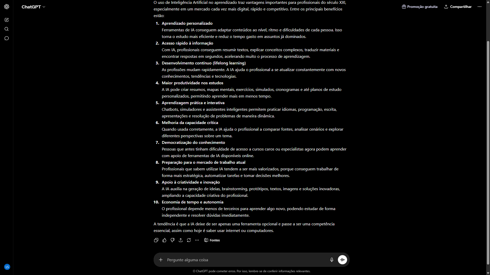
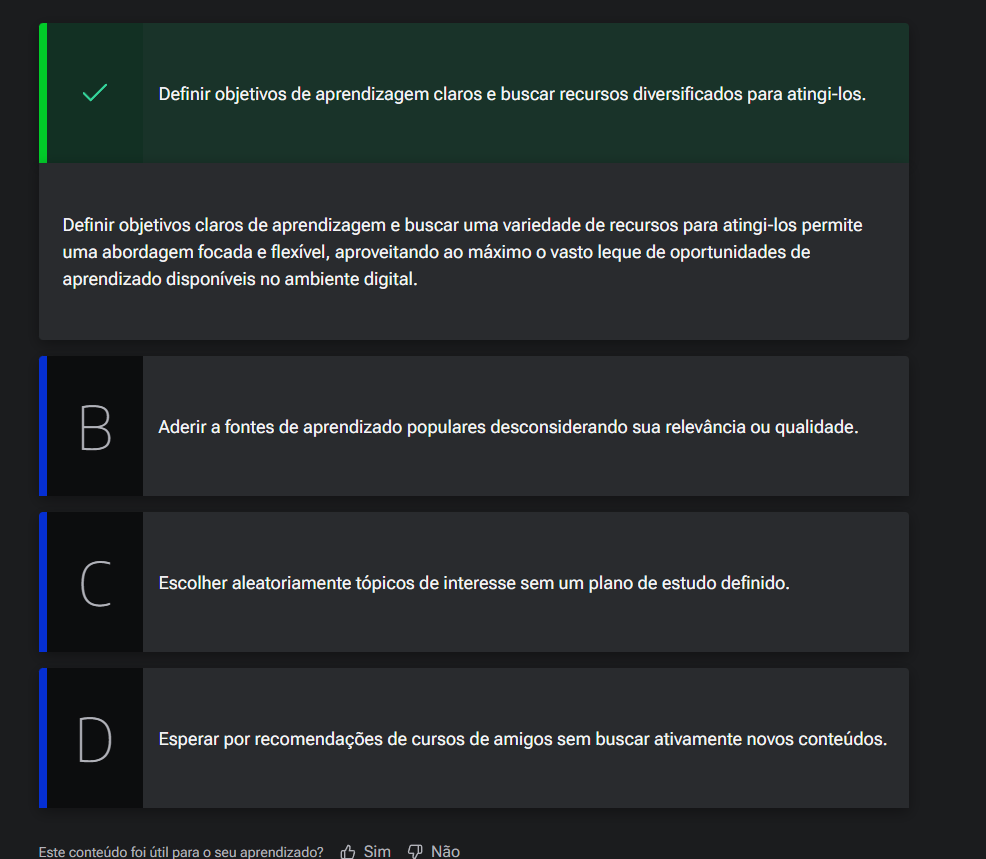
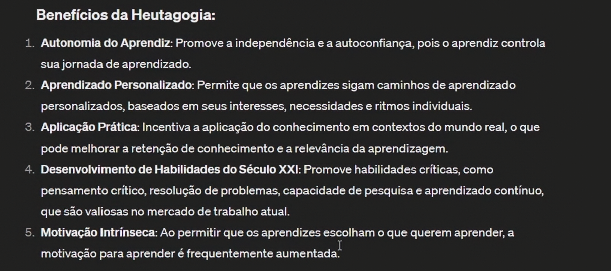
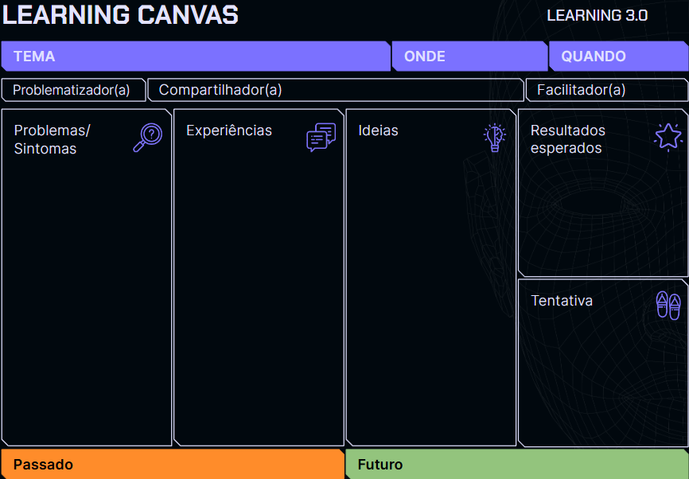

# Você, Aprendiz

<a id="topo"></a>

## Sumário
- [Você, Aprendiz](#você-aprendiz)
  - [Sumário](#sumário)
  - [1. Apresentação](#1-apresentação)
  - [2. Slides do curso](#2-slides-do-curso)
  - [3. Aprendizagem autônoma](#3-aprendizagem-autônoma)
  - [4. Preparando o ambiente](#4-preparando-o-ambiente)
  - [5. Navegando pela aprendizagem autônoma](#5-navegando-pela-aprendizagem-autônoma)
  - [6. Mão na Massa: método 70-20-10 - Maximizando o aprendizado](#6-mão-na-massa-método-70-20-10---maximizando-o-aprendizado)
  - [7. Pesquisar, conectar, praticar](#7-pesquisar-conectar-praticar)
  - [↑ Voltar ao topo](#-voltar-ao-topo)
  - [8. Para saber mais: aprendizado contínuo](#8-para-saber-mais-aprendizado-contínuo)
  - [9. Desafio: Learning Canvas](#9-desafio-learning-canvas)
  - [10. Mão na massa: aprendizagem autônoma](#10-mão-na-massa-aprendizagem-autônoma)
  - [11. O que aprendemos?](#11-o-que-aprendemos)

## 1. Apresentação
Neste curso teremos as seguintes metas de aprendizado, sendo elas:
- 1 Identificar o seu estilo de aprendizagem 
- 2 Selecionar estrategias de aprendizagem conforme seu estilo 
- 3 Montar uma rotina de estudos personalizada com auxilio da inteligência Artificial 
- 4 Desenhar um roadmap de estudos aplicando a taxonomia de Bloom
- 5 Produzir resumos, fichamento e apresentações. 

---
## 2. Slides do curso
Boas-vindas!

Tudo pronto para começar o curso de aprendizagem com IA?

Aproveite ao máximo essa oportunidade de crescimento pessoal e profissional. 
Este curso é um espaço onde você terá a oportunidade de expandir seus conhecimentos, desenvolver habilidades e explorar novos horizontes. E, para melhor acompanhamento dos vídeos, [disponibilizamos os slides do curso para download](db/Slides-Alura-PDF-Aprendizagem%20com-IA.pdf).

Desejamos a você um curso próspero, repleto de aprendizados significativos e momentos gratificantes. Curta essa jornada, faça novas amizades na nossa comunidade, supere desafios e, acima de tudo, divirta-se!

Ah! Conte para gente o que achou sobre o curso depois, viu?

Vamos começar? Bons estudos!

---
## 3. Aprendizagem autônoma

Para a aula iremos iniciar utilizando o [chat GPT](https://chat.openai.com/chat), especificamente realizando o seguinte questionamento:  
```text
Quais são os benefícios para o profissional do século XXI utilizar IA para o aprendizado?
```
Como devolutiva temos a seguinte resposta:  

<table style="text-align: center; width: 100%;"> 
<tr>
    <td style="text-align: left;">
    
    </td>
</tr>
</table>

A grande diferença de um aprendizado guiado por meios institucionais padrões, para um aprendizado autônomo com I.A que envolve por exemplo, decisões de _(o que, com quem e onde aprender)_ esse autonomia conquistada com I.A tem um nome e esse nome é `Abordagem` __`heutagógica`__. 
Nesse tipo de abordagem , temos algumas grandes diferenças de um ambiente de aula tradicional, onde temos por exemplo professores disponíveis por um tempo determinado em um espaço delimitado, também não temos uma tutoria para guiar o aprendizado deixando a cargo do aluna tais decisões. Mas qual a importância de se falar sobre aprendizado e processo de aprendizados com I.A?
>"Saber como aprender será uma habilidade fundamental dado o ritmo de inovação e das mudanças estruturais de comunidades e do ambiente de trabalho"

---
## 4. Preparando o ambiente
Ao longo do curso utilizaremos o ChatGPT e para que você acompanhe passo a passo, recomendamos que crie uma conta no site da [OpenIA](https://chatgpt.com/). Clique na opção “inscreva-se” ou na opção “login” se já tiver sua conta.

Para se familiarizar com o ChatGPT antes de colocar em prática os conteúdos do curso, você pode acessar os artigos:

[GPT-3 e GPT-4: o que é, diferenças e como a inteligência artificial pode te ajudar](https://www.alura.com.br/artigos/o-que-e-gpt-3-gpt-4)  
[ChatGPT: o que é, como usar e dicas de comandos para o dia a dia](https://www.alura.com.br/artigos/chatgpt)  

Bons estudos!

---
## 5. Navegando pela aprendizagem autônoma

Imagine que você é um entusiasta do aprendizado que sempre buscou expandir seus horizontes educacionais. Com a recente transição para o trabalho e estudo remotos, você percebeu uma mudança significativa na forma como o aprendizado ocorre.  

Agora, o mundo digital se abre como um vasto oceano de oportunidades de aprendizado, onde você pode escolher o que, com quem, onde e quando aprender.  
Considerando a heutagógica, uma abordagem de aprendizagem onde o aprendiz é o principal agente de sua jornada educacional, você decide mergulhar de cabeça nessa nova forma de aprender.  
Com tantas opções disponíveis, você começa a refletir sobre como a aprendizagem autônoma no ambiente digital pode ser mais eficazmente conduzida. Dessa forma, considerando o contexto desta aula, qual das seguintes estratégias seria a mais eficaz para maximizar sua aprendizagem autônoma no ambiente digital?  
<table style="text-align: center; width: 100%;"> 
<tr>
    <td style="text-align: left;">
    
    </td>
</tr>
</table>

---
## 6. Mão na Massa: método 70-20-10 - Maximizando o aprendizado

Você já ouviu falar do método 70-20-10?  

Este método é um modelo de aprendizado e desenvolvimento que foi proposto por pesquisadores e profissionais de recursos humanos para orientar a alocação de tempo e recursos em atividades de aprendizado e crescimento profissional. O nome "70-20-10" refere-se à divisão percentual recomendada para diferentes tipos de experiências de aprendizado. Vamos entender como funciona esta divisão!  

> - 70% do aprendizado deve ocorrer por meio da experiência prática no trabalho. Isso significa que a maior parte do desenvolvimento profissional deve vir das tarefas e projetos diários. Ao enfrentar desafios e assumir responsabilidades, as pessoas têm a oportunidade de aprender com suas próprias experiências. Interessante, não?  
> - 20% do aprendizado deve ocorrer por meio da interação com outras pessoas. Isso pode incluir a colaboração com colegas de trabalho, feedback de supervisores e mentoria. Através dessas interações, as pessoas podem obter orientação, compartilhar conhecimento e aprender com a experiência dos outros.
> - 10% do aprendizado, por sua vez, deve ocorrer por meio de atividades formais de desenvolvimento, como treinamentos, cursos, workshops e leituras. Essas oportunidades de aprendizado estruturado podem fornecer novos conhecimentos, habilidades e insights que complementam a aprendizagem prática e social.  

Agora que entendeu como funciona o método, chegou a hora de colocar a mão na massa!

__Utilizando GPT para uma análise pessoal__  
É importante refletir sobre como estamos distribuindo nossos esforços de aprendizado e garantir que estejamos investindo naquilo que realmente impulsiona nosso crescimento.  
Será que estou focando mais de 10% em atividades formais e deixando a parte prática mais de lado? Ou meu esforço de aprendizado é muito focado em interações sociais e negligencio os outros aspectos, formais e práticos?  

__Utilize o ChatGPT para ajudar nesta análise.__ Imagine que você tenha participado de vários cursos, workshops ou treinamentos, mas, ao mesmo tempo, sente que falta a aplicação prática desses conhecimentos. O GPT pode te ajudar a identificar se você está investindo mais do que os 10% recomendados em atividades formais. Com uma rápida conversa, você pode explorar suas experiências e descobrir se está aproveitando ao máximo as oportunidades para aprender com sua própria prática.

Caso queira, utilize o fórum ou o Discord da Alura para compartilhar sua resposta.  
__Opinião do instrutor__
Uma abordagem para esta atividade é começar descrevendo em sua mensagem para o ChatGPT que você deseja avaliar sua distribuição de aprendizado conforme o método 70-20-10.

Faça perguntas como:  
- Como estou distribuindo meu tempo entre atividades práticas e atividades formais de aprendizado?  
- Estou dedicando mais do que 10% do meu tempo em cursos e treinamentos?  
Você precisará fornecer algumas informações a respeito do seu processo de aprendizado, por exemplo, quantos cursos você tem feito, quantas atividades práticas tem feito, quais pontos de contato você tem com outros profissionais para trocas, mentorias, etc.    

[↑ Voltar ao topo](#topo)

---
## 7. Pesquisar, conectar, praticar

Quando realizamos esse tipo de abordagem de aprendizado, nos determinamos na prática quais são as perguntas a serem feitas, porém não necessariamente quais serão as respostas obtidas para tal, quando perguntamos ao ChatGPT, quais os benefícios dessa abordagem de aprendizado temos uma resposta como:  
<table style="text-align: center; width: 100%;"> 
<tr>
    <td style="text-align: left;">
    
    </td>
</tr>
</table>

Porém ao nos deparamos com tais respostamos, podemos ter a sensação de que essas são habilidades que desejamos desenvolver, porém na hora da prática do processo de aprendizado temos algumas dificuldades ou impasses quanto ao aprendizado em si. Para que possamos concretizar esse processo, temos que modificar o paradigma do estudo e olhar para ele de outro prisma, para além dos processos de autonomia e autodisciplina da abordagem heutagógica, precisamos colocar em pratica alguns pontos:  
- Problematizar 
  - Problematizar aquilo que estamos estudado 
- Criar sentido   
  - Tanto para aquilo que foi aprendido, tanto para o cenário que se deseja aplicar sobre o conhecimento recém adquirido
- Compartilhar. 
  - Tanto compartilhar com alguma comunidade, ou com pessoas próximas sobre os problemas do aprendizado ajuda na fixação do que foi aprendido.

Um ferramenta que pode ser utilizada para esse processo de aprendizado temos o __`Learning Canvas`__.
> <table style="text-align: center; width: 100%;"> 
> <tr>
> <td style="text-align: center;">
> 
> </td>
> </tr>
> </table>

Nessa ferramenta temos duas divisões de zonas temporais __"Passo e Futuro"__, para além dessas zonas também temos alguns papeis que são importante de serem respeitados durante a aplicação desse dinâmica, sendo eles 
- __1º Tema:__ Esse deverá ser claro e objetivo;
- __2º Quando:__ Esse quando poderá ser, tanto quando o problema começou ou local de onde será aplicado essa dinâmica;
- __3º Onde:__ Determinar onde esse problema ou essa dinâmica está ocorrendo;
- __4º Problematizador:__ Esse papel tem a incumbência de ser o responsável por trazer os problemas que serão discutidos;
- __5º Facilitador:__  Esse papel tem como diretriz ajudar as pessoas da dinâmica a sair com uma solução, pelas as duas zonas;
- __6º Compartilhador:__ Esse papel é atribuído a todos que não são nem os problematizadores, quanto os facilitadores;
  
Mas como preencho esse quadro ou como ele funciona ?  
Se repararmos na imagem acima, podemos notar que na zona do passado temos duas principais colunas, essas sendo _Problemas/Sintomas e Experiências_, preencher essa primeira coluna é de responsabilidade da pessoa eleita como problematizadora, e para além do preenchimento dessa coluna e de atribuição do problematizador _"defender"_ o porquê aquilo é um problema.  
Passado essa etapa partiremos ao preenchimento da coluna de _"Experiências"_, nessa etapa os compartilhadores atuam, ouvindo e compartilhando _"experiências, problemas ou ainda soluções"_ parecidas com o que está sendo abordado.
Após esse compartilhamento de experiências, partimos para o quadro de ideias que serão propostas pelo compartilhadores, e ficam na sessão de futuro do quadro podendo ser 1 ou mais ideias, essa não precisam necessariamente serem acatadas por você. 
No próximo passo iremos preencher o quadro de resultado esperados, nesse quadro devemos preenchê-lo quais são os resultados que você espera a partir das ideias que foram sugestionadas.   
No fim temos a coluna de tentativa, que em suma devemos preencher com base na ideia sugestionada com o que você irá tentar aplicar para resolver aquele problema. 
Após esse processo podemos esperar um intervalo de tempo de uma ou mais semanas para registrar se deu certo ou não a aplicação daquela ideia e com o porque.    

Todo esse processo descrito acima foi sintetizado pelos autores: _"Alexandre Magno e Yoris Linhares"_ como __Learning 3.0__ 
>"Por mais que não possamos determinar que a aprendizagem  prescritiva seja ruim, não podemos negar as suas limitações, principalmente quando falamos de matérias cuja prática  envolverá a relação com outras pessoas. 
> Ela parece ser adequada em operações mais previsíveis, quando o que se espera do receptor de conhecimento seja uma pura repetição de ações."

Para entender melhor sobre esse __Learning 3.0__  devemos nos atentar a alguns pontos:  
- __Evitar__ pura cópia de informações
- __Fomentar__ o debate para diversidade.
- __Incluir__ facilitadores.

[↑ Voltar ao topo](#topo)
---
## 8. Para saber mais: aprendizado contínuo

No mundo acelerado em que vivemos, a capacidade de aprender continuamente é mais do que uma vantagem; tornou-se uma necessidade. O artigo da Alura, intitulado [ "Aprendizado contínuo: como criar o hábito de aprender sempre em um mundo de mudanças"](https://www.alura.com.br/artigos/aprendizado-continuo-habito-aprender-mundo-mudancas) explora esse tema oferecendo insights valiosos sobre como desenvolver e manter o hábito de aprendizado constante, fundamental para se manter atualizado e adaptado às transformações constantes do mercado e da sociedade.

Explore esse recurso e aprofunde seus conhecimentos sobre o aprendizado contínuo, uma habilidade imprescindível no cenário atual.

---
## 9. Desafio: Learning Canvas

Te convidamos para um desafio, você topa?  

Ao longo desta aula você conheceu uma ferramenta importantíssima para o aprendizado: o `Learning Canvas`.  
Agora, é hora de mergulhar mais fundo e colocá-lo em prática.

Você pode aplicar remotamente com um grupo de pessoas ou presencialmente no seu trabalho, ou faculdade! Selecione bem a temática que irá discutir com as outras pessoas e defina quem será o problematizador(a), o facilitador(a) e as demais pessoas que serão as compartilhadoras. Passe por cada etapa da ferramenta:

- Problemas
- Experiências
- Ideias
- Resultados esperados
- Tentativa

Você pode baixar esta [planilha com modelo do Learning Canvas](db/Learning%20Canvas%20-%20Alura.xlsx) ou até adaptar para um novo formato que desejar.  

---
## 10. Mão na massa: aprendizagem autônoma

Nesta atividade você realizará uma análise de pontos fortes e fracos para o desenvolvimento da aprendizagem autônoma, o objetivo é promover uma autoavaliação eficaz, identificando áreas para melhoria e desenvolvimento pessoal na autodidática.  

Comece avaliando suas habilidades e hábitos de estudo, identificando seus pontos fortes e fracos.  
Em seguida, reflita sobre as estratégias passadas que foram eficazes e pense em novas abordagens para melhorar sua autodidática. Com base nisso, elabore um plano de ação detalhado, definindo metas específicas e prazos para implementar suas estratégias de melhoria.

Ao longo do processo, acompanhe seu progresso e faça ajustes conforme necessário para garantir um desenvolvimento contínuo e eficaz na aprendizagem autônoma.

Se surgirem dúvidas, recorra ao fórum do curso.   

__Opinião do instrutor__

Vamos analisar a atividade com uma resolução fictícia:

__Pontos Fortes:__  

- Capacidade de manter disciplina, autonomia na busca por recursos, habilidade organizacional, curiosidade intrínseca e resiliência diante de desafios.

__Pontos Fracos:__  

- Tendência à procrastinação, dificuldade em manter estrutura, falta de feedback externo, facilidade de distração e inconsistência na motivação.

__Estratégias Passadas Eficientes:__  

- Estabelecimento de metas claras, uso da técnica Pomodoro, revisão regular do material, criação de mapas conceituais e participação em comunidades de aprendizagem.

__Novas Abordagens para Melhorar a Autodidática:__  

- Implementar uma rotina de estudo, buscar feedback de forma regular, praticar mindfulness, explorar novas estratégias de aprendizagem e manter a motivação conectada aos objetivos pessoais.

__Plano de Ação:__  

- Definir metas específicas, estabelecer uma rotina de estudo, buscar feedback regularmente, experimentar novas estratégias e revisar e ajustar o plano conforme necessário.

__Acompanhamento e Avaliação:__  

- Manter registros detalhados do progresso, fazer autoavaliações regulares, utilizar feedback externo para ajustes e celebrar as conquistas ao longo do caminho.
  
[↑ Voltar ao topo](#topo)
## 11. O que aprendemos?  

Nessa aula, você aprendeu como:
- __Introdução ao GPT-4:__  
  - Aprendemos sobre a interface do ChatGPT versão 4.0 e como ela pode ser utilizada para iniciar o processo de aprendizado autônomo.  

- __Benefícios da IA no Aprendizado:__  
  - Discutimos os possíveis benefícios que profissionais do século XXI podem obter ao utilizar inteligência artificial, como o GPT, em seu processo de aprendizado.

- __Heutagogia Explicada:__
  - Entendemos o conceito de heutagogia, um processo de aprendizado autodirigido, e como a IA pode facilitar essa abordagem no ambiente digital.

- __Desenvolvendo uma Postura Heutagógica:__
  - Aprendemos sobre os comportamentos e atitudes necessários para adotar uma postura heutagógica eficaz no nosso aprendizado.
- __Learning 3.0 e Learning Canvas:__
  - Conhecemos o conceito de Learning 3.0 e como o Learning Canvas pode ser utilizado para estruturar e compartilhar o conhecimento adquirido de maneira mais eficaz.
---

<table align="center" style="border-collapse: collapse; margin-left: auto; margin-right: auto;"> 
  <caption><b>Skills do projeto</b></caption>
  <tr>
    <td style="padding: 5px;">
      
    </td>
    <td style="padding: 5px;">
      
    </td>
  </tr>
</table>


---
__Titulo:__ Você, Aprendiz
__Autor:__ Thierry Lucas Chaves  
__Data de Criação:__ 27-05-2026  
__Data de Modificação:__ 27-05-2026  
__Versão:__ "1.0"