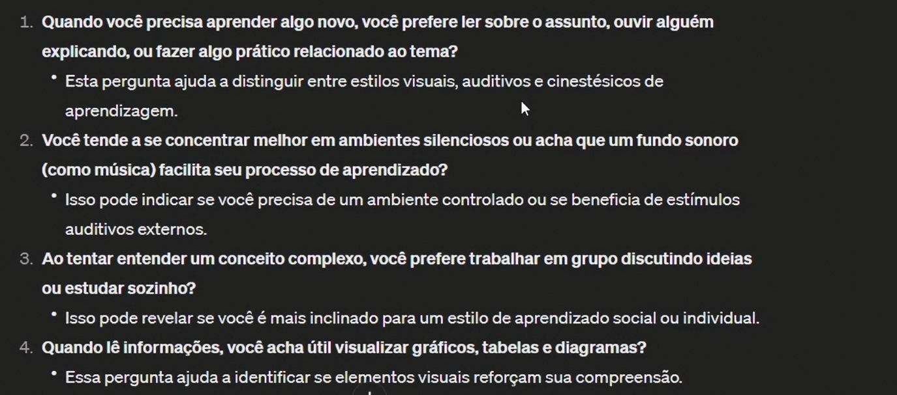
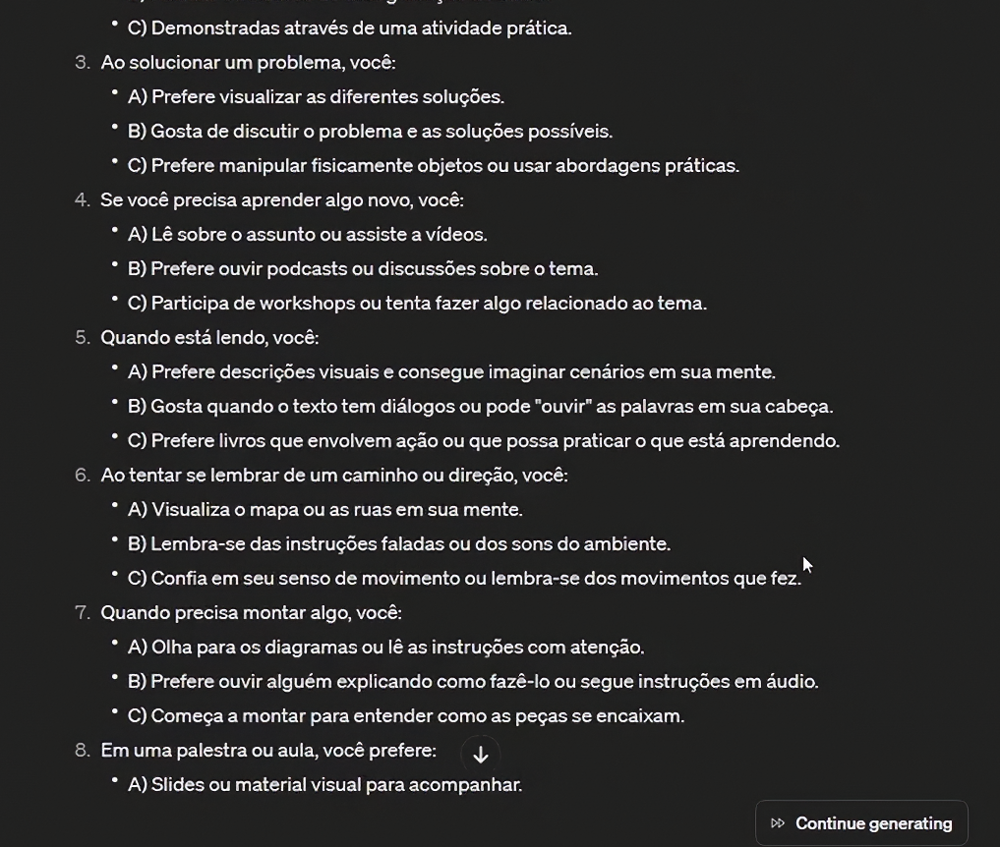
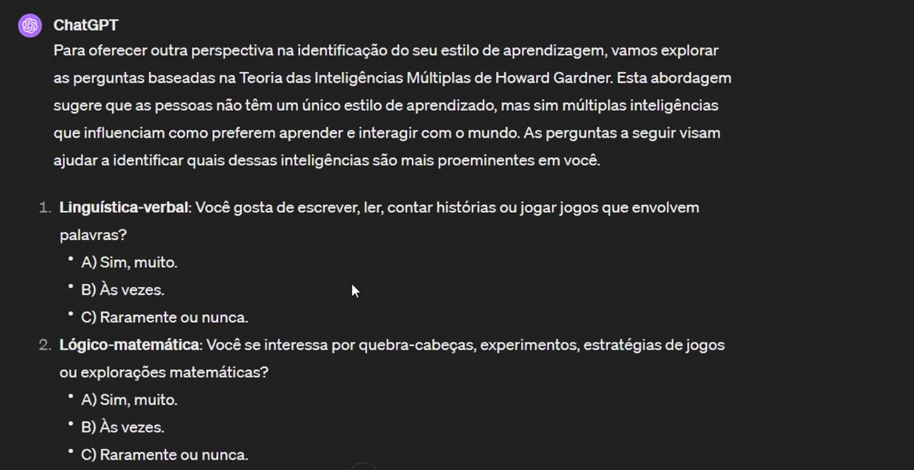
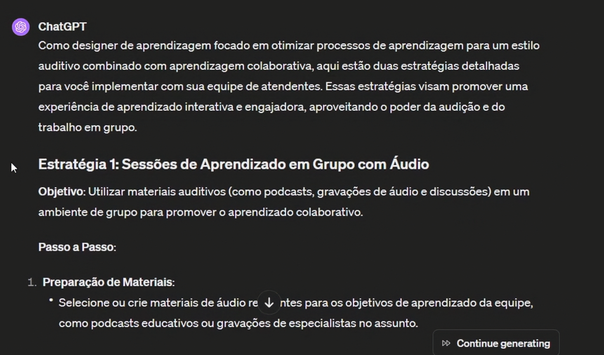
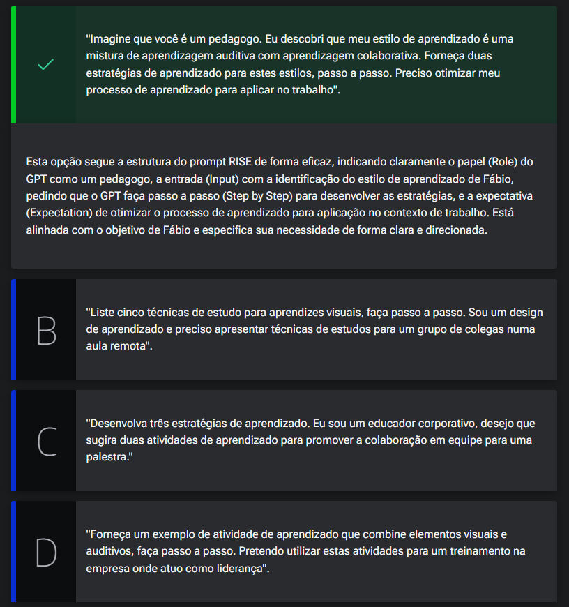
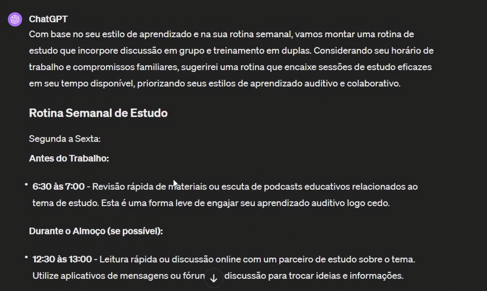
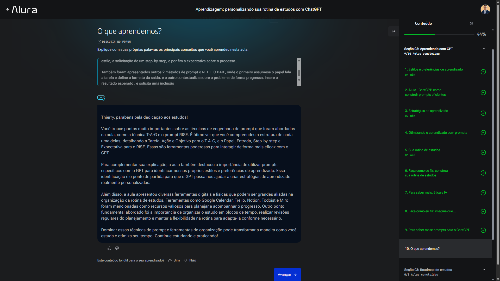

# Aprendendo com GPT

<a id="topo"></a>

## Sumário
- [Aprendendo com GPT](#aprendendo-com-gpt)
  - [Sumário](#sumário)
  - [1. Estilos e preferências de aprendizado](#1-estilos-e-preferências-de-aprendizado)
  - [2. Alura+ ChatGPT: como construir prompts eficientes](#2-alura-chatgpt-como-construir-prompts-eficientes)
  - [3. Estratégias de aprendizado](#3-estratégias-de-aprendizado)
  - [4. Otimizando o aprendizado com prompts](#4-otimizando-o-aprendizado-com-prompts)
  - [5. Sua rotina de estudos](#5-sua-rotina-de-estudos)
  - [6. Faça como eu fiz: construa sua rotina de estudos](#6-faça-como-eu-fiz-construa-sua-rotina-de-estudos)
  - [7. Para saber mais: ética e IA](#7-para-saber-mais-ética-e-ia)
  - [8. Faça como eu fiz: imagine que...](#8-faça-como-eu-fiz-imagine-que)
  - [9. Para saber mais: prompts para o ChatGPT](#9-para-saber-mais-prompts-para-o-chatgpt)
  - [10. O que aprendemos?](#10-o-que-aprendemos)

## 1. Estilos e preferências de aprendizado
A partir desse momento iremos aprender, técnicas de utilização do [chat GPT](https://chat.openai.com/chat) no processo de aprendizado de maneira mais eficiente.   
Dentro do local de inserção de prompt foi digitado o seguinte:  
```text
Faça-me dez perguntas-chave para identificar meu estilo de aprendizado. Eu quero entender como identificar meu estilo e preferência de aprendizado.Esta identificação é para melhorar meu processo de aprendizado e escolher as melhores formas de aprender. 
```
Diferentemente do texto acima que fora inteiramente digitado no curso foi utilizado um `comando` 
```prompt
\estilo
```
Que se utiliza de outra ferramenta de automação de texto que será visualizado futuramente no curso.  Ao realizar o prompt podemos ter um resultado como imagem abaixo:  
<table style="text-align: center; width: 100%;"> 
<tr>
    <td style="text-align: left;">
    
    </td>
</tr>
</table>

porém esse não é bem o resultado desejado, para melhor o prompt digitado iremos edita-lo com os seguintes dizeres:  
```text
Faça-me dez perguntas-chave em múltipla escolha para identificar meu estilo de aprendizado. Eu quero entender como identificar meu estilo e preferência de aprendizado.Esta identificação é para melhorar meu processo de aprendizado e escolher as melhores formas de aprender. 
```
<table style="text-align: center; width: 100%;"> 
<tr>
    <td style="text-align: left;">
    
    </td>
</tr>
</table>   

Após responder tais perguntas que foram geradas pelo Chat, ele deverá gerar uma analise sobre o seu processo de aprendizado.  
Mas o que tem por trás desse prompt que foi realizado, nesse prompt em questão utilizamos uma técnica conhecida como __`TAG`__, que significa:  
- Tarefa (task)
- Ação (action)
- Objetivo (Goal).

---
## 2. Alura+ ChatGPT: como construir prompts eficientes
Conforme já debatido anteriormente em outras aulas, incorremos sempre nos problemas de _"alucinações"_  de I.A ou respostas vagas e não tão coerentes com o que desejamos, para mitigar esses problemas segue abaixo algumas boas práticas, e dicas para melhor resultado durante sua construção de prompts:  
- 1 Seja claro e detalhista 
- 2 Sempre dê um contexto dentro do seu prompt.
- 3 Teste diferentes abordagens. 
- 4 Divida tarefas complexas.
- 5 Utilize exemplos dentro dos prompts.
- 6 Tenha um banco de prompts.
- 7 Pratique bastante a criação de prompts.

Dado todos as dicas e lista de  boas práticas listas acima vamos exemplificar uma conversa entre a I.A utilizando-as:  
```text
Atuo como social media e estou gerenciando uma página com conteúdo culinário no Instagram. O público da minha página são jovens entre 20 e 29 anos que querem aprender a cozinhar de forma simples e prática. Quero que me ajude a criar um post em formato carrossel dividindo em 5 partes que ensine o passo a passo para fazer um bolo de chocolate para festas de fim de ano. Utilize um tom de voz educativo e ao final acrescente uma chamada de ação para o site da marca. 
```
---
## 3. Estratégias de aprendizado
Voltando ao [exemplo anterior](#1-estilos-e-preferências-de-aprendizado), podemos continuar nossa interação no chat, utilizando o mesmo contexto de conversa porém agora iremos inserir um novo prompt com os seguintes dizeres:  
```text
FAÇA-ME PERGUNTAS-CHAVES PARA IDENTIFICAR MEU ESTILO DE APRENDIZADO E UTILIZE OUTRA TÉCNICA PARA IDENTIFICAÇÃO. EU QUERO ENTENDER COMO IDENTIFICAR MEU ESTILO E PREFERÊNCIA DE APRENDIZADO COM OUTRO PONTO DE VISTA. ESTA IDENTIFICAÇÃO É PARA MELHORAR MEU PROCESSO DE APRENDIZADO E ESCOLHER AS MELHORES FORMAS DE APRENDER.
```
Com esse prompt podemos ter um resultado como o seguinte:  
<table style="text-align: center; width: 100%;"> 
<tr>
    <td style="text-align: left;">
    
    </td>
</tr>
</table>   

Nesse modelo em questão foi realizado novas perguntas para identificação de modelo de aprendizado, ainda mantendo a estrutura de múltipla escolha  de resultados, porém com novas abordagens. Seguindo o processo de respostas, ele também realizará uma analise utilizando outra abordagem de aprendizado. 

Para além da identificação do estilo de aprendizagem, também podemos identificar estratégias que fazem sentido para o estilo, para isso podemos realizar um novo prompt com os seguintes dizeres:  
```text
Imagine que você é um design de aprendizagem. Eu descobri que meu estilo de aprendizado é uma mistura de aprendizagem auditiva com aprendizagem colaborativa. Forneça duas estratégias de aprendizado para estes estilos, passo a passo. Preciso otimizar meu processo de aprendizado para aplicar com minha equipe de atendentes no trabalho.
``` 
Com esse prompt podemos ter um resultado como o seguinte: 
<table style="text-align: center; width: 100%;"> 
<tr>
    <td style="text-align: left;">
    
    </td>
</tr>
</table>   

Podemos querer que a resposta gerada pela I.A não seja baseada como um `Design de aprendizagem` e sim como um __Educador__, para isso utilizamos o mesmo prompt em questão porém modificando o inicio dele para : `Imagine que você é um educador`.  E essa estrategia de modificação de estilo poderá ser replicada conforme necessidade e área de atuação.  

Para ambos os prompts visto nesse tópicos fora utilizado a técnica chamada de __`Prompt RISE`__ que significa:  
- _R_ Especifique o papel (ROLE)
- _I_ Defina a entrada (INPUT)
- _S_ Peça passo a passo (STEPS)
- _E_ Descreva sua expectativa (EXPECTATION)

---
## 4. Otimizando o aprendizado com prompts

Após identificar seu estilo de aprendizado como uma combinação de auditivo e colaborativo, Fábio decidiu utilizar o GPT para desenvolver estratégias de aprendizado personalizadas. Considerando a técnica de prompt RISE abordada nesta aula, ele precisa escolher a melhor abordagem para solicitar ao GPT estratégias que otimizem seu processo de aprendizado.

Qual das seguintes opções de prompt você sugere que Fábio utilize para alcançar seu objetivo de forma mais eficaz?

<table style="text-align: center; width: 100%;"> 
<tr>
    <td style="text-align: left;">
    
    </td>
</tr>
</table>   

---
## 5. Sua rotina de estudos

Além desses processos vistos, podemos utilizar ainda o chat para que ele possa elaborar uma rotina de estudos. Para tal podemos utilizar um prompt similar ao descrito abaixo:  
```text
Eu descobri que meu estilo de aprendizado é uma mistura de aprendizagem auditiva com aprendizagem colaborativa. Identifiquei duas estratégias de aprendizado de acordo com meu estilo: Discussão em grupo e treinamento em duplas. Preciso montar uma rotina de estudo com base nessas preferências, Minha rotina inclui: Inserir descrição da rotina
```
Com esse prompt podemos ter um resultado como o seguinte: 
<table style="text-align: center; width: 100%;"> 
<tr>
    <td style="text-align: left;">
    
    </td>
</tr>
</table>   

Mas para além do texto de sugestão de rotina sugeridos pelo chat gpt, podemos também utilizar algumas ferramentas para maximizar essa rotina proposta, essas podendo ser:  
- 1 Google Agenda
- 2 Trello e Notion
- 3 Planner físico  

Para entendermos melhor o que foi esse sugestionamento exemplificado acima podemos dissecar no seguinte:  
> - 1 Blocos de tempo
> - 2 Revisão e planejamento
> - 3 Flexibilidade 
---
## 6. Faça como eu fiz: construa sua rotina de estudos

Chegou a hora de aplicar o que aprendemos na construção de uma rotina de estudos eficaz.

- Utilize o GPT para explorar diferentes estilos de aprendizado e identifique aquele que melhor se adapta a você.
- Em seguida, analise suas estratégias de estudo atuais, considerando a organização do material, técnicas de memorização e ambiente de estudo.
- Utilize o GPT para orientações sobre como criar uma rotina de estudos eficaz, adaptada ao seu estilo de aprendizado e às suas estratégias identificadas.
- Com base nessas orientações, elabore um plano de estudos detalhado para as próximas semanas, definindo metas específicas e horários.
- Implemente o plano e ajuste conforme necessário, observando sua produtividade ao longo do tempo.
- Ao final, reflita sobre os resultados e faça ajustes para otimizar sua rotina de estudos, combinando as sugestões do GPT com sua própria experiência.

__Opinião do instrutor__  
Após realizar a análise do meu estilo de aprendizagem com o auxílio do Chat GPT:

- Identifiquei que sou uma pessoa aprendiz visual.
- Costumo organizar meu material de estudo com mapas mentais e resumos visuais, que construo com o auxílio da IA.
- Decidi revisar um capítulo por dia de cada disciplina durante duas horas todas as manhãs, utilizando a técnica Pomodoro.
- Incluí o uso de flashcards para reforçar a memorização.
- Ao longo das semanas, acompanho meu progresso e ajusto meu plano com a ajuda do chat GPT conforme necessário para garantir uma rotina de estudos eficaz.
---
## 7. Para saber mais: ética e IA
A relação entre ética e inteligência artificial (IA) é cada vez mais relevante devido ao papel crescente que a IA desempenha em diversas áreas da sociedade.  
A ética na IA envolve questões complexas relacionadas ao uso responsável e ético dessa tecnologia.
Alguns dos principais tópicos éticos em IA incluem viés algorítmico, privacidade, transparência, responsabilidade, equidade e segurança.  
A comunidade global está buscando desenvolver diretrizes e padrões éticos para governar o desenvolvimento e uso da IA de forma responsável. Isso inclui a criação de frameworks éticos, comitês de ética e regulamentações específicas para garantir que a IA seja desenvolvida e usada de maneira ética, respeitando os direitos humanos e promovendo o bem-estar social.

Se você quer conhecer mais sobre o tema, recomendamos a leitura do artigo["Ética e Inteligência Artificial (IA) para profissionais de tecnologia: navegando no mundo digital de forma responsável"](https://www.alura.com.br/artigos/etica-e-inteligencia-artificial) para uma compreensão mais aprofundada dessas questões éticas e de como os profissionais de tecnologia podem lidar com elas de maneira responsável.

---
## 8. Faça como eu fiz: imagine que...

Vimos nesta aula como utilizar o Prompt TAG para que o ChatGPT auxilie no processo de identificação de nosso estilo ou preferência de aprendizagem. Agora chegou a sua vez de interagir com o chat.

Primeiro, vamos lembrar como funciona o prompt utilizado em aula:
> __Tarefa:__ Faça-me dez perguntas-chave para identificar meu estilo de aprendizado.
> __Ação:__ Eu quero entender como identificar meu estilo e preferência de aprendizado.
> __Objetivo:__ Esta identificação é para melhorar meu processo de aprendizado e escolher as melhores formas de aprender.

Bora lá? Sinta-se à vontade para modificar o texto de cada etapa do prompt de acordo com suas necessidades e compartilhe conosco, pelo fórum ou pelo Discord da Alura o seu resultado!

Aproveite para em seguida, no mesmo chat, utilizar o Prompt RISE para selecionar algumas estratégias de aprendizado que estejam conectadas com o seu estilo.  
> __Papel (R ):__ Imagine que você é…[defina o papel].

> __Entrada (I):__ Eu descobri que meu estilo de aprendizado é...[inserir estilo identificado].

> __Passo a passo (S):__ Forneça duas estratégias de aprendizado para estes estilos, passo a passo.

> __Expectativa:__ Preciso otimizar meu processo de aprendizado para aplicar com minha equipe de atendentes no trabalho.

__Opinião do instrutor__  

Ao longo das aulas, testamos os seguintes prompts:

- TAG:
  ```text
  Faça-me dez perguntas-chaves para identificar meu estilo de aprendizado e uUtilize outra técnica para identificação. Eu quero entender como identificar meu estilo e preferência de aprendizado com outro ponto de vista. Esta identificação é para melhorar meu processo de aprendizado e escolher as melhores formas de aprender.
  ```
Depois, editamos o prompt pedindo que as perguntas fossem de múltipla escolha. Sinta-se à vontade para escolher o formato de questionário que melhor te ajudará.
- RISE:
  ```text
  Imagine que você é um design de aprendizagem. Eu descobri que meu estilo de aprendizado é uma mistura de aprendizagem auditiva com aprendizagem colaborativa. Forneça duas estratégias de aprendizado para estes estilos, passo a passo. Preciso otimizar meu processo de aprendizado para aplicar com minha equipe de atendentes no trabalho.
    ```
E
```text
Imagine que você é um educador corporativo. Eu descobri que meu estilo de aprendizado é uma mistura de aprendizagem auditiva com aprendizagem colaborativa. Forneça duas estratégias de aprendizado para estes estilos, passo a passo. Preciso otimizar meu processo de aprendizado para aplicar com minha equipe de atendentes no trabalho.
```
Aproveite o passo papel ou role no original para inserir uma posição que tenha relação com o ambiente que está aprendendo ou o setor que está aprendendo. Você é uma pessoa desenvolvedora? Que tal pedir que o GPT imagine ser uma liderança de tecnologia? Você trabalha com Marketing? Que tal pedir que ele assuma o papel de uma gerência de Marketing Digital? Aproveite e brinque!  

---
## 9. Para saber mais: prompts para o ChatGPT

Khizer Abbas é especialista em Growth Marketing e é o responsável por uma framework de prompts para o ChatGPT. Entre eles, conhecemos nesta aula dois modelos: Prompt TAG e Prompt RISE.
Esses prompts são projetados para ajudar a maximizar o potencial do ChatGPT, fornecendo uma maneira estruturada de interagir com o modelo de linguagem. Além dos dois modelos citados em aula, há outros, como:  

- __Prompt RTF:__
  - Papel ou Role, no original: Aja como um…[defina o papel]
  - Tarefa ou Task: Crie uma tarefa
  - Formato ou Format: Mostre-me no…[defina o formato]

- __Prompt BAB:__
  - Antes ou Before: Explique seu problema
  - Depois ou After: Diga o resultado que quer alcançar
  - Incluir ou Bridge: Peça para incluir

E como fica na prática esses dois formatos, por exemplo?

Veja este exemplo com o RTF:
  ```text
  Imagine que você é um estudante de programação buscando aprofundar seus conhecimentos em Python (Papel). Você precisa de um plano de estudo detalhado que inclua recursos online recomendados, projetos práticos para aplicar conceitos aprendidos(Tarefa). Para isso, é necessário um cronograma estruturado para manter um progresso consistente ao longo das próximas 8 semanas (Formato). Seu objetivo é ganhar confiança em estruturas de dados e algoritmos para se preparar para entrevistas de emprego em tecnologia.
  ```
Para finalizarmos, um exemplo com o BAB:
  ```text
  Tenho sentido estagnado e sobrecarregado ao tentar entender conceitos de programação avançados, como algoritmos complexos e estruturas de dados (Antes). Quer superar esse platô para progredir nos estudos e alcançar a habilidade de construir projetos complexos com confiança (Depois). E preciso de um método de estudo estruturado que inclua recursos adaptados ao meu estilo de aprendizagem, como tutoriais interativos, exercícios práticos e sessões de mentoria, para criar uma ponte entre o ponto onde estou agora e onde deseja estar (*Incluir)..
  ```
Adapte cada passo do prompt para sua realidade e compartilhe suas dúvidas no Fórum.

---
## 10. O que aprendemos?

<table style="text-align: center; width: 100%;"> 
<tr>
    <td style="text-align: left;">
    
    </td>
</tr>
</table>   

---

<table align="center" style="border-collapse: collapse; margin-left: auto; margin-right: auto;"> 
  <caption><b>Skills do projeto</b></caption>
  <tr>
    <td style="padding: 5px;">
      
    </td>
    <td style="padding: 5px;">
      
    </td>
  </tr>
</table>


---
__Titulo:__ Aprendendo com GPT
__Autor:__ Thierry Lucas Chaves  
__Data de Criação:__ 27-05-2026  
__Data de Modificação:__ 28-05-2026  
__Versão:__ "1.0"