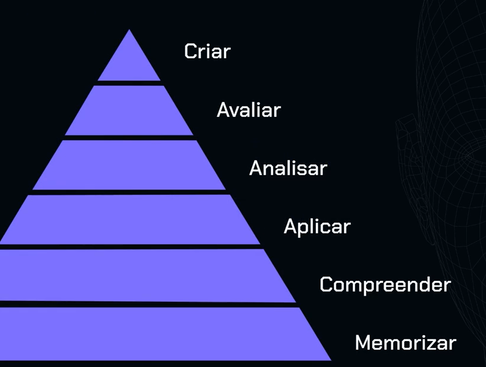
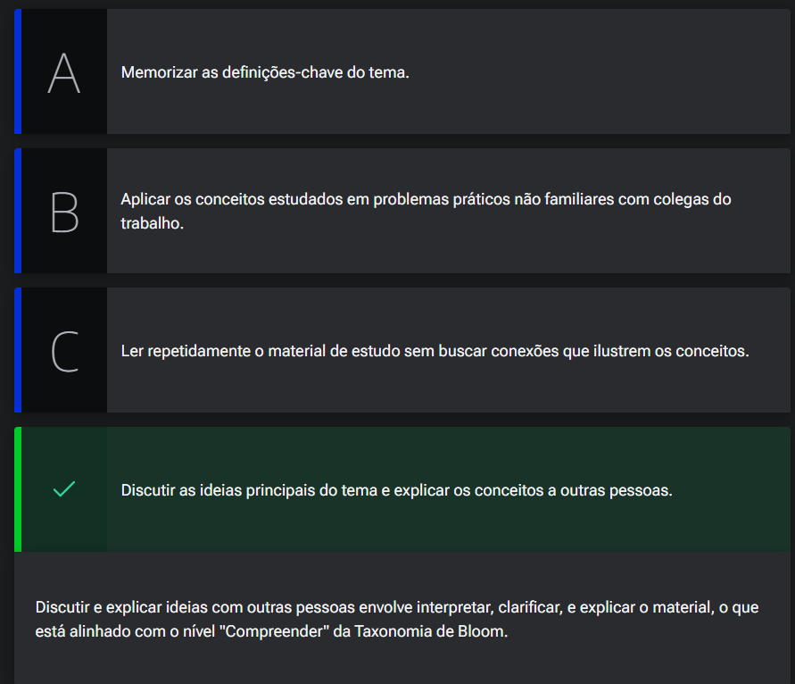

# Rodmap de estudos

<a id="topo"></a>

## Sumário
- [Rodmap de estudos](#rodmap-de-estudos)
  - [Sumário](#sumário)
  - [1. Roadmap de estudos](#1-roadmap-de-estudos)
  - [2. Taxonomia de Bloom](#2-taxonomia-de-bloom)
  - [3. Mão na massa: cronograma de estudos](#3-mão-na-massa-cronograma-de-estudos)
  - [4. Desafio: 7 days of code](#4-desafio-7-days-of-code)
  - [5. Níveis de aprendizagem](#5-níveis-de-aprendizagem)
  - [6. Avançando no roadmap de estudos](#6-avançando-no-roadmap-de-estudos)
  - [7. Mão na massa: crie seu roadmap de estudos](#7-mão-na-massa-crie-seu-roadmap-de-estudos)
  - [8. O que aprendemos?](#8-o-que-aprendemos)

## 1. Roadmap de estudos
Uma das informações fundamentais para o processo de aprendizagem é saber em qual nível ou qual etapa do aprendizado estamos, para exemplificar o processo em questão, vamos supor  que esteja começando o processo de aprendizagem e para tal passamos por algumas etapas:
- 1º Memorizar informações básicas
- 2º Compreensão da sintaxe e lógica
- 3º Analisar o projeto em questão. 

Para qualquer processo de estudos ou de objetivo traçado para o estudo precisamos passar pelas as etapas descritas, de memorizar, compreender, e analisar, porém para isso precisamos realizar uma melhor organização do estudo de acordo com o nível de aprendizado, e uma das ferramentas possíveis de serem utilizadas, e uma que será demonstrada é a ferramenta de  ROADMAP DE ESTUDOS. que consiste nos pontos:  
- Mapa 
- Objetivos. 
- Curto, médio e longo prazo.

Uma diferença primordial entre um ROADMAP e um cronograma de estudos se da no fato que um cronograma está focado nas atividades que devem ser realizadas com uma delimitação de tempo X. Já o roadmap não é focado nas tarefas que devem ser feitas e sim nos objetivos que se deseja alcançar.
Supondo que temos o objetivo de ser proficiente em Python podemos realizar o roadmap da seguinte maneira:
>
>|                         |                                     |                                            |                           |
>| ----------------------- | ----------------------------------- | ------------------------------------------ | ------------------------- |
>| Temáticas               | Curto prazo                         | Médio prazo                                | Longo Prazo               |
>| Python                  | Memorizar conceitos e regras Python | Compreender os conceitos básicos de python | Aplicar Python em projeto |
>| Inteligencia artificial | Objetivo 01                         | Objetivo 02                                | Objetivo 03               |
>| Comunicação             | Objetivo 01                         | Objetivo 02                                | Objetivo 03               |

Nesse processo não temos um limite temporal bem demarcado e delimitador como em um cronograma, como por exemplo para alguma pessoa a atividade demarcada no curto prazo pode durar entre 8 horas ou até 2 meses, estando mais ligado no que esta sendo feito agora que no restante.
Nesse quadro acima, podemos ser mais objetivos como por exemplo aplicar um questionamento de quais conceitos? quais regras? etc..

E Podemos por exemplo aplicar I.A para construção desse ROADMAP

```TEXT
Estou começando a estudar Python. Gostaria de estabelecer três objetivos de aprendizagem na seguinte ordem: Memorizar, compreender, aplicar. Cada objetivo será separado em curto, médio e longo prazo, sendo memorizar a curto prazo, compreender a médio e aplicar a longo prazo. Crie quatro colunas, sendo a primeira temática "Ptyhon" e outras três colunas com objetivos a curto,médio e longo prazo.
```


## 2. Taxonomia de Bloom

Os níveis de aprendizados, que foram anteriormente, fazem parte do chamado de `Taxonomia de Bloom` mais especificamente o domínio cognitivo, e para esse domínio  cognitivo possuem 6 níveis, sendo eles 

<table style="text-align: center; width: 100%;"> 
<tr>
    <td style="text-align: center;">
    
    </td>
</tr>
</table>

O processo é representado por ma piramide, pois temos passo para aplicar cada conhecimento 
- 1 Memorizar, nesse passo estamos somente repetindo o que foi passado as informações são decoradas e repassadas 
- 2 Compreender, nesse passo começamos a ter um melhor entendimento do processo 
- 3 Aplicar, como já entendemos o que antes era decorado agora partimos para prática onde aquele conhecimento é aplicado 
- 4 Analisar, aqui já começamos a analisar, tendencias padrões, ou até mesmo diferenças  entre partes de mesmo assunto. 
- 5 Avaliar, aqui depois que realizamos o entendimento do processo a analise dele, seguimos começar a fazer julgamento ou avaliações sobre o assunto, sobre técnicas etc..
- 6 Criar, aqui é a última etapa do processo aqui não estamos simplesmente realizando uma replicação de algo em uma situação conhecida, aqui criamos algo a partir do assunto 

Podemos realizar o seguinte prompt para o `Chat GPT`, para que possamos averiguar em qual nível estamos:  

```text
Estou estudando lógica de programação e quero saber em que nível do domínio cognitivo da taxonomia de bloom estou para organizar meu estudo, sendo os níveis:

1 Memorizar
2 Compreender 
3 Aplicar
4 Analisar
5 Avaliar
6 Criar 

Você pode fazer 10 perguntas objetivas para identificar em qual nível de aprendizado me encontro no momento?
```

---
## 3. Mão na massa: cronograma de estudos
Chegou o momento de aplicar o conhecimento da Taxonomia de Bloom na criação de um cronograma de estudos eficaz. Nesta atividade, você utilizará o GPT ou Bing para explorar os diferentes níveis da Taxonomia de Bloom e identificar estratégias de estudo correspondentes a cada nível. Em seguida, aplicará essas estratégias para desenvolver um cronograma de estudos personalizado.

__Passos:__

- __Exploração da Taxonomia de Bloom:__
  - Utilize o GPT ou Bing para pesquisar sobre os seis níveis da Taxonomia de Bloom: memorizar, compreender, aplicar, analisar, avaliar e criar. Anote estratégias de estudo associadas a cada nível.  

- __Identificação de Estratégias de Estudo:__
  - Com base nas informações coletadas, identifique estratégias de estudo específicas que correspondam a cada nível da Taxonomia de Bloom. Considere técnicas como resumos, mapas mentais, estudos de caso, entre outras.

- __Desenvolvimento do Cronograma de Estudos:__
  - Utilize as estratégias identificadas para elaborar um cronograma de estudos semanal ou mensal. Distribua suas atividades de estudo conforme os diferentes níveis da Taxonomia de Bloom, priorizando áreas em que você deseja se aprimorar.  
  - 
- __Compartilhamento e Discussão:__
  - Compartilhe seu cronograma de estudos e suas experiências no fórum do curso. Discuta suas estratégias e aprenda com os colegas sobre diferentes abordagens para aprimorar o estudo com base na Taxonomia de Bloom.

__Opinião do instrutor__  
Vamos observar como essa atividade pode ser realizada com um exemplo fictício:

Após pesquisar com o auxílio da IA, compreendo os principais pontos da Taxonomia de Bloom e as estratégias que podem ser traçadas.

Com base nas estratégias identificadas, desenvolvo um cronograma de estudos semanal que inclui tempo dedicado a cada nível da Taxonomia de Bloom. Por exemplo, reservo duas horas para memorização usando flashcards, seguidas por uma hora para compreensão por meio de discussões em grupo. Além disso, agendo sessões de estudo prático para aplicar e analisar conceitos, e reservo tempo para avaliar fontes e criar projetos originais.

[↑ Voltar ao topo](#topo)

---
## 4. Desafio: 7 days of code
O [7 Days of Code](https://7daysofcode.io/) é uma iniciativa da Alura que propõe sete desafios práticos em diversas áreas da tecnologia, como Front-End, Back-End, Dados, e Mobile, para praticar e aprimorar habilidades em programação. Cada participante escolhe a tecnologia que deseja aprender ou melhorar, recebendo um desafio diário por e-mail durante uma semana. Esta é uma oportunidade para desenvolvedores de todos os níveis demonstrarem suas habilidades e adicionarem projetos ao seu portfólio.  

Mas que tal, além de praticar o teu conhecimento, inserir a IA como assistente neste processo?  

Desafie-se a participar do ["7 Days of Code"](https://7daysofcode.io/) e aprimore suas habilidades de programação! Nesta atividade, você utilizará o Chat GPT ou o Bing para buscar orientações e sugestões enquanto enfrenta um dos desafios propostos. O objetivo é aplicar seus conhecimentos de programação e desenvolver soluções criativas para problemas reais.  
__Opinião do instrutor__  
- __Passos:__

- __Escolha do Desafio:__
  - Explore os desafios disponíveis no "7 Days of Code" e escolha um que esteja de acordo com suas habilidades e interesses. Anote o enunciado do problema e os requisitos específicos.

- __Pesquisa de Orientações:__
  - Utilize a IA para buscar orientações sobre como abordar o problema escolhido.

- __Implementação da Solução:__
  - Com base nas orientações fornecidas pelo GPT, comece a desenvolver sua solução para o desafio.

- __Compartilhamento e Discussão:__
  - Compartilhe sua solução e experiência no fórum do "7 Days of Code". Discuta sua abordagem com outros estudantes, compartilhe insights e aprenda com diferentes perspectivas.

[↑ Voltar ao topo](#topo)

---
## 5. Níveis de aprendizagem

Considere o seguinte cenário: você está se preparando para o exame de uma certificação. Você tem um vasto conteúdo para revisar e quer garantir que está estudando da maneira mais eficaz possível. Nesta aula, você aprendeu sobre a Taxonomia de Bloom e como ela pode ser aplicada para melhorar a rotina de aprendizagem, organizando os objetivos de estudo conforme os níveis cognitivos: Memorizar, Compreender, Aplicar, Analisar, Avaliar e Criar. Você decide aplicar essa estrutura para planejar seus estudos.   
Qual atividade de estudo você deveria priorizar para atingir o nível de "Compreender" em sua preparação para o exame final?

<table style="text-align: center; width: 100%;"> 
<tr>
    <td style="text-align: center;">
    
    </td>
</tr>
</table>

---
## 6. Avançando no roadmap de estudos
Avançando no processo da construção do ROADMAP, vamos construir um novo voltado para alguém que por exemplo ocupe um cargo de liderança

> |                   |                                                                       |                                               |                                                                                            |
>| ----------------- | --------------------------------------------------------------------- | --------------------------------------------- | ------------------------------------------------------------------------------------------ |
> | Temáticas         | Curto prazo                                                           | Médio prazo                                   | Longo Prazo                                                                                |
>| Gestão de pessoas | Melhorar a integração e o engajamento das novas integrantes na equipe | Avaliar modelos de dinâmicas de Team Building | Criar um novo modelo de avaliação de competências para novas pessoas integrantes da equipe |

Ta mas como podemos identificar os outros 3 níveis de acordo com a taxonomia de `Bloom`:

- Analisar: Integração e o engajamento das novas integrantes na equipe
- Avaliar: Modelos de dinâmicas de Team building
- Criar: Modelo de avaliação de competências

---
## 7. Mão na massa: crie seu roadmap de estudos

Ao longo desta aula você aprendeu como montar um Roadmap de Estudos com o auxílio da Taxonomia de Bloom e entendeu como o ChatGPT pode apoiar esta construção. Agora chegou a hora de colocar a mão na massa e desenvolver o seu Roadmap. 

Disponibilizamos para você uma [planilha modelo de Roadmap](db/Modelo%20de%20Roadmap%20de%20Estudos%20-%20Alura.xlsx) para usar.

Acesse o arquivo e inicie sua atividade!

Compartilhe sua resposta conosco e em caso de dúvidas, utilize o Fórum. Bons estudos!

Opinião do instrutor
•

Opções
Lembre-se:

Defina em quais etapas da Taxonomia de Bloom você se encontra e caso tenha dificuldades em identificar, utilize o ChatGPT para te ajudar. Além disso, você também pode usar a IA para auxiliar na construção dos seus objetivos a curto, médio e longo prazo.

Ao utilizar o ChatGPT, escolha algum modelo de prompt que pode potencializar a resposta da IA e gerar resultados melhores.

---
## 8. O que aprendemos?
Nessa aula, você aprendeu como:
- Construir um roadmap de estudos:
- Definindo objetivos a curto, médio e longo prazo.
- Como utilizar a Taxonomia de Bloom para organizar seu roadmap em níveis de aprendizagem:
- Memorizar
- Compreender
- Aplicar
- Analisar
- Avaliar
- Criar
- Como utilizar o ChatGPT para construir seu roadmap nos seis níveis de aprendizagem da Taxonomia de Bloom;
- Como utilizar o ChatGPT para identificar em qual nível da taxonomia você se encontra.


---

<table align="center" style="border-collapse: collapse; margin-left: auto; margin-right: auto;"> 
  <caption><b>Skills do projeto</b></caption>
  <tr>
    <td style="padding: 5px;">
      
    </td>
    <td style="padding: 5px;">
      
    </td>
  </tr>
</table>


---
__Titulo:__ Rodmap de estudos
__Autor:__ Thierry Lucas Chaves  
__Data de Criação:__ 28-05-2026  
__Data de Modificação:__ 29-05-2026  
__Versão:__ "1.0"