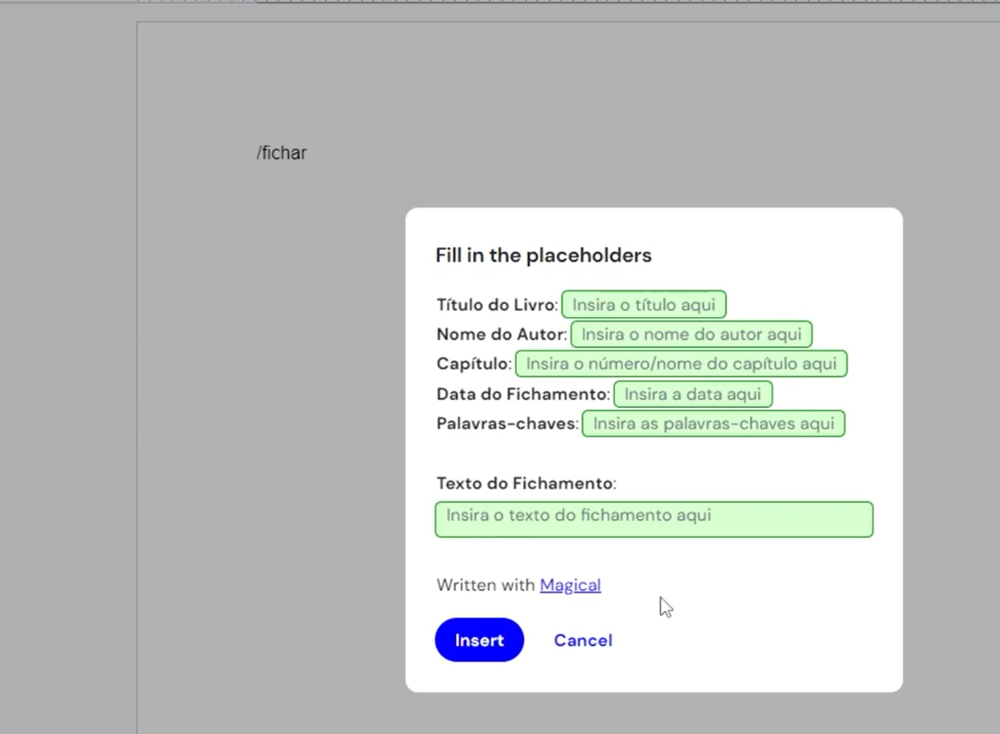
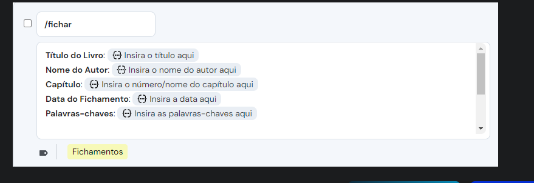
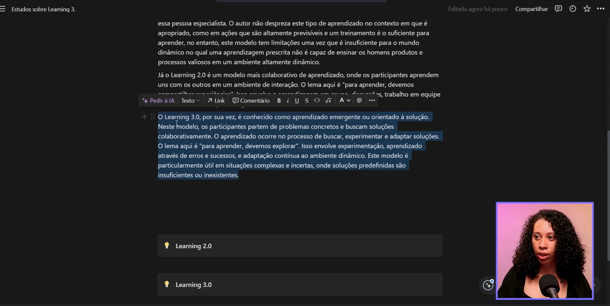
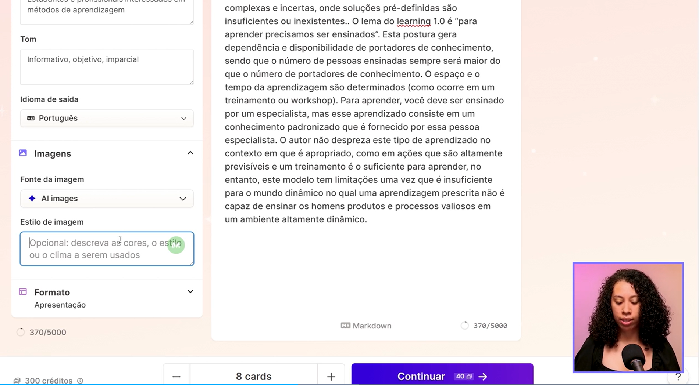
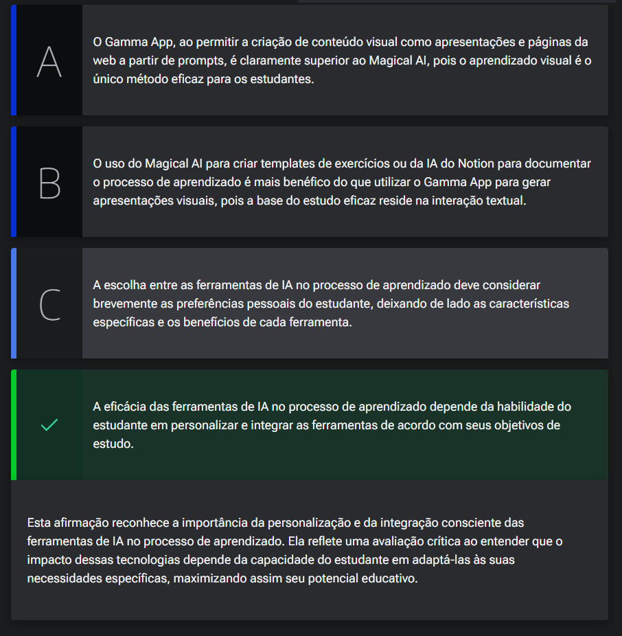

# IA na rotina de estudos

<a id="topo"></a>

## Sumário
- [IA na rotina de estudos](#ia-na-rotina-de-estudos)
  - [Sumário](#sumário)
  - [1. Magical IA](#1-magical-ia)
  - [2. Mão na massa: utilizando a IA do Magical](#2-mão-na-massa-utilizando-a-ia-do-magical)
  - [Nota: Atualmente, a ferramenta Magical não disponibiliza o assistente de IA (AI Assistant) no plano de teste.](#nota-atualmente-a-ferramenta-magical-não-disponibiliza-o-assistente-de-ia-ai-assistant-no-plano-de-teste)
  - [3. IA do Notion](#3-ia-do-notion)
  - [4. Gamma APP](#4-gamma-app)
  - [5. Avaliando as ferramentas](#5-avaliando-as-ferramentas)
  - [6. Para saber mais: explorando outras ferramentas](#6-para-saber-mais-explorando-outras-ferramentas)
  - [7. Mão na massa: desenvolva seu prompt para o Gamma APP](#7-mão-na-massa-desenvolva-seu-prompt-para-o-gamma-app)
  - [8. O que aprendemos?](#8-o-que-aprendemos)

## 1. Magical IA

Após compreender como podemos utilizar e criar um roadmap de estudos com auxilio do GPT, e utilizando a taxonomia de `Bloom`, e utilizamos o chat gpt para identificar modelo de aprendizagem confecção de roadmap etc..
Porém existem outras ferramentas para auxiliar em tarefas do dia a dia. 
Uma delas é o [Magical](chrome-extension://iibninhmiggehlcdolcilmhacighjamp/options.html), que é uma extensão no navegador, que nos auxilia no processo de automação de textos através de macros 

<table style="text-align: center; width: 100%;"> 
<tr>
    <td style="text-align: left;">
    
    </td>
</tr>
</table>

---
## 2. Mão na massa: utilizando a IA do Magical

 Nota: Atualmente, a ferramenta Magical não disponibiliza o assistente de IA (AI Assistant) no plano de teste.
---
Nesta aula conhecemos um pouco sobre a IA do [Magical](chrome-extension://iibninhmiggehlcdolcilmhacighjamp/options.html).
Magical AI é uma ferramenta de assistência à escrita que permite automatizar a redação de mensagens em diversas plataformas com um clique. Ela é projetada para responder a emails, mensagens no Slack, LinkedIn DMs, e WhatsApp sem a necessidade de digitar ou elaborar respostas manualmente.

Fizemos uma adaptação desta ferramenta para criar templates para exercícios e postagem na plataforma do LinkedIn e agora chegou a sua vez de utilizar a ferramenta!

Você pode escolher criar um template personalizado com a assistência da IA para um fichamento, para um resumo, para listas de exercícios, postagens do seu progresso de estudos em redes sociais. A criatividade está com você nesta agora.

Crie sua conta no [site do Magical](https://www.getmagical.com/signup) e vá para a área de trabalho ou workspace como achará na ferramenta e siga, passo a passo, como demonstrado em vídeo para criar seus templates com a assistência da IA.

Qualquer dúvida, temos o Fórum à disposição.

Lembre-se de compartilhar conosco o resultado do seu template : )

__Opinião do instrutor__    

Ao longo da aula elaboramos três templates:

- Para 10 exercícios
- Para exercícios de múltipla escolha
- Para uma postagem no LinkedIn sobre estudo  

Você pode criar os mesmos e até outros que faça sentido para sua rotina de aprendizado.
Caso não queira utilizar a IA do Magical, você pode construir seus templates manualmente, utilizando os placeholders, um campo reservado para alguma informação específica, como “título”, “nome”, entre outros.

<table style="text-align: center; width: 100%;"> 
<tr>
    <td style="text-align: left;">
    
    </td>
</tr>
</table>

---
## 3. IA do Notion

Para além do Magical, também temos a do Notion, que pode ser apresentada  da seguinte forma:  

<table style="text-align: center; width: 100%;"> 
<tr>
    <td style="text-align: left;">
    
    </td>
</tr>
</table>

---
## 4. Gamma APP

Até o presente momento ,vismo muitas I.A que são muito focadas em texto, porém temos o [GAMMA APP](https://gamma.app/create/generate), onde serve para gerar informações mais visuais 

<table style="text-align: center; width: 100%;"> 
<tr>
    <td style="text-align: left;">
    
    </td>
</tr>
</table>

---
## 5. Avaliando as ferramentas

Após explicar esta aula, você pode se deparar com uma variedade de ferramentas e técnicas para otimizar seu processo de aprendizado. Desde a criação de templates para exercícios com o Magical AI ou fichamentos com a IA do Notion, até a elaboração de apresentações visuais com o Gamma App, percebemos o potencial transformador da IA na educação. Agora, você deve avaliar criticamente o potencial das ferramentas de IA e sua aplicabilidade e impacto no seu dia a dia de estudo.

Considerando o que você aprendeu sobre o uso de ferramentas de IA para documentar e otimizar seu processo de aprendizado, qual das seguintes afirmações melhor reflete uma avaliação crítica sobre a aplicação dessas tecnologias?    

<table style="text-align: center; width: 100%;"> 
<tr>
    <td style="text-align: left;">
    
    </td>
</tr>
</table>

---
## 6. Para saber mais: explorando outras ferramentas

Agora que você adentrou no vasto universo das ferramentas de Inteligência Artificial, é empolgante descobrir opções que ampliam seu aprendizado.

Três notáveis exemplos são as IAs: VideoHighlight, ChatMind e AskYourPDF.

O [VideoHighlight](https://videohighlight.com/) é uma solução inteligente para quem deseja destacar momentos cruciais em vídeos. Equipado com algoritmos avançados de reconhecimento de padrões, esta IA identifica automaticamente os trechos mais relevantes, poupando aos usuários tempo e esforço durante a edição.  

O [Mapify](https://mapify.so/pt), por sua vez, foi desenvolvido para aprimorar a interação humana em chats online. Utilizando sofisticadas técnicas de processamento de linguagem natural, essa IA compreende as mensagens dos usuários e oferece respostas precisas e úteis em tempo real, aprimorando a experiência do usuário e otimizando o atendimento.  


Finalmente, o [AskYourPDF](https://askyourpdf.com/pt) é uma IA projetada para simplificar a extração de informações de documentos PDF. Equipada com reconhecimento óptico de caracteres (OCR) e processamento inteligente de texto, essa IA permite aos usuários buscar e extrair facilmente dados específicos de documentos em PDF, tornando a pesquisa e organização de dados mais eficientes.  

Esses exemplos ilustram o potencial transformador da inteligência artificial em diversos campos, oferecendo soluções inovadoras que facilitam nossas vidas e impulsionam a produtividade. Conhece outras ferramentas notáveis? Compartilhe suas descobertas em nosso fórum para ajudar outros estudantes a explorarem novas plataformas!

---
## 7. Mão na massa: desenvolva seu prompt para o Gamma APP

A IA do Gamma App foca em automatizar e otimizar a criação de conteúdo digital, como apresentações, documentos e páginas web. Utiliza tecnologias avançadas para entender as instruções do usuário e gerar conteúdos relevantes e esteticamente agradáveis com base nesses inputs, facilitando a personalização e a edição sem a necessidade de habilidades técnicas ou de design.

E como vimos nesta aula, a IA do Gamma também consegue gerar imagens a partir de prompts para suas apresentações. Para essa atividade, você pode criar uma apresentação a partir de um documento já existente ou não, mas te desafiamos a desenvolver um prompt para gerar imagens condizentes com o conteúdo da sua apresentação.

__Opinião do instrutor__  
Em aula utilizamos o seguinte prompt para as imagens:
```text
Imagine uma sala ampla e iluminada, banhada pela luz natural que entra através de grandes janelas. A sala é vibrante, com paredes pintadas em tons quentes de amarelo e detalhes em vermelho vivo, criando um ambiente energético e inspirador. No centro, uma grande mesa de madeira clara reúne um grupo diverso de trabalhadores, homens e mulheres de várias idades e etnias, vestindo roupas casuais-profissionais. Eles estão envolvidos em uma discussão animada, gestos expressivos sugerem uma troca de ideias proativa e colaborativa. Alguns estão de pé, apontando para documentos e gráficos coloridos espalhados sobre a mesa, enquanto outros estão sentados, contribuindo com suas opiniões e tomando notas em notebooks e tablets. A imagem deve capturar o momento dinâmico e positivo da equipe trabalhando juntos, com expressões focadas, mas entusiasmadas. O foco é na interação energética, na comunicação eficaz e na paixão compartilhada pelo projeto em mãos. As cores vivas, como vermelho e amarelo, devem realçar a atmosfera de otimismo e criatividade no espaço de trabalho.
```

---
## 8. O que aprendemos?

[↑ Voltar ao topo](#topo)

Nessa aula, você aprendeu como:  
- Ferramentas de inteligência artificial para o dia a dia, como:
  - Utilizar a IA do Magical para:
    - Construir templates textuais para exercícios e postagens em redes sociais.
- Utilizar a IA do Notion;
- Utilizar a IA do Gamma App:
  - Para criar apresentações ou documentos;
  - Gerar imagens para suas apresentações.

---

<table align="center" style="border-collapse: collapse; margin-left: auto; margin-right: auto;"> 
  <caption><b>Skills do projeto</b></caption>
  <tr>
    <td style="padding: 5px;">
      
    </td>
    <td style="padding: 5px;">
      
    </td>
  </tr>
</table>


---
__Titulo:__ IA na rotina de estudos
__Autor:__ Thierry Lucas Chaves  
__Data de Criação:__ 29-05-2026  
__Data de Modificação:__ 29-05-2026  
__Versão:__ "1.0"