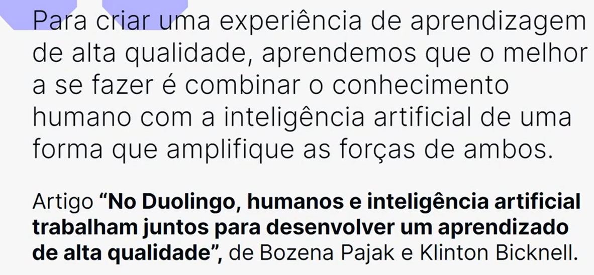
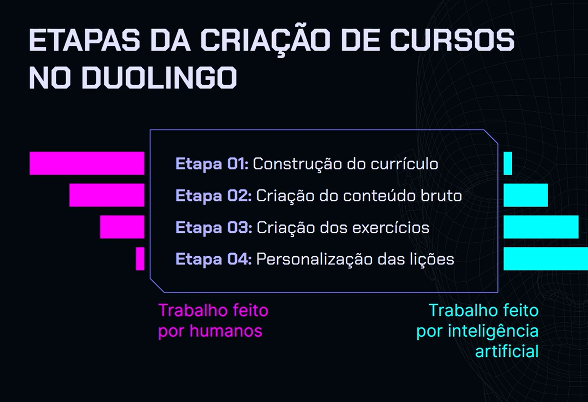
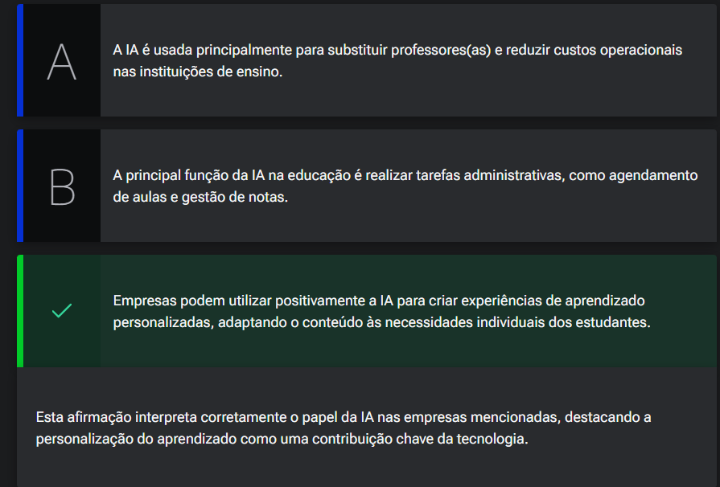
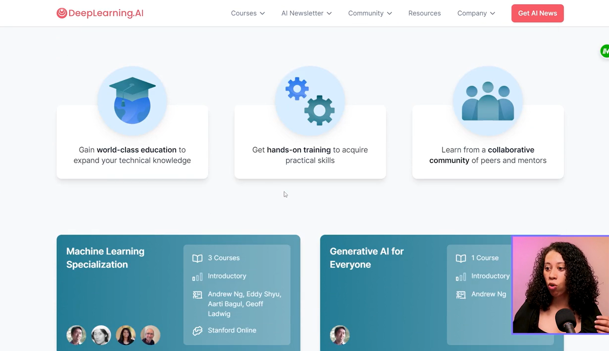

# Cases: IA aplicada no aprendizado

## Sumário
- [Cases: IA aplicada no aprendizado](#cases-ia-aplicada-no-aprendizado)
  - [Sumário](#sumário)
  - [1. Cases: empresas e IA](#1-cases-empresas-e-ia)
  - [2. Um olhar sobre empresas inovadoras](#2-um-olhar-sobre-empresas-inovadoras)
  - [3. Mão na massa: análise de caso](#3-mão-na-massa-análise-de-caso)
  - [4. Cases: pessoas e IA](#4-cases-pessoas-e-ia)
  - [5. Para saber mais: indicação de TEDx Talks](#5-para-saber-mais-indicação-de-tedx-talks)
  - [6. Para ir mais fundo](#6-para-ir-mais-fundo)
  - [7. O que aprendemos?](#7-o-que-aprendemos)

## 1. Cases: empresas e IA
Vamos citar alguns casos de empresas que estão utilizando I.A no mundo real 
Duolingo:  

<table style="text-align: center; width: 100%;"> 
<tr>
    <td style="text-align: left;">
    
    </td>
</tr>
</table>

<table style="text-align: center; width: 100%;"> 
<tr>
    <td style="text-align: left;">
    
    </td>
</tr>
</table>

---
## 2. Um olhar sobre empresas inovadoras

A tecnologia avança a passos largos! O processo de aprendizado tem visto uma transformação significativa com a introdução da inteligência artificial (IA). Empresas inovadoras estão na vanguarda dessa mudança, utilizando IA para criar experiências de aprendizado mais personalizadas e eficazes. Duolingo, Nuance, Stepwise e Carnegie Learning são exemplos de como a IA está sendo aplicada para melhorar tanto o ensino quanto a aprendizagem. Cada uma dessas empresas adota uma abordagem única para integrar a IA em suas soluções educacionais, desde a otimização da criação de cursos até a personalização do ensino.

Considerando as informações sobre as empresas que utilizam IA na educação, qual das seguintes afirmações melhor interpreta e explica a contribuição da inteligência artificial para o processo de aprendizado, conforme exemplificado pelas empresas mencionadas?

<table style="text-align: center; width: 100%;"> 
<tr>
    <td style="text-align: left;">
    
    </td>
</tr>
</table>

---
## 3. Mão na massa: análise de caso
Nesta aula conhecemos alguns exemplos de empresas que estão utilizando a inteligência artificial para aprimorar seus processos. Falamos das seguintes:
- Duolingo
- Nuance
- Stepwise
- Carnegie Learning

Escolha um destes cases apresentados na aula, um que mais lhe interesse, especialmente aquele que você acredita ter aplicações inovadoras de inteligência artificial na educação ou outros exemplos. Realize uma pesquisa detalhada sobre a empresa selecionada. Foque em entender como ela integra inteligência artificial em seus serviços ou produtos educacionais. Algumas questões para orientar sua pesquisa:  

- Como a empresa descreve o uso da IA em seus processos ou ofertas?
- Quais problemas específicos a aplicação de IA visa resolver na educação?
- Existem resultados mensuráveis ou estudos de caso que demonstrem o impacto da IA?

Você também pode adicionar outras perguntas ou outros pontos que achar relevantes em sua pesquisa. Alguns materiais podem estar em inglês, mas você pode optar pela tradução do Google Chrome ou utilizar a tradução automática, caso o conteúdo esteja em vídeo.  

Apresentação
Com base na sua pesquisa, crie um material de apresentação. Você pode utilizar o Gamma App ou o Notion, por exemplo, aproveitando suas IAs para dar aquele up no seu conteúdo. Lembre-se de compartilhar sua apresentação no Fórum ou no Discord para que possamos gerar um momento de conhecimento compartilhado com outros alunos e alunas.  

__Opinião do instrutor__  
Esta atividade foi cuidadosamente projetada para não apenas reforçar o conteúdo aprendido sobre o uso de inteligência artificial nas empresas de educação, mas também para desenvolver suas habilidades críticas e analíticas importantes.

Além disso, o compartilhamento da sua pesquisa e o eventual feedback entre pares ajuda a promover um ambiente de aprendizado colaborativo, onde você e outras pessoas podem aprender umas com as outras, explorando diferentes perspectivas e aprofundar seu entendimento sobre as possibilidades e desafios associados ao uso da IA na aprendizagem.  

---
## 4. Cases: pessoas e IA
<table style="text-align: center; width: 100%;"> 
<tr>
    <td style="text-align: left;">
    
    </td>
</tr>
</table>I

---
## 5. Para saber mais: indicação de TEDx Talks

Para aprimorar ainda mais seus estudos em IA, recomendamos assistir a dois TED Talks inspiradores disponíveis no YouTube.  
O primeiro é ["A teaching assistant named Jill Watson"](https://www.youtube.com/watch?v=WbCguICyfTA) apresentado por Ashok Goel no TEDxSanFrancisco. Neste vídeo, Goel compartilha a fascinante história de Jill Watson.  

O segundo TED Talk é ["How AI Could Empower Any Business"](https://www.youtube.com/watch?v=reUZRyXxUs4) conduzido por Andrew Ng. Nesta palestra, Ng explora o impacto potencial da IA em qualquer negócio e como ela pode ser uma ferramenta poderosa para impulsionar o crescimento e a inovação empresarial.

Ambos os TED Talks oferecem insights sobre o papel da IA em diferentes contextos e são apresentados em inglês.
Para assistir em português, basta acessar as opções de legendas e selecionar a opção "auto translate" para português. Isso permitirá que você desfrute do conteúdo completo e absorva os conhecimentos compartilhados pelos palestrantes.

---
## 6. Para ir mais fundo

- Conselho da Europa - Inteligência Artificial no Sistema Judiciário
  - Tipo: Documentação oficial
  - Idioma: Inglês
  - Acesso: Gratuito
  - Link: [Conselho da Europa - IA no Sistema Judiciário](rm.coe.int/0900001680aae327)

- Departamento de Educação dos EUA - Relatório sobre Inteligência Artificial
  -   Tipo: Documentação oficial
  -   Idioma: Inglês
  -   Acesso: Gratuito
  -   Link: [Departamento de Educação dos EUA - Relatório sobre IA](https://www2.ed.gov/documents/ai-report/ai-report.pdf)

- Itransition - Inteligência Artificial na Educação
  - Tipo: Artigo em site especializado
  - Idioma: Inglês (Indicado)
  - Acesso: Gratuito
  - Link: [Itransition - IA na Educação](https://www.itransition.com/ai/education)
 
Blog Duolingo - Como os especialistas do Duolingo trabalham com inteligência artificial
  - Tipo: Artigo em blog
  - Idioma: Português
  - Acesso: Gratuito
  - Link: [Blog Duolingo - Especialistas e IA](https://blog.duolingo.com/pt/como-os-especialistas-do-duolingo-trabalham-com-inteligencia-artificial/)
 
- Learning 3.0: como os profissionais criativos aprendem

- Tipo: livro
- Idioma: português
- Acesso: pago
- Link: [Casa do código](https://www.casadocodigo.com.br/products/livro-learning?_pos=4&_sid=e70e3db70&_ss=r)

---
## 7. O que aprendemos?
Thierry, parabéns pela dedicação aos estudos!

É ótimo que você tenha percebido que a inteligência artificial tem diversas aplicações na aprendizagem e é utilizada por várias empresas. A aula explorou justamente como a IA está sendo integrada para criar experiências educacionais mais eficazes e personalizadas.

Vimos exemplos de empresas como Duolingo, Nuance, Stepwise e Carnegie Learning, que utilizam a IA de maneiras distintas. O Duolingo, por exemplo, é conhecido por suas lições de idiomas personalizadas. A Nuance, com seu software Dragon Speech Recognition, foca em reconhecimento de fala para melhorar a eficiência e acessibilidade, auxiliando tanto professores quanto alunos. Já a Stepwise e a Carnegie Learning aplicam a IA para oferecer instruções adaptativas, especialmente em disciplinas STEM (Ciência, Tecnologia, Engenharia e Matemática), ajustando o conteúdo às necessidades individuais de cada estudante em tempo real.

Além disso, a aula destacou a contribuição de pessoas como Andrew Ng, que desenvolve cursos online massivos, e Ashok Goel, que cria assistentes de ensino virtuais, mostrando como indivíduos também estão na vanguarda da aplicação da IA na educação.

A capacidade da IA de proporcionar uma aprendizagem adaptativa e personalizada é um dos pontos mais importantes, pois permite que o ensino se ajuste ao ritmo e estilo de cada pessoa, tornando o processo mais engajador e eficiente.

Continue estudando e praticando!

---

<table align="center" style="border-collapse: collapse; margin-left: auto; margin-right: auto;"> 
  <caption><b>Skills do projeto</b></caption>
  <tr>
    <td style="padding: 5px;">
      
    </td>
    <td style="padding: 5px;">
      
    </td>
  </tr>
</table>

---
__Titulo:__ Cases: IA aplicada no aprendizado
__Autor:__ Thierry Lucas Chaves  
__Data de Criação:__ 29-05-2026  
__Data de Modificação:__ 29-05-2026  
__Versão:__ "1.0"