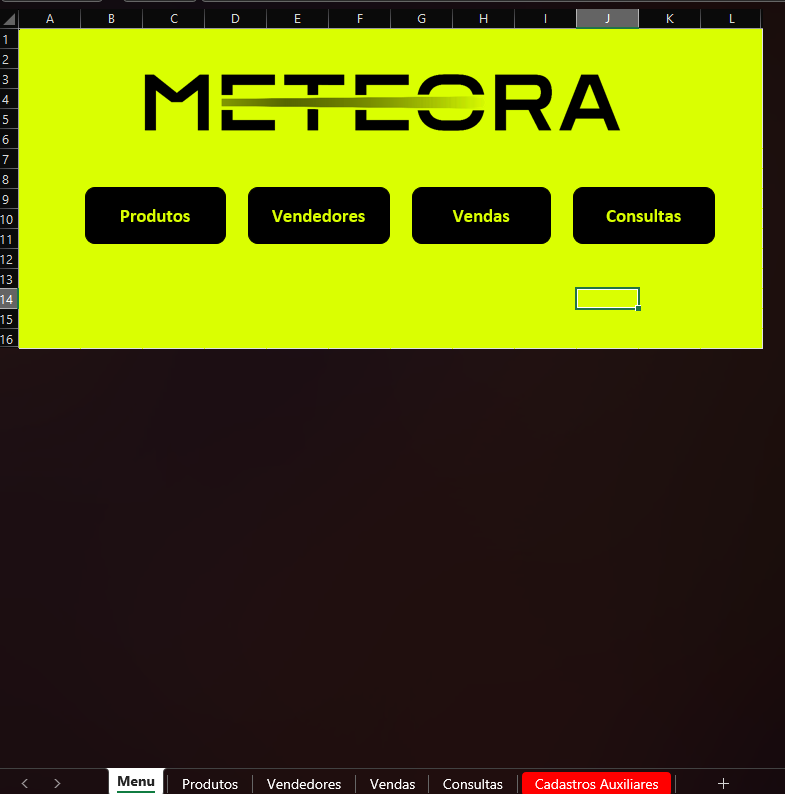
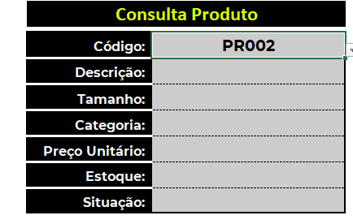
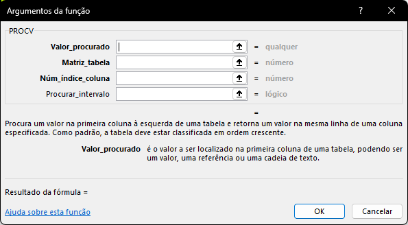
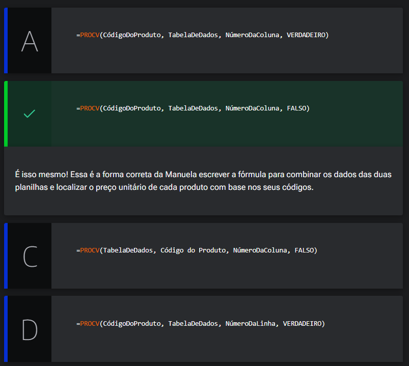

# Funções de pesquisa e referência

<a id="topo"></a>

## Sumário
- [Funções de pesquisa e referência](#funções-de-pesquisa-e-referência)
  - [Sumário](#sumário)
  - [1. Apresentação](#1-apresentação)
  - [2. Preparando o ambiente: planilha Meteora E-commerce](#2-preparando-o-ambiente-planilha-meteora-e-commerce)
  - [3. Busca com PROCV](#3-busca-com-procv)
  - [4. Análise de vendas](#4-análise-de-vendas)
  - [5. Busca com PROCX](#5-busca-com-procx)
  - [6. PROCH vs. PROCX](#6-proch-vs-procx)
  - [7. Faça como eu fiz: pesquisando tamanhos](#7-faça-como-eu-fiz-pesquisando-tamanhos)
  - [8. O que aprendemos?](#8-o-que-aprendemos)

## 1. Apresentação

Esse grupo é destinado para quem deseja saber mais sobre:  
  - Procura e Referência
  - Funções e de lógica 
  - PROCV
  - PROCX
  - CORRESP/CORRESPX

---
## 2. Preparando o ambiente: planilha Meteora E-commerce

Para acompanhar o curso com o máximo de aproveitamento, você pode fazer o [acessar a planilha](db/Meteora%20Ecommerce%20-%20PLANILHA%20INICIAL.xlsx) que estamos trabalhando no curso.

Essa planilha é uma ferramenta importante para os seus estudos. Ao explorá-la, você poderá praticar os conceitos apresentados, fazer exercícios e acompanhar seu próprio progresso de maneira personalizada.

---
## 3. Busca com PROCV
Retornando ao processo de aplicação da planilha trabalhada anteriormente, contamos na nova versão com modificações já realizadas pelo instrutor e iremos partir dessa nova versão com as atividades, em perspectiva ao modelo anterior a nova planilha está da seguinte maneira :   

> <table style="text-align: center; width: 50%;"> 
> <tr>
> <td style="text-align: left;">
> 
> </td>
> </tr>
> </table>

uma das modificações que serão efetuadas sobre a planilha de vendas, onde iremos preencher os valores ausentes na planilha, para o preenchimento das colunas de __Preço unitário, Desconto e total__ com base em nos valores permitidos de descontos para cada vendedor, que está presente tanto na planilha de vendedor quanto na planilha de cadastros auxiliares, onde os descontos também possuem regras para quantidade. 

---

Mas antes de passar a esse processo iremos iniciar com nosso __OBJETIVO INICIAL__ que é __trabalhar com consultas__. 
Então iremos aplicar já algumas das funções de consultas `procx, procv`etc.., o primeiro passo será acessar a planilha de consultas, nela percebemos que temos uma lista possível de valores a serem inseridos, esse passo já foi realizado dentro da planilha, caso tenha dúvidas esse processo foi descrito [aqui](https://github.com/thierryLchaves/Santander-Imersao-Digital/blob/5013c1d9debfa35797111545e19eac3629e49f96/Analise_de_dados_e_IA_Nivelamento/Semana_02/Funcoes_com_excel_operacoes_matematicas_e_filtros/04_Validacao_de_dados/ValidacaoDeDados.md), porém iremos adicionar a seguinte funcionalidade, para além da lista possível iremos inserir também as informações correspondentes a aquele produto: 
> <table style="text-align: center; width: 100%;"> 
> <tr>
> <td style="text-align: center;">
> 
> </td>
> </tr>
> </table>

Para esse preenchimento _"automático"_ dessas informações iremos ver as duas funções mais utilizadas para esses casos `(PROCV E PROCX)`, porém ao longo do curso iremos analisar e aprender outras alternativas a tais funções.  
Iniciaremos o processo utilizando a função de `PROCV`, porém antes de _"digitar na mão"_ os parâmetros necessários para inserção da fórmula de `PROCV`, vamos acessar a guia de `Fórmulas` dentro da célula desejada, e escolheremos a função, ao acessar a função o Excel nos fornece a caixa com vários auxílios para o preenchimento correto dessa fórmula:   
 
<table style="text-align: center; width: 100%;"> 
<tr>
    <td style="text-align: left;">
    
    </td>
</tr>
</table>

Para que possamos melhor fixar, ou ainda compreender o funcionamento dessa fórmula vamos aos passos dos argumentos que são esperados:  
- __1º Valor procurado:__ Nesse argumento faz-se necessário informar o que estamos procurando, fazendo uma analogia se solicitassem a alguém algo como _"procura algo para mim"_, o primeiro questionamento lógico que seria feito, deveria ser _"procurar o que"_. Ou seja nesse primeiro argumento iremos informar o que estamos procurando, nesse casso iremos referenciar o código do produto presente na validação de produtos
- __2º Matriz tabela:__ No segundo argumento, iremos inserir o local onde a busca por tal objeto será realizada, outra analogia possível de ser feita, seria quando alguém solicitar que procure algo como um relógio por exemplo, poderíamos questionar onde é que seria necessário realizar tal busca, evitando assim a procura inócua de algo onde não está.
- __3º Numero índice coluna:__ Esse argumento tem um ponto restritivo peculiar do Excel, e da função em questão , na função de `PROCV` somente realiza a procura para a direita, então no casso como selecionamos anteriormente toda a tabela na __Matriz tabela__, iremos informar o índice desejado, para _"descobrir"_ esse índice basta realizar a quantificação da coluna a partir da matriz, no nosso casso desejamos o nome do produto, para o preenchimento de tal, o índice primeiro é a primeira coluna, o nome do produto está na segunda coluna.
- __4º Procurar intervalo:__ Esse ultimo argumento preencheremos com valores lógicos, nesse argumento somente 2 valores são possíveis de preenchimento, `Verdadeiro ou Falso`, mas quando e como utilizar eles, a grosso modo utilizamos o valor de `VERDADEIRO` quando desejarmos realizar busca por _"proximidade"_, ou seja se quisermos realizar a busca __MAIS PRÓXIMA__ na primeira coluna em ordem crescente do valor utilizaremos `VERDADEIRO`, porém quando é necessário realizar a busca exata do valor utilizamos `FALSO`.

Agora caso não quisermos utilizar a caixa de fórmulas disponibilizada pelo `Excel`, podemos utilizar a função diretamente, sendo sua formula escrita da seguinte maneira para nosso exemplo:
```excel
=PROCV(C6;TB_Produtos[#TUDO];2;FALSO)
```

- [↑ Voltar ao topo](#topo)
---
## 4. Análise de vendas

Manuela é uma analista de dados especializada em marketing digital. Seu supervisor lhe atribuiu uma tarefa crucial: comparar os resultados de produtos vendidos em diferentes regiões, a fim de identificar quais produtos tiveram um notável aumento nas vendas. Para executar essa análise, Manuela possui duas planilhas à sua disposição.

A primeira contém informações detalhadas sobre os produtos, enquanto a segunda apresenta registros de vendas dos produtos. Para agilizar o processo de análise, Manuela pretende utilizar a função PROCV() no Excel para localizar o preço unitário de cada produto com base nos códigos dos produtos.

Baseado no que aprendemos na aula, vamos ajudar a Manuela a escrever a função correta para combinar os dados das duas planilhas? 

<table style="text-align: center; width: 100%;"> 
<tr>
    <td style="text-align: center;">
    
    </td>
</tr>
</table>

---
## 5. Busca com PROCX
Utilizaremos agora a função `PROCX`, para o preenchimento da coluna de tamanho, a função em questão ela é mais recente no Excel, mais versátil que a função `PROCV`, e na maioria dos casos de utilização mais fácil. Para melhor fluidez do processo e para não repetição do conteúdo iremos apenas listas as diferenças de argumentos entre as duas funções. 
A primeira diferença entre as duas funções se dá no segundo argumento que seria de matriz de procura, enquanto na `PROCV` nos selecionamos a tabela como um todo, na `PROCX` podemos selecionar o intervalo que contem o valor referenciado no primeiro argumento, no caso o código do produto e após o `;` utilizamos o que aquela busca ira retornar.
> PS: O intervalo de procura e retorno deverá ter o mesmo tamanho, exemplo se inserimos o segundo argumento que contem os códigos dos produtos com o cabeçalho, no retorno daquele valor deverá se iniciar pelo cabeçalho também.   
> PS2: Como na pasta de trabalho atual estamos utilizando o formatação em tabela essa seleção indefere se ira englobar o cabeçalho, porém se não utilizarmos tal formatação é importante se atentar a esse ponto também.  
Ao final do preenchimento das informações, a formula ficaria da seguinte maneira:  
```excel
=PROCX(C6;TB_Produtos[[#Tudo];[Código]];TB_Produtos[[#Tudo];[Tamanho]])
```
> Dado a versão utilizada na máquina que está sendo realizado a anotação, a fórmula não foi reconhecida, por esse motivo utilizarei o `PROCV` para o preenchimento.
---
Em situações de por exemplo que não tivéssemos utilizando a validação de dados, ou que o valor escolhido para o argumento de busca não estivesse condizente com a matriz de procura, inserida no segundo argumento, o Excel irá apresentar o valor de `#N/D`, que é o correspondente ao um erro, para que possamos sanar essa apresentação podemos editar a função, adicionando uma função visto que na `PROCV` por exemplo não temos a opção para esse tipo de tratativa, então antes do nome da função,iremos adicionar uma função de `SERRRO`, deixando a formulá da seguinte maneira:  
```excel
=SEERRO(PROCV($C$6;TB_Produtos[#Tudo];2;FALSO);"Não encontrado")
```
Porém como a `PROCX` é uma evolução da `PROCV` e esse tipo de apresentação é comum, possuímos um argumento possível se ser adicionado, pós os valores da duas colunas, esse valor condiz sobre qual mensagem será exibida caso o valor não for encontrado.
```excel
=PROCX(C6;TB_Produtos[[#Tudo];[Código]];TB_Produtos[[#Tudo];[Tamanho]];"Valor não encontrado")
```
Outra vantagem da utilização da `PROCX` é que ela possibilita a procura a esquerda do valor,exemplo na `PROCX` , podemos buscar pelo produto e devolver código, já na `PROCV` isso não é possível. 

[↑ Voltar ao topo](#topo)

---
## 6. PROCH vs. PROCX
Apenas para título de informação podemos preencher outra célula, utilizando de referência não estruturada, tornando assim o preenchimento da fórmula da seguinte maneira:  
__`PROCV`__  
```excel
=SEERRO(PROCV($C$6;Produtos!$B$6:$G$66;4;FALSO);"Valor não encontrado")
```  
__``__  
```excel
=PROCX($C$6;Produtos!;$B$6:$B$66;Produtos!;$G$6:$G$66;"")
```  
Pós o preenchimento das demais células, iremos preencher a próxima tabela, no campo de dias da semana, e para tal utilizaremos a função `DIA.DA.SEMANA()`, essa função tem como retorno um número entre 1 e 7 conforme a data escolhida, porém como essa função irá retornar um número não é propriamente o que desejamos e sim que o Excel nos retorne o dia da semana, iremos utilizar a planilha de `cadastros auxiliares`, para realizar a busca porém na correspondência dos dias da semana presente nessa planilha os dias da semana estão listados de forma de linha, o que nos impediria por exemplo, de utilizar a função `PROCV`, visto que a utilização do `PROCV` realiza a busca de forma vertical, e não é o que desejamos, então para realizar o processo de procura de maneira horizontal utilizamos a função de `PROCH`, sua utilização e bem similar ao da `procv`, porém sua diferença primária se da na maneira que o argumento de busca é passado, enquanto em uma utilizamos a referência da coluna nessa utilizaremos a linha. 
Nesse ponto, é possível visualizar principal diferença entre essa funções com a `PROCX`, pois essa função ela realiza a busca tanto de forma vertical, quanto de forma horizontal, sendo que o que irá determinar qual será o retorno, é a maneira como será realizado a seleção dos intervalos;  
```excel
=PROCH(DIA.DA.SEMANA(F6);'Cadastros Auxiliares'!$B$4:$I$5;2;FALSO)
```

[↑ Voltar ao topo](#topo)

---
## 7. Faça como eu fiz: pesquisando tamanhos  

Vamos treinar o que aprendemos na aula e executar uma pesquisa para descobrir os tamanhos dos produtos na planilha de “Consultas” da E-commerce Meteora?

Essa é uma oportunidade perfeita para aprimorar suas habilidades e explorar as funcionalidades do Excel. Use a função adequada para realizar essa busca e perceba os insights aparecer.

__Opinião do instrutor__  
Para realizar essa atividade, siga o passo a passo proposto.

- Passo 1: O primeiro passo que devemos seguir, é selecionar a célula onde vamos escrever a nossa função. Para efeitos deste exercício, vamos colocar a nossa fórmula na célula `C8` da planilha “Consultas”.

- Passo 2: Como queremos realizar uma busca para descobrir os tamanhos dos produtos, vamos utilizar a função a nova função
```text
=PROCX.
```
- Passo 3: Na célula `C8` insira o símbolo do igual “=” para abrir a função e digite `PROCX`.
```text
=PROCX(
```
- Passo 4: O primeiro parâmetro da função PROCX, a pesquisa_valor, é a célula de referência que contém o valor a ser pesquisado. Neste caso, selecione a célula `C6` do campo _“Código”_  e, em seguida, digite o ponto e vírgula `;` para adicionar o próximo parâmetro da função.
```text
=PROCX(C6;
```
- Passo 5: O segundo parâmetro da função PROCX, a pesquisa_matriz, corresponde a coluna que vamos realizar a busca. Neste caso, selecione a coluna “Código” da planilha `Produtos(B6:B66)` e, em seguida, digite o ponto e vírgula `;` para adicionar o próximo parâmetro da função.
```text
=PROCX(C6;TB_Produtos[[#Tudo];[Código]]
```
- Passo 6: O terceiro parâmetro da função PROCX, a `matriz_retorno`, corresponde a coluna que queremos retornar o resultado da busca. Selecione a coluna “Tamanho” da planilha `Produtos(D6:D66)` e, em seguida, digite o ponto e vírgula `;` para adicionar o próximo parâmetro da função.
```text
=PROCX(C6;TB_Produtos[[#Tudo];[Código]];TB_Produtos[[#Tudo];[Tamanho]]
```
- Passo 7: O quarto argumento da função PROCX, o se_não_encontrada, permite a inclusão de um texto ou valor caso o item pesquisado não seja localizado na matriz, evitando a exibição de erros ao usuário. Neste caso, digite entre aspas `“Não Encontrado”`.
  > Lembre-se de que para as funções reconhecerem um texto, as informações devem estar entre aspas.
```text
=PROCX(C6;TB_Produtos[[#Tudo];[Código]];TB_Produtos[[#Tudo];[Tamanho]];”Não Encontrado”
```
- Passo 8: Feche os parênteses e pressione o [ENTER] para finalizar a fórmula.
```text
=PROCX(C6;TB_Produtos[[#Tudo];[Código]];TB_Produtos[[#Tudo];[Tamanho]];”Não Encontrado”)
```

Pronto, nossa função foi criada e já temos as informações dos tamanhos dos produtos na planilha de “Consultas”!!

---
## 8. O que aprendemos?

Nessa aula, você aprendeu como:
- Experimentar o recurso "Inserir Função";
- Utilizar as funções de pesquisa e referência, PROCV(), PROCX() e PROCH() do Excel;
- Utilizar a função de lógica SEERRO() do Excel;
- Utilizar a função DIA.DA.SEMANA() do Excel;
- Comparar as as funções de pesquisa e referência, PROCV(), PROCX() e PROCH() do Excel;
- Produzir cálculos em diferentes planilhas;
- Produzir funções aninhadas no Excel ou seja, uma ou mais funções dentro dos argumentos de outra função no Excel.
---

<table align="center" style="border-collapse: collapse; margin-left: auto; margin-right: auto;"> 
  <caption><b>Skills do projeto</b></caption>
  <tr>
    <td style="padding: 5px;">
      
    </td>
    <td style="padding: 5px;">
      
    </td>
    <td style="padding: 5px;">
      
    </td>
  </tr>
</table>


---
__Titulo:__ Funções de pesquisa e referência
__Autor:__ Thierry Lucas Chaves  
__Data de Criação:__ 23-05-2026  
__Data de Modificação:__ 01-06-2026  
__Versão:__ "1.0"