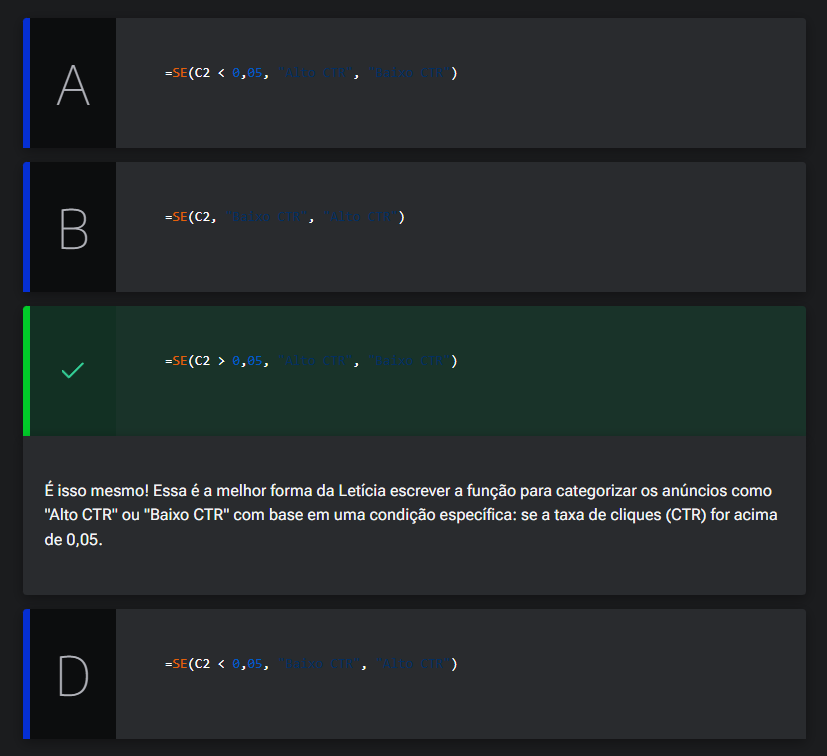
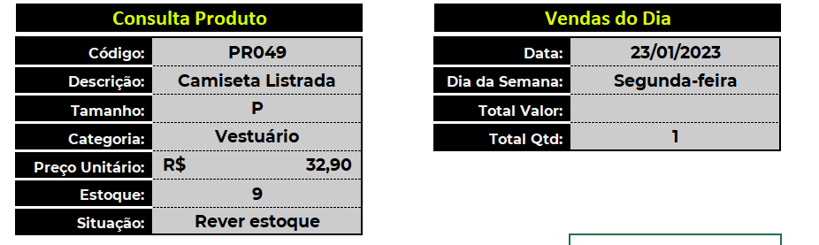

# Trabalhando com lógica

<a id="topo"></a>

## Sumário
- [Trabalhando com lógica](#trabalhando-com-lógica)
  - [Sumário](#sumário)
  - [1. Projeto da aula anterior](#1-projeto-da-aula-anterior)
  - [2. Situação do estoque](#2-situação-do-estoque)
  - [3. Taxas de cliques](#3-taxas-de-cliques)
  - [4. Comparando SE() e SES()](#4-comparando-se-e-ses)
  - [5. Desafio: estoque por categoria](#5-desafio-estoque-por-categoria)
  - [6. Juntando Procura e Lógica](#6-juntando-procura-e-lógica)
  - [7. Faça como eu fiz: situação estoque](#7-faça-como-eu-fiz-situação-estoque)
  - [8. O que aprendemos?](#8-o-que-aprendemos)

## 1. Projeto da aula anterior

Para acompanhar o curso com o máximo de aproveitamento, você pode [acessar da planilha](db/Meteora%20Ecommerce%20-%20FINAL%20AULA%201.xlsx).  
Com a planilha em mãos, você terá a oportunidade de praticar os exercícios propostos, explorar os exemplos e mergulhar ainda mais no aprendizado.

---
## 2. Situação do estoque
A partir de agora daremos seguimento nos estudos, porém iremos aprofundar mais um pouco nas funções de lógicas, enquanto nas funções de busca e referência as funções mais utilizadas, são as funções de  `SE;SES`.  
Como as funções citadas, acima tratam de funções lógicas, temos que sempre pensar em retornos de verdadeiro ou falso, ou seja as funções que aplicaremos adiante, utilização um teste lógico e esse teste lógico irá nos retorna verdadeiro ou falso.
A função mais utilizada trata-se de da função `SE`, essa função é utilizada para verificação lógica dado a um determinado questionamento, vamos utilizar a célula de situação para melhor compreensão do que estamos dizendo:  
```excel
=SE(C11>10;"Estoque ok";"Rever Estoque")
```
No código da função acima, o que estamos fazendo é aplicação de validação lógica, onde o primeiro argumento dita se tal coisa, primeiro argumento, faça segundo argumento se, se não terceiro argumento, ou seja se o valor de `C11` é maior que 10, retorne a mensagem _"Estoque ok"_, se não retorne a mensagem _"Rever Estoque"_.
Porém quando desejamos um aninhamento de funções, como por exemplo uma nova mensagem caso o estoque esteja zerado, podemos utilizar _"UM SE DENTRO DO OUTRO"_, e como seria essa sintaxe:  
```excel
=SE(C11>10;"Estoque ok";SE(C11=0;"Estoque zerado";"Rever Estoque"))
```
---
## 3. Taxas de cliques

Letícia é uma experiente profissional de marketing digital e é responsável por gerenciar campanhas online para diversos clientes e está sempre buscando formas de otimizar seu trabalho e entregar resultados de qualidade. Atualmente, Letícia está envolvida em uma campanha de anúncios para um cliente importante.

Ela precisa monitorar as taxas de cliques dos anúncios, CTR acima de 0,05, cadastrados na coluna C da sua planilha, para garantir que eles estejam gerando um bom engajamento com o público-alvo. Para isso, ela decidiu utilizar a função SE para categorizar os anúncios como "Alto CTR" ou "Baixo CTR".

Seguindo o que aprendemos na aula, vamos ajudar a Letícia a escrever a função SE() para categorizar automaticamente os anúncios como "Alto CTR" ou "Baixo CTR" com base na taxa de cliques (CTR)?

Selecione uma alternativa:  

<table style="text-align: center; width: 100%;"> 
<tr>
    <td style="text-align: left;">
    
    </td>
</tr>
</table>

---
## 4. Comparando SE() e SES()
A função `SES`, foi implementada justamente para substituir a função `SE`, pois conforme vimos [anteriormente](#2-situação-do-estoque), quando temos mais de uma condição de verificação dentro do Excel, e necessário o aninhamento de funções, o que quando utilizamos somente duas condições pode ser de fácil compressão, porém e quando temos varias condições? Para isso a função `SES` foi implementada.
E seu funcionamento ocorre da seguinte maneira, é informado o primeiro teste lógico e sua resposta caso atenda a condição, outro teste lógico e outra resposta assim sucessivamente, como se estivéssemos utilizando vários `se` aninhados.
```excel
=SES(C11=0;"Estoque zerado";C11>=10;"Estoque ok";1;"Rever estoque")
```
Na fórmula acima temos a seguinte validação, primeiro verificamos se a célula C11 é igual a 0 caso ela não seja ele passa para o próximo teste que é C11 >= a 10, caso não seja iremos a próxima, mas no caso so queremos verificar 2 condições, sendo assim caso C11 não seja 0 nem >= a 10, ele atende a condição então utilizamos `1`
> Em `Excel` os números 1 e 0 em aplicações de formulas condizem com verdadeiro e falso respectivamente.
então se não é 0 nem maior igual á 10 ele deve entrar na condição de revisão de estoque, em outras palavras atende a condição.

<table style="text-align: center; width: 100%;"> 
<tr>
    <td style="text-align: left;">
    
    </td>
</tr>
</table>

O mine desafio proposto, foi de aplicar a verificação de estoque conforme a tabela, de situação em cadastro auxiliares, e conforme dica dado em aula, podemos utilizar o valor contido na célula de categoria da tabela de consulta.  

## 5. Desafio: estoque por categoria

Chegou o momento de testar o seu desenvolvimento nesta jornada.  
__Opinião do instrutor__   
Neste desafio, a sua missão é seguir o que foi ensinado na aula e alterar o valor fixo da condição se o estoque estiver OK, ou seja, considerar as informações de estoque mínimo de acordo com as categorias.  

---
## 6. Juntando Procura e Lógica
Para resolução do problema em questão primeiro iremos adicionar uma linha extra para exibição do estoque mínimo conforme a categoria, e para tal utilizaremos o `procx`, da seguinte forma:  
```excel
=PROCX($C$9;'Cadastros Auxiliares'!G8:G11;'Cadastros Auxiliares'!H8:H11;"")
```
Com essa informação, de qual será o nosso estoque mínimo conforme a categoria do produto, podemos aplicar função de `SES`, deixando a formula da seguinte maneira:  
```excel
=SES(C11=0;"Estoque zerado";C11>=C13;"Estoque ok";1;"Rever estoque")
```
caso não  desejarmos realizar a adição de uma nova linha para inclusão da condição, podemos incluir a função do procx dentro da verificação deixando a célula da seguinte maneira:  
```excel
=SES(C11=0;"Estoque zerado";C11>=PROCX($C$9;'Cadastros Auxiliares'!G8:G11;'Cadastros Auxiliares'!H8:H11;"");"Estoque ok";1;"Rever estoque")
```


---
## 7. Faça como eu fiz: situação estoque
Agora é o momento de aplicarmos o que aprendemos e colocar nossas habilidades à prova! Por isso, fica o desafio: que tal utilizar o conhecimento adquirido em aula e utilizar a função SES() para verificar a situação do Estoque na planilha de “Consultas” da E-commerce Meteora?

Com as dicas que exploramos, você é uma pessoa preparada para realizar esse cálculo de forma precisa e eficiente. Aproveite essa oportunidade para consolidar seu aprendizado e se destacar na análise de dados no Excel.  

__Opinião do instrutor__  

Para realizar essa atividade, siga o passo a passo proposto.

- __Passo 1:__ O primeiro passo que devemos seguir é criar uma uma nova linha na Consulta Produtos. Utilize o pincel de formatação para copiar e colar formatos sem carregar os dados. Digite como nome do campo, “Estoque Mínimo.”

- __Passo 2:__ Para buscar as novas informações de estoque mínimo, vamos utilizar a função PROCX().

- __Passo 3:__ Na célula C13 insira o símbolo do igual “=” para abrir a função e digite PROCX.
```excel
=PROCX(
```
- __Passo 4:__ O primeiro parâmetro da função PROCX, a pesquisa_valor, é a célula de referência que contém o valor a ser pesquisado. Neste caso, selecione a célula C9 do campo “Categoria” e, em seguida, digite o ponto e vírgula “;” para adicionar o próximo parâmetro da função.
```excel
=PROCX(C9;
```
- __Passo 5:__ O segundo parâmetro da função PROCX, a pesquisa_matriz, corresponde a coluna que vamos realizar a busca. Neste caso, selecione a coluna “Categoria” da planilha “Cadastros Auxiliares” (G9:G11) e, em seguida, digite o ponto e vírgula “;” para adicionar o próximo parâmetro da função.
```excel
=PROCX(C9;'Cadastros Auxiliares'!G9:G11;
```
- __Passo 6:__ O terceiro parâmetro da função PROCX, a matriz_retorno, corresponde a coluna que queremos retornar o resultado da busca. Selecione a coluna “Estoque Mínimo” da planilha “Cadastros Auxiliares” (H9:H11). Feche os parênteses e pressione o [ENTER] para finalizar a fórmula.
```excel
=PROCX(C9;'Cadastros Auxiliares'!G9:G11;'Cadastros Auxiliares'!H9:H11) 
```
Pronto, nossa função foi criada e já temos as informações de Estoque Mínimo na planilha de “Consultas”!!

- __Passo 7:__ O próximo passo que devemos seguir, é criar o nosso teste lógico para a Situação do Estoque. Para efeitos deste exercício, vamos colocar a nossa fórmula na célula C12 da planilha “Consultas”.

- __Passo 8:__ Como queremos verificar se a situação do estoque está de acordo, vamos utilizar a função a nova função =SES.

- __Passo 9:__ Na célula C12 insira o símbolo do igual “=” para abrir a função e digite SES.
```excel
=SES(
```
- __Passo 10:__ Agora temos que criar uma condição para cada um dos conceitos possíveis. O primeiro teste lógico que queremos verificar, é se o Estoque é igual a zero (0). Selecione a célula C11 do campo “Estoque”, digite o sinal de igual (=) e, em seguida, o número zero (0). Para adicionar o próximo parâmetro da função, digite o ponto e vírgula “;”.
```excel
=SES(C11=0;
```
- __Passo 11:__ O segundo parâmetro da função SES(), o valor_se_verdadeiro1, corresponde ao primeiro resultado esperado caso o teste lógico seja verdadeiro. Digite entres aspas "Estoque Zerado" e, em seguida, digite o ponto e vírgula “;” para adicionar o próximo parâmetro da função.
```excel
=SES(C11=0;”Estoque Zerado”
```
- __Passo 12:__ Agora para cada novo conceito possível temos que esquecer o anterior e criar apenas a nova condição e seu respectivo conceito. O segundo teste lógico que queremos verificar, é se o Estoque for maior ou igual ao Estoque Mínimo, a condição será “Estoque OK”.

- __Passo 13:__ Selecione a célula C11 do campo “Estoque”, insira o símbolo do maior (>) e o sinal de igual (=) e, em seguida, selecione a célula C13 do campo “Estoque Mínimo” . Para adicionar o próximo parâmetro da função, digite o ponto e vírgula “;”.
```excel
=SES(C11=0;”Estoque Zerado;C11>=C13;
```
- __Passo 14:__ Para o segundo valor_se_verdadeiro2, digite entres aspas "Estoque OK" e, em seguida, digite o ponto e vírgula “;” para adicionar a próxima condição da função.
```excel
=SES(C11=0;”Estoque Zerado;C11>=C13;”Estoque OK”
```
- __Passo 15:__ E por fim, caso nenhuma das condições testadas forem verdadeiras, digite o número 1 ou Verdadeiro, para especificar um resultado padrão e, em seguida digite o ponto e vírgula “;” e entre aspas "Rever Estoque".
```excel
=SES(C11=0;”Estoque Zerado;C11>=C13;”Estoque Zerado”;1;"Rever Estoque" 
```
- __Passo 16:__ Feche os parênteses e pressione o [ENTER] para finalizar a fórmula.
```excel
=SES(C11=0;”Estoque Zerado;C11>=C13;”Estoque Zerado”;1;"Rever Estoque")
```
Pronto, nossa função foi criada e já podemos verificar a situação do estoque!!  

---
## 8. O que aprendemos?
Nessa aula, você aprendeu como:
- Comparar às funções funções de lógica SE() e SES() do Excel;
- Produzir as funções de lógica SE() e SES() do Excel.

---

<table align="center" style="border-collapse: collapse; margin-left: auto; margin-right: auto;"> 
  <caption><b>Skills do projeto</b></caption>
  <tr>
    <td style="padding: 5px;">
      
    </td>
    <td style="padding: 5px;">
      
    </td>
    <td style="padding: 5px;">
      
    </td>
  </tr>
</table>


---
__Titulo:__ Trabalhando com lógica
__Autor:__ Thierry Lucas Chaves  
__Data de Criação:__ 23-05-2026  
__Data de Modificação:__ 02-06-2026  
__Versão:__ "1.0"