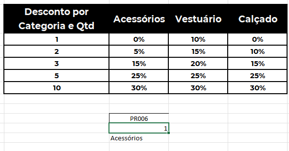
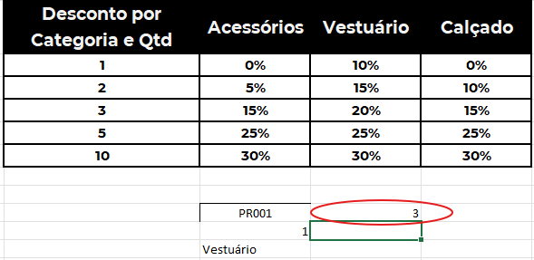
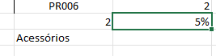
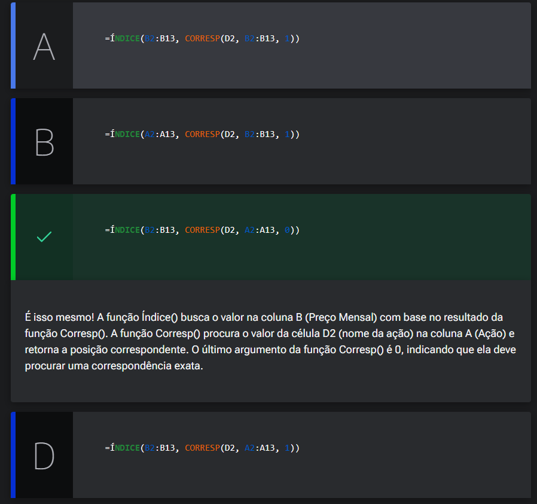

# Desconto progressivo

<a id="topo"></a>

## Sumário
- [Desconto progressivo](#desconto-progressivo)
  - [Sumário](#sumário)
  - [1. Projeto da aula anterior](#1-projeto-da-aula-anterior)
  - [2. Procura bi-dimensional](#2-procura-bi-dimensional)
  - [3. Índice com Corresp](#3-índice-com-corresp)
  - [↑ Voltar ao topo](#-voltar-ao-topo)
  - [4. Análise de ações](#4-análise-de-ações)
  - [5. Calculando o desconto](#5-calculando-o-desconto)
  - [6. Faça como eu fiz: criando o desconto](#6-faça-como-eu-fiz-criando-o-desconto)
  - [7. O que aprendemos?](#7-o-que-aprendemos)

## 1. Projeto da aula anterior

Continuando a nossa jornada neste curso, você pode [acessar a planilha](db/Meteora%20Ecommerce%20-%20FINAL%20AULA%202.xlsx).   
Com a planilha em mãos, você terá a oportunidade de praticar os exercícios propostos, analisar com mais detalhes as funções e construir comigo uma planilha muito útil e de fácil entendimento.

---
## 2. Procura bi-dimensional
 Após realizar o processo de filtro iremos acessar a aba de `Cadastros Auxiliares` nessa planilha temos a tabela de descontos progressivos e a ideia dessa tabela é aplicar descontos de quantidade X categoria, esse desconto deverá ser aplicado dentro da planilha de vendas, onde temos os campos de preço desconto a serem aplicados, porém para além da tabela mencionada ainda temos as regras de desconto máximo possíveis de serem concedidas pelos vendedores.

Para o preenchimento da coluna de preço, utilizaremos o `PROCV`  padrão utilizando referência estruturada, para buscar o  valores de cada produto para nossa planilha de vendas, deixando a fórmula de seguinte maneira:  
```excel
=PROCV([@Código];TB_Produtos[#Tudo];6;0)
```
Como a fizemos com referência estruturada a fórmula não terá mais problemas, porém se formos utilizar referências relativas, precisamos nos atentar ao fato de bloqueio do intervalo de busca, para que a referência não "ande" ao aplicar a fórmula.

Agora quando formos aplicar a lógica para o desconto, temos que "fasear" o problema pois em nossa planilha de vendas não temos a referência de categoria que é um dos critérios para nosso desconto progressivo, somente referências ao produto e a quantidade vendida, então para tal uma das maneiras de se trata esse problema , que podemos aplicar seria dentro da planilha de cadastros auxiliares, começar pelo mais lógica que seria um processo de busca de produto e sua quantidade. para tal iniciaremos adicionando mais 2 valores de um código de produto e sua quantidade, para realizar a busca da categoria do produto isso pode ser realizado tanto com a função `Procv` quanto com a `Porcx`, e ao final do processo termos o seguinte resultado:  

<table style="text-align: center; width: 100%;"> 
<tr>
    <td style="text-align: left;">
    
    </td>
</tr>
</table>

Feito isso teremos o resultado das categorias, conforme o produto selecionado assim como já foi feito por exemplo na planilha de buscas, porém nosso problema agora é que temos que realizar a aplicação de produto em _"duas frentes"_, se utilizarmos por exemplo a `procv` ela irá realizar uma busca vertical na tabela, e se utilizarmos a `proch` a busca será horizontal, e quando temos esse tipo de problemas, temos o que é chamado de <a href="#bdib">Busca Bidimensional</a>  e para aplicação desse processo utilizaremos uma nova fórmula chamada de `CORRESP`, em outras palavras essa função funciona tal qual uma `PROCV`, porém ao invés de sua procura ser realizada em colunas ela procura ou em __linha ou em coluna__.
Mas nesse processo como faríamos , para essa aplicação ? Primeiro parâmetro a ser informado tal qual é qual informação está sendo procurada, posteriormente a matriz de busca que para essa aplicação será a linha, e por fim 3 tipos de parâmetros `-1,0,1` , sendo respectivamente `(Menor que, Correspondência exata, Maior que, no nosso casso utilizaremos 0, deixando a formula da seguinte forma:  
```Excel
=CORRESP(C18;B8:E8;0)
```

<table style="text-align: center; width: 80%;"> 
<tr>
    <td style="text-align: left;">
    
    </td>
</tr>
</table>

Mas o que queremos aplicar com isso visto que a corresp, nos retorna o número da coluna conforme visto em imagem acima, se analisarmos mais podemos por exemplo utilizar essa função dentro de uma `PROCV` por exemplo no lugar do parâmetro da coluna. 


<details id="bdib">
    <summary>Busca Bidimensional: Conceito e Fórmulas</summary>
    <p>É a busca de um valor na interseção entre uma linha e uma coluna específica dentro de uma matriz de dados.</p>
    <ul>
        <li><strong>Conceito:</strong> Cruza dois eixos dinamicamente (ex: Modelo vs. Ano), superando a limitação do PROCV tradicional.</li>
        <li><strong>Fórmula Moderna (Excel 365):</strong> =PROCX(Linha; Vetor_Linhas; PROCX(Coluna; Vetor_Colunas; Matriz))</li>
        <li><strong>Fórmula Clássica (Universal):</strong> =ÍNDICE(Matriz; CORRESP(Linha; Vetor_Linhas; 0); CORRESP(Coluna; Vetor_Colunas; 0))</li>
    </ul>
</details>  

[↑ Voltar ao topo](#topo)

---
## 3. Índice com Corresp

Para solução deste problema existem várias formas possíveis de resolve-lo e uma das maneiras, assim conforme dito anteriormente, será utilizando `PROCV + CORRESP`, para nosso problema o que desejamos realizar, é a busca dos descontos pela quantidade de produtos por categoria, então utilizaremos a fórmula abaixo 
```excel
=PROCV(C17;B8:E13;D16;VERDADEIRO)
```
onde `C17` é a quantidade de nossa tabela de código e quantidade, a matriz de busca é nossa tabela de Desconto por categoria e qtd, o `D16` e nosso índice de coluna que utiliza a `corresp`, e no ultimo parâmetro informamos `VERDADEIRO` diferente do que foi utilizado em outras fórmulas anteriormente pois queremos a correspondência aproximada, e essa utilização se deve ao fato de que em nossa tabela temo intervalo de valores: _(1,2,3,5,10)_ ou seja temos descontos que valem a partir de, então por correspondência aproximada 4 não aplicaria os descontos da linha 12, pois o desconto é valida a partir de 5:  

> <table style="text-align: center; width: 100%;"> 
> <tr>
> <td style="text-align: left;">
> 
> </td>
> </tr>
> </table>

Na fórmula que inserirmos utilizamos a referência a célula com `corresp`, mas o ideal seria _"copiar"_ a formula para o parâmetro
```excel
=PROCV(C17;B8:E13;CORRESP(C18;B8:E8;0);VERDADEIRO)
```
Esse processo é muito, utilizado  porém podemos utiliza-la de outra maneira, se por exemplo fizemos o processo de intercessão de linha X coluna, poderíamos aplicar mais uma corresp essa sendo para busca da linha, teríamos uma fórmula como essa:  
```excel
=CORRESP(C17;B8:B13;1)
```
E nesse caso utilizaremos menor que pois desejamos que o processo seja apresentado somente para o número correto, ou menor que o próximo número.
Mas para aplicar isso também temos uma outra formula chamada de `INDICE` que poderia ser esprita da seguinte maneira:  
```excel
=ÍNDICE(B8:E13;E16;E17)`
```
porém isso poderia ser substituído pelas `corresp`'s de `E16`55 e `E17`.

[↑ Voltar ao topo](#topo)
---
## 4. Análise de ações

Eduarda é uma analista financeira que trabalha em uma empresa de consultoria de investimentos. Ela é conhecida por sua habilidade em lidar com dados complexos e criar relatórios precisos para orientar as decisões de investimento. Recentemente, Eduarda foi confrontada com um desafio intrigante. A empresa está analisando o desempenho de várias ações ao longo do último ano e precisa encontrar uma maneira eficiente de extrair informações específicas desses dados para seus clientes. Eduarda tem um conjunto de dados que registra o preço mensal de várias ações ao longo do último ano. Para este desafio, Eduarda já preparou os dados em uma planilha com duas colunas: "Ação" (coluna A) e "Preço Mensal" (coluna B) e decidiu usar as funções Índice e Corresp() do Excel.

Baseado no que aprendemos na aula, vamos ajudar a Eduarda a criar as fórmulas corretas para atingir seu objetivo.
Qual das opções abaixo indica a forma adequada para essa tarefa?

<table style="text-align: center; width: 100%;"> 
<tr>
    <td style="text-align: center;">
    
    </td>
</tr>
</table>

---
## 5. Calculando o desconto
Agora iremos aplicar a exportação da fórmula do `índice + corresp`, para nossa planilha de vendas, porém antes de realizar tal processo, devemos no ater ao fato que na planilha de Cadastros Auxiliares, as referências dos valores estão aplicadas de forma relativa, e para isso deveremos modificar algumas coisas, antes da aplicação na nova planilha, e para além dessa questão a `corresp` deverá ser _"Dinâmica"_ para buscar a categoria conforme o produto presente na planilha de vendas.
Antes de  tudo vamos modificar os nomes dos intervalos, visto que a `CORRESP` diferentemente da `PROCV`, busca intervalos de linha ou coluna, para facilitar nosso processo iremos renomear esses intervalos como : `Desc_Categoria` _linha_ e `Desc_quantidades` _Coluna_, e para além disso também aplicaremos intervalo da tabela toda como `Desc_Tabela_Toda`.
Para além disso vamos trocar outras referências também ,deixando nossa fórmula da seguinte maneira: 
```excel
=ÍNDICE(Desc_Tabela_Toda;CORRESP([@Qtd];Desc_Quantidade;1);CORRESP(PROCV([@Código];TB_Produtos[#Tudo];4);Desc_Categorias;0))
```
Vamos dissecar essa fórmula ponto a ponto:  

>   - `ÍNDICE(Desc_Tabela_Toda;` Nesse trecho estamos indicando que nosso índice utilizara a tabela de descontos como um todo para a busca
>   - `CORRESP([@Qtd];Desc_Quantidade;1);` Para esse trecho estamos utilizando a função  de `CORRESP`, utilizando como referência a quantidade da própria tabela no campo de quantidades, e o _"alias"_ do intervalo de quantidades dentro da planilha de `Cadastros Auxiliares, e por fim o parâmetro de __menor que__.
>   - `CORRESP(PROCV([@Código];TB_Produtos[#Tudo];4);Desc_Categorias;0)` Nesse ultimo processo tivemos que aninhar o `CORRESP COM PROCV`, pois na planilha de vendas não possuímos referencias as categorias, para sanar isso fizemos o `PROCV`, onde estamos buscando o produto da planilha, utilizamos o intervalo completo da tabela de produtos, e pegamos o 4º índice de coluna que no caso é a categoria, de posse desse valor, utilizamos a referência ao intervalo das categorias da planilha de cadastros Auxiliares, e informamos que a __correspondência deve ser exata__
---
## 6. Faça como eu fiz: criando o desconto

Chegou mais um momento de você exercitar o aprendizado e fortalecer suas habilidades.

Por isso, desafie-se a aplicar o que aprendemos em aula para criar as informações de desconto com base na quantidade e categoria. Coloque em prática o seu conhecimento e aproveite para praticar um pouco mais suas habilidades no Excel.  

__Opinião do instrutor__    
- Passo 1: O primeiro passo que devemos seguir, é criar nomes para a nossa matriz __“Desconto por Categoria e Quantidade”__.

- Passo 2: Para criar o nome para as linhas de título da matriz, selecione o intervalo `B8:E8` e na caixa de nome, lado direito da tela, digite _“Desc_Categorias”_ e pressione [ENTER].

- Passo 3: Para criar o nome para a coluna _“Desconto por Categoria e Quantidade”_, selecione o intervalo `B8:B13` e na caixa de nome, lado direito da tela, digite
*“Desc_Quantidades"* e pressione [ENTER].

- Passo 4: Para criar o nome para a matriz (Linhas e Colunas), selecione o intervalo `B8:E13` e na caixa de nome, lado direito da tela, digite _“Desc_TabelaToda”_ e pressione [ENTER].

Pronto, nossa matriz foi renomeada!!!

- Passo 5: Na planilha __“Vendas”__, célula `G5 (Coluna Desconto)`, insira o símbolo do igual “=” para abrir a primeira função e digite ÍNDICE().
```excel
=ÍNDICE(
```
- Passo 6: O primeiro parâmetro da função ÍNDICE, a matriz, é o intervalo de onde vamos obter o resultado. Neste caso, vamos utilizar a matriz _Desc_TabelaToda_ e, em seguida, digite o ponto e vírgula `;` para adicionar o próximo parâmetro da função.
```excel
=ÍNDICE(Desc_TabelaToda;
```
- Passo 7: Como segundo parâmetro da função ÍNDICE(), o _"Núm_linha"_, vamos utilizar outra função, a `CORRESP()`. Digite CORRESP, pressione a tecla [TAB] do teclado para abrir a função.
```excel
=ÍNDICE(Desc_TabelaToda;CORRESP(
```
- Passo 8: Como primeiro parâmetro da função CORRESP, o valor_procurado, selecione a célula E5 da coluna _“Qtd”_, e, em seguida, digite o ponto e vírgula `;` para adicionar o próximo parâmetro da função.
```excel
=ÍNDICE(Desc_TabelaToda;CORRESP([@Qtd];
```
- Passo 9: O segundo parâmetro da função CORRESP(), a matriz_procurada, que é o intervalo em que vamos procurar o nosso valor, digite _Desc_Quantidades_ e, em seguida, digite o ponto e vírgula `;` para adicionar o próximo parâmetro da função.
```excel
=ÍNDICE(Desc_TabelaToda;CORRESP([@Qtd];Desc_Quantidades;
```
- Passo 10: O terceiro parâmetro da função `CORRESP()`, o tipo_correspondência, digite o número __1__, pois queremos uma correspondência do tipo aproximada. Feche os parênteses e, em seguida, digite o ponto e vírgula `;` para adicionar o próximo parâmetro da função.
```excel
=ÍNDICE(Desc_TabelaToda;CORRESP([@Qtd];Desc_Quantidades;1);
```
Pronto, a nossa primeira CORRESP referente às informações de quantidade foi criada!

- Passo 11: O próximo passo é inserir novamente a função CORRESP, para buscar as informações de _“Categoria”_. Digite CORRESP e pressione a tecla [TAB] do teclado para abrir a função.
```excel
=ÍNDICE(Desc_TabelaToda;CORRESP([@Qtd];Desc_Quantidades;1);CORRESP(
```
- Passo 12: Como primeiro parâmetro da função CORRESP, o valor_procurado, vamos utilizar a função `PROCX()`. Digite `PROCX()` e pressione a tecla [TAB] do teclado para abrir a função.
```excel
=ÍNDICE(Desc_TabelaToda;CORRESP([@Qtd];Desc_Quantidades;1);CORRESP(PROCX
```

- Passo 13: Para o primeiro parâmetro da função PROCX, a pesquisa_valor, selecione a célula `D5` do campo _“Código”_ e, em seguida, digite o ponto e vírgula `;` para adicionar o próximo parâmetro da função.
```excel
=ÍNDICE(Desc_TabelaToda;CORRESP([@Qtd];Desc_Quantidades;1);CORRESP(PROCX([@Código];
```
- Passo 14: Para o segundo parâmetro da função PROCX, selecione a coluna “Código” da planilha “Produtos” (B6:B66) e, em seguida, digite o ponto e vírgula `;` para adicionar o próximo parâmetro da função.
```excel
=ÍNDICE(Desc_TabelaToda;CORRESP([@Qtd];Desc_Quantidades;1);CORRESP(PROCX([@Código];TB_Produtos[[#Tudo];[Código]];
```
- Passo 15: Para o terceiro parâmetro da função PROCX, selecione a coluna _“Categoria”_ da planilha _“Produtos” `(E6:E66)`_. Feche os parênteses e, em seguida, digite o ponto e vírgula `;` para retornar para função CORRESP().
```excel
=ÍNDICE(Desc_TabelaToda;CORRESP([@Qtd];Desc_Quantidades;1);CORRESP(PROCX([@Código];TB_Produtos[[#Tudo];[Código]];TB_Produtos[[#Tudo];[Categoria]]);
```
- Passo 16: Para o segundo parâmetro da função `CORRESP()`, a matriz_procurada, que é o intervalo em que vamos procurar o nosso valor, digite Desc_Categorias e, em seguida, digite o ponto e vírgula `;` para adicionar o próximo parâmetro da função.
```excel
=ÍNDICE(Desc_TabelaToda;CORRESP([@Qtd];Desc_Quantidades;1);CORRESP(PROCX([@Código];TB_Produtos[[#Tudo];[Código]];TB_Produtos[[#Tudo];[Categoria]]);Desc_Categorias;
```
- Passo 17: Para o terceiro e último parâmetro da função `CORRESP()`, o tipo_correspondência, digite o número __0__, pois queremos uma correspondência do tipo exata. Feche os parênteses e pressione o [ENTER] para finalizar a fórmula.
```excel
=ÍNDICE(Desc_TabelaToda;CORRESP([@Qtd];Desc_Quantidades;1);CORRESP(PROCX([@Código];TB_Produtos[[#Tudo];[Código]];TB_Produtos[[#Tudo];[Categoria]]);Desc_Categorias;0))
```

Pronto, nossas funções foram criadas e já temos as informações dos descontos na Planilha de “Vendas”!!  

[↑ Voltar ao topo](#topo)

---
## 7. O que aprendemos?

Nessa aula, você aprendeu como:
- Identificar uma procura bi-dimensional no Excel;
- Produzir a função CORRESP() do Excel;
- Produzir a função ÍNDICE() do Excel;
- Implementar nomes nos intervalos do Excel;
- Elaborar uma função aninhada, utilizando as funções ÍNDICE(), CORRESP() e PROCX() do Excel.

---

<table align="center" style="border-collapse: collapse; margin-left: auto; margin-right: auto;"> 
  <caption><b>Skills do projeto</b></caption>
  <tr>
    <td style="padding: 5px;">
      
    </td>
    <td style="padding: 5px;">
      
    </td>
    <td style="padding: 5px;">
      
    </td>
  </tr>
</table>


---
__Titulo:__ Desconto progressivo
__Autor:__ Thierry Lucas Chaves  
__Data de Criação:__ 23-05-2026  
__Data de Modificação:__ 03-06-2026  
__Versão:__ "1.0"