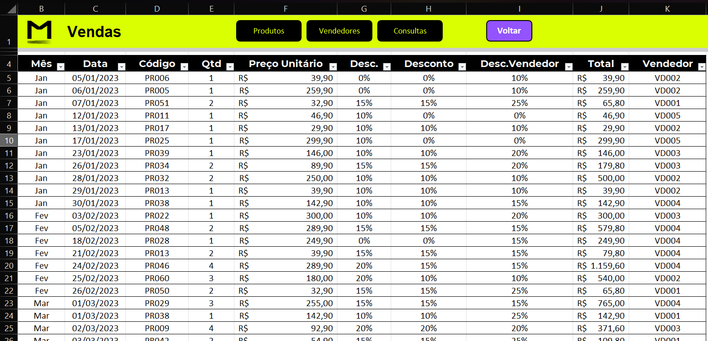
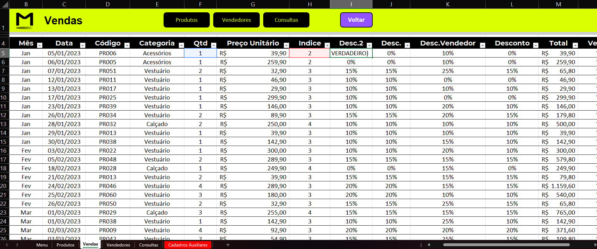
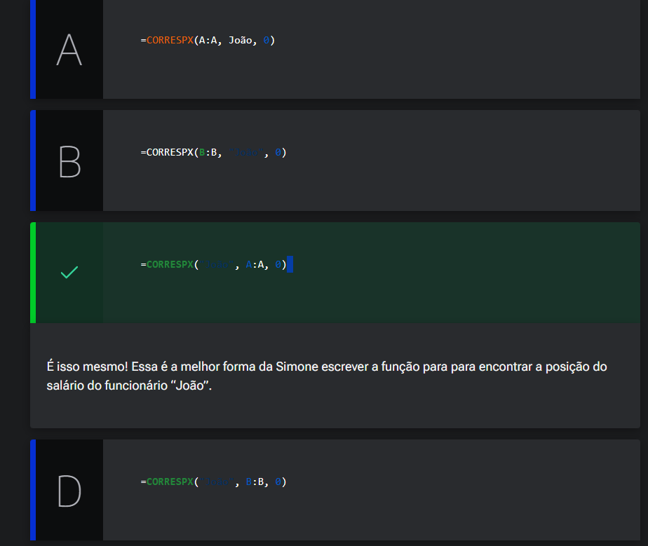

# Testes lógicos

<a id="topo"></a>

## Sumário
- [Testes lógicos](#testes-lógicos)
  - [Sumário](#sumário)
  - [1. Projeto da aula anterior](#1-projeto-da-aula-anterior)
  - [2. Desconto do vendedor](#2-desconto-do-vendedor)
  - [3. Desconto passo a passo](#3-desconto-passo-a-passo)
  - [4. CORRESPX()](#4-correspx)
  - [5. Desconto com lógica](#5-desconto-com-lógica)
  - [6. Faça como eu fiz: coluna índice](#6-faça-como-eu-fiz-coluna-índice)
  - [7. O que aprendemos?](#7-o-que-aprendemos)

## 1. Projeto da aula anterior
Para acompanhar o curso com o máximo de aproveitamento, você pode fazer acessar a [planilha]. Com a planilha em mãos, você terá a oportunidade de praticar os exercícios propostos, explorar os exemplos e mergulhar ainda mais no aprendizado.

---
## 2. Desconto do vendedor
Por fim devemos realizar o desconto máximo por vendedor, e para iniciar esse processo iremos realizar a adição de mais uma coluna a esquerda da coluna de total, para que possamos inserir o desconto máximo por vendedor, para isso iremos renomear as colunas tanto a nova criada quanto a antiga denominada de desconto, pós esse passo iremos realizar também a utilização de `PROCV`ou `PROCX` para realizar a busca dos descontos máximos possíveis por vendedor, deixando a fórmula da seguinte maneira:  
```excel
=PROCX([@Vendedor];Vendedores!$A$5:$A$9;Vendedores!$D$6:$D$10)
```
Depois desse processo iremos realizar a condição de teste lógico utilizando a função `SE()`, nessa função podemos verificar de duas formas diferentes para realizar a mesma verificação, visto que nosso objetivo é se o desconto aplicado for diferente do permitido pelo vendedor o desconto a ser apresentado deverá ser o máximo permitido. Então podemos escrever a fórmula das seguintes maneiras :
```excel
=SE([@[Desc.]]>[@[Desc.Vendedor]];[@[Desc.Vendedor]];[@[Desc.]])
=SE([@[Desc.]]<=[@[Desc.Vendedor]];[@[Desc.]];[@[Desc.Vendedor]])
```
Por fim para que apresentação da tabela fique melhor iremos ocultar essa duas colunas extras, e deixaremos a planilha da seguinte forma.

<table style="text-align: center; width: 100%;"> 
<tr>
    <td style="text-align: left;">
    
    </td>
</tr>
</table>

[↑ Voltar ao topo](#topo)

---
## 3. Desconto passo a passo
Nesse tópico iremos reformular a função utilizada de cálculos de desconto, e para iniciar esse processo iremos re-exibir as colunas de _"desc. e desc.vendedor"_, para "melhorar a fórmula", anteriormente feita na coluna de descontos, iremos decompor cada uma dos aninhamento de funções em outras colunas e funções, então a primeira a ser decomposta será a de categoria dos produtos, para isso utilizaremos `PROCX()` para busca dessas categorias:
```excel
=PROCX([@Código];TB_Produtos[Código];TB_Produtos[Categoria];"")
```
Depois iremos decompor mais um ponto que será a busca de indices que seria o índice do `PROCV()`, deixando nossa recém criada coluna __ÍNDICE__ da seguinte maneira:  
```excel
=CORRESPX([@Categoria];Desc_Categorias;0)
```
E por fim utilizaremos mais um `PROCV()`, para busca da quantidade de descontos  pela categoria, deixando nosso fórmula da seguinte maneira:  
```excel
=PROCV([@Qtd];Desc_TabelaToda;[@Indice];VERDADEIRO)
```
Por fim teremos nossa tabela da seguinte forma:  
<table style="text-align: center; width: 100%;"> 
<tr>
    <td style="text-align: left;">
    
    </td>
</tr>
</table>

Com isso poderíamos por  exemplo substituir o na coluna de desconto máximo, para verificar o valor por qualquer um dos 2 valores, porém esses passo aqui descritos foram para efeitos mermante de didática    

---
## 4. CORRESPX()

Simone é uma analista financeira em uma empresa de tecnologia. Ela está trabalhando em uma planilha do Excel que contém uma lista de funcionários e seus respectivos salários. Ela precisa encontrar a posição do salário de um funcionário específico na lista, chamado João, para poder compará-lo com os salários dos outros funcionários. Para fazer isso, ela decide usar a função CORRESPX() do Excel. Para fins de exercício, a planilha está organizada da seguinte forma: coluna A “Nome dos Funcionários” e a coluna B “Salário”.

Seguindo o que aprendemos na aula, qual alternativa indica a maneira correta que a Simone deve escrever a função para encontrar a posição do salário do funcionário “João”?

<table style="text-align: center; width: 100%;"> 
<tr>
    <td style="text-align: left;">
    
    </td>
</tr>
</table>


---
## 5. Desconto com lógica
Podemos aplicar ainda a contabilização do desconto utilizando funções de lógica.
> PS: Sobre essa aplicação não é muito utilizada no dia a dia mas para fins diádicos será demonstrada.  

Para isso  iremos criar mais um coluna para efetuar o calculo da  nova formula:  
```excel
=SES([@Categoria]='Cadastros Auxiliares'!$C$8;2;[@Categoria]='Cadastros Auxiliares'!$D$8;3;[@Categoria]='Cadastros Auxiliares'!$E$8;4)
``` 
Dessa maneira fixamos os resultados com as buscas, e utilizamos uma função lógica, porém incorre no problema de modificações de valores adição de novas categorias etc. Ainda poderíamos complexificar mais esse resultado modificando  o retorno para que ele apresentasse a porcentagem, para tal utilizaríamos a seguinte fórmula :  
```excel
=PROCV([@Qtd];Desc_TabelaToda;SES([@Categoria]='Cadastros Auxiliares'!$C$8;2;[@Categoria]='Cadastros Auxiliares'!$D$8;3;[@Categoria]='Cadastros Auxiliares'!$E$8;4);VERDADEIRO)
```
---
## 6. Faça como eu fiz: coluna índice

Vamos treinar o que aprendemos na aula e utilizar a função `CORRESPX()` para retornar a posição das informações de Categoria na nossa tabela de Vendas

Essa é uma oportunidade perfeita para aprimorar suas habilidades e explorar as funcionalidades do Excel. Vamos lá!  

__Opinião do instrutor__
Para realizar essa atividade, siga o passo a passo proposto.

- Passo 1: O primeiro passo que devemos seguir, é inserir uma nova coluna na TB_Vendas. Renomeie a nova coluna como _“Índice.”_

- asso 2: Na célula `H5` insira o símbolo do igual `=` para abrir a função e digite CORRESPX.
```excel
=CORRESPX(
```

- Passo 3: O primeiro parâmetro da função CORRESPX, a pesquisa_valor, é a célula de referência que contém o valor a ser pesquisado. Neste caso, selecione a célula `E5` do campo _“Categoria”_ e, em seguida, digite o ponto e vírgula `;` para adicionar o próximo parâmetro da função.
```excel
=CORRESPX([@Categoria];
```

- Passo 4: O segundo parâmetro da função CORRESPX, a pesquisa_matriz, corresponde a coluna ou intervalo que queremos realizar a busca. Neste caso, digite Desc_Categorias e, em seguida, digite o ponto e vírgula `;` para adicionar o próximo parâmetro da função.
```excel
=CORRESPX([@Categoria];Desc_Categorias;
```
- Passo 5: O terceiro e último parâmetro da função `CORRESPX()`, o tipo_correspondência, digite o número 0, pois queremos uma correspondência do tipo exata. Feche os parênteses e pressione o [ENTER] para finalizar a fórmula.
```excel
=CORRESPX([@Categoria];Desc_Categorias;0)
```

Pronto, nossa função foi criada e está pronta!!

---
## 7. O que aprendemos?

Nessa aula, você aprendeu como:
- Produzir a função CORRESPX() do Excel;
- Revisar a função PROCX;
- Relembrar a Função SE.

---

<table align="center" style="border-collapse: collapse; margin-left: auto; margin-right: auto;"> 
  <caption><b>Skills do projeto</b></caption>
  <tr>
    <td style="padding: 5px;">
      
    </td>
    <td style="padding: 5px;">
      
    </td>
    <td style="padding: 5px;">
      
    </td>
  </tr>
</table>


---
__Titulo:__ Testes lógicos
__Autor:__ Thierry Lucas Chaves  
__Data de Criação:__ 23-05-2026  
__Data de Modificação:__ 03-06-2026  
__Versão:__ "1.0"