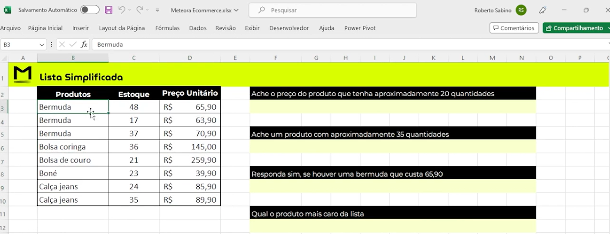
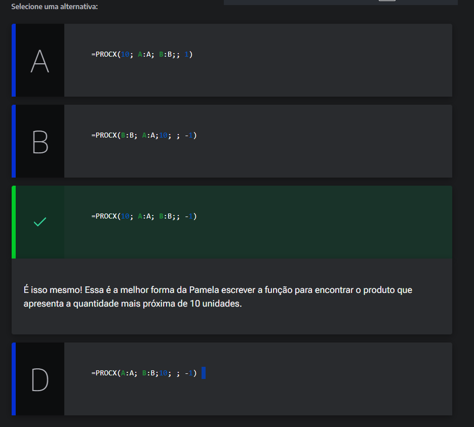
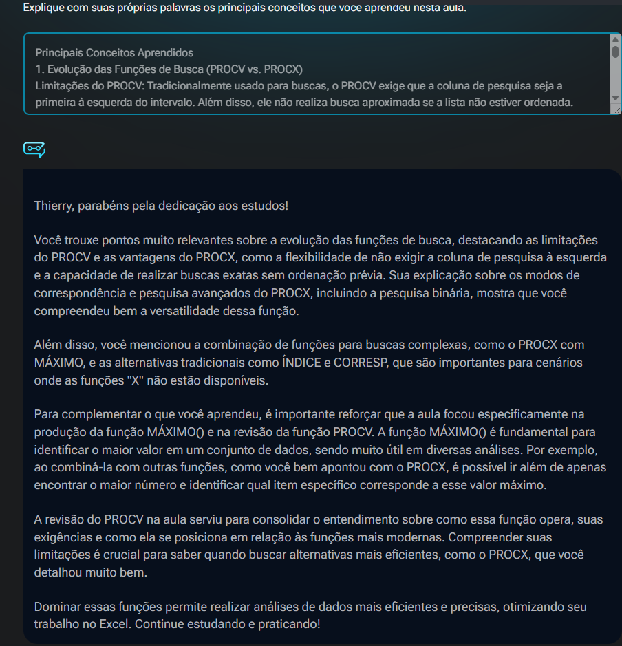

# Busca aproximada

<a id="topo"></a>

## Sumário
- [Busca aproximada](#busca-aproximada)
  - [Sumário](#sumário)
  - [1. Projeto da aula anterior](#1-projeto-da-aula-anterior)
  - [2. Procura de valores](#2-procura-de-valores)
  - [3. Modo de correspondência](#3-modo-de-correspondência)
  - [4. Faça como eu fiz: produto mais caro](#4-faça-como-eu-fiz-produto-mais-caro)
  - [5. Explicando o desafio](#5-explicando-o-desafio)
  - [6. Desafio: respondendo as perguntas](#6-desafio-respondendo-as-perguntas)
  - [7. O que aprendemos?](#7-o-que-aprendemos)

## 1. Projeto da aula anterior  

Para acompanhar o curso com o máximo de aproveitamento, você pode acessar a [planilha](db/Meteora%20Ecommerce%20-%20FINAL%20AULA%204.xlsx). Com a planilha em mãos, você terá a oportunidade de praticar os exercícios propostos e fazermos juntos uma jornada de aprendizado com qualidade e muita mão na massa.

---
## 2. Procura de valores

Nessa próxima etapa iremos dar inicio ao tradicional __desafio__, para esse desafio foi realizado a adição de mais duas planilhas, sendo uma delas a da imagem abaixo: 

<table style="text-align: center; width: 100%;"> 
<tr>
    <td style="text-align: left;">
    
    </td>
</tr>
</table>

Para o primeiro questionamento poderíamos utilizar o `PROCV()`, porém essa função não funciona corretamente se os valores não estiverem em ordem, então se formos realizar a fórmula conforme a escrita abaixo: 
```excel
=PROCV(20;B2:D9;2;VERDADEIRO)
```
Nao teremos o resultado desejado, pois  o primeiro valor no qual desejamos procurar, tem que ser o primeiro valor da esquerda, para ajustar e gerar ao menos 1 resultado,  basta trocar a referência de `B2` Para `C2`, porém isso irá criar um novo problema, ele irá realizar a busca porém não trará o resultado, e isso se deve conforme dito anteriormente que:  
>PS: __A FUNÇÃO `PROCV()` NÃO FAZ PROCURA APROXIMADA SE A LISTA NÃO TIVER EM ORDEM__  

Então para sanar esse problema, devemo realizar a ordenação da planilha pelo valor em estoque 
Mas para sanar esse problema podemos utilizar a função de `PROCX()`, pois nessa função para além dos parâmetros que vimos anteriormente, também temos mais __2__ argumentos possíveis de serem adicionados:  
```excel
=PROCX(20;C2:C9;D2:D9;"";-1)
```
Onde esse parâmetro informado com `-1`, corresponde as opções de :
- Correspondência Exata
- Correspondência exata ou próximo item menor
- Correspondência exata ou próximo item maior
- Correspondência de caractere curinga

Esse ultimo item não será abordado por enquanto nesse curso, porém como desejamos buscar o _"Ache o preço do produto que tenha aproximadamente 20 quantidades"_, utilizaremos a exatam ou próximo item menor, 

Ainda temos mais uma opção dentro da função que contem as seguintes informações:  
- Pesquisar do primeiro ao último 
- Pesquisar do último ao primeiro
- Pesquisa Binária (Ordem de classificação crescente)
- Pesquisa Binária (Ordem de classificação decrescente)
  
Sobre as opções de pesquisa binária também não serão abordadas com profundidade por hora, porém é valido ressaltar, que quando selecionarmos essa opção será necessário que os itens também estejam em ordem.
Os demais questionamentos também utilizamos `PROCX()` e estão descritas abaixo:  
```excel
=PROCX(35;C2:C9;B2:B9;"";)

=SE(PROCX(65,9;D2:D9;B2:B9)="Bermuda";"Sim";"Não")

=PROCX(MÁXIMO(D2:D9);D2:D9;B2:B9)
```

---
## 3. Modo de correspondência

Pamela desempenha o papel de gerente de marketing em uma companhia de produtos de beleza. Atualmente, ela está envolvida na manipulação de uma planilha Excel, na qual são registradas as informações referentes ao controle de estoque dos diversos itens disponíveis. O foco atual de Pamela é identificar, dentre todos os produtos armazenados no estoque, __qual deles apresenta a quantidade mais próxima de 10 unidades__. Pamela sabe que para realizar essa busca, ela pode utilizar a função PROCX(), mas está na dúvida de como escrever a função.

Baseado no que aprendemos na aula, qual alternativa indica a maneira correta que a Pamela deve escrever a função para encontrar o produto apresenta a quantidade mais próxima ou igual a 10 unidades?

<table style="text-align: center; width: 100%;"> 
<tr>
    <td style="text-align: left;">
    
    </td>
</tr>
</table>  

---
## 4. Faça como eu fiz: produto mais caro
Agora é o momento de aplicarmos o que aprendemos e colocar nossas habilidades à prova!

Para este exercício utilize a seguinte tabela:  

|     Produtos     | Estoque |     Preço Unitário     |
| :--------------: | :-----: | :--------------------: |
|     Bermuda      |   48    | R$               65,90 |
|     Bermuda      |   17    | R$               63,90 |
|     Bermuda      |   37    | R$               70,90 |
|  Bolsa coringa   |   36    | R$             145,00  |
| Bolsa de   couro |   19    | R$             259,90  |
|       Boné       |   23    | R$               39,90 |
|   Calça jeans    |   24    | R$               85,90 |
|   Calça jeans    |   34    | R$               89,90 |

Desafio: Que tal utilizar o conhecimento adquirido em aula para responder: Qual o produto mais caro da lista?
>Com as dicas que exploramos, você é uma pessoa preparada para realizar esse cálculo de forma precisa e eficiente. Aproveite essa oportunidade para consolidar seu aprendizado e se destacar na análise de dados no Excel!

__Opinião do instrutor__ 
Para realizar essa atividade, siga o passo a passo proposto.

- Passo 1: O primeiro passo que devemos seguir, é selecionar a célula onde vamos escrever a nossa função para buscar a resposta. Para efeitos deste exercício, vamos colocar a nossa fórmula na célula `F3` da planilha.

- Passo 2: Como queremos realizar uma busca para descobrir qual é o valor aproximado, vamos utilizar a função a função `=PROCX`.

- Passo 3: Na célula `F3` insira o símbolo do igual `=` para abrir a função e digite PROCX.
```excel
=PROCX(
```
- Passo 4: O primeiro parâmetro da função PROCX, a pesquisa_valor, vamos utilizar outra função, a `MÁXIMO()`. Digite MÁXIMO e pressione a tecla `TAB` do teclado para abrir a função.
```excel
=PROCX(MÁXIMO(;
```
- Passo 5: Como primeiro parâmetro da função MÁXIMO, o núm_1, selecione o intervalo da coluna `“Preço Unitário” (D3:D10)`. Feche os parênteses e, em seguida, digite o ponto e vírgula `;` para retornar a função `PROCX().`
```excel
=PROCX(MÁXIMO(D3:D10);
```

- Passo 6: Para o segundo parâmetro da função PROCX, a pesquisa_matriz, selecione novamente o intervalo da coluna `“Preço Unitário” (D3:D10)` e, em seguida, digite o ponto e vírgula `;` para adicionar o próximo parâmetro da função.
```excel
=PROCX(MÁXIMO(D3:D10);(D3:D10);
```
- Passo 7: Para o terceiro parâmetro da função PROCX, a matriz_retorno, selecione o intervalo da coluna `“Produtos” (B3:B10)`. Feche os parênteses e pressione o [ENTER] para finalizar a fórmula.
```excel
=PROCX(MÁXIMO(D3:D10);D3:D10;B3:B10)
```

Pronto a função foi criada e temos como resultado, Bolsa de couro, sendo o produto mais caro da lista!

---
## 5. Explicando o desafio
O desafio será aplicar formulas parecidas, a utilizadas no desafio 1 porém sem a utilização de `PROCX()` Ou de `CORRESPX()`,para que possamos visualizar diferentes maneiras de chegar ao mesmo resultado de forma diferente.  

Para isso iremos dar o exemplo da primeira pergunta no Desafio 02, utilizando `PROCV()`  
```EXCEL
=PROCV(20;C3:D10;2;VERDADEIRO)
``` 
Para esse e outra função devemos ordenar os valores da tabela.

---
## 6. Desafio: respondendo as perguntas

Então, você é uma pessoa preparada para se desafiar à medida que aprende? A hora é agora!

Neste desafio, a sua missão é seguir o passo a passo elaborado durante a aula para responder às perguntas da planilha “Desafio 2” sem utilizar as novas funções “X” do Excel `(PROCX() e CORRESPX())`.


__Opinião do instrutor__ 

Para desenvolver o Desafio final, recomendamos que você pode acessar a [planilha](db/Meteora%20Ecommerce%20-%20FINAL%20AULA%204.xlsx) que estamos trabalhando para a Loja Meteora. Essa é uma excelente oportunidade para explorar e aplicar o seu conhecimento, colocando em prática tudo o que aprendeu. Abaixo, acompanhe a resolução detalhada:

__1° Ache o preço do produto que tenha aproximadamente 20 quantidades: Para responder esta pergunta você pode utilizar a combinação das funções `ÍNDICE(), CORRESP(), MÍNIMO() e ABS()` para encontrar a menor diferença entre o estoque e 20, e retornar o preço do produto correspondente. A fórmula ficará da seguinte forma:__
```excel
=ÍNDICE(D3:D10;CORRESP(MÍNIMO(ABS(C3:C10-20));ABS(C3:C10-20);0))
```

> Explicação da fórmula:

> - ÍNDICE(D3:D10): A função ÍNDICE vai retornar o valor da coluna D (preço), com base na posição indicada pela função CORRESP.

> - CORRESP(MÍNIMO(ABS(C3:C10-20));ABS(C3:C10-20);0): A função CORRESP encontra a posição da menor diferença entre os valores de estoque e o número 20.

> - MÍNIMO(ABS(C3:C10-20)): Encontra a menor diferença entre os valores da coluna C e 20.

> - ABS(C3:C10-20): Calcula a diferença absoluta entre cada valor da coluna C e 20 e transforma diferenças negativas em positivas, permitindo encontrar a quantidade mais próxima de 20.

__2. Ache um produto com aproximadamente 35 quantidades: Para garantir que o produto encontrado tenha a quantidade de estoque mais próxima de 35, evitando ambiguidades, você pode utilizar a combinação das funções `ÍNDICE, CORRESP, MÍNIMO e ABS`, incluindo um critério adicional que prioriza valores menores ou iguais a 35.__

A fórmula ficará da seguinte forma:
```excel
=ÍNDICE(B3:B10;CORRESP(1;((ABS(C3:C10-35)=MÍNIMO(ABS(C3:C10-35)))*(C3:C10<=35));0))
```

> Explicação da fórmula:

> - ÍNDICE(B3:B10: A fórmula retornará o valor do produto na coluna B correspondente à posição encontrada pela função CORRESP

> - CORRESP(1;...; 0): A função CORRESP vai localizar o índice (posição) da primeira linha que atende ao critério combinado.

> - ABS(C3:C10 - 35): Calcula a diferença absoluta entre cada valor da coluna de estoque (C3:C10) e 35, ignorando sinais negativos.

> - = MÍNIMO(ABS(C3:C10-35))): Encontra o menor valor das diferenças absolutas, ou seja, a menor distância entre os valores da coluna de estoque e o número 35.

> - (ABS(C3:C10 - 35) = MÍNIMO(ABS(C3:C10 - 35))): Retorna verdadeiro para as linhas cujas diferenças absolutas sejam <= ao valor encontrado.

> - (C3:C10 <= 35): Adiciona um critério para priorizar valores de estoque menores ou iguais a 35, garantindo que, em caso de empate, o menor valor seja selecionado.

> - ((...)*(...)): Combina os critérios, retornando 1 apenas para as linhas que satisfazem ambos (menor diferença absoluta e menor ou igual a 35).

__3. Responda sim, se houver uma bermuda que custa 65,90: Você pode responder esta pergunta de duas formas:__

1ª Forma: Utilizando a combinação das funções `SE(), ÍNDICE() e CORRESP`

```excel
=SE(ÍNDICE(B3:D10;CORRESP(65,9;D3:D10;0);1)="Bermuda";"Sim";"Não")
```
> Explicação da fórmula:

> - SE(...="Bermuda";"Sim";"Não"): Verifica se o produto encontrado na fórmula é "Bermuda". Se for, retorna "Sim", caso contrário, retorna "Não".
> - ÍNDICE(B3:D10;CORRESP(65,9;D3:D10;0);1): * A função ÍNDICE(B3:D10;...;1) retorna o valor correspondente da coluna B (Produtos) na mesma linha onde o preço foi encontrado e a > - função CORRESP(65,9;D3:D10;0) localiza a posição do preço 65,90 na coluna D (Preço Unitário).


2ª Forma: Utilizando as funções `SE(), E() e CONT.SES`

```excel
=SE(E(CONT.SES(B3:B10;"Bermuda";D3:D10;65,9)>0);"Sim";"Não")
```
> - Explicação da fórmula:

> - SE(E(...); "Sim"; "Não"): A fórmula verifica se os dois critérios são atendidos. Se for verdadeiro, a fórmula retorna "Sim", caso contrário, retorna "Não".

> - CONT.SES(B3:B10;"Bermuda";D3:D10;65,9): A função CONT.SES conta quantas linhas atendem simultaneamente aos dois critérios, o produto na coluna B deve ser igual a "Bermuda" e o preço na coluna D deve ser exatamente igual a 65,90.

__4. Qual o produto mais caro da lista: Para responder esta pergunta, você pode utilizar a combinação das funções `ÍNDICE, CORRESP e MÁXIMO` para identificar o maior preço e retornar o produto correspondente.__

A fórmula ficará da seguinte forma:
```excel
=ÍNDICE(B3:B10;CORRESP(MÁXIMO(D3:D10);D3:D10;0))
```
> - Explicação da fórmula:

> - ÍNDICE(B3:B10;...): A fórmula vai retornar o valor na coluna B (produtos) correspondente à linha que contém o maior preço. Ou seja, ela busca o nome do produto na coluna B, na linha que foi localizada pela função CORRESP().

> - CORRESP(MÁXIMO(D3:D10); D3:D10; 0): A função CORRESP() localiza a posição (linha) onde o maior preço, encontrado pela função MÁXIMO(), está na coluna de preços D3:D10.

> - MÁXIMO(D3:D10): A função vai retornar o maior valor encontrado no intervalo especificado (no caso, os preços na coluna D, de D3 a D10).


Abraços e bons estudos!

[↑ Voltar ao topo](#topo)

---
## 7. O que aprendemos?

<table style="text-align: center; width: 100%;"> 
<tr>
    <td style="text-align: left;">
    
    </td>
</tr>
</table>  


---

<table align="center" style="border-collapse: collapse; margin-left: auto; margin-right: auto;"> 
  <caption><b>Skills do projeto</b></caption>
  <tr>
    <td style="padding: 5px;">
      
    </td>
    <td style="padding: 5px;">
      
    </td>
    <td style="padding: 5px;">
      
    </td>
  </tr>
</table>


---
__Titulo:__ Busca aproximada
__Autor:__ Thierry Lucas Chaves  
__Data de Criação:__ 23-05-2026  
__Data de Modificação:__ 03-06-2026  
__Versão:__ "1.0"