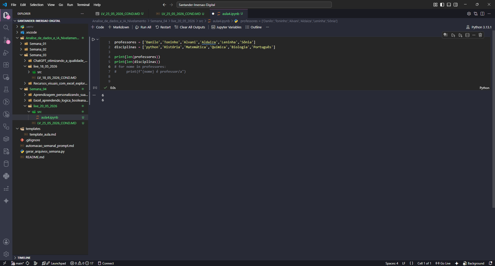
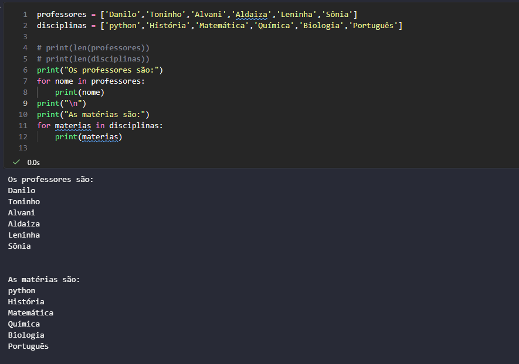
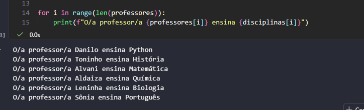
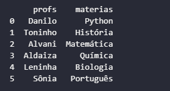

# Conteúdo Live 25/05/2026
## Conceitos de Análise de dados com Python

<a id="topo"></a>

## Sumário
- [Conteúdo Live 25/05/2026](#conteúdo-live-25052026)
  - [Conceitos de Análise de dados com Python](#conceitos-de-análise-de-dados-com-python)
  - [Sumário](#sumário)
  - [1. Introdução.](#1-introdução)
  - [2. Conteúdo](#2-conteúdo)
  - [3. Comando `Len`](#3-comando-len)
  - [4. Comando `Range`](#4-comando-range)
  - [5. Visualização Tabular](#5-visualização-tabular)

## 1. Introdução.
O objetivo inicial da aula será de realizar a emulação de um banco de dados com `Python`. 

## 2. Conteúdo
Assim como na [aula anterior](https://github.com/thierryLchaves/Santander-Imersao-Digital/blob/960757e419bf7f2dca3309c2b8d81c16d2370dfa/Analise_de_dados_e_IA_Nivelamento/Semana_03/live_18_05_2026), muitas coisas serão [programadas](C:\Users\Thierry-G15\Documents\Estudos\Alura\Santander-Imersao-Digital\Analise_de_dados_e_IA_Nivelamento\Semana_04\live_20_05_2026\src\aula4.ipynb) e nesse arquivo conterá apenas algumas observações pontuais sobre o que foi repassado. 

## 3. Comando `Len`
O comando `len`, é utilizado para capturar a quantidade de coisas _"Objetos"_ dentro de uma lista, conforme exemplo abaixo:  

<table style="text-align: center; width: 100%;"> 
<tr>
    <td style="text-align: left;">
    
    </td>
</tr>
</table>

Conforme dito, em aula como estamos trabalhando com análise de dados, e importante que quando estivermos trabalhando com listas essas listas tenham a mesma quantidade de dados, e um dos motivos dessa utilização se dá ao fato de que em análise de dados trabalhamos muitos com indices.
>__PS:__ Sobre a utilização do `FOR`, uma forma de se explicar a utilização do `FOR` e que esse comando é um laço de repetição, então se temos um conjunto de coisas como por exemplo:
> uma lista esse laço ira atribuir o valor do primeiro argumento "assumindo o valor" daquela coisa e irá fazer o comando até que aquele conjunto de coisas tenha acabado.

<table style="text-align: center; width: 100%;"> 
     <tr>
         <td style="text-align: left;">
             
         </td>
     </tr>
 </table>

No exemplo acima temos a utilização de um laço de repetição utilizando o comando `FOR`, porém caso desejamos utilizar a _"Concatenação"_ de um elemento de uma lista com o outro elemento como :
```text
Danilo leciona Python
```

o que temos em comum entre o elemento _"Danilo"_ e o elemento _"Python"_ e que ambos elementos ocupam a primeira posição __(posição 0)__, de ambas as listas, ou seja para que possamos utilizar em um único comando for a exibição de ambos os resultados concatenados, iremos passa-los pela posição dos elementos da lista.  
Então conforme dito anteriormente tanto em `Excel` quanto em banco de dados relacionais, e quase que uma regra que na mesma linha se refere ao mesmo dado/objeto.
>__PS:__ Assim como em outras linguagens de programação uma lista ou uma `Array` se inicia pela posição 0 então o primeiro elemento de uma lista sempre terá o índice 0

Para tal utilização utilizamos o seguinte comando utilizamos o [comando range](#4-comando-range)

## 4. Comando `Range`
O comando `range` é utilizado para indicar o conjunto de posições presentes em uma lista.   

```python
for i in range(len(professores)):
    print(professores[i])
```

Em termos de sintaxe, os comandos divergem um do outro, porém da maneira como foi escrito acima, os resultados serão idênticos no que tange a saída em terminal de um comando `FOR var in list` por exemplo, em termos práticos trocamos a _"assimilação"_ de variável em um conjunto para um laço de repetição que realize a _"assimilação"_ de valor por posição 
```python
professores = ['Danilo','Toninho','Alvani','Aldaiza','Leninha','Sônia']
for i in range(len(professores)):
    print(professores[i])
# Step By Step
#  i[0] = Danilo
#  i[1] = Toninho
#  i[2] = Alvani
#  i[3] = Aldaiza
#  i[4] = Leninha
#  i[5] = Sônia
 ```
Então a importância de termos uma lista com a mesma quantidade de _"Objetos"_, em uma lista se dá que para casos em que queremos acessar diferentes lista ou até mesmo dicionários de dados com um único comando, uma vez que não realizamos mais a atribuição de valor em uma variável pelos valores de um conjunto e sim pelos índices desse conjunto é possível realizar esse processo de  atribuição.

<table style="text-align: center; width: 100%;"> 
     <tr>
         <td style="text-align: left;">
             
         </td>
     </tr>
 </table>

## 5. Visualização Tabular
Para os próximos passos, precisaremos utilizar bibliotecas _"Não nativas"_ no `Python`, a primeira que utilizaremos será o `PANDAS`. Para realizar a instalação e utilização de tal biblioteca utilizaremos os seguintes comandos:  
> Em caso de utilização de arquivos `Python`
```cmd
python pip install pandas
```
> Em caso de utilização de arquivos `Jupyter Notebook`
```ipynb
!pip install pandas
```
Pós a instalação da biblioteca no ambiente devermos importar esse `framework`
```python
import pandas as pd
```

Pós tal processo podemos dar seguimento no código conforme exemplo abaixo:  
```python
import pandas as pd
professores = ['Danilo','Toninho','Alvani','Aldaiza','Leninha','Sônia']
disciplinas = ['Python','História','Matemática','Química','Biologia','Português']
dados = {
    'profs': professores,
    'materias':disciplinas
}
print(pd.DataFrame(dados))
```
<table style="text-align: center; width: 100%;"> 
     <tr>
         <td style="text-align: left;">
             
         </td>
     </tr>
 </table>

Para que possamos salvar um dicionário conforme criado em um arquivo como `Excel`, podemos utilizar o comando descrito abaixo:
```py
carros = {
    'modelo':['uno','gol','polo','kombi'],
    'preço':[20000,30000,60000,15000],
    'marca':['fiat','vw','vw','vw'],
    'fabricação':[2005,2015,2023,1975]

}
carros = pd.DataFrame(carros)
carros.to_excel('carros.xlsx')
```
Esse comando foi utilizado e gerou a [planilha](src/carros.xlsx)

---

<table align="center" style="border-collapse: collapse; margin-left: auto; margin-right: auto;"> 
  <caption><b>Skills do projeto</b></caption>
  <tr>
    <td style="padding: 5px;">
      
    </td>
    <td style="padding: 5px;">
      
    </td>
    <td style="padding: 5px;">
      
    </td>
    <td style="padding: 5px;">
      
    </td>
  </tr>
</table>


---
__Titulo:__ Conteúdo Live 25/05/2026  
__Autor:__ Thierry Lucas Chaves    
__Data de Criação:__ 26-05-2026  
__Data de Modificação:__ 26-05-2026  
__Versão:__ "1.0"