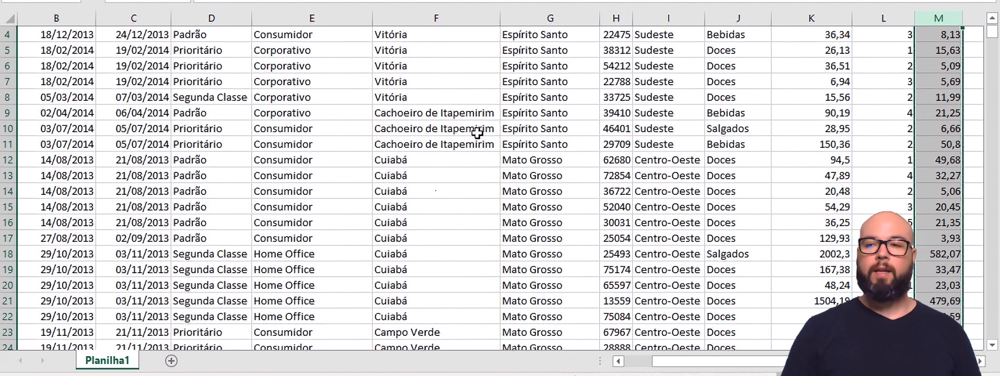
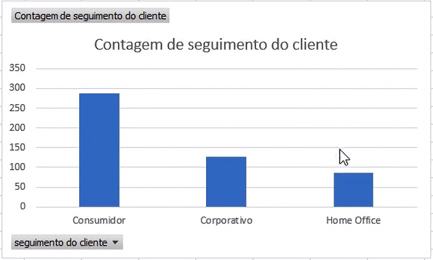
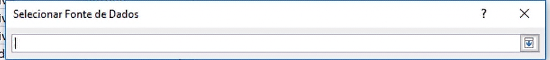
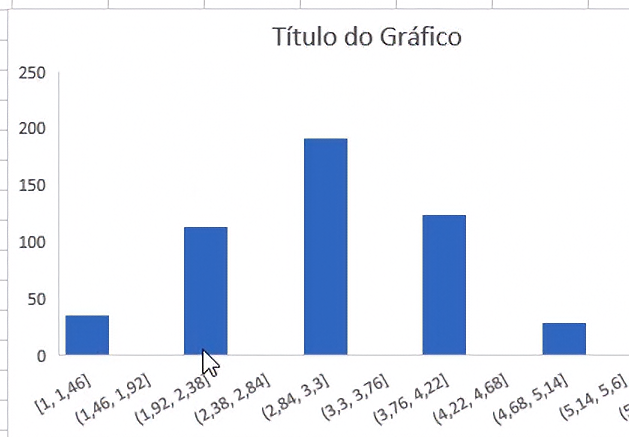
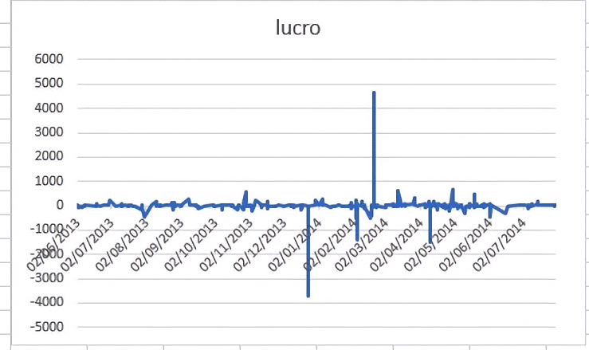
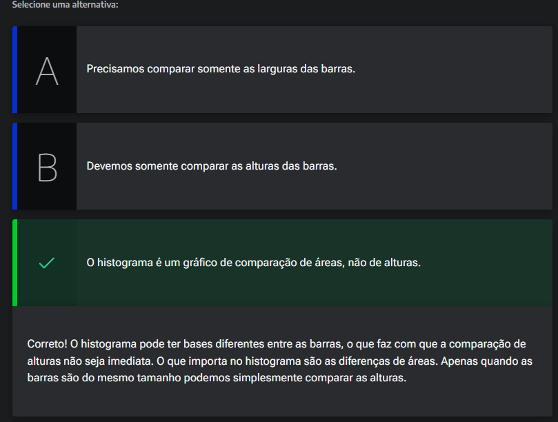
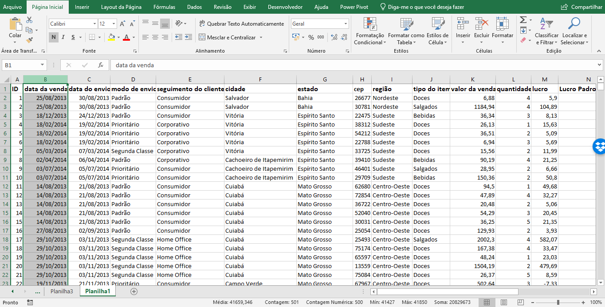
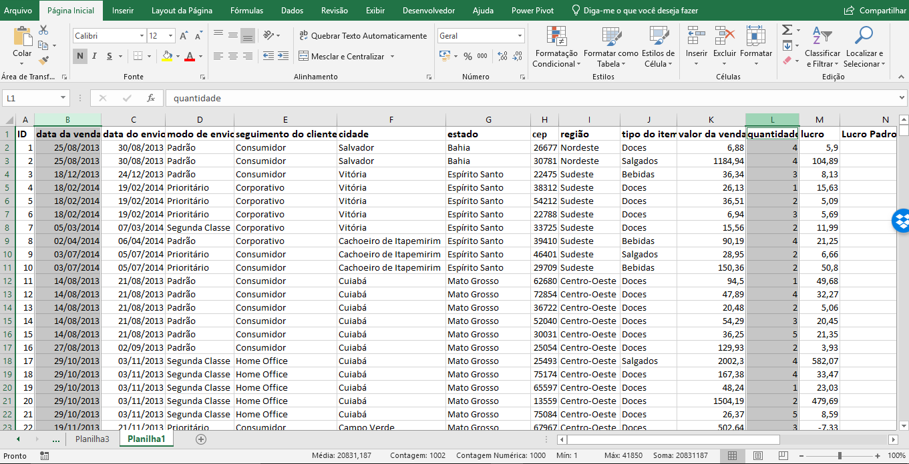
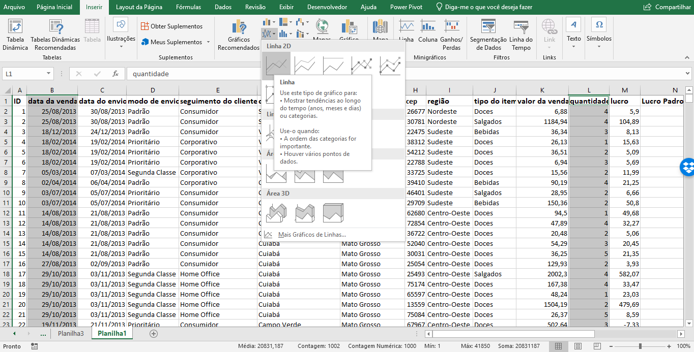
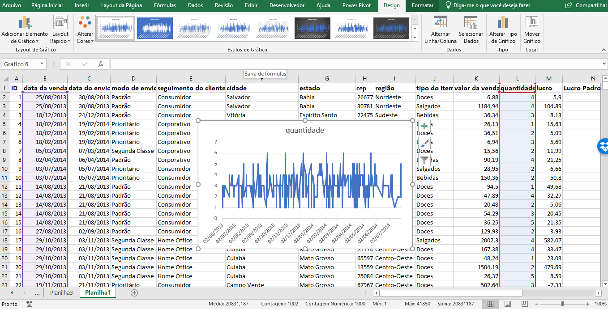

# Visualização de Dados

## Sumário
- [Visualização de Dados](#visualização-de-dados)
  - [Sumário](#sumário)
  - [1. Introdução](#1-introdução)
  - [2. Botando a mão na massa](#2-botando-a-mão-na-massa)
  - [3. Visualização de variáveis categóricas](#3-visualização-de-variáveis-categóricas)
  - [4. Visualização de variáveis quantitativas](#4-visualização-de-variáveis-quantitativas)
  - [5. Visualização de uma Série Temporal](#5-visualização-de-uma-série-temporal)
  - [6. Cuidado com as barras](#6-cuidado-com-as-barras)
  - [7. Faça como eu fiz na aula](#7-faça-como-eu-fiz-na-aula)
  - [8. O que aprendemos?](#8-o-que-aprendemos)

## 1. Introdução

Nesse curso iremos explorar bastante as ferramentas de estatísticas do Excel, diversas fórmulas e analises gráficos, em casos fictícios, porém também iremos trabalhar com dados de uma empresa do ramo alimentício, para que possamos descobrir algumas relações nessa base de dados.

---
## 2. Botando a mão na massa

Antes de iniciarmos com a base de dados, a ser disponibilizada, iremos relembrar alguns conceitos prévios do Excel.
No banco de dados de exemplo temos diversos vetores e alinhamentos (Intercessão entre linhas e colunas do Excel)  

<table style="text-align: center; width: 100%;"> 
<tr>
    <td style="text-align: center;">
    
    </td>
</tr>
</table>

Conforme descrito em vídeo, o banco de dados em questão pode ser considerado de um tamanho moderado (contendo mais de 500 linhas), o que impossibilita a olho nú a identificação de padrões nessa base então para esse fator iremos utilizar estatística descritiva para identificação de tais padrões.

---
## 3. Visualização de variáveis categóricas
O primeiro passo a ser dado e pode ser considerado uma boa prática dentro de uma nova base de dados, e visualizar _"pedir"_ alguns gráficos para visualizar o jeito de alguma variável, como por exemplo uma variável categórica.
> Uma variável categórica é uma variável não quantitativa, ou seja uma variável que dividida em categorias, nomes ou qualidades por exemplo. 

No exemplo do nosso banco de dados, temos a coluna `E` com as descrições de seguimento do cliente, e conforme já reiterado diversas vezes a visualização dessa distribuição a olho nú pode se tornar algo impossível de fazer, então para analisar esse tipo de distribuição de valores podemos utilizar um `gráfico de barras` para visualizar essa distribuição, e para tal processo iremos selecionar todo o intervalo de valores da coluna referida e inserir um gráfico no caso um gráfico recomendado pela própria ferramenta trata-se de um gráfico de barras, quando implementamos esse tipo de gráfico podemos ter um vislumbre da distribuição dessa variável,   

<table style="text-align: center; width: 100%;"> 
<tr>
    <td style="text-align: center;">
    
    </td>
</tr>
</table>

---
## 4. Visualização de variáveis quantitativas
No exemplo anterior verificamos como identificamos um padrão de uma variável descritiva, porém agora iremos visualizar uma variável quantitativa, para esse tipo de dados e dado à algumas distribuições, podemos utilizar um outro tipo de gráfico no caso o gráfico que é chamado de gráfico de Histograma, esse gráfico e indicado quando queremos visualizar um distribuição de variáveis quantitativas. 
Uma das maneiras de inserção de gráfico para além da padrão, pode ser utilizando o processo de seleção de um campo, acessar a guia de inserir e escolher o gráfico (para o caso em especifico iremos escolher a opção de gráfico estatístico), ao selecionar o gráfico desejado `histograma` será apresentado em tela uma tela em gráfico, e para que possamos inserir o gráfico existem duas maneiras 
  - 1ª Selecionar o gráfico em branco, acessar a guia de __Design__, menu de dados, `Selecionar dados`
  - 2ª Selecionar o gráfico em branco, clicar com botão de mouse direito e escolher a opção de `Selecionar dados`
Será apresentado uma tela conforme exemplo: 

<table style="text-align: center; width: 100%;"> 
<tr>
    <td style="text-align: left;">
    
    </td>
</tr>
</table>  

Nessa tela deverá ser selecionado o intervalo de dados no qual o Excel deverá gerar o gráfico, após a seleção do intervalo será _"plotado"_ o gráfico de histograma, esse gráfico e muito utilizado, pois trata-se de um gráfico _"especial"_ de barras (na verdade o histograma é um gráfico de áreas) , ou seja ele é utilizado para comparação das áreas de determinadas colunas.  

<table style="text-align: center; width: 100%;"> 
<tr>
    <td style="text-align: center;">
    
    </td>
</tr>
</table>   

O que podemos analisar a partir de tal gráfico, é a distribuição dos valores presentes no intervalo, a imagem _"plotada"_ do gráfico demonstrar em um gráfico qual foi, ou quais foram os números e suas distribuições mais frequentes, para o exemplo a maior distribuição dessa base de dados foram de vendas de 3 itens.

---
## 5. Visualização de uma Série Temporal

Outro tipo de gráfico que iremos analisar, será o gráfico de dispersão ou __Série temporal__ (um gráfico de pontos com linhas a grosso modo), que tem com utilidade analisar o _"comportamento"_ de uma determinada variável ao longo do tempo, esse tipo de análise e denominada de analise `Bi-dimensional`, ou seja iremos _"pegar"_ duas variáveis simultaneamente para analise.   
Para confecção desse gráfico iremos selecionar 2 intervalos de valores, sendo eles `Data da venda` e `Lucro`, pós seleção iremos inserir o gráfico recomendado, iremos selecionar a segunda opção na qual o Excel nomeou de gráfico de linha. Será apresentado um gráfico conforme exemplo:  
<table style="text-align: center; width: 100%;"> 
<tr>
    <td style="text-align: center;">
    
    </td>
</tr>
</table>   

Esse gráfico é montado com 2(duas) informações em 2 eixos diferentes, onde no eixo horizontal temos a temporalidade e no eixo vertical o lucro, ou seja o quantitativo. Através desse tipo de gráfico podemos analisar como o lucro da empresa em questão foi distribuído ao longo do tempo.  

---
## 6. Cuidado com as barras

Você agora é o analista de dados e precisa gerar uma visualização da variável lucro. Como sabemos a variável lucro é quantitativa e então há uma maior variedade de gráficos que podemos produzir. Dois tipos de gráficos muito comuns e parecidos são o gráfico de barras (colunas no Excel) e o histograma.

Se optarmos por fazer um histograma, que cuidado sempre devemos ter na interpretação dos resultados? 

<table style="text-align: center; width: 100%;"> 
<tr>
    <td style="text-align: center;">
    
    </td>
</tr>
</table>   

---
## 7. Faça como eu fiz na aula

Vamos fazer juntos uma série temporal da variável quantidade? Esse gráfico serve para vermos o comportamento da variável quantidade ao longo do tempo.

Clique na letra `B` para selecionar toda a coluna data da venda.  

<table style="text-align: center; width: 100%;"> 
<tr>
    <td style="text-align: left;">
    
    </td>
</tr>
</table>

Agora segure Ctrl e clique na coluna quantidade.

<table style="text-align: center; width: 100%;"> 
<tr>
    <td style="text-align: left;">
    
    </td>
</tr>
</table>  

Clique em Inserir, Gráfico de linhas ou de áreas, escolha a opção linhas:    

<table style="text-align: center; width: 100%;"> 
<tr>
    <td style="text-align: left;">
    
    </td>
</tr>
</table>  

O resultado deve ser esse:  

<table style="text-align: center; width: 100%;"> 
<tr>
    <td style="text-align: left;">
    
    </td>
</tr>
</table>  

__Opinião do instrutor__  

Veja que em diversos momentos a linha é vertical, isso ocorre porque há dias em que há mais de uma venda.

---
## 8. O que aprendemos?

Nesta aula, vimos como:

- Estruturar um banco de dados em formato de planilha.
- Transformar dados qualitativos em gráficos.
- Transformar dados quantitativos em gráficos.
- Visualizar dados que descrevem fenômenos ao longo do tempo.

---

<table align="center" style="border-collapse: collapse; margin-left: auto; margin-right: auto;"> 
  <caption><b>Skills do projeto</b></caption>
  <tr>
    <td style="padding: 5px;">
      
    </td>
    <td style="padding: 5px;">
      
    </td>
    <td style="padding: 5px;">
      
    </td>
  </tr>
</table>

---
__Titulo:__ Visualização de Dados
__Autor:__ Thierry Lucas Chaves  
__Data de Criação:__ 08-06-2026  
__Data de Modificação:__ 08-06-2026  
__Versão:__ "1.0"