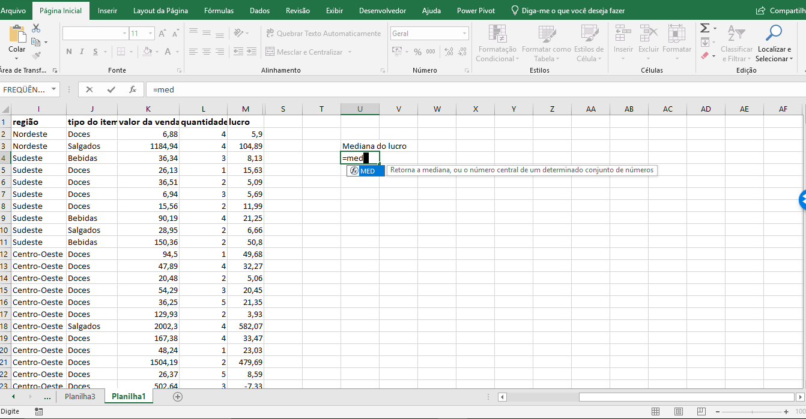
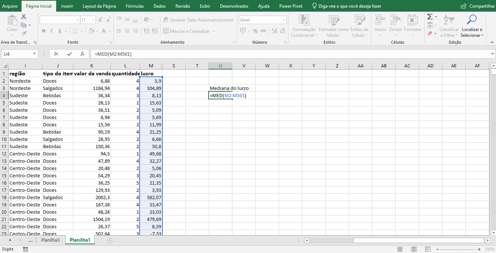
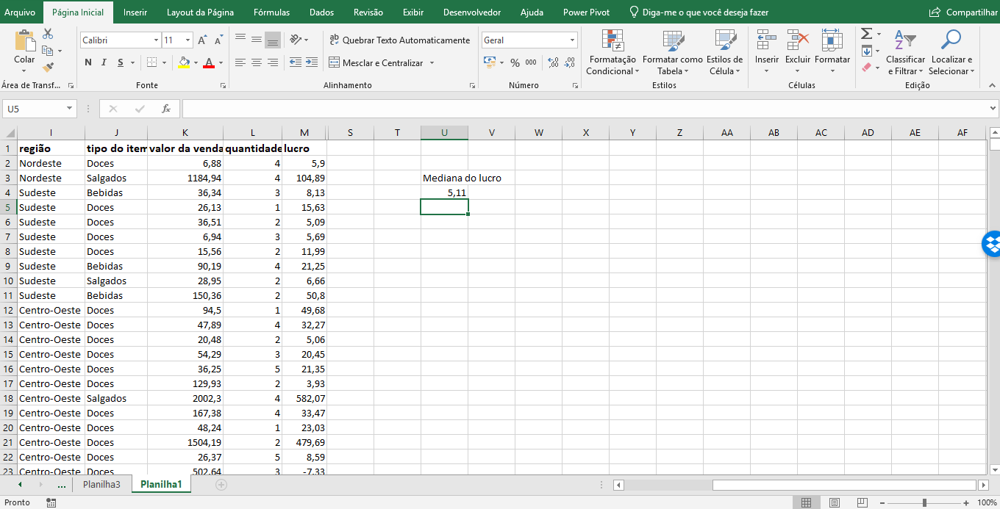

# Medidas de Posição

<a id="topo"></a>

## Sumário
- [Medidas de Posição](#medidas-de-posição)
  - [Sumário](#sumário)
  - [1. Uma medida que resume uma coluna](#1-uma-medida-que-resume-uma-coluna)
  - [2. Uma medida que divide a coluna duas metades](#2-uma-medida-que-divide-a-coluna-duas-metades)
  - [3. Média Condicional](#3-média-condicional)
  - [4. Média ou Mediana?](#4-média-ou-mediana)
  - [5. Faça como eu fiz na aula](#5-faça-como-eu-fiz-na-aula)
  - [6. O que aprendemos?](#6-o-que-aprendemos)

## 1. Uma medida que resume uma coluna

Nesse tópico iremos abordar a medida mais importante sobre análise de dados que é o calculo de média aritmética, e para tal iremos calcular tal processo com base na na coluna de valor da venda. 
>PS: O acesso da base de dados a ser utilizada está disponível através da [planilha](db/Base_dados.xlsx)

Esse valor de vendas, está disponível na `Coluna K` de nossa base, essa média a ser calculada, pode ser referida também como medida de tendência central, ou ainda mais genericamente falando como uma medida de resumo, existem várias medidas de resumo _(<a href="#MTC">Medidas de Tendência Central</a>,e <a href="#MD">Medidas de Dispersão</a>)_. Porém se tratando de medidas de tendência central em valores representativos, veremos mais a frente a média aritmética e mediana.  
Para esse cálculo ser realizado em Excel, por mais que sua aplicação seja _"de fácil execução"_  em base de dados tidas como grandes, pode aumentar a sucessibilidade de erros, para fazer isso no Excel, podemos selecionar uma célula vazia e inserir a formula abaixo: 
```excel
=MÉDIA(K:K)
```
> PS: Em análise de dados e de boa prática realizar uma notação sobre o calculo que está sendo realizado, como um texto descritivo sobre tal valor.
> PS2: Como a base de dados está com a coluna referida somente com os dados de valores de vendas selecionamos todo o intervalo da coluna `k:k`.  

Quando realizamos uma segunda análise sobre os dados, vemos que temos uma média de vendas de 221,0452 o que podemos considerar como uma média de vendas boa, porém conforme visualizado anteriormente em nosso gráfico de serie temporal esse dado não condiz muito com a realidade visto que o lucro em sí não orbita conforme essa média de vendas, o que pode levar a conclusão prévia de que talvez o custo operacional esteja elevado.  
Outro ponto que devemos nos ater quando estamos trabalhando com média aritmética e que esse calculo comumente pode sofrer distorções pelos então chamados de _"OutLiers"_, ou seja valores muito discrepantes dos valores padrões, em suma se tivermos um valor que é muito diferente dos demais (seja para baixo ou para cima), esses valores tendem a tirar ela da tendência central real da distribuição, exemplo:   
Dado a seguinte distribuição numérica: __1,1,1,1,1,1000__, esse valor de __1000__ e tido como um valor minoritário dado a sua apresentação única dentre os valores da distribuição porém ele irá distorcer nossa média dado ao seu alto valor. Para que possamos corrigir esse processo temos outro cálculo que pode ser aplicado que é a mediana.

<details id="MTC">
    <summary>Medidas de Tendência Central</summary>
    <p>São valores que resumem um conjunto de dados, indicando um ponto central ou típico em torno do qual os dados se distribuem.</p>
    <ul>
        <li><strong>Média:</strong> A soma de todos os valores dividida pela quantidade total de elementos.</li>
        <li><strong>Mediana:</strong> O valor exato que divide o conjunto de dados ordenado ao meio (50% dos dados abaixo, 50% acima).</li>
        <li><strong>Moda:</strong> O valor ou valores que aparecem com maior frequência no conjunto de dados.</li>
    </ul>
</details>

---

<details id="MD">
    <summary>Medidas de Dispersão</summary>
    <p>São métricas que indicam o grau de variabilidade ou afastamento dos dados em relação à média central.</p>
    <ul>
        <li><strong>Amplitude:</strong> A diferença bruta entre o maior e o menor valor do conjunto.</li>
        <li><strong>Variância:</strong> A média dos quadrados dos desvios de cada valor em relação à média geral.</li>
        <li><strong>Desvio Padrão:</strong> A raiz quadrada da variância, que traz a dispersão de volta para a mesma unidade de medida dos dados originais.</li>
    </ul>
</details>

---
## 2. Uma medida que divide a coluna duas metades

Agora veremos mais sobre a mediana, essa medida também se trata de uma medida de resumo e também uma medida de tendência central assim como a média, porém sua utilização e menos suscetível  a distorções de valores, porém é menos utilizada em aplicações mais avançadas em funções de estatísticas.  
Para realização do calculo da mediana em Excel, podemo utilizar a seguinte fórmula:  
```excel
=MED(K:K)
```
Quando comparamos os valores da média e da mediana temos valores muito divergentes, sendo da média de 221,04 e da mediana de 39,1. O que são valores muito diferentes para medidas de tendência central, isso pode indicar que a valores distorcendo a média, e por que a na mediana não temos esse tipo de distorção, pois a mediana realiza a divisão em duas parte iguais da distribuição de valores.  
Então para melhor interpretação desse valor da mediana, podemos _"interpretar"_ que metade dos valores de vendas tiveram o valor inferior ou igual a 39 e a outra metade tiveram valores superior ou igual a 39.  

---
## 3. Média Condicional
Agora iremos abordar sobre a média condicional, esse tipo de média é feita quando existe o calculo de uma média que leva uma condição em consideração na hora de calculo, ela comumente é utilizada quando se deseja realizar uma _"análise mais refinada"_ de uma tendência central, ou seja suponhamos que desejamos realizar uma média somente de alguns casos em especifico, vamos supor que a média desejada seria de lucro por tipo de consumidor (colunas `E` e `M`),podemos utilizar essa função, e para tal utilizaremos a seguinte formula no Excel:  
```excel
=MÉDIASE(E:E;E2;M:M)
```
Onde o primeiro parâmetro da formula utilizada diz respeito ao intervalo de critérios que utilizaremos, o segundo parâmetro diz respeito ao critério a propriamente dito a ser utilizado, e por fim o intervalo da obtenção da média. Na prática o Excel realiza a comparação de linha a linha do intervalo de critérios, comparando se o critério foi atendido realiza o armazenamento daquele valor para que então o cálculo da média seja aplicado.

---
## 4. Média ou Mediana?

Agora que você já sujou as mãos no banco de dados, é hora de dar uma descrição mínima dos dados. Você quer comunicar ao cliente um número apenas, que indique o centro da distribuição de uma coluna.

A média e a mediana são sempre consideradas medidas equivalentes para representar o centro de uma distribuição de dados? Explique o porquê de serem ou não equivalentes.
```text
Não. Pois enquanto a média pode ser mais suscetível a  outliers de valores, a mediana não é tão  suscetível e esse processo. E sempre importante avaliar as duas medidas, visto que são medidas de tendência central, porém podemos ter valores diferentes ao realizar o calculo de cada uma.
```
<table style="text-align: center; width: 100%;"> 
<tr>
    <td style="text-align: left;">
    
    </td>
</tr>
</table>

---
## 5. Faça como eu fiz na aula

Que tal relembrar como calculamos a mediana de um conjunto de dados? Vamos calcular a mediana do lucro. Selecione uma célula para inserir a fórmula, digite  `=med`.

<table style="text-align: center; width: 100%;"> 
<tr>
    <td style="text-align: left;">
    
    </td>
</tr>
</table>

Selecione todos os valores da variável:
<table style="text-align: center; width: 100%;"> 
<tr>
    <td style="text-align: left;">
    
    </td>
</tr>
</table>

E aperte `Enter`:
<table style="text-align: center; width: 100%;"> 
<tr>
    <td style="text-align: left;">
    
    </td>
</tr>
</table>

__Opinião do instrutor__  

Note como a mediana do lucro é maior do que a média, que é aproximadamente 1,14.


---
## 6. O que aprendemos?

Nesta aula, vimos:

- Como resumir um conjunto de dados num um único número que seja representativo de todo o conjunto.
- O número que separa o conjunto de dados ordenados em duas metades.
- A técnica para calcular a média considerando apenas casos específicos de uma coluna.

---

<table align="center" style="border-collapse: collapse; margin-left: auto; margin-right: auto;"> 
  <caption><b>Skills do projeto</b></caption>
  <tr>
    <td style="padding: 5px;">
      
    </td>
    <td style="padding: 5px;">
      
    </td>
    <td style="padding: 5px;">
      
    </td>
  </tr>
</table>


---
__Titulo:__ Medidas de Posição
__Autor:__ Thierry Lucas Chaves  
__Data de Criação:__ 08-06-2026  
__Data de Modificação:__ 08-06-2026  
__Versão:__ "1.0"