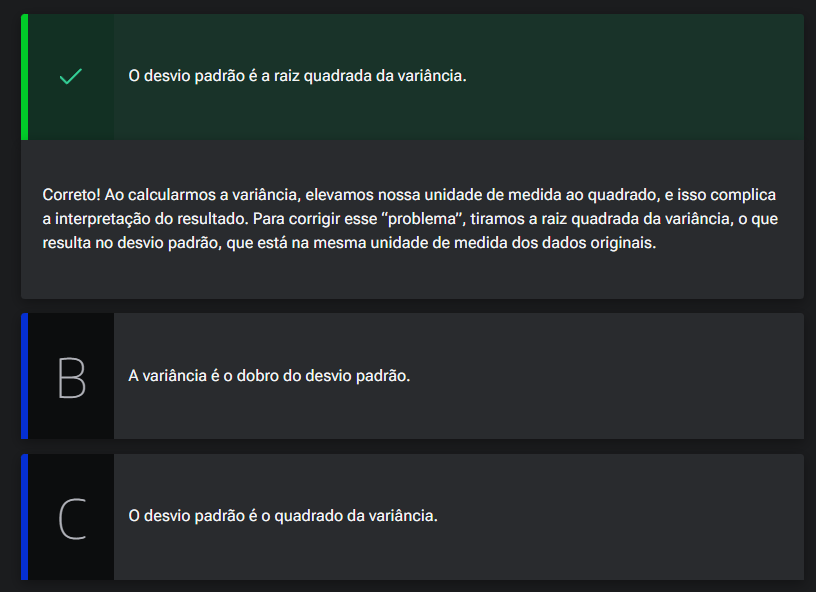
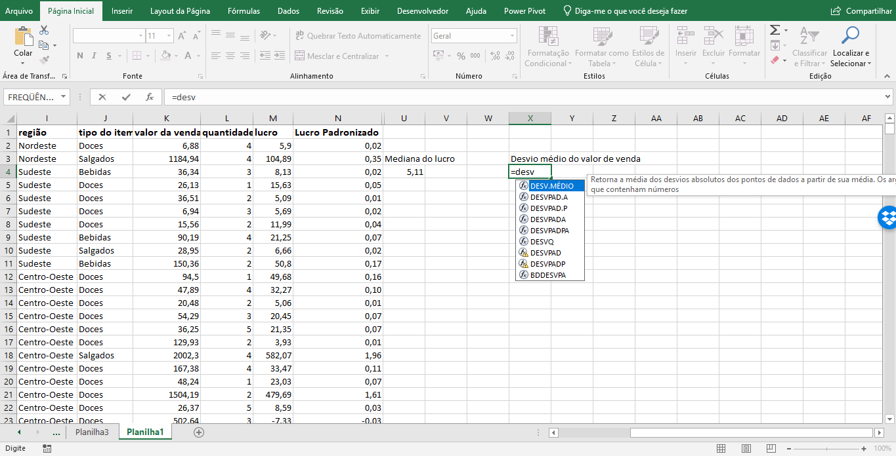
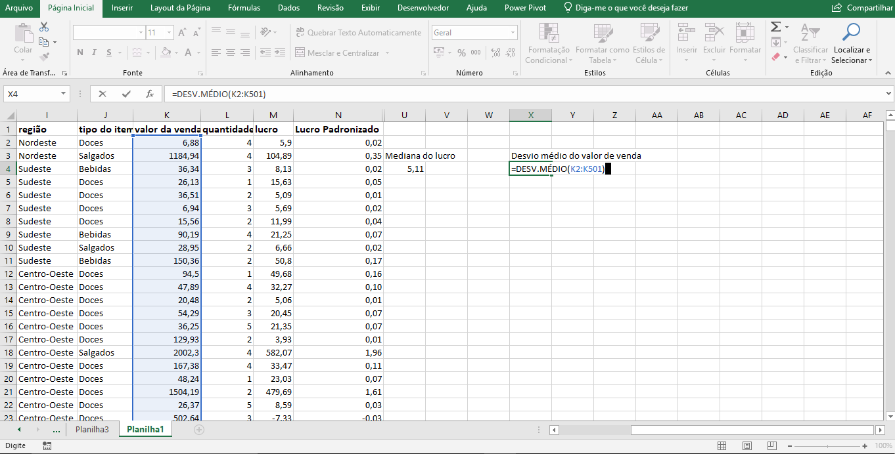
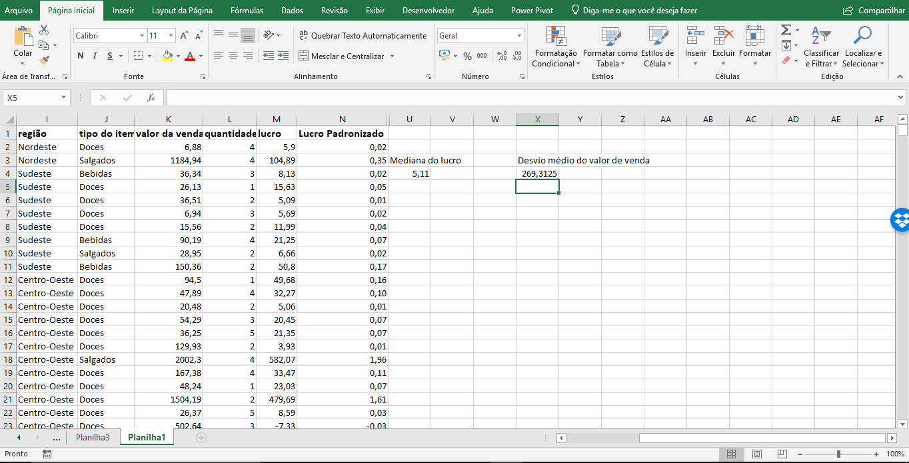

# Medidas de Dispersão

<a id="topo"></a>

## Sumário
- [Medidas de Dispersão](#medidas-de-dispersão)
  - [Sumário](#sumário)
  - [1. Observando a variação dos dados](#1-observando-a-variação-dos-dados)
  - [2. A variância](#2-a-variância)
  - [3. Desvio Padrão](#3-desvio-padrão)
  - [4. Comentários sobre as medidas de dispersão](#4-comentários-sobre-as-medidas-de-dispersão)
  - [5. Variância varia e desvio desvia](#5-variância-varia-e-desvio-desvia)
  - [6. Faça como eu fiz na aula](#6-faça-como-eu-fiz-na-aula)
  - [7. O que aprendemos?](#7-o-que-aprendemos)

## 1. Observando a variação dos dados

Nesta aula abordaremos sobre medida de dispersão, que são também medidas de resumo mas nos dão a ideia da variação dos dados, essas são utilizadas em complemento medidas de tendência central (media e mediana).   
Para inicio utilizaremos outra medida de tendência central chamada de __Desvio Médio__, que se trata da média dos desvios em relação a média do intervalo de valores. Para realização desse calculo em nossa [base  de dados](db/Base_dados.xlsx), utilizaremos a coluna de lucro, a priore iremos calcular a média do valor do lucro, e posteriormente utilizaremos a fórmula de desvio médio do Excel:  
```excel
=DESV.MÉDIO(M:M)
```
Ao aplicar a formula acima teremos o valor de __65,45373632__ esse valor condiz com a média de _"distâncias"_ para o lucro médio, então se analisarmos nosso lucro médio está em torno de __1,14468__, então a média dos _"erros"_ dos  lucros que são maiores ou menores que esse lucro médio tem esse valor, em outros termos podemos considerar que esse valor é o que esperamos que aconteça em termos  de diferença em relação a média do valor como se fosse valores percentuais para cima ou para baixo (pontos de pesquisa por exemplo), ou seja esperamos que possa haver na base de dados lucros de __65,45 + 1__ ou de __65,45 - 1__.

---
## 2. A variância
A variância e outra importante medida de dispersão,  sua importância se da pois ela traz consigo as variações _(conforme o nome sugere)_, mas também é importante pois através calculamos o desvio padrão.
Para realizar esse calculo no Excel, podemos utilizar a seguinte formula:  
```excel
=VAR.A(M:M)
```
Onde o `.A` diz respeito a variância amostral, enquanto o .`P` diz respeito a variância populacional, utilizaremos a opção de amostral pois estamos trabalhando com uma base de dados amostral que não representa o universo total do objeto de estudo.   
Do ponto de vista estatístico, isso daria uma pequena diferença na fórmula da variância. Mas como é realizada a fórmula da variância ? A fórmula da variância é seria mais ou menos como que uma média dos desvios quadráticos, ou seja obtém-se uma média, subtrai dessa média cada um dos casos, eleva-se ao quadrado e retira a media de tudo isso. 
Quando aplicamos a fórmula descrita acima irá nos retornar um valor de __88033,59817__, esse número pode _"soar"_ estranho , porém como a variância é calculada com número elevados ao quadrado sua unidade de medida é diferente da unidade de medida original, no nosso cenário esse valor seria como valor em reais ao quadrado porém essa unidade de medida não existe no mundo real, esse é um problema intrínseco do calculo de variância não existe variância na mesma medida dos dados originais, e por esse motivo utilizamos o desvio padrão, que nada mais é que a raiz quadrada da variância.  

---
## 3. Desvio Padrão
Com base no que foi descrito no tópico anterior iremos aplicar a fórmula do desvio padrão, e para tal utilizaremos a seguinte fórmula:  
```excel
=DESVPAD.A(M:M)
```
> PS: Assim como na fórmula de variância existem duas possibilidades de fórmulas `.A` e `.P`, e sua utilização se da no mesmo contexto.

Com essa aplicação teremos como retorno o seguinte número: __296,7045638__,  e conforme o nome já diz ele indica um desvio de valores já esperado dentro da média, outro ponto e que o desvio padrão sempre estará na mesma unidade de medida dos dados.

---
## 4. Comentários sobre as medidas de dispersão
Para finalizar esse processo vamos abordar quando é indicado utilizar cada uma dessas medidas de dispersão estudas: 
- 1º Desvio Médio
- 2º Variância
- 3º Desvio Padrão

Esse é o mais comum e intuitivo dos 3, pois podemos interpreta-lo como a média das distâncias para um determinado valor, porém sua maneira de calculo impede que ele seja facilmente usado em outras medidas estatísticas, porém os 3 são _"ligados"_, se o desvio padrão cresce a variância cresce assim como o desvio médio também.

Sobre as utilizações das variações de `DESVPAD.A`,`DESVPAD.P`, `VAR.A` ou `VAR.P`, essas utilizações irão depender de como estamos trabalhando como os dados, quando tivermos o universo completo dos dados devemos utilizar as fórmula de populacional, agora quando estamos trabalhando com um _"subconjunto"_ desse universo o estritamente correto a ser utilizado deve ser a amostral.


---
## 5. Variância varia e desvio desvia

Continuando nossa análise dos dados, geralmente não basta olharmos para as medidas de tendência central, precisamos também ver como os dados variam em relação à média. Para isso, precisamos entender a relação entre as medidas de dispersão para escolhermos entre elas.

Qual é a relação entre variância e desvio padrão?  

<table style="text-align: center; width: 100%;"> 
<tr>
    <td style="text-align: left;">
    
    </td>
</tr>
</table>


---
## 6. Faça como eu fiz na aula

Uma medida de dispersão que é bastante intuitiva, mas pouco usada, é o desvio médio. Façamos mais um exemplo dessa estimação. Calcule o desvio médio da coluna valor de venda. Escolha uma célula em branco e escreva `=desv.médio` para escolher a fórmula:  

<table style="text-align: center; width: 100%;"> 
<tr>
    <td style="text-align: left;">
    
    </td>
</tr>
</table>

Selecione toda a coluna:
<table style="text-align: center; width: 100%;"> 
<tr>
    <td style="text-align: left;">
    
    </td>
</tr>
</table>

E aperte Enter:
<table style="text-align: center; width: 100%;"> 
<tr>
    <td style="text-align: left;">
    
    </td>
</tr>
</table>

__Opinião do instrutor__  
Veja como o desvio médio no valor das vendas é significativo para uma loja de varejo de alimentos.

---
## 7. O que aprendemos?

Nesta aula, vimos:

- Uma técnica intuitiva para compreender a variação de um conjunto de dados.
- A medida de resumo de dados usada historicamente.
- A medida de resumo de dados que preserva a unidade de medida original dos dados.

---

<table align="center" style="border-collapse: collapse; margin-left: auto; margin-right: auto;"> 
  <caption><b>Skills do projeto</b></caption>
  <tr>
    <td style="padding: 5px;">
      
    </td>
    <td style="padding: 5px;">
      
    </td>
    <td style="padding: 5px;">
      
    </td>
  </tr>
</table>


---
__Titulo:__ Medidas de Dispersão
__Autor:__ Thierry Lucas Chaves  
__Data de Criação:__ 08-06-2026  
__Data de Modificação:__ 09-06-2026  
__Versão:__ "1.0"