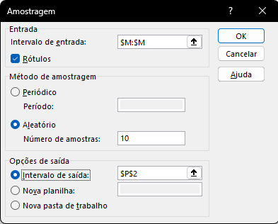
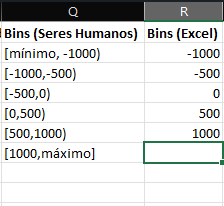
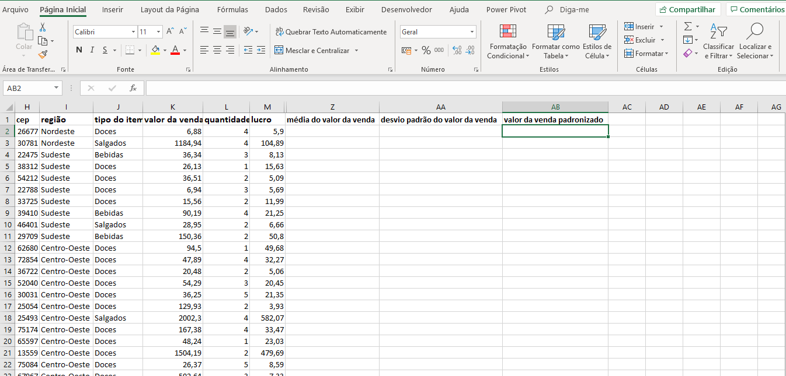
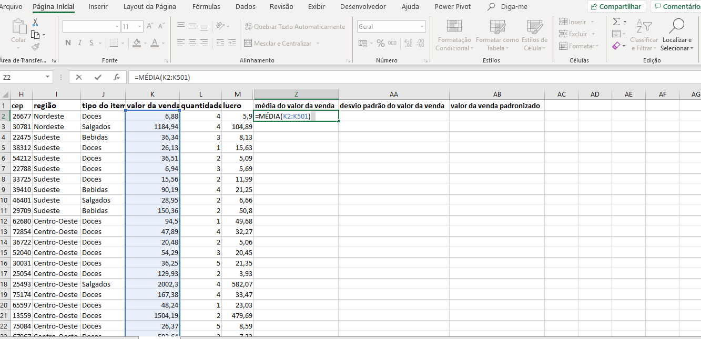
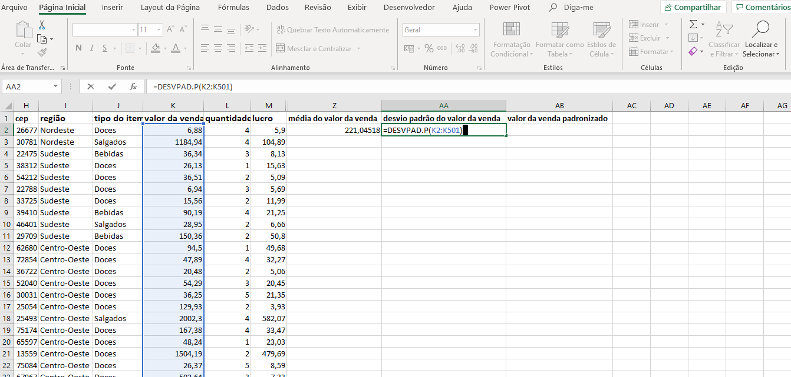
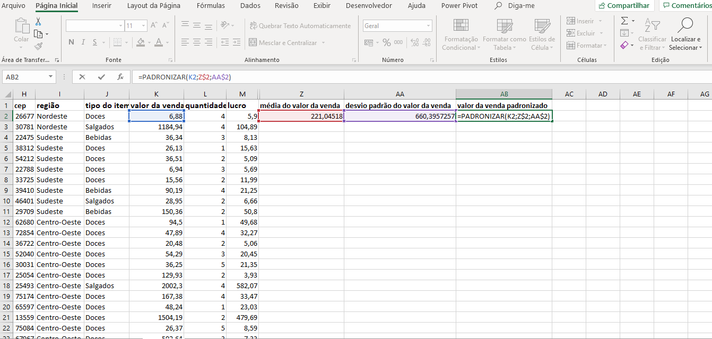
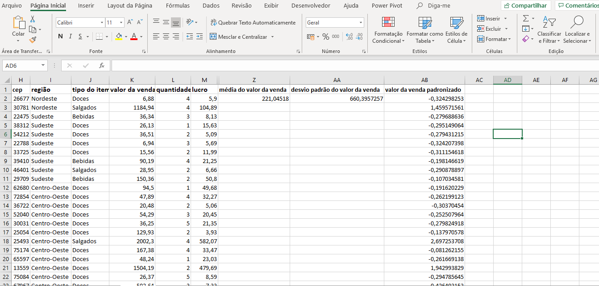
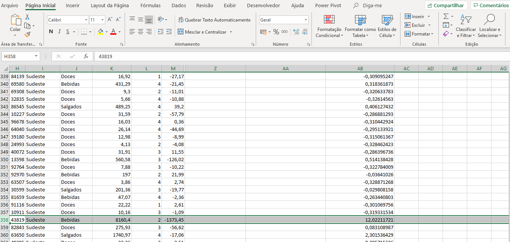

# Padronização Amostragem e Frequência

<a id="topo"></a>

## Sumário
- [Padronização Amostragem e Frequência](#padronização-amostragem-e-frequência)
  - [Sumário](#sumário)
  - [1. Padronização de uma coluna](#1-padronização-de-uma-coluna)
  - [2. Amostragem](#2-amostragem)
  - [3. Frequência](#3-frequência)
  - [4. A parte e o todo](#4-a-parte-e-o-todo)
  - [5. Faça como eu fiz na aula](#5-faça-como-eu-fiz-na-aula)
  - [6. O que aprendemos?](#6-o-que-aprendemos)

## 1. Padronização de uma coluna

Nesta aula verificaremos processos de padronização de uma coluna ou de um dados. Em termos de estatística isso significa transformar os valores de uma coluna em desvios padrão, com relação a média daquela coluna. Então após essa padronização qualquer valor existente naquela coluna será medido em desvio padrão. Inicialmente sua utilização se da  para perceber algum caso discrepante na coluna trabalhada.  
Para nosso exemplo de nossa [base de dados](db/Base_dados.xlsx), iremos trabalhar essa padronização com base na coluna de lucro, e para realizar ou calcular essa padronização precisamos inicialmente de 2 valores (a média da coluna, e do desvio padrão daquela coluna), e para tal processo utilizaremos a seguinte fórmula no Excel:  
```excel
=PADRONIZAR(M2:M501;$N$12;$N$18)
```
Onde os parâmetros ali inseridos dizem respeito a:
  - 1º O intervalo dos valores a serem padronizados.
  - 2º A média dos valores a serem padronizados. 
  - 3º O desvio padrão dos valores a serem padronizados.

E importante se ater ao fato que como realizamos a padronização dos valores da coluna através de desvio padrões da média dos valores, quanto mais próximo a 0 menor o desvio em relação a média assim como o inverso é valido, isso também e utilizado para busca de _"Outliers"_

---
## 2. Amostragem

Agora nesse tópico iremos visualizar como podemos selecionar uma amostra aleatória dos dados, isso tem serventia para casos que precisamos mostrar apenas algum dados sobre uma base de dados, ou realizar alguma exibição de alguns dados.  
No Excel possuímos uma ferramenta de amostra denominada de amostra de dados, que nos permite realizar esse tipo de amostragem, essa ferramenta pode ser acessada através da guia de dados.
> Ps: Por mais que essa ferramente seja uma ferramenta padrão do Excel, a mesma não "vem" habilitada por padrão, para habilita-la deve seguir os passos:
>   1º Aquivos
>   2º Opções
>   3º Suplementos
>   4º Selecionar a opção de Ferramentas de Analise
>   5º Clicar em Ir
>   6º Selecionar o Check-Box Ferramentas de Analise 

Pós habilitação desse recurso, será disponibilizado na guia de dados o recurso de analise de dados, Sua utilização segue o seguinte padrão:
Seleciona-se o tipo de analise de dados para o caso em questão iremos selecionar `Amostragem`, será exibido ao usuário uma tela conforme exemplo abaixo:

<table style="text-align: center; width: 100%;"> 
<tr>
    <td style="text-align: left;">
    
    </td>
</tr>
</table>

Nessa tela devemos informar qual o intervalo de dados que devem ser considerados para gerar a amostragem, a flag de Rótulo indicará ao Excel, que o intervalo selecionado contém rótulos e que esse não deverá ser levado em consideração para criação da amostra, no tópico de método de amostragem selecionamos a opção de aleatório para que a amostra a ser gerada será aleatório e informamos o valor de quantos dados serão gerados, e por fim indicamos onde serão exibidos tais dados.

---
## 3. Frequência
Nesse tópico iremos abordar como criar nossa própria distribuição de frequência para uma variável, em [aula anterior](https://github.com/thierryLchaves/Santander-Imersao-Digital/blob/cef466a28f7b7b09b7ac0f3b345bd7a386f25b90/Analise_de_dados_e_IA_Nivelamento/Semana_05/Analise_de_dados_Calculos_padroes_e_estrategias_com_Excel/01_Visualizacao_de_Dados/VisualizacaoDeDados.md) visualizamos que ao criamos um gráfico de histograma o Excel, realizava _"por conta própria"_ sua própria distribuição de dados para intervalos, porém podemos criar nossa própria divisão, e para tal utilizaremos uma função denominada de `frequência`, essa é uma função matricial que alguns requisitos mais detalhados em termos de sintaxe.
O primeiro passo se da em criações de categorias, pois o que queremos no fim é dividir o lucro em diversas categorias, em estatísticas essa categorias são denominadas de Bins, ou seja são as faixas de valores desejáveis, para isso realizaremos o quadro abaixo:  
<table style="text-align: center; width: 100%;"> 
<tr>
    <td style="text-align: left;">
    
    </td>
</tr>
</table>

Para o Excel utilizaremos somente os valores inseridos na coluna `R`, onde temos os bins do menor valor possível no caso __-1000__ até o maior valor possível sendo __1000__. 
Como iremos trabalhar com uma fórmula matricial é de suma importância que seja selecionado para aplicação desse fórmula uma célula a mais do que a quantidade de bins. 
Deixando a fórmula da seguinte maneira:
```excel
=FREQÜÊNCIA(M:M;R2:R6)
```
> PS: Como se trata de uma função matricial, para sua correta aplicação é necessário que pós o preenchimento dos parâmetros da função, o processo correto de sua aplicação somente ocorrera quando as teclas `CTRL + SHIFT + ENTER`, forem pressionadas em conjunto.

---
## 4. A parte e o todo
Nós vimos como selecionar uma amostra aleatória de uma variável. Podemos usar esse recurso numa análise de dados quando não queremos trabalhar com todo o conjunto ou, por exemplo, quando precisamos mostrar uma parte dos dados para alguém ter uma ideia das informações.

Quando calculamos uma estatística como a média, por exemplo, podemos afirmar que o resultado será igual tanto para a amostra aleatória quanto para a variável inteira? Por quê?
```text
Não.  pois uma amostragem  a depender da quantidade de amostras geradas não representam o universo completo dos dados, e para casos de média o universo de dados a serem trabalhados influem diretamente no resultado, podendo ter ou não outiliers no processo. 
```
<table style="text-align: center; width: 100%;"> 
<tr>
    <td style="text-align: left;">
    
    </td>
</tr>
</table>

---
## 5. Faça como eu fiz na aula

Uma medida eficaz para encontrarmos valores discrepantes e também para preparar uma variável para análises posteriores é a padronização, tal como vimos na aula. Vamos repetir essa técnica, agora usando a coluna “valor da venda”. Esse exercício é bom também porque nos leva a relembrar a média e o desvio padrão de uma coluna.

A primeira coisa que temos que fazer é calcular a média e o desvio padrão da variável. Então, vamos criar colunas para registrar esses valores e o valor padronizado:  
<table style="text-align: center; width: 100%;"> 
<tr>
    <td style="text-align: left;">
    
    </td>
</tr>
</table>

Calculando a média:

<table style="text-align: center; width: 100%;"> 
<tr>
    <td style="text-align: left;">
    
    </td>
</tr>
</table>

E o desvio padrão:

<table style="text-align: center; width: 100%;"> 
<tr>
    <td style="text-align: left;">
    
    </td>
</tr>
</table>  

Padronizando o primeiro elemento (não se esqueça de “travar” as células da média e do desvio padrão usando $ na frente do número):
<table style="text-align: center; width: 100%;"> 
<tr>
    <td style="text-align: left;">
    
    </td>
</tr>
</table>  

E copiando a fórmula para toda a coluna:

<table style="text-align: center; width: 100%;"> 
<tr>
    <td style="text-align: left;">
    
    </td>
</tr>
</table>  

__Opinião do instrutor__  
Veja como a venda na linha 358 é outlier para ninguém botar defeito: 

<table style="text-align: center; width: 100%;"> 
<tr>
    <td style="text-align: left;">
    
    </td>
</tr>
</table>  

---
## 6. O que aprendemos?

[↑ Voltar ao topo](#topo)

---

<!-- <table style="text-align: center; width: 100%;"> 
<tr>
    <td style="text-align: left;">
    
    </td>
</tr>
</table> -->

---

<table align="center" style="border-collapse: collapse; margin-left: auto; margin-right: auto;"> 
  <caption><b>Skills do projeto</b></caption>
  <tr>
    <td style="padding: 5px;">
      
    </td>
    <td style="padding: 5px;">
      
    </td>
    <td style="padding: 5px;">
      
    </td>
  </tr>
</table>


---
__Titulo:__ Padronização Amostragem e Frequência
__Autor:__ Thierry Lucas Chaves  
__Data de Criação:__ 08-06-2026  
__Data de Modificação:__ 08-06-2026  
__Versão:__ "1.0"