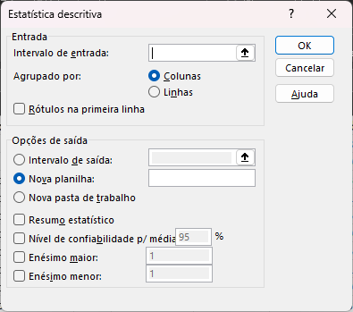
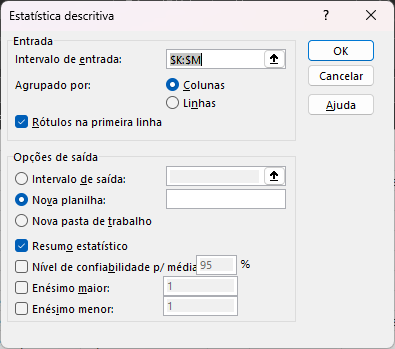
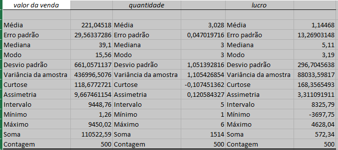
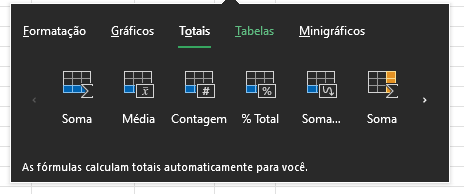
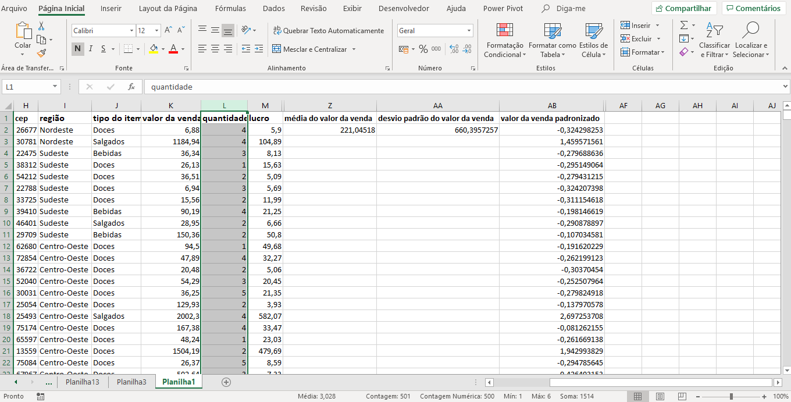
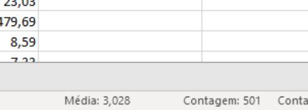

# Ferramentas de Análise Rápida

<a id="topo"></a>

## Sumário
- [Ferramentas de Análise Rápida](#ferramentas-de-análise-rápida)
  - [Sumário](#sumário)
  - [1. Técnicas básicas de resumo rápido](#1-técnicas-básicas-de-resumo-rápido)
  - [2. Assistente de estatística descritiva](#2-assistente-de-estatística-descritiva)
  - [3. Ferramenta de sumarização seletiva](#3-ferramenta-de-sumarização-seletiva)
  - [4. Medidas descritivas imediatas](#4-medidas-descritivas-imediatas)
  - [5. Conclusão](#5-conclusão)
  - [6. Quem conta um conto aumenta um ponto](#6-quem-conta-um-conto-aumenta-um-ponto)
  - [7. Faça como eu fiz na aula](#7-faça-como-eu-fiz-na-aula)
  - [8. O que aprendemos?](#8-o-que-aprendemos)

## 1. Técnicas básicas de resumo rápido 

Nessa aula será abordado sobre as funções de resumo rápido, essas são funções de contagem existentes no Excel, que tem como sua utilização principal nos demonstrar, o quantitativo de algo, novamente iremos acessar nossa [base de dados](db/Base_dados.xlsx), e nela iremos visualizar a nossa primeira função:
```excel
=CONT.VALORES(O:O)
```
Pós execução dessa fórmula o Excel irá realizar a contagem de todos os valores seja caractere, ou número  ele irá contar como uma instância válida, ou seja a contagem é realizada desde que haja algum valor inserido na célula.  
Agora caso desejarmos realizar a contagem apenas dos números de um intervalo, a fórmula a ser utilizada deverá ser:    

```excel
=CONT.NÚM(O:O)
```
Agora outra função que pode ser utilizada, para contagem de células vazias é :
```excel
=CONTAR.VAZIO(O1:O501)
```

---
## 2. Assistente de estatística descritiva

Agora nesse tópico iremos abordar uma ferramenta disponível no Excel que nos permite obter diversas estatísticas descritivas de diversas colunas simultaneamente.
Para sua utilização, iremos acessar a guia de dados e utilizaremos o recurso de Análise de dados, porém dessa vez escolheremos a opção de estatística descritiva. 
Pós sua seleção será apresentado a seguinte tela abaixo:  

<table style="text-align: center; width: 100%;"> 
<tr>
    <td style="text-align: left;">
    
    </td>
</tr>
</table>

Para sua utilização iremos inserir qual o intervalo de entrada, e nessa opção podemos inserir colunas ou linhas e esse deve ser selecionado continuamente, pos esse processo escolheremos as opções de saída, e qual tipo de estatística que desejamos gerar:

<table style="text-align: center; width: 100%;"> 
<tr>
    <td style="text-align: left;">
    
    </td>
</tr>
</table>

E por fim será gerado uma nova tabela, com algumas informações conforme imagem abaixo: 
<table style="text-align: center; width: 100%;"> 
<tr>
    <td style="text-align: left;">
    
    </td>
</tr>
</table>

---
## 3. Ferramenta de sumarização seletiva

Agora iremos visualizar um assistente presente no Excel, que nos permite realizar algumas analises de forma assistida e mais rápidas de serem feitas.  
Essa opção fica presente no Excel, quando selecionamos um intervalo como um todo, e no fim é apresentado algumas sugestões para edição conforme exemplo:   

<table style="text-align: center; width: 100%;"> 
<tr>
    <td style="text-align: left;">
    
    </td>
</tr>
</table>

---
## 4. Medidas descritivas imediatas

E agora por fim iremos visualizar uma análise descritiva imediata, essas medidas  são aquelas que são apresentadas na parte inferior do Excel com informações de por exemplo 
__Média, Contagem, Soma, etc..__ Essa opções são geralmente apresentadas quando selecionamos algum intervalo de valor ou algo do tipo.

---
## 5. Conclusão

Durante todo o módulo visualizamos informações de produção de gráficos, medidas de posição e medidas de dispersão que são quantidades numéricas que nos dão uma ideia sobre a distribuição de informações que podem estar presentes no Excel, também  visualizamos informações de como podemos padronizar uma coluna no Excel,  visualizamos formulas de frequência. Ainda como realizar a retirada de uma amostragem.  e demais coisas que estão presente no repositório. 

---
## 6. Quem conta um conto aumenta um ponto

Uma prática de diagnóstico básico em análise de dados é a contagem de casos em uma variável; e você como analista de dados está atento a isso.

Se quisermos saber quantos números há numa coluna, qual função devemos usar?   

<table style="text-align: center; width: 100%;"> 
<tr>
    <td style="text-align: left;">
    
    </td>
</tr>
</table>


---
## 7. Faça como eu fiz na aula

Para fecharmos com chave de ouro, imagine que você está reportando sua análise de dados em uma reunião e alguém lhe pede uma média de uma variável que você não calculou. Numa situação dessas podemos: 1) pedir um tempo para trazer a resposta; ou 2) dar a resposta em poucos segundos, agregar valor na análise, economizar o tempo de todo mundo e de quebra sair da reunião como a pessoa que manja dos paranauê.

Vamos treinar essa habilidade, então!

Agora, eu te pergunto: qual é a média da coluna quantidade?

Você, de imediato, clica na letra da coluna:   

<table style="text-align: center; width: 100%;"> 
<tr>
    <td style="text-align: left;">
    
    </td>
</tr>
</table>

__Opinião do instrutor__  
Então, rapidamente você me responde: “Três vírgula zero vinte e oito!”

<table style="text-align: center; width: 100%;"> 
<tr>
    <td style="text-align: left;">
    
    </td>
</tr>
</table>

---
## 8. O que aprendemos?
Nesta aula, vimos:

- Como contar quantos valores ou casos temos em uma coluna.
- Como obter um conjunto de estatísticas descritivas de uma só vez.
- Uma ferramenta visual de análise rápida dos dados.
- Uma ferramenta para obtenção instantânea de algumas estatísticas descritivas.>

---

<table align="center" style="border-collapse: collapse; margin-left: auto; margin-right: auto;"> 
  <caption><b>Skills do projeto</b></caption>
  <tr>
    <td style="padding: 5px;">
      
    </td>
    <td style="padding: 5px;">
      
    </td>
    <td style="padding: 5px;">
      
    </td>
  </tr>
</table>


---
__Titulo:__ Ferramentas de Análise Rápida
__Autor:__ Thierry Lucas Chaves  
__Data de Criação:__ 08-06-2026  
__Data de Modificação:__ 09-06-2026  
__Versão:__ "1.0"