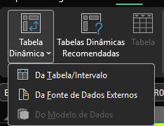
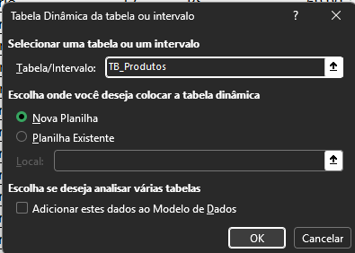
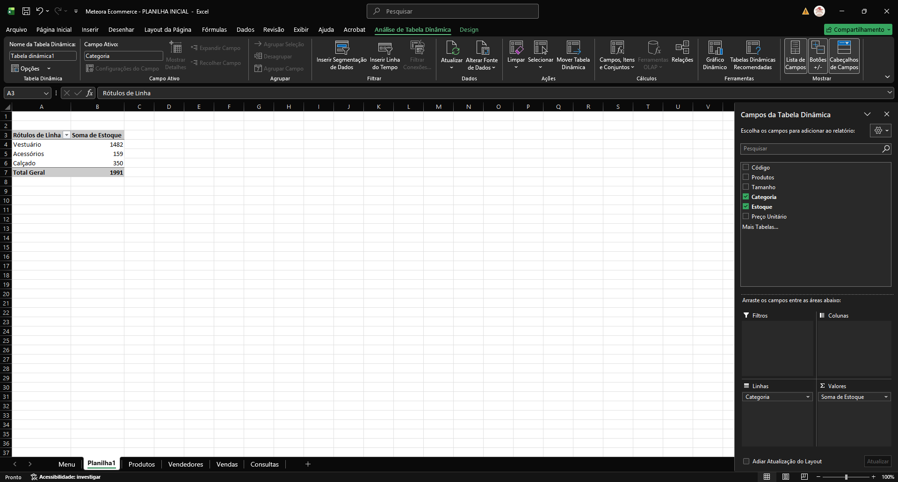
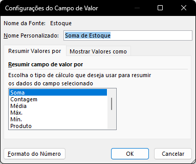
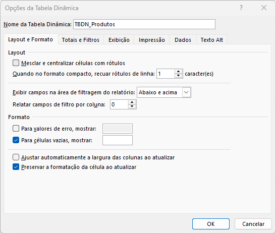

# Conceitos do Excel

## Sumário
- [Conceitos do Excel](#conceitos-do-excel)
  - [Sumário](#sumário)
  - [1. Apresentação](#1-apresentação)
  - [2. Preparando o ambiente: planilha Meteora E-commerce](#2-preparando-o-ambiente-planilha-meteora-e-commerce)
  - [3. Noções de tabela dinâmica](#3-noções-de-tabela-dinâmica)
  - [4. Para saber mais: tabelas dinâmicas](#4-para-saber-mais-tabelas-dinâmicas)
  - [5. Opções da tabela dinâmica](#5-opções-da-tabela-dinâmica)
  - [6. Conhecendo o seletor de campos](#6-conhecendo-o-seletor-de-campos)
  - [7. Organizando os campos da tabela dinâmica](#7-organizando-os-campos-da-tabela-dinâmica)
  - [8. Faça como eu fiz: tabela dinâmica de produtos](#8-faça-como-eu-fiz-tabela-dinâmica-de-produtos)
  - [9. Para saber mais: estrutura da tabela dinâmica](#9-para-saber-mais-estrutura-da-tabela-dinâmica)
  - [10. O que aprendemos?](#10-o-que-aprendemos)

## 1. Apresentação

Esse curso tem como objetivo, apresentação de conceitos de tabelas dinâmica, sendo:  
  - Como usar Tabelas Dinâmicas; 
  - Onde usar Tabelas Dinâmicas;
    - Esse passando pelo passo introdutório com exemplos mais simples
Chegaremos futuramente em uma construção de uma tabela dinâmica _"mais complexa"_, confeccionando 1 tabela dinâmica com 2 origens de dados diferentes.

---
## 2. Preparando o ambiente: planilha Meteora E-commerce  

Queremos que você aproveite ao máximo essa oportunidade de aprendizado e desenvolva suas habilidades de forma excepcional.

Nesse sentido, para acompanhar o curso de ponta a ponta, você pode fazer o acessar a [planilha](db/Meteora%20Ecommerce%20-%20PLANILHA%20INICIAL.xlsx) que estamos trabalhando no curso.

Essa planilha é uma ferramenta de aprendizagem que o professor Sabino usará durante a jornada do curso. Ao explorá-la, você poderá praticar os conceitos apresentados, fazer exercícios e acompanhar seu próprio progresso de maneira personalizada.

---
## 3. Noções de tabela dinâmica

Assim como nos demais módulos já trabalhados durantes as semanas passadas, esse módulo também será baseado na nossa planilha do E-commerce fictício da Meteora, que tem como objetivo central: Criar um controle de vendas.

Iremos já iniciar o processo criando uma tabela dinâmica, porém antes de iniciarmos com comandos  ou a famosa mão na massa, vamos a voltar alguns passos, para essa confecção iremos trabalhar em cima da nossa planilha de produtos, essa por sua vez está formatada já como tabela, porém esse recurso não é uma tabela dinâmica e sim um recurso do Excel para formatação de dados em uma planilha.  
> PS: E tido como boa prática a criação de uma tabela dinâmica a partir de uma planilha formatada como tabela.  

Assim como quase qualquer outro processo dentro do Excel, antes de fazermos quaisquer alterações é necessário realizar a seleção de um dado intervalo etc..., pós seleção desse dado, iremos seguir os passos:
  1º Guia Inserir
  2º Inserir Tabela Dinâmica
    Caso selecionado o botão principal, o Excel ira realizar a inserção padrão de uma tabela dinâmica, porém ao selecionar o menu lateral dessa opção será apresentada alguma opções para inserção dos dados.

> <table style="text-align: center; width: 100%;"> 
> <tr>
> <td style="text-align: left;">
> 
> </td>
> </tr>
> </table>

Para o caso do curso, obteremos o mesmo resultado tanto selecionado a opção de `Inserir da tabela ou intervalo`, quanto selecionar o botão principal da guia de inserir, pós escolha desse recurso será apresentado um quadro com algumas opções conforme exemplo abaixo:  

<table style="text-align: center; width: 100%;"> 
  <tr>
    <td style="text-align: left;">
     
   </td>
  </tr>
</table>

Pós seleção da informações será montado uma nova planilha em nossa pasta de trabalho, a priore será demonstrado uma planilha em branco sem nenhuma informação, porém a ideia de uma tabela dinâmica, serve para alguns propósitos e para melhor exemplificação dessa utilização, imaginemos que todos os dados presentes na tabela de produtos foram copiados e misturados em outra planilha e agora temos reorganizar esses dados, seja para realizar analise de dados, criar dashboards, criar gráficos etc...  
Sua utilização fica mais explicita quando por exemplo ao selecionar nos campos de lista selecionamos 2 informações da tabela original, no caso selecionamos as colunas de __"Categoria e Estoque"__, automaticamente o Excel realiza a sumarização das duas informações selecionadas

<table style="text-align: center; width: 100%;"> 
  <tr>
    <td style="text-align: left;">
     
   </td>
  </tr>
</table>

No exemplo acima o Excel, já realizou um processo de `SOMASE`  agrupado por categorias de produtos. Ou seja a tabela dinâmica por sí só já realiza o processo de agrupamento de dados _(soma, média, agrupamento etc..)_  para tal processo de modificação das quantidades temos no canto inferior direito da planilha 4 quadrantes `Filtros, Colunas, Linhas e Valores` onde dentro do quadrante de valores, temos as opções de modificação desses dados, ao selecionar a opção de `Configurar campo de valores` , nos é apresentado um sub-menu de opções: 

<table style="text-align: center; width: 100%;"> 
  <tr>
    <td style="text-align: left;">
     
   </td>
  </tr>
</table>

---
## 4. Para saber mais: tabelas dinâmicas

Tabela dinâmica (ou pivot table, em inglês) é uma ferramenta comumente utilizada em software de planilhas, como o Microsoft Excel e o Google Sheets, para organizar, resumir, calcular e analisar grandes conjuntos de dados de forma rápida e fácil permitindo visualizar comparações, padrões e tendências nos dados. As tabelas dinâmicas oferecem uma série de benefícios significativos, como:

Resumir dados: Permitem que você resuma grandes quantidades de dados de forma rápida e simples. Com alguns cliques, você pode obter valores agregados, como somas, médias, contagens e muito mais, sem a necessidade de escrever fórmulas complexas.

Visualização Clara: Proporcionam uma maneira visual e organizada de apresentar informações. Ao arrastar e soltar campos nas áreas de linhas, colunas e valores, você pode criar uma representação clara dos dados, o que torna mais fácil identificar padrões e tendências.

Flexibilidade Analítica: As tabelas dinâmicas permitem que você altere rapidamente a disposição dos dados para explorar diferentes ângulos de análise. Isso possibilita a exploração de diferentes combinações de campos para obter insights mais profundos.

Comparação Simples: Você pode comparar categorias diferentes de dados lado a lado, o que é útil para identificar diferenças, semelhanças e tendências entre os elementos de dados.

Filtros Personalizados: A capacidade de aplicar filtros aos dados permite que você analise subconjuntos específicos com facilidade. Isso ajuda a focar na análise de dados relevantes para responder a perguntas específicas.

Agilidade na Tomada de Decisões: Com a capacidade de analisar dados de maneira rápida e eficiente, você pode tomar decisões informadas de maneira mais ágil, o que é crucial em ambientes empresariais e de tomada de decisões.

No geral, as tabelas dinâmicas fornecem uma abordagem eficaz para a análise e a compreensão de grandes volumes de dados, permitindo que você descubra insights valiosos de maneira eficiente e precisa.

---
## 5. Opções da tabela dinâmica

Um ponto muito importante ao se trabalhar com tabelas dinâmicas, e que sua atualização não ocorre de forma instantânea, um dos motivos e que dado ao possível tamanho de algumas fonte de dados pode tornar a pasta de trabalho muito pesada, então para que as alterações feitas nas fontes de dados brutos da tabela dinâmicas ocorram é necessário a atualização da nossa tabela, e isso pode ser feito tanto selecionado algum valor existente dentro da tabela dinâmica, quanto em algumas opções de menu específicos da tabela dinâmica, e essa opção de atualização da tabela dinâmica está presente na guia de `Análise de Tabela Dinâmica` sobre a opção de atualizar.  
Outro ponto válido de ser ressaltado sobre o processo de atualização da tabela dinâmica, e que se por exemplo realizarmos a modificação de tamanho de fonte e espaçamento da tabela, e posteriormente realizarmos a atualização, a apresentação dessa tabela será readequada para nova apresentação. Para que possamos _"contornar"_ esse formatação podemos fazer o seguinte, dentro da guia de `Análise de tabela Dinâmica` sobre a opção de menu `Tabela Dinâmica`, teremos algumas opções, dentre elas a de renomear nossa tabela, bem como outras presentes em imagem abaixo:    

<table style="text-align: center; width: 100%;"> 
  <tr>
    <td style="text-align: left;">
     
   </td>
  </tr>
</table>

Outra vantagem de uma tabela dinâmica e de que caso desejarmos realizar a inclusão ou remoção de um dado para apresentação  basta selecionar ou "desselecionar" esse dado, para além dessa facilidade de apresentação também temos a facilidade de formatação do número dentro da guia de analise , tempos a opção de configurações do campo, onde nela é possível determinar o formato do campo, então toda vez que aquele campo for selecionado, esse será apresentado com aquela formatação.  
[↑ Voltar ao topo](#topo)  

---
## 6. Conhecendo o seletor de campos
Conforme já dito anteriormente a formatação e exibição de uma tabela dinâmica e bastante "simples" e responsiva, e  também vimos que na opção de [CAMPOS DA TABELA DINÂMICA](#3-noções-de-tabela-dinâmica), possuem por padrão 4 quadrantes nesses quadrante podemos por exemplo ao selecionar um campo redirecionar sua exibição organizando dado x para linha e dado Y para coluna, bem como a adição de um novo filtro arrastando o dado para o quadrante de filtros, outro ponto a ser salientado e de que a ordem disposta dos dados na tabela dinâmica é de suma importância para montagem da tabela.

---
## 7. Organizando os campos da tabela dinâmica

Eduarda trabalha como gerente financeira em uma empresa de consultoria. A empresa está passando por um período de análise intensiva de gastos e receitas, e Eduarda precisa criar uma Tabela Dinâmica no Excel para visualizar claramente como os gastos estão distribuídos entre diferentes departamentos. Na planilha de despesas no Excel, ela selecionou os dados relevantes, que incluem as colunas de "Departamento", "Categoria de Despesa" e "Valor Gasto". Após criar a tabela dinâmica, Eduarda ficou na dúvida de como organizar os campos corretamente para obter as informações necessárias.

Seguindo o que aprendemos na aula, selecione as alternativas que indicam a melhor forma que a Eduarda deve seguir para organizar os campos corretamente e obter as informações necessárias das despesas por departamento

Escolha as alternativas corretas.

<table style="text-align: center; width: 100%;"> 
  <tr>
    <td style="text-align: center;">
     
   </td>
  </tr>
</table>

---
## 8. Faça como eu fiz: tabela dinâmica de produtos
Agora que você já está familiarizado com tabelas dinâmicas e as possíveis aplicações dessa ferramenta no dia a dia, chegou a hora de colocar as suas habilidades em ação.

Nesse momento, vamos seguir com o que aprendemos em aula e criar uma tabela dinâmica com os dados da tabela de Produtos para resumir os dados da E-commerce Meteora . Por isso, explore e experimente as possibilidades com criatividade. Vamos lá?  

__Opinião do instrutor__  

Para realizar essa atividade, siga o passo a passo proposto:

- Passo 1: Na planilha “Produtos”, clique em qualquer local da TB_Produtos `(B5:G66)`.

- Passo 2: Na guia Inserir, clique no ícone Tabela Dinâmica e selecione a opção Da Tabela/Intervalo.

- Passo 3: Na caixa de diálogo “Tabela Dinâmica da tabela ou Intervalo”, na opção Escolha onde você deseja colocar a tabela dinâmica clique na opção Nova Planilha para posicionar a Tabela Dinâmica em uma nova planilha e, em seguida clique no botão OK.

- Passo 4: Agora vamos começar a escolher os campos que serão adicionados na tabela dinâmica. Clique na área da Tabela Dinâmica para abrir o “Lista de Campos da Tabela Dinâmica”.

- Passo 5: Caso a Lista de Campos da Tabela Dinâmica não esteja aparecendo, na guia “Análise de Tabela Dinâmica” clique no ícone “Mostrar” e, em seguida, clique na opção Lista de Campos.

- Passo 6: No seletor de Campos da Tabela Dinâmica, para o campo Linhas, clique nos dados de Categoria e Produtos.

- Passo 7: Para o campo Valores, selecione os dados de Estoque e Preço Unitário.

- Passo 8: Para formatar os dados de “Preço Unitário” como moeda, clique na coluna de “Soma de Preço Unitário, e na guia Análise de Tabela Dinâmica, clique no ícone Configurações do Campo.

- Passo 9: Na caixa de diálogo “Configurações do Campo de Valor”, clique no botão Formato do Número. Na janela Formatar Células, escolha a opção Contábil.

- Passo 10: Clique na guia Design para alterar o design e o estilo da Tabela Dinâmica.

Pronto, a nossa tabela dinâmica foi criada!  

[↑ Voltar ao topo](#topo)

---
## 9. Para saber mais: estrutura da tabela dinâmica
Na aula, vimos que a tabela dinâmica possui algumas áreas e estruturas distintas que ajudam a organizar e apresentar os dados de maneira mais compreensível. As principais estruturas de uma tabela dinâmica são:

Campos: Representam as categorias ou elementos pelos quais você deseja analisar os dados. Eles são extraídos das colunas da sua fonte de dados original.

Valores: Área onde você coloca as métricas numéricas que deseja calcular ou resumir. Aqui, você pode escolher funções como soma, média, contagem, etc., para analisar seus dados numéricos. Isso geralmente envolve valores que podem ser agregados.

Linhas: Esta área é usada para agrupar e organizar os dados em linhas com base em um ou mais campos. Os valores únicos desses campos formarão as linhas da sua tabela dinâmica.

Colunas: Similar às linhas, a área de colunas permite agrupar e organizar os dados em colunas, com base nos campos selecionados. Isso pode ser útil para criar comparações ou visualizações adicionais.

Filtros: são usados para filtrar os dados exibidos na tabela dinâmica com base em critérios específicos.

---
## 10. O que aprendemos?

<table style="text-align: center; width: 100%;"> 
  <tr>
    <td style="text-align: center;">
     
   </td>
  </tr>
</table>

---

<table align="center" style="border-collapse: collapse; margin-left: auto; margin-right: auto;"> 
  <caption><b>Skills do projeto</b></caption>
  <tr>
    <td style="padding: 5px;">
      
    </td>
    <td style="padding: 5px;">
      
    </td>
    <td style="padding: 5px;">
      
    </td>
  </tr>
</table>

---
__Titulo:__ Conceitos do Excel
__Autor:__ Thierry Lucas Chaves  
__Data de Criação:__ 04-06-2026  
__Data de Modificação:__ 06-06-2026  
__Versão:__ "1.0"