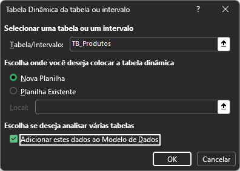
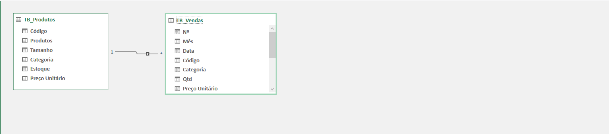
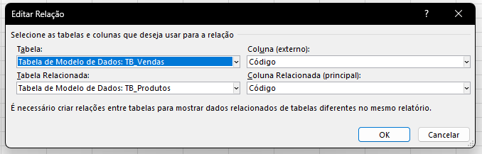
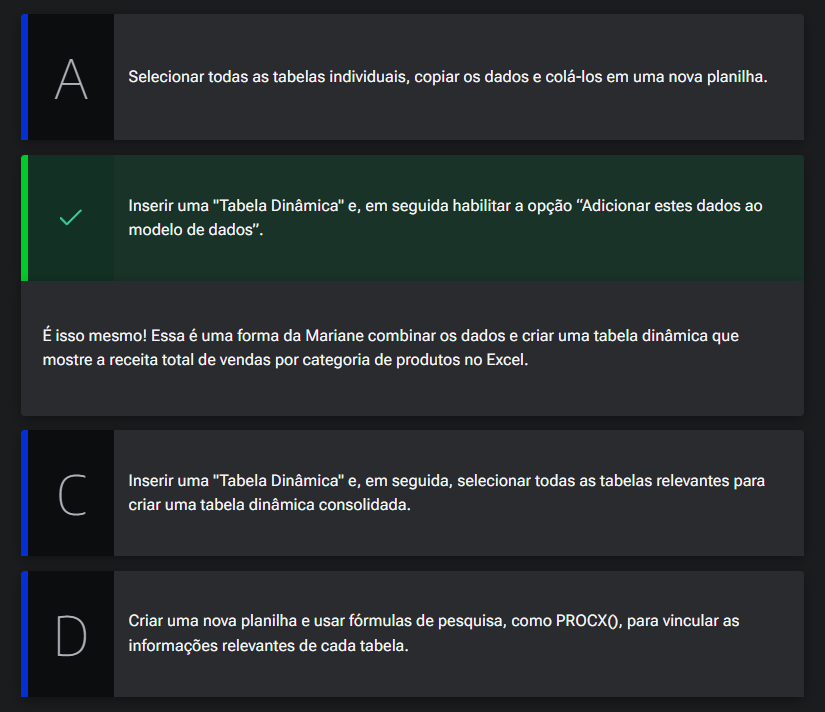
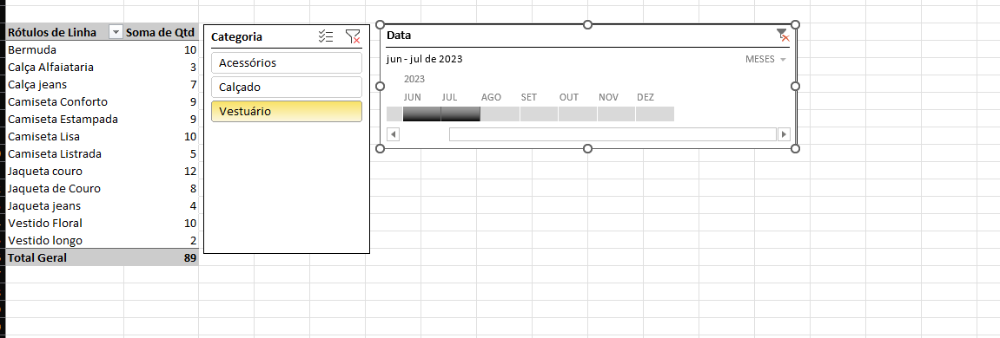

# Origens dos Dados

## Sumário
- [Origens dos Dados](#origens-dos-dados)
  - [Sumário](#sumário)
  - [1. Projeto da aula anterior](#1-projeto-da-aula-anterior)
  - [2. Modelo de dados](#2-modelo-de-dados)
  - [3. Tabela dinâmica](#3-tabela-dinâmica)
  - [4. Para saber mais: suplemento Power Pivot](#4-para-saber-mais-suplemento-power-pivot)
  - [5. Filtros visuais](#5-filtros-visuais)
  - [6. Origem dos dados](#6-origem-dos-dados)
  - [7. Faça como eu fiz: segmentação de dados](#7-faça-como-eu-fiz-segmentação-de-dados)
  - [8. O que aprendemos?](#8-o-que-aprendemos)

## 1. Projeto da aula anterior

Para acompanhar o curso com o máximo de aproveitamento, você pode acessar a [planilha](db/Meteora%20Ecommerce%20-%20FINAL%20AULA%201.xlsx). Com a planilha em mãos, você terá a oportunidade de praticar os exercícios propostos, explorar os exemplos e mergulhar ainda mais no aprendizado.

---
## 2. Modelo de dados
O processo de adição de modelos de dados, é utilizando quando por exemplo temos informações em planilhas separadas, quando estávamos trabalhando em  aulas anteriores com a planilha de vendas por exemplo temos o campo de categoria, que originalmente não é oriundo dessa planilha e para que esse fosse adicionado foi necessário a inserção via função _(No caso `PROCX`)_, porém para tabelas dinâmicas podemos realizar esse processo de forma diferente, então seguiremos o mesmo passo de adição de uma tabela dinâmica conforme visto na [aula anterior](https://github.com/thierryLchaves/Santander-Imersao-Digital/blob/574013161956e3bd6b2eb00c433095154ff5cffb/Analise_de_dados_e_IA_Nivelamento/Semana_05/Excel_Utilizando_tabelas_dinamicas_e_graficos_dinamicos/01_Conceitos_do_Excel), porém agora iremos marcar a flag de _"Adicionar esses dados ao Modelo de Dados"_:  
> <table style="text-align: center; width: 100%;"> 
> <tr>
> <td style="text-align: center;">
> 
> </td>
> </tr>
> </table>  

Depois iremos realizar esse processo tanto para tabela de produtos, quanto para a tabela de vendas, pós esse processo será apresentado dentro da opção de menu lateral Campos da tabela dinâmica a  aba de tudo. Feito esse processo esses modelos de dados estarão disponíveis para seleção em tal abam porém isso não significa que  ao realizar esse processo caso selecionarmos os dados de quantidade presente em vendas e produtos produtos esses dados serão automaticamente apresentados e formatados automaticamente, pois para esse processo é necessário que haja alguma relação entre as tabelas, e essa mensagem é apresentada no Excel após a seleção dos campos, onde é apresentado no menu 2 opções:
- 1º Detectar automaticamente 
- 2º Criar 
Para fins didáticos utilizaremos a primeira opção de detectar automaticamente, mas em suma esse processo de relacionamento funciona tal qual é feito em banco de dados, e o Excel realizou esse relacionamento da seguinte forma: Identificou o cabeçalho de dados,e posteriormente o conteúdo de cada coluna.   

Dando seguimento ao processo utilizaremos agora o `POWER PIVOT` este está presente na guia de dados, menu Ferramenta de dados, iremos selecionar a opção de `Modelo de Dados -> Gerenciar modelo de dados` com essa opção selecionada será aberto o `POWER PIVOT` do Excel, através dessa opção podemos visualizar forma diagramática a relação de dados que foi realizada pelo Excel quando escolhemos a opção de detectar automaticamente.

> <table style="text-align: center; width: 100%;"> 
> <tr>
> <td style="text-align: center;">
> 
> </td>
> </tr>
> </table>  

Já caso seja necessário realizar a relação de dados de forma manual entre as tabelas essa pode ser feita ainda na guia de Dados -> Ferramentas de dados -> Modelo de dados -> Relações  
> <table style="text-align: center; width: 100%;"> 
> <tr>
> <td style="text-align: center;">
> 
> </td>
> </tr>
> </table>  
---
## 3. Tabela dinâmica  

Mariane é uma analista de dados experiente numa empresa de marketing . Ela está trabalhando em um projeto desafiador que envolve a análise de dados de campanhas de marketing de diferentes produtos ao longo de vários anos. Como os dados estão armazenados em duas tabelas distintas, Vendas e Produtos, Mariane ficou na dúvida de como combinar os dados e criar a tabela dinâmica para mostrar a receita total de vendas por categoria de produtos no Excel.

Baseado no que aprendemos na aula, qual alternativa indica como Mariane deve fazer para combinar os dados e criar uma tabela dinâmica?  
<table style="text-align: center; width: 100%;"> 
<tr>
    <td style="text-align: center;">
    
    </td>
</tr>
</table>

---
## 4. Para saber mais: suplemento Power Pivot

Na aula, vimos que o Power Pivot é um suplemento para análise de dados no Excel, que permite que os usuários trabalhem com grandes volumes de dados ou fontes de dados externas de maneira mais eficiente e flexível.

O suplemento é gratuito, presente a partir da versão 2013 do Office, mas que por padrão da Microsoft, não vem habilitado.    

Para habilitá-lo basta ir em __Arquivo > Opções > Suplementos__. Na janela _“Exiba e gerencie Suplementos do Microsoft Office”_, na parte inferior, em __“Gerenciar”__, escolha a opção Suplemento COM e clique em Ir. Depois na janela “Suplementos COM” habilite a caixa Microsoft Power Pivot for Excel e clique em OK.

O Power Pivot, permite importar, relacionar e analisar dados de várias fontes, usando a linguagem DAX para realizar cálculos avançados, sendo uma ferramenta valiosa para criar modelos de dados flexíveis e realizar análises complexas. Com o Power Pivot é possível:

- Importar Dados de Fontes Externas: O Power Pivot permite que você importe dados de várias fontes externas diretamente para o Excel. Isso inclui bancos de dados relacionais, como SQL Server, Oracle e Access, bem como fontes de dados não relacionais, como arquivos CSV e XML.

- Modelagem de Dados: Uma das características distintivas do Power Pivot é a capacidade de criar modelos de dados. Isso envolve a importação de várias tabelas de diferentes fontes de dados e a criação de relacionamentos entre essas tabelas. Esses relacionamentos permitem que você crie análises mais sofisticadas, combinando informações de várias fontes.

- Linguagem DAX (Data Analysis Expressions): O Power Pivot usa a linguagem DAX, para criar medidas personalizadas, colunas calculadas e tabelas calculadas para realizar cálculos complexos, como médias móveis, análises de tendências e muito mais.

- Medidas e Tabelas Calculadas: Além das fórmulas simples, você pode criar medidas e tabelas calculadas no Power Pivot. As medidas são usadas para realizar cálculos agregados, como somas e médias, e podem ser usadas em tabelas dinâmicas e gráficos dinâmicos. As tabelas calculadas permitem criar tabelas virtuais com base em fórmulas.

- Tabelas Dinâmicas Avançadas: O Power Pivot aprimora as tabelas dinâmicas tradicionais do Excel. Você pode criar tabelas dinâmicas com recursos mais avançados, como segmentação de dados, filtros de linha e coluna, e a capacidade de trabalhar com grandes volumes de dados de maneira mais eficiente.

- Atualização de Dados Automática: Uma característica conveniente do Power Pivot é a capacidade de configurar atualizações automáticas dos dados. Isso é útil quando você trabalha com dados que mudam regularmente, garantindo que suas análises estejam sempre atualizadas.

- Integração com o Power BI: O Power Pivot é intimamente relacionado ao Power BI, ele permite criar modelos de dados que podem ser importados diretamente para o Power BI para criar relatórios interativos e compartilháveis online.

- Ferramenta para Profissionais de Dados: Embora seja acessível a usuários avançados do Excel, o Power Pivot é especialmente útil para profissionais de dados, analistas financeiros, analistas de negócios e qualquer pessoa que precise realizar análises de dados complexas em grande escala.

---
## 5. Filtros visuais
Antes de começar o processo precisamo primeiro nos ater a um ponto muito importante, quando futuramente estivermos trabalhando na confecção de DashBoard e muito provável que para a correta implementação seja necessário a criação de filtros visuais nas tabelas dinâmicas, tanto pela facilidade de utilização bem como pela melhor exibição do dados (MAIS BONITO). 

E o primeiro filtro que iremos utilizar trata-se do filtro e `Segmentação de dados`, presente em (Guia: Inserir -> Filtros -> Segmentação de dados) e essa opção também pode ser encontrada dentro da guia de Análise da tabela dinâmica, onde temos a opção de `Inserir segmentação de dados`, a diferença entre as duas opções e que com a segunda opção descrita os dados ficaram segmentados ou filtrados diretamente para nossa tabela dinâmica sem nenhuma passo a mais. Outro filtro que podemos aplicar é o de linha do tempo, que como o nome intui ele realiza a filtragem dos dados por tempo, e ao inseri-lo somente serão habilitados para seleção dados em formato de data.  

<table style="text-align: center; width: 100%;"> 
<tr>
    <td style="text-align: center;">
    
    </td>
</tr>
</table>  

>Ps: E importante salientar que quando excluirmos uma segmentação nem sempre os dados irão "reaparecer" para isso precisamo limpar completamente os filtros.

---
## 6. Origem dos dados
Um ponto muito importante quando estivemos trabalhando com tabelas dinâmicas é a origem dos dados, e para inciar nossa conferencia dessa origem dentro da guia de Analise da tabela dinâmica, existe a opção de Alterar fonte de dados, e nessa opção será possível visualizar qual é a fonte de dados correspondente a aquela  tabela.
Outro ponto que devemos nos ater e ao fato que caso for realizar a inserção de 2 tabelas dinâmicas na mesma planilha, esse processo deve ser feito com parcimônia, pois pode haver problemas de escalonamento de tamanho entre as tabelas. Ainda nessa seara de atenção é possível realizar a segmentação de dados para duas tabelas dinâmicas diferentes, porém é mandatório que as origem dos dados sejam as mesma para ambas, e para tal fato dentro da guia de segmentação escolher a opção de `conexão de relatórios`.

---
## 7. Faça como eu fiz: segmentação de dados

É hora de ação! Vamos treinar o que aprendemos na aula e inserir uma segmentação de dados para filtrar os dados pelas Categorias?

Essa é uma oportunidade perfeita para aprimorar suas habilidades e explorar as funcionalidades do Excel. Use as funções mais adequadas para calcular os indicadores e perceba os insights aparecer. Vamos lá!

__Opinião do instrutor__
- Passo 1: Posicione o cursor do mouse em qualquer área da tabela dinâmica para que a guia Análise de Tabela Dinâmica seja habilitada.

- Passo 2: Na guia Análise de Tabela Dinâmica, clique em Inserir Segmentação de dados.

- Passo 3: Na janela Inserir Segmentação de dados, selecione a coluna de Categoria e, em seguida apertar o botão OK.

- Passo 4: Clique na guia Segmentação para alterar o design e o estilo da Segmentação de Dados.
s
Pronto, nossa segmentação de dados foi inserida e agora podemos filtrar os dados de produtos clicando nas categorias!!

---
## 8. O que aprendemos?

Nessa aula, você aprendeu a:  
- Relacionar os dados através do recurso de Modelos de Dados do Excel;
- Implementar os dois recursos de filtros visuais, linha do tempo e Segmentação de dados na Tabela Dinâmica;
- Investigar a origem dos dados utilizados na Tabela Dinâmica;
- Conhecer sobre o suplemento de análise de dados do Excel: Power pivot.

---

<table align="center" style="border-collapse: collapse; margin-left: auto; margin-right: auto;"> 
  <caption><b>Skills do projeto</b></caption>
  <tr>
    <td style="padding: 5px;">
      
    </td>
    <td style="padding: 5px;">
      
    </td>
    <td style="padding: 5px;">
      
    </td>
  </tr>
</table>

---
__Titulo:__ Origens dos Dados
__Autor:__ Thierry Lucas Chaves  
__Data de Criação:__ 04-06-2026  
__Data de Modificação:__ 04-06-2026  
__Versão:__ "1.0"